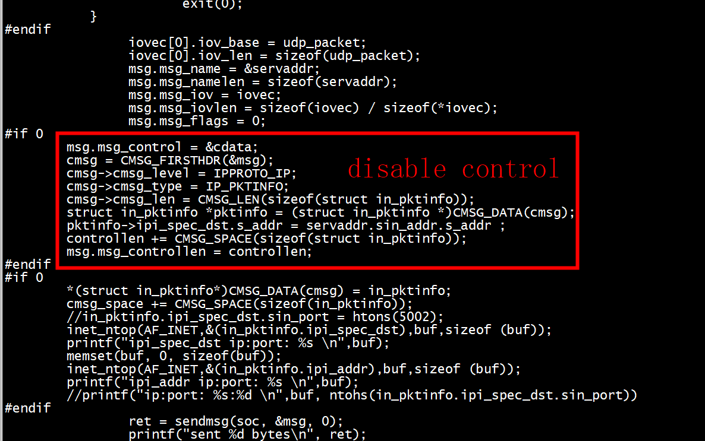

# test1

## server


## client

 


# test2  sendmsg to local server

## server 


## client

```
[root@centos7 c]# ./cli 
bind result 0 port 5005
sent 8 bytes
[root@centos7 c]#
```


# test3  sendmsg to remote server

remote server= 10.10.16.82:5000


```
[root@centos7 c]# gcc udp_pkt_cli.c -o cli
[root@centos7 c]# ./cli
bind result 0 port 5005
sent -1 bytes
error Invalid argument
[root@centos7 c]# 
```

## no pktinfo


### client




### server


# references

[UDP Socket 编程](https://www.jianshu.com/p/22b32e5a267d)


 


