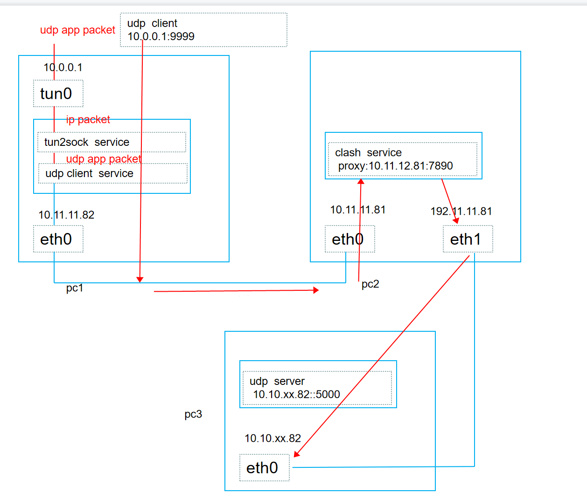
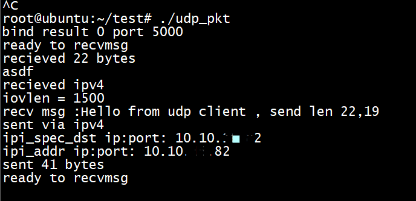
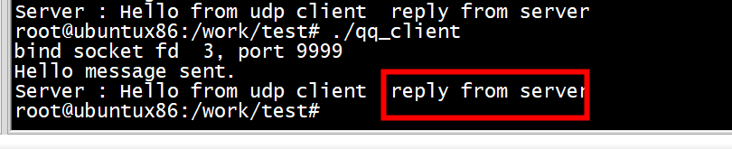
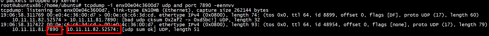

# udp test
```
route add  -host 10.10.xx.82  gw  10.0.0.2 metric 6
```

```
./install/bin/badvpn-tun2socks  --tundev tun0 --netif-ipaddr 10.0.0.2 --netif-netmask  255.255.255.0 --socks-server-addr  10.11.11.81:7890   --socks5-udp
```



## server



## client



