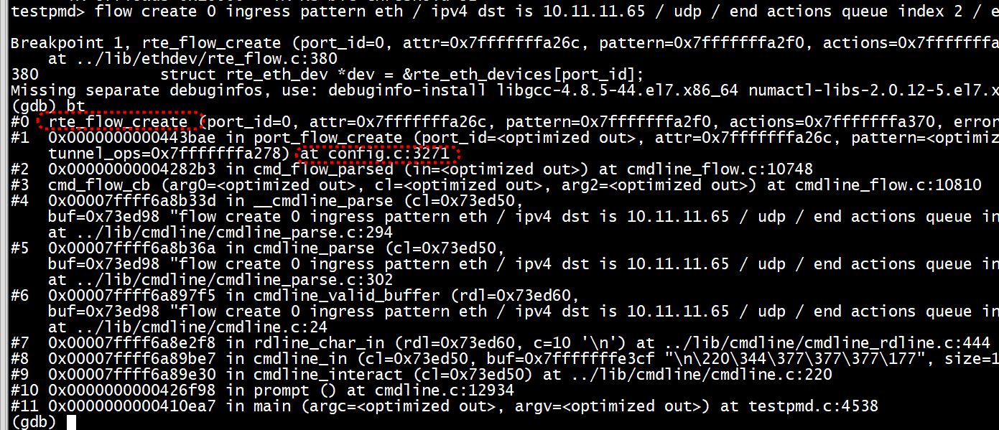

```
    testpmd> set fwd rxonly
    testpmd> set verbose 1
    testpmd> start
```


```
sudo ./build/testpmd  -c 1ffff -n 4 -- -i --rxq=16 --txq=16
testpmd> set fwd rxonly
Set rxonly packet forwarding mode
testpmd> start
testpmd> flow create 0 ingress pattern eth / ipv4 dst is 10.11.11.65 / udp / end actions queue index 2 / end
Flow rule #0 created
testpmd>  - recve queue id 0 
 - recve queue id 0 
 - recve queue id 2 
 - FDIR matched hash=0x0 ID=0x0 ip packet id 809041920  ,src ip : 10.11.11.66, dst ip : 10.11.11.65 payload len 128, ip hdrlen 20, next proto UDP 
udp dst port 5000 
```




```
testpmd> flow create 0 ingress pattern eth / ipv4 src is 10.11.11.66 dst is 10.11.11.65 / udp src is 3333 dst is 5000 / end actions queue index 2 / end
Flow rule #0 created
testpmd> set fwd rxonly
Set rxonly packet forwarding mode
testpmd> start
testpmd>  - recve queue id 2 
 - FDIR matched hash=0x0 ID=0x0 ip packet id 809041920  ,src ip : 10.11.11.66, dst ip : 10.11.11.65 payload len 128, ip hdrlen 20, next proto UDP 
udp dst port 5000
```

```
testpmd> flow create 0 ingress pattern eth / ipv4 src is 10.11.11.66 dst is 10.11.11.65  / udp src is 3333 dst is 5000 / end actions queue index 3 / end
Flow rule #0 created
testpmd>  flow list 0
ID      Group   Prio    Attr    Rule
0       0       0       i--     ETH IPV4 UDP => QUEUE
testpmd> 
testpmd> set fwd rxonly
Set rxonly packet forwarding mode
testpmd> start
testpmd>  - recve queue id 0 
 - recve queue id 3 
 - FDIR matched hash=0x0 ID=0x0 ip packet id 809041920  ,src ip : 10.11.11.66, dst ip : 10.11.11.65 payload len 228, ip hdrlen 20, next proto UDP 
udp dst port 5000 
 - recve queue id 0 
ip packet id 809041920  ,src ip : 10.11.11.66, dst ip : 10.11.11.65 payload len 98, ip hdrlen 20, next proto UDP 
udp dst port 4789 
```

# 网卡初始化
```
(gdb) bt
#0  rte_eth_dev_configure (port_id=0, nb_rx_q=16, nb_tx_q=16, dev_conf=0x100e03178) at ../lib/ethdev/rte_ethdev.c:1083
#1  0x00000000004173aa in eth_dev_configure_mp (dev_conf=0x100e03178, nb_tx_q=<optimized out>, nb_rx_q=16, port_id=0) at testpmd.c:579
#2  start_port (pid=pid@entry=65535) at testpmd.c:2950
#3  0x0000000000410dc3 in main (argc=<optimized out>, argv=<optimized out>) at testpmd.c:4486
(gdb) c
```