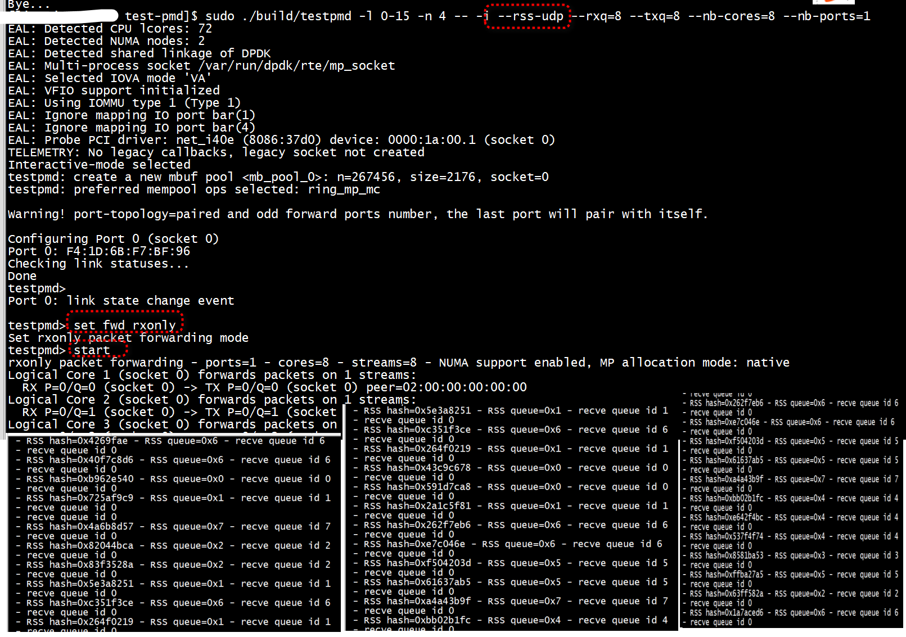

Start testpmd with 2 ports in interactive mode

```bash
./build/app/dpdk-testpmd --legacy-mem --socket-mem 1024,1024 -- \
    -i --nb-cores=2 --total-num-mbufs=4096 \
    --nb-ports=2 --rxq=4 --txq=4 \
    --auto-start --forward-mode=rxonly
```

Make sure to set the RSS key to be same for both ports else, it would pick different queue on each port for same input

```
port config 0 rss-hash-key ipv4 D82A6C5ADD3B9D1E14CE2F3786B269F044317EA207A50A9949C6A4FE0C4F5902D444E24ADBE1058230717D7A8D4298D32E301EA3
port config 1 rss-hash-key ipv4 D82A6C5ADD3B9D1E14CE2F3786B269F044317EA207A50A9949C6A4FE0C4F5902D444E24ADBE1058230717D7A8D4298D32E301EA3
```

Port 0 gets Uplink N3 traffic which has UE IP as the inner src

```
flow create 0 ingress pattern eth / ipv4 / udp / gtpu / ipv4 / end actions rss types ipv4 l3-src-only end key_len 0 queues end / end
```

Port 1 gets Downlink N9 traffic which has UE IP as the inner dst

```
flow create 1 ingress pattern eth / ipv4 / udp / gtpu / ipv4 / end actions rss types ipv4 l3-dst-only end key_len 0 queues end / end
```

Port 1 also gets Downlink N6 has UE IP as dst
```
flow create 1 ingress pattern eth / ipv4 / end actions rss types ipv4 l3-dst-only end key_len 0 queues end / end
```

Clear and check per queue stats

```
clear fwd stats all
show fwd stats all
```


# test1

```Shell
sudo ./build/testpmd -l 0-15 -n 4 -- -i --rss-udp --rxq=8 --txq=8 --nb-cores=8 --nb-ports=1
```
 
 
 
> ## rss-udp


```
  if (!strcmp(lgopts[opt_idx].name, "rss-udp"))
                                rss_hf = RTE_ETH_RSS_UDP;
```


```
void
init_port_config(void)
{
        portid_t pid;
        struct rte_port *port;
        int ret, i;

        RTE_ETH_FOREACH_DEV(pid) {
                port = &ports[pid];

                ret = eth_dev_info_get_print_err(pid, &port->dev_info);
                if (ret != 0)
                        return;

                if (nb_rxq > 1) {
                        port->dev_conf.rx_adv_conf.rss_conf.rss_key = NULL;
                        port->dev_conf.rx_adv_conf.rss_conf.rss_hf =
                                rss_hf & port->dev_info.flow_type_rss_offloads;
                } else {
                        port->dev_conf.rx_adv_conf.rss_conf.rss_key = NULL;
                        port->dev_conf.rx_adv_conf.rss_conf.rss_hf = 0;
                }
```