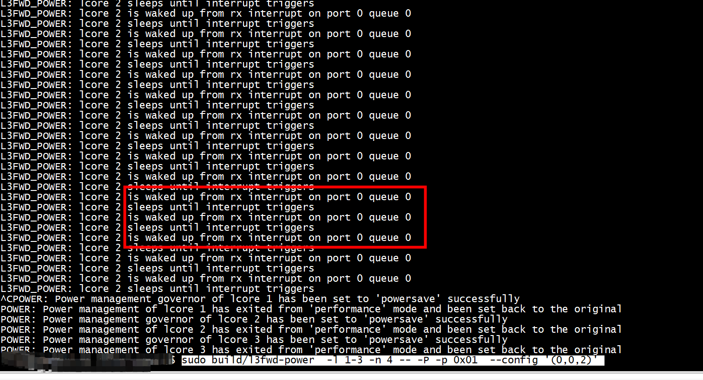

# dpdk interrupt example

[VF One-shot Rx Interrupt Tests](https://dpdk-test-plans.readthedocs.io/en/latest/vf_interrupt_pmd_test_plan.html)   

> ## dpdk-lsc-interrupt
 The default is polling mode. To set interrupt mode,
option dpdk-lsc-interrupt has to be set to true.


```
      /* register lsi interrupt callback, need to be after
         * rte_eth_dev_configure(). if (intr_conf.lsc == 0), no
         * lsc interrupt will be present, and below callback to
         * be registered will never be called.
         */
        /* RTE callback register. 8< */
        rte_eth_dev_callback_register(portid,
            RTE_ETH_EVENT_INTR_LSC, lsi_event_callback, NULL);
        /* >8 End of registering lsi interrupt callback. */
```

设置 dev->data->dev_conf.intr_conf.rxq    
```

        if ((rte_intr_cap_multiple(intr_handle) ||
             !RTE_ETH_DEV_SRIOV(dev).active) &&
            dev->data->dev_conf.intr_conf.rxq != 0) {
                intr_vector = dev->data->nb_rx_queues;
                ret = rte_intr_efd_enable(intr_handle, intr_vector);
                if (ret)
                        return ret;
        }

```

```
static struct rte_eth_conf port_config = {
    .rxmode = {
       .mq_mode = RTE_ETH_MQ_RX_NONE,
    },
    .txmode = {
        .mq_mode = RTE_ETH_MQ_TX_NONE,
    },
    .intr_conf = {
     .rxq = 1
    }
};
```
# pingpong


```
[root@centos7 dpdk-pingpong]# modprobe vfio-pci
./usertools/dpdk-devbind.py -b  vfio-pci  0000:05:00.0
```


> ## RX Intr vector unset
```
Initilize port 0 done.
RX Intr vector unset
```

```
int
rte_eth_dev_rx_intr_ctl_q_get_fd(uint16_t port_id, uint16_t queue_id)
{
        struct rte_intr_handle *intr_handle;
        struct rte_eth_dev *dev;
        unsigned int efd_idx;
        uint32_t vec;
        int fd;

        RTE_ETH_VALID_PORTID_OR_ERR_RET(port_id, -1);

        dev = &rte_eth_devices[port_id];

        if (queue_id >= dev->data->nb_rx_queues) {
                RTE_ETHDEV_LOG(ERR, "Invalid RX queue_id=%u\n", queue_id);
                return -1;
        }

        if (!dev->intr_handle) {
                RTE_ETHDEV_LOG(ERR, "RX Intr handle unset\n");
                return -1;
        }

        intr_handle = dev->intr_handle;
        if (!intr_handle->intr_vec) {
                RTE_ETHDEV_LOG(ERR, "RX Intr vector unset\n");
                return -1;
        }

        vec = intr_handle->intr_vec[queue_id];
        efd_idx = (vec >= RTE_INTR_VEC_RXTX_OFFSET) ?
                (vec - RTE_INTR_VEC_RXTX_OFFSET) : vec;
        fd = intr_handle->efds[efd_idx];

        return fd;
}
```

# test

+ client 
客户端设置neighor   
```
 ip n | grep 10.11.11.65
10.11.11.65 dev eno2 lladdr f4:1d:6b:f7:bf:96 PERMANENT
 ping 10.11.11.65
PING 10.11.11.65 (10.11.11.65) 56(84) bytes of data.
```
f4:1d:6b:f7:bf:96 是dpdk server的mac    
+ server    
```
 sudo ./dpdk-hping --file-prefix server  -c0x3  -- -s -p 0 -a 10.11.11.65
```

> ## event_register只在main core 上注册（有bug）

+ slave线程没有调用event_register，会hang在rte_epoll_wait上     

```
    if (server_mode)
    {
        if(event_register(portid, 0) < 0)
        {
             printf("interrupt event register fails \n");
        }
        else
        {
             intr_en = 1;
             printf("interrupt event register \n");
        }
        //rte_eal_remote_launch(server_launch_one_lcore, NULL, lcore_id);
        //rte_eal_remote_launch(server_launch_one_lcore, NULL, CALL_MAIN);
        rte_eal_mp_remote_launch(server_launch_one_lcore, NULL, CALL_MAIN);
    }
```


dpdk-hping 有5个线程   
```
(gdb) info threads
  Id   Target Id         Frame 
  5    Thread 0x7f67b57a6700 (LWP 6271) "eal-intr-thread" 0x00007f67ca58e9a7 in epoll_wait (epfd=6, events=0x7f67b57a4bf0, maxevents=2, timeout=-1)
    at ../sysdeps/unix/sysv/linux/epoll_wait.c:30
  4    Thread 0x7f67b4fa5700 (LWP 6272) "rte_mp_handle" 0x00007f67ca866d87 in __libc_recvmsg (fd=9, msg=0x7f67b4fa3940, flags=0)
    at ../sysdeps/unix/sysv/linux/recvmsg.c:28
  3    Thread 0x7f67b47a4700 (LWP 6273) "rte-worker-1" 0x00007f67ca58e9a7 in epoll_wait (epfd=45, events=0x7f67b47a2920, maxevents=1, timeout=10)
    at ../sysdeps/unix/sysv/linux/epoll_wait.c:30
  2    Thread 0x7f67b3fa3700 (LWP 6274) "telemetry-v2" 0x00007f67ca866077 in __libc_accept (fd=28, addr=..., len=0x0)
    at ../sysdeps/unix/sysv/linux/accept.c:26
* 1    Thread 0x7f67cb6739c0 (LWP 6270) "dpdk-hping" 0x00007f67ca58e9a7 in epoll_wait (epfd=44, events=0x7ffee60341e0, maxevents=1, timeout=10)
    at ../sysdeps/unix/sysv/linux/epoll_wait.c:30
```

eal-intr-thread   
```
(gdb) 
#0  0x00007f67ca58e9a7 in epoll_wait (epfd=44, events=0x7ffee60341e0, maxevents=1, timeout=10) at ../sysdeps/unix/sysv/linux/epoll_wait.c:30
#1  0x00007f67caaa8fa3 in eal_epoll_wait () from /usr/local/lib64/librte_eal.so.23
#2  0x0000000000402891 in sleep_until_rx_interrupt (num=1, lcore=0) at dpdk-hping.c:323
#3  server_main_loop (nb_bytes=<optimized out>) at dpdk-hping.c:353
#4  server_launch_one_lcore (dummy=<optimized out>) at dpdk-hping.c:415
#5  0x00007f67caa88648 in rte_eal_mp_remote_launch () from /usr/local/lib64/librte_eal.so.23
#6  0x0000000000401c52 in main (argc=6, argv=<optimized out>) at dpdk-hping.c:557
(gdb) 
```


## 运行在slave lcore 1
在slave lcore 上 调用event_register
```
 sudo ./dpdk-hping --file-prefix server  -c0x3  -- -s -p 0 -a 10.11.11.65
```


```
static void server_main_loop(uint64_t nb_bytes)
{
    unsigned nb_rx, nb_tx;
    struct rte_mbuf *m = NULL;
    struct rte_ether_hdr *eth_hdr;
    struct rte_mbuf *pkts_burst[MAX_PKT_BURST];
    int i = 0;
    struct rte_mbuf **pkts = malloc(MAX_PKT_BURST * sizeof(struct rte_mbuf *));
        if(event_register(portid, 0) < 0)
        {
             printf("interrupt event register fails \n");
        }
        else
        {
             intr_en = 1;
             printf("interrupt event register \n");
        }
    /* wait for pong */
    while (true)
    {
        if(1 == intr_en)
        {
            turn_on_off_intr(portid, 0, 1);
            sleep_until_rx_interrupt(1, rte_lcore_id());
            turn_on_off_intr(portid, 0, 0);
        }
```


# test2


+ 1 使用vf

[VF One-shot Rx Interrupt Tests](https://doc.dpdk.org/dts/test_plans/vf_interrupt_pmd_test_plan.html)

```
echo 1 > /sys/bus/pci/devices/0000\:04\:00.0/sriov_numvfs

modprobe vfio-pci
./usertools/dpdk-devbind.py --bind=vfio-pci 0000:04:10.0(vf_pci)
```

+ 2 直接使用物理网卡  


```
./dpdk-devbind.py  -s | grep vfio
0000:1a:00.1 'Ethernet Connection X722 for 10GbE SFP+ 37d0' drv=vfio-pci unused=i40e
```

 
```
export PKG_CONFIG_PATH=/usr/local/lib64/pkgconfig
sudo build/l3fwd-power  -l 1-3 -n 4 -- -P -p 0x01  --config '(0,0,2)'
```



# helloworld

```
sudo ./build/helloworld -c 0x1
```

```
Breakpoint 1, 0x00007fffec8f6990 in __vsi_queues_bind_intr () from /usr/local/lib64/dpdk/pmds-23.0/librte_net_i40e.so.23.0
Missing separate debuginfos, use: debuginfo-install libgcc-4.8.5-44.el7.x86_64 numactl-libs-2.0.12-5.el7.x86_64 zlib-1.2.7-21.el7_9.x86_64
(gdb) bt
#0  0x00007fffec8f6990 in __vsi_queues_bind_intr () from /usr/local/lib64/dpdk/pmds-23.0/librte_net_i40e.so.23.0
#1  0x00007fffec8fdf73 in i40e_vsi_queues_bind_intr () from /usr/local/lib64/dpdk/pmds-23.0/librte_net_i40e.so.23.0
#2  0x00007fffec90a817 in i40e_dev_start () from /usr/local/lib64/dpdk/pmds-23.0/librte_net_i40e.so.23.0
#3  0x00007ffff7aed8c7 in rte_eth_dev_start () from /usr/local/lib64/librte_ethdev.so.23
#4  0x0000000000400d89 in main ()
(gdb) 
```

> ##  vfio_enable_msix   
```
Breakpoint 1, 0x00007ffff73f1524 in vfio_enable_msix () from /usr/local/lib64/librte_eal.so.23
Missing separate debuginfos, use: debuginfo-install libgcc-4.8.5-44.el7.x86_64 numactl-libs-2.0.12-5.el7.x86_64 zlib-1.2.7-21.el7_9.x86_64
(gdb) bt
#0  0x00007ffff73f1524 in vfio_enable_msix () from /usr/local/lib64/librte_eal.so.23
#1  0x00007ffff73f25e3 in rte_intr_enable () from /usr/local/lib64/librte_eal.so.23
#2  0x00007fffec90d117 in eth_i40e_dev_init () from /usr/local/lib64/dpdk/pmds-23.0/librte_net_i40e.so.23.0
#3  0x00007ffff7ae627c in rte_eth_dev_create () from /usr/local/lib64/librte_ethdev.so.23
#4  0x00007fffec8f7bed in eth_i40e_pci_probe () from /usr/local/lib64/dpdk/pmds-23.0/librte_net_i40e.so.23.0
#5  0x00007ffff49be6c2 in pci_probe () from /usr/local/lib64/librte_bus_pci.so.23
#6  0x00007ffff73ccb93 in rte_bus_probe () from /usr/local/lib64/librte_eal.so.23
#7  0x00007ffff73ee8c3 in rte_eal_init () from /usr/local/lib64/librte_eal.so.23
#8  0x0000000000400c5f in main ()
(gdb) 
```

```
eth_i40e_dev_init(struct rte_eth_dev *dev)
	/* register callback func to eal lib */
	rte_intr_callback_register(&(pci_dev->intr_handle),
		i40e_dev_interrupt_handler, (void *)dev);

	/* configure and enable device interrupt */
	i40e_pf_config_irq0(hw);
	i40e_pf_enable_irq0(hw);

	/* enable uio intr after callback register */
	rte_intr_enable(&(pci_dev->intr_handle));
```


VFIO_DEVICE_SET_IRQS     

```
vfio_enable_msix(const struct rte_intr_handle *intr_handle) {
       
        vfio_dev_fd = rte_intr_dev_fd_get(intr_handle);
        ret = ioctl(vfio_dev_fd, VFIO_DEVICE_SET_IRQS, irq_set);

        return 0;
}
```

> ##  eventfd
```
(gdb) bt
#0  eventfd () at ../sysdeps/unix/syscall-template.S:78
#1  0x00007ffff49c29e0 in pci_vfio_map_resource_primary () from /usr/local/lib64/librte_bus_pci.so.23
#2  0x00007ffff49be867 in pci_probe () from /usr/local/lib64/librte_bus_pci.so.23
#3  0x00007ffff73ccb93 in rte_bus_probe () from /usr/local/lib64/librte_eal.so.23
#4  0x00007ffff73ee8c3 in rte_eal_init () from /usr/local/lib64/librte_eal.so.23
#5  0x0000000000400c5f in main ()
(gdb) 
```