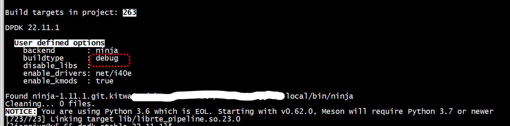
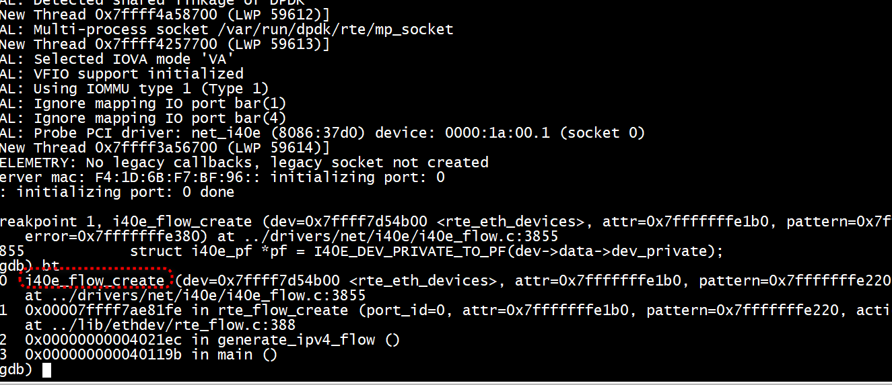

```
CONFIG_RTE_LIBRTE_ETHDEV_DEBUG=y
RTE_LOG_LEVEL=RTE_LOG_DEBUG
RTE_LIBRTE_ETHDEV_DEBUG=y
```


# 开启gdb
```
export EXTRA_CFLAGS="-O0 -g"
mkdir -p /usr/src/dpdk
[root@centos7 dpdk-19.11]# make install T=arm64-armv8a-linuxapp-gcc  DESTDIR=/usr/src/dpdk -j 64
```

# dpdk-stable-22.11.1
必须先clean，否则出现`UIO_RESOURCE_LIST tailq is already registered`    
+ clean   
```
cd build  进入配置
 ninja clean
 
```

+ build   
```
cd build  进入配置
meson configure --prefix $(pwd)/../install
meson configure -Dbuildtype=debug
cd ..  返回上级目录
ninja -C build  只编译不安装
``` 
采用如下命令，把debug版本所有文件装到一个目录   
```
meson configure --prefix $(pwd)/../install
```
不要采用../   



不需要 reconfigure   
```
meson --prefix $(pwd)/../install  --reconfigure 
ninja install -j CORES
```
Then you need to re-compile.    
```
rm -rf ../build/* ../install/*
ninja install
```

+ 使用   
```
[ubuntu flow_filtering]$ export PKG_CONFIG_PATH=/home/ubuntu/dpdk-stable-22.11.1/build/../dpdk_dbg/lib64/pkgconfig
[ubuntu flow_filtering]$ pkg-config --modversion libdpdk
22.11.1
[ubuntu flow_filtering]$ 
```


+ 动态库
```
[ubuntu dpdk-stable-22.11.1]$ find ./ -name librte_net_i40e.so.23.0
./build/drivers/librte_net_i40e.so.23.0
```


+  gdb  

```
ln -sf flow-shared build/flow
```
build/flow是链接文件，应该gdb flow-shared 

`i40e_flow_create`



#   UIO_RESOURCE_LIST tailq is already registered

```
[ubuntu@ test-pmd]$ sudo ./build/helloworld -c0x1
EAL: Detected CPU lcores: 72
EAL: Detected NUMA nodes: 2
EAL: Detected shared linkage of DPDK
EAL: UIO_RESOURCE_LIST tailq is already registered
PANIC in tailqinitfn_rte_uio_tailq():
Cannot initialize tailq: UIO_RESOURCE_LIST
0: /home/ubuntu/dpdk-stable-22.11.1/build/lib/librte_eal.so.23 (rte_dump_stack+0x1f) [7f5598c66cdd]
1: /home/ubuntu/dpdk-stable-22.11.1/build/lib/librte_eal.so.23 (__rte_panic+0xdb) [7f5598c3c51d]
2: /home/ubuntu/dpdk-stable-22.11.1/dpdk_dbg/lib64/dpdk/pmds-23.0/librte_bus_pci.so.23.0 (7f55965fd000+0x4843) [7f5596601843]
3: /lib64/ld-linux-x86-64.so.2 (7f559ade4000+0xf11a) [7f559adf311a]
4: /lib64/ld-linux-x86-64.so.2 (7f559ade4000+0xf226) [7f559adf3226]
5: /lib64/ld-linux-x86-64.so.2 (7f559ade4000+0x12ff3) [7f559adf6ff3]
6: /lib64/libc.so.6 (_dl_catch_exception+0x5c) [7f55987118dc]
7: /lib64/ld-linux-x86-64.so.2 (7f559ade4000+0x128da) [7f559adf68da]
8: /lib64/libdl.so.2 (7f55980a4000+0xfe6) [7f55980a4fe6]
9: /lib64/libc.so.6 (_dl_catch_exception+0x5c) [7f55987118dc]
10: /lib64/libc.so.6 (_dl_catch_error+0x1f) [7f559871194f]
11: /lib64/libdl.so.2 (7f55980a4000+0x1625) [7f55980a5625]
12: /lib64/libdl.so.2 (dlopen+0x51) [7f55980a5081]
13: /home/ubuntu/dpdk-stable-22.11.1/build/lib/librte_eal.so.23 (7f5598c2e000+0x1c63b) [7f5598c4a63b]
14: /home/ubuntu/dpdk-stable-22.11.1/build/lib/librte_eal.so.23 (7f5598c2e000+0x1c8ce) [7f5598c4a8ce]
15: /home/ubuntu/dpdk-stable-22.11.1/build/lib/librte_eal.so.23 (rte_eal_init+0x1d1) [7f5598c6a2cb]
16: ./build/helloworld (400000+0x106b8) [4106b8]
17: /lib64/libc.so.6 (__libc_start_main+0xe7) [7f5598609017]
18: ./build/helloworld (400000+0x1181a) [41181a]
```
使用了/home/ubuntu/dpdk-stable-22.11.1/build/lib/librte_eal.so.23   
把编译生成的`/home/ubuntu/dpdk-stable-22.11.1/build`的build目录删掉    
使用`/home/ubuntu/dpdk-stable-22.11.1/install/librte_eal.so.23`
```
find ./ -name 'lib*net_i40e*'
./lib64/librte_net_i40e.so.23
./lib64/librte_net_i40e.so.23.0
./lib64/librte_net_i40e.so
./lib64/librte_net_i40e.a
./lib64/dpdk/pmds-23.0/librte_net_i40e.so.23
./lib64/dpdk/pmds-23.0/librte_net_i40e.so.23.0
./lib64/dpdk/pmds-23.0/librte_net_i40e.so
```
动态库和静态库重名了    
