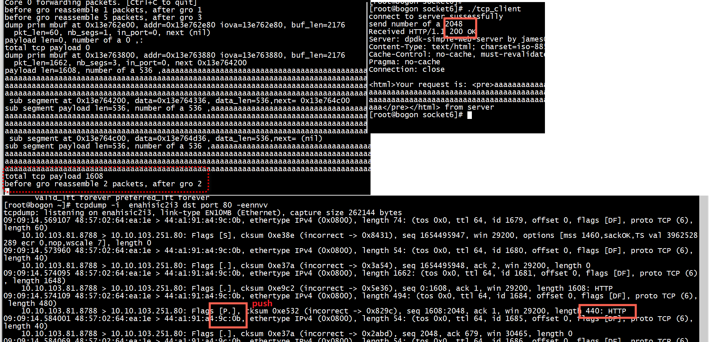
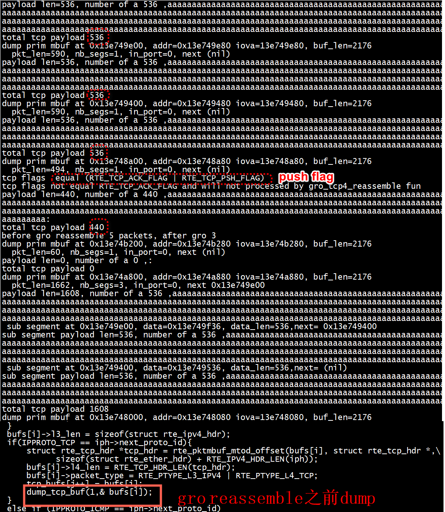

# dpdk

```
rte_gso_segment 
rte_gro_reassemble
```


```C
static int
GeneratePayloadPackets(uint16_t core_id, uint16_t port, uint8_t *pktbuf,
					   int len, int payloadlen, uint64_t offset, int fd)
{
  struct rte_mbuf *m;
  struct rte_ether_hdr *ethh;
  struct rte_ipv4_hdr *iph;
  struct rte_tcp_hdr *tcph;
  uint8_t *buf;
  
  m = get_wptr(core_id, port, len + payloadlen);
  buf = (void *)rte_pktmbuf_mtod(m, struct rte_ether_hdr *);
  assert(buf != NULL);

  memcpy(buf, pktbuf, len);
  if (read_file(fd, buf + len, payloadlen, offset) < 0) {
    TRACE_ERROR("File did not read\n");
    return -1;
  }

  ethh = (struct rte_ether_hdr *)rte_pktmbuf_mtod(m, struct rte_ether_hdr *);
  iph  = (struct rte_ipv4_hdr *)(ethh + 1);
  tcph = (struct rte_tcp_hdr *)(iph + 1);

  iph->total_length = htons(len + payloadlen - ETHERNET_HEADER_LEN);
  iph->hdr_checksum = 0;
  tcph->cksum = 0;

  m->l2_len = sizeof(struct rte_ether_hdr);
  m->l3_len = sizeof(struct rte_ipv4_hdr);
  m->l4_len = (tcph->data_off & 0xf0) >> 2;
  m->tso_segsz = MAX_PKT_SIZE - (m->l3_len + m->l4_len);
  m->ol_flags |=
	  PKT_TX_IPV4 | PKT_TX_TCP_CKSUM | PKT_TX_IP_CKSUM | PKT_TX_TCP_SEG;

  return 1;

#if NO_HARDWARE_TSO
  /***
   * Fallback when there's no hardware offload TSO
   ***/

  struct dpdk_private_context *dpc;
  int pkts = 0;

  /* If packet fits in MTU, do not segment */
  if (len + payloadlen <= MAX_PKT_SIZE) {
    m = get_wptr(core_id, port, len + payloadlen);
    buf = (void *)rte_pktmbuf_mtod(m, struct rte_ether_hdr *);
    // assert(buf != NULL);

    memcpy(buf, pktbuf, len);
    if (read_file(fd, buf + len, payloadlen, offset) < 0) {
      TRACE_ERROR("File did not read\n");
      return -1;
    }

    ethh = (struct rte_ether_hdr *)rte_pktmbuf_mtod(m, struct rte_ether_hdr *);
    iph = (struct rte_ipv4_hdr *)(ethh + 1);
    tcph = (struct rte_tcp_hdr *)(iph + 1);

    iph->total_length = htons(len + payloadlen - ETHERNET_HEADER_LEN);
    iph->hdr_checksum = 0;
    tcph->cksum = 0;

    m->l2_len = sizeof(struct rte_ether_hdr);
    m->l3_len = sizeof(struct rte_ipv4_hdr);
    m->l4_len = (tcph->data_off & 0xf0) >> 2;

    m->ol_flags |=
      PKT_TX_IPV4 | PKT_TX_TCP_CKSUM | PKT_TX_IP_CKSUM;

    return 1;
  }

  /****
   * Sending packet with GSO
   * - BUG: Memory pool problems?
   * - BUG: Sometimes segments packets and sends packets without payloads
   *****/

  dpc = ctx_array[core_id]->dpc;

  /* Allocate packet buffer */
  m = get_wptr(core_id, port, len + payloadlen);
  assert(m != NULL);

  /* Make sure to send remaining packets first */
  send_pkts(core_id, port);

  /* Make a single packet to GSO */
  buf = (void *)rte_pktmbuf_mtod(m, struct rte_ether_hdr *);
  m->ol_flags |=
      PKT_TX_IPV4 | PKT_TX_TCP_SEG | PKT_TX_TCP_CKSUM | PKT_TX_IP_CKSUM;

  memcpy(buf, pktbuf, len);
  if (read_file(fd, buf + len, payloadlen, offset) < 0) {
    TRACE_ERROR("File did not read\n");
    return -1;
  }
  
  ethh = (struct rte_ether_hdr *)buf;
  iph = (struct rte_ipv4_hdr *)(ethh + 1);
  tcph = (struct rte_tcp_hdr *)(iph + 1);

  m->l2_len = sizeof(struct rte_ether_hdr);
  m->l3_len = sizeof(struct rte_ipv4_hdr);
  m->l4_len = (tcph->data_off & 0xf0) >> 2;

  tcph->cksum = 0;

  pkts = rte_gso_segment(m, gso_ctx_array[core_id],
						 dpc->gso_pkts_burst, MAX_PKT_BURST);

  if (pkts <= 0) {
    fprintf(stderr, "\nERROR: Couldn't generate GSO segments\n");
    return -1;
  }

  /* Send GSO segments */
  struct rte_mbuf **pkts_burst;
  int ret, pkts_count, i;
  pkts_burst = dpc->gso_pkts_burst;
  pkts_count = pkts;
  do {
      ret = rte_eth_tx_burst(port, core_id, pkts_burst, pkts);
      pkts_burst += ret;
      pkts_count -= ret;
  } while (pkts_count > 0);

  for(i = 0; i < pkts; i++) {
    rte_pktmbuf_free(dpc->gso_pkts_burst[i]);
  }

  rte_pktmbuf_free(m);

  fprintf(stderr, "Sent %d packets for %u sized payload\n", pkts, payloadlen);

  return pkts;
#endif
}
```

# gro

```
./build/app/web_srv  -c 0x1 -n1 -- 10.10.103.251 80
```



+ 发送2048字节，gro_reassemble之后只接收了`total tcp payload 1608`     

+ 这是因为带有push flag的tcp报文，被gro_tcp4_reassemble drop了     
```C
 if (tcp_hdr->tcp_flags != RTE_TCP_ACK_FLAG)
                return -1;
```


> ## gro_tcp4_reassemble

+ 要设置pkt->l2_len，pkt->l3_len   
+ 不处理 tcp_hdr->tcp_flags != RTE_TCP_ACK_FLAG   

```C
gro_tcp4_reassemble(struct rte_mbuf *pkt,
                struct gro_tcp4_tbl *tbl,
                uint64_t start_time)
{
        struct rte_ether_hdr *eth_hdr;
        struct rte_ipv4_hdr *ipv4_hdr;
        struct rte_tcp_hdr *tcp_hdr;
        uint32_t sent_seq;
        int32_t tcp_dl;
        uint16_t ip_id, hdr_len, frag_off;
        uint8_t is_atomic;

        struct tcp4_flow_key key;
        uint32_t cur_idx, prev_idx, item_idx;
        uint32_t i, max_flow_num, remaining_flow_num;
        int cmp;
        uint8_t find;

        /*
         * Don't process the packet whose TCP header length is greater
         * than 60 bytes or less than 20 bytes.
         */
        if (unlikely(INVALID_TCP_HDRLEN(pkt->l4_len)))
                return -1;

        eth_hdr = rte_pktmbuf_mtod(pkt, struct rte_ether_hdr *);
        ipv4_hdr = (struct rte_ipv4_hdr *)((char *)eth_hdr + pkt->l2_len);
        tcp_hdr = (struct rte_tcp_hdr *)((char *)ipv4_hdr + pkt->l3_len);
        hdr_len = pkt->l2_len + pkt->l3_len + pkt->l4_len;

        /*
         * Don't process the packet which has FIN, SYN, RST, PSH, URG, ECE
         * or CWR set.
         */
        if (tcp_hdr->tcp_flags != RTE_TCP_ACK_FLAG)
                return -1;
        /*
         * Don't process the packet whose payload length is less than or
         * equal to 0.
         */
```
# tso
```
static inline void ff_offload_set(struct ff_dpdk_if_context *ctx, void *m, struct rte_mbuf *head)
{
    void                    *data = NULL;
    struct ff_tx_offload     offload = {0};

    ff_mbuf_tx_offload(m, &offload);
    data = rte_pktmbuf_mtod(head, void*);

    if (offload.ip_csum) {
        /* ipv6 not supported yet */
        struct rte_ipv4_hdr *iph;
        int iph_len;
        iph = (struct rte_ipv4_hdr *)(data + RTE_ETHER_HDR_LEN);
        iph_len = (iph->version_ihl & 0x0f) << 2;

        head->ol_flags |= PKT_TX_IP_CKSUM | PKT_TX_IPV4;
        head->l2_len = RTE_ETHER_HDR_LEN;
        head->l3_len = iph_len;
    }

    if (ctx->hw_features.tx_csum_l4) {
        struct rte_ipv4_hdr *iph;
        int iph_len;
        iph = (struct rte_ipv4_hdr *)(data + RTE_ETHER_HDR_LEN);
        iph_len = (iph->version_ihl & 0x0f) << 2;

        if (offload.tcp_csum) {
            head->ol_flags |= PKT_TX_TCP_CKSUM;
            head->l2_len = RTE_ETHER_HDR_LEN;
            head->l3_len = iph_len;
        }

       /*
         *  TCP segmentation offload.
         *
         *  - set the PKT_TX_TCP_SEG flag in mbuf->ol_flags (this flag
         *    implies PKT_TX_TCP_CKSUM)
         *  - set the flag PKT_TX_IPV4 or PKT_TX_IPV6
         *  - if it's IPv4, set the PKT_TX_IP_CKSUM flag and
         *    write the IP checksum to 0 in the packet
         *  - fill the mbuf offload information: l2_len,
         *    l3_len, l4_len, tso_segsz
         *  - calculate the pseudo header checksum without taking ip_len
         *    in account, and set it in the TCP header. Refer to
         *    rte_ipv4_phdr_cksum() and rte_ipv6_phdr_cksum() that can be
         *    used as helpers.
         */
        if (offload.tso_seg_size) {
            struct rte_tcp_hdr *tcph;
            int tcph_len;
            tcph = (struct rte_tcp_hdr *)((char *)iph + iph_len);
            tcph_len = (tcph->data_off & 0xf0) >> 2;
            tcph->cksum = rte_ipv4_phdr_cksum(iph, PKT_TX_TCP_SEG);

            head->ol_flags |= PKT_TX_TCP_SEG;
            head->l4_len = tcph_len;
            head->tso_segsz = offload.tso_seg_size;
        }

        if (offload.udp_csum) {
            head->ol_flags |= PKT_TX_UDP_CKSUM;
            head->l2_len = RTE_ETHER_HDR_LEN;
            head->l3_len = iph_len;
        }
    }
}
```