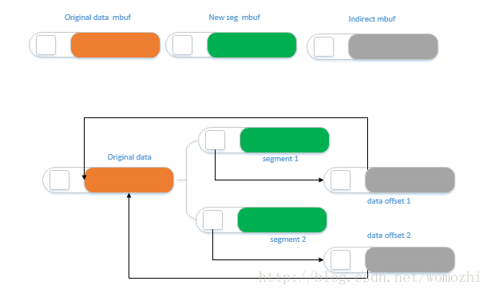

# port mtu

```
#define	IPV4_MTU_DEFAULT_HALF	(RTE_ETHER_MTU/2)
#define	IPV6_MTU_DEFAULT_HALF	(RTE_ETHER_MTU/2)
```

# IP数据报分片

另外，IP数据报分片后，只有第一片带有UDP首部或ICMP首部，其余的分片只有IP头部，到了端点后根据IP头部中的信息再网络层进行重组。而TCP报文段的每个分段中都有TCP首部，到了端点后根据TCP首部的信息在传输层进行重组。IP数据报分片后，只有到达目的地后才进行重组，而不是向其他网络协议，在下一站就要进行重组。

# mac address

```
static struct rte_ether_addr srv81_ether_addr =
    {{0x48,0x57,0x02,0x64,0xea,0x1e}};

static struct rte_ether_addr srv82_ether_addr =
    {{0x48,0x57,0x02,0x64,0xe7,0xad}};
```

#  ./usertools/dpdk-devbind.py  -s

```Shell
./usertools/dpdk-devbind.py  -s
./usertools/dpdk-devbind.py  -u  0000:06:00.0
./usertools/dpdk-devbind.py  -u  0000:05:00.0
./usertools/dpdk-devbind.py   --bind=vfio-pci  0000:06:00.0
./usertools/dpdk-devbind.py   --bind=vfio-pci  0000:05:00.0
```

# ./build/app/ip_fragmentation
```
[root@centos7 ip_frag_test]# ./build/app/ip_fragmentation -l 0,1  -- -p 0x3
EAL: Detected 128 lcore(s)
EAL: Detected 4 NUMA nodes
EAL: Multi-process socket /var/run/dpdk/rte/mp_socket
EAL: Selected IOVA mode 'VA'
EAL: No available hugepages reported in hugepages-2048kB
EAL: Probing VFIO support...
EAL: VFIO support initialized
EAL: PCI device 0000:05:00.0 on NUMA socket 0
EAL:   probe driver: 19e5:200 net_hinic
EAL:   using IOMMU type 1 (Type 1)
net_hinic: Initializing pf hinic-0000:05:00.0 in primary process
net_hinic: Device 0000:05:00.0 hwif attribute:
net_hinic: func_idx:0, p2p_idx:0, pciintf_idx:0, vf_in_pf:0, ppf_idx:0, global_vf_id:15, func_type:2
net_hinic: num_aeqs:4, num_ceqs:4, num_irqs:32, dma_attr:2
net_hinic: Get public resource capability:
net_hinic: host_id: 0x0, ep_id: 0x0, intr_type: 0x0, max_cos_id: 0x7, er_id: 0x0, port_id: 0x0
net_hinic: host_total_function: 0xf2, host_oq_id_mask_val: 0x8, max_vf: 0x78
net_hinic: pf_num: 0x2, pf_id_start: 0x0, vf_num: 0xf0, vf_id_start: 0x10
net_hinic: Get share resource capability:
net_hinic: host_pctxs: 0x0, host_cctxs: 0x0, host_scqs: 0x0, host_srqs: 0x0, host_mpts: 0x0
net_hinic: Get l2nic resource capability:
net_hinic: max_sqs: 0x10, max_rqs: 0x10, vf_max_sqs: 0x4, vf_max_rqs: 0x4
net_hinic: Initialize 0000:05:00.0 in primary successfully
EAL: PCI device 0000:06:00.0 on NUMA socket 0
EAL:   probe driver: 19e5:200 net_hinic
net_hinic: Initializing pf hinic-0000:06:00.0 in primary process
net_hinic: Device 0000:06:00.0 hwif attribute:
net_hinic: func_idx:1, p2p_idx:1, pciintf_idx:0, vf_in_pf:0, ppf_idx:0, global_vf_id:135, func_type:0
net_hinic: num_aeqs:4, num_ceqs:4, num_irqs:32, dma_attr:2
net_hinic: Get public resource capability:
net_hinic: host_id: 0x0, ep_id: 0x1, intr_type: 0x0, max_cos_id: 0x7, er_id: 0x1, port_id: 0x1
net_hinic: host_total_function: 0xf2, host_oq_id_mask_val: 0x8, max_vf: 0x78
net_hinic: pf_num: 0x2, pf_id_start: 0x0, vf_num: 0xf0, vf_id_start: 0x10
net_hinic: Get l2nic resource capability:
net_hinic: max_sqs: 0x10, max_rqs: 0x10, vf_max_sqs: 0x4, vf_max_rqs: 0x4
net_hinic: Initialize 0000:06:00.0 in primary successfully
EAL: PCI device 0000:7d:00.0 on NUMA socket 0
EAL:   probe driver: 19e5:a222 net_hns3
EAL: PCI device 0000:7d:00.1 on NUMA socket 0
EAL:   probe driver: 19e5:a221 net_hns3
EAL: PCI device 0000:7d:00.2 on NUMA socket 0
EAL:   probe driver: 19e5:a222 net_hns3
EAL: PCI device 0000:7d:00.3 on NUMA socket 0
EAL:   probe driver: 19e5:a221 net_hns3
IP_FRAG: Creating direct mempool on socket 0
IP_FRAG: Creating indirect mempool on socket 0
IP_FRAG: Creating LPM table on socket 0
IP_FRAG: Creating LPM6 table on socket 0
Initializing port 0 on lcore 0...net_hinic: Disable vlan filter succeed, device: hinic-0000:05:00.0, port_id: 0
net_hinic: Disable vlan strip succeed, device: hinic-0000:05:00.0, port_id: 0
net_hinic: Set port mtu, port_id: 0, mtu: 9596, max_pkt_len: 9614
 Address:44:A1:91:A4:9C:0B
txq=0,0 txq=1,1 
Initializing port 1 on lcore 1...net_hinic: Disable vlan filter succeed, device: hinic-0000:06:00.0, port_id: 1
net_hinic: Disable vlan strip succeed, device: hinic-0000:06:00.0, port_id: 1
net_hinic: Set port mtu, port_id: 1, mtu: 9596, max_pkt_len: 9614
 Address:44:A1:91:A4:9C:0C
txq=0,0 txq=1,1 

net_hinic: Set new mac address 44:a1:91:a4:9c:0b

net_hinic: Disable promiscuous, nic_dev: hinic-0000:05:00.0, port_id: 0, promisc: 0
net_hinic: Disable allmulticast succeed, nic_dev: hinic-0000:05:00.0, port_id: 0
net_hinic: Enable promiscuous, nic_dev: hinic-0000:05:00.0, port_id: 0, promisc: 0
Add Rx callback function to detect L3 packet type by SW : port = 0
net_hinic: Set new mac address 44:a1:91:a4:9c:0c

net_hinic: Disable promiscuous, nic_dev: hinic-0000:06:00.0, port_id: 1, promisc: 0
net_hinic: Disable allmulticast succeed, nic_dev: hinic-0000:06:00.0, port_id: 1
net_hinic: Enable promiscuous, nic_dev: hinic-0000:06:00.0, port_id: 1, promisc: 0
Add Rx callback function to detect L3 packet type by SW : port = 1
IP_FRAG: Socket 0: adding route 100.10.0.0/16 (port 0)
IP_FRAG: Socket 0: adding route 100.20.0.0/16 (port 1)
IP_FRAG: Socket 0: adding route 100.30.0.0/16 (port 2)
IP_FRAG: Socket 0: adding route 100.40.0.0/16 (port 3)
IP_FRAG: Socket 0: adding route 100.50.0.0/16 (port 4)
IP_FRAG: Socket 0: adding route 100.60.0.0/16 (port 5)
IP_FRAG: Socket 0: adding route 100.70.0.0/16 (port 6)
IP_FRAG: Socket 0: adding route 100.80.0.0/16 (port 7)
IP_FRAG: Socket 0: adding route 0101:0101:0101:0101:0101:0101:0101:0101/48 (port 0)
IP_FRAG: Socket 0: adding route 0201:0101:0101:0101:0101:0101:0101:0101/48 (port 1)
IP_FRAG: Socket 0: adding route 0301:0101:0101:0101:0101:0101:0101:0101/48 (port 2)
IP_FRAG: Socket 0: adding route 0401:0101:0101:0101:0101:0101:0101:0101/48 (port 3)
IP_FRAG: Socket 0: adding route 0501:0101:0101:0101:0101:0101:0101:0101/48 (port 4)
IP_FRAG: Socket 0: adding route 0601:0101:0101:0101:0101:0101:0101:0101/48 (port 5)
IP_FRAG: Socket 0: adding route 0701:0101:0101:0101:0101:0101:0101:0101/48 (port 6)
IP_FRAG: Socket 0: adding route 0801:0101:0101:0101:0101:0101:0101:0101/48 (port 7)

Checking link status
done
Port0 Link Up .Speed 40000 Mbps - full-duplex
Port1 Link Up .Speed 40000 Mbps - full-duplex
IP_FRAG: entering main loop on lcore 1
IP_FRAG:  -- lcoreid=1 portid=1
IP_FRAG: entering main loop on lcore 0
IP_FRAG:  -- lcoreid=0 portid=0
```

# 81 node
```
[root@bogon ~]# route add -host 100.20.0.82   gw 10.10.103.251
[root@bogon ~]#  ip neigh add 10.10.103.251  lladdr 44:A1:91:A4:9C:0B dev enahisic2i3

```

```Shell
[root@bogon ~]# ping  100.20.0.82
PING 100.20.0.82 (100.20.0.82) 56(84) bytes of data.
64 bytes from 100.20.0.82: icmp_seq=1 ttl=64 time=0.144 ms
64 bytes from 100.20.0.82: icmp_seq=2 ttl=64 time=0.175 ms
64 bytes from 100.20.0.82: icmp_seq=3 ttl=64 time=0.158 ms
64 bytes from 100.20.0.82: icmp_seq=4 ttl=64 time=0.139 ms
64 bytes from 100.20.0.82: icmp_seq=5 ttl=64 time=0.204 ms
64 bytes from 100.20.0.82: icmp_seq=6 ttl=64 time=0.183 ms
64 bytes from 100.20.0.82: icmp_seq=7 ttl=64 time=0.156 ms
64 bytes from 100.20.0.82: icmp_seq=8 ttl=64 time=0.139 ms
64 bytes from 100.20.0.82: icmp_seq=9 ttl=64 time=0.106 ms
64 bytes from 100.20.0.82: icmp_seq=10 ttl=64 time=0.173 ms
64 bytes from 100.20.0.82: icmp_seq=11 ttl=64 time=0.142 ms
64 bytes from 100.20.0.82: icmp_seq=12 ttl=64 time=0.125 ms
64 bytes from 100.20.0.82: icmp_seq=13 ttl=64 time=0.099 ms
64 bytes from 100.20.0.82: icmp_seq=14 ttl=64 time=0.166 ms
64 bytes from 100.20.0.82: icmp_seq=15 ttl=64 time=0.125 ms
64 bytes from 100.20.0.82: icmp_seq=16 ttl=64 time=0.112 ms
64 bytes from 100.20.0.82: icmp_seq=17 ttl=64 time=0.197 ms
64 bytes from 100.20.0.82: icmp_seq=18 ttl=64 time=0.177 ms
64 bytes from 100.20.0.82: icmp_seq=19 ttl=64 time=0.152 ms
64 bytes from 100.20.0.82: icmp_seq=20 ttl=64 time=0.122 ms
64 bytes from 100.20.0.82: icmp_seq=21 ttl=64 time=0.099 ms
64 bytes from 100.20.0.82: icmp_seq=22 ttl=64 time=0.171 ms
64 bytes from 100.20.0.82: icmp_seq=23 ttl=64 time=0.234 ms
64 bytes from 100.20.0.82: icmp_seq=24 ttl=64 time=0.294 ms
64 bytes from 100.20.0.82: icmp_seq=25 ttl=64 time=0.191 ms
64 bytes from 100.20.0.82: icmp_seq=26 ttl=64 time=0.146 ms
64 bytes from 100.20.0.82: icmp_seq=27 ttl=64 time=0.127 ms
64 bytes from 100.20.0.82: icmp_seq=28 ttl=64 time=0.103 ms
```

# 82 node
```
 route add -host 10.10.103.81   gw 100.20.0.251
ip neigh add  100.20.0.251  lladdr 44:A1:91:A4:9C:0C dev enahisic2i2
```

```Shell
root@ubuntu:~# ping  10.10.103.81 -s 1500
PING 10.10.103.81 (10.10.103.81) 1500(1528) bytes of data.
1508 bytes from 10.10.103.81: icmp_seq=1 ttl=64 time=0.215 ms
1508 bytes from 10.10.103.81: icmp_seq=2 ttl=64 time=0.197 ms
1508 bytes from 10.10.103.81: icmp_seq=3 ttl=64 time=0.249 ms
1508 bytes from 10.10.103.81: icmp_seq=4 ttl=64 time=0.187 ms
1508 bytes from 10.10.103.81: icmp_seq=27 ttl=64 time=0.261 ms
1508 bytes from 10.10.103.81: icmp_seq=28 ttl=64 time=0.304 ms
1508 bytes from 10.10.103.81: icmp_seq=59 ttl=64 time=0.329 ms
1508 bytes from 10.10.103.81: icmp_seq=60 ttl=64 time=0.325 ms
1508 bytes from 10.10.103.81: icmp_seq=61 ttl=64 time=0.236 ms
1508 bytes from 10.10.103.81: icmp_seq=62 ttl=64 time=0.262 ms
1508 bytes from 10.10.103.81: icmp_seq=63 ttl=64 time=0.242 ms
1508 bytes from 10.10.103.81: icmp_seq=64 ttl=64 time=0.265 ms
1508 bytes from 10.10.103.81: icmp_seq=65 ttl=64 time=0.259 ms
1508 bytes from 10.10.103.81: icmp_seq=66 ttl=64 time=0.239 ms
1508 bytes from 10.10.103.81: icmp_seq=67 ttl=64 time=0.268 ms
1508 bytes from 10.10.103.81: icmp_seq=68 ttl=64 time=0.226 ms
1508 bytes from 10.10.103.81: icmp_seq=69 ttl=64 time=0.244 ms
1508 bytes from 10.10.103.81: icmp_seq=70 ttl=64 time=0.244 ms
1508 bytes from 10.10.103.81: icmp_seq=71 ttl=64 time=0.219 ms
1508 bytes from 10.10.103.81: icmp_seq=72 ttl=64 time=0.244 ms
```

# rte_ipv4_fragment_packet

```Text
1、参数pkt_in，此时的mbuf数据的偏移位置需在ip头部。可通过rte_pktmbuf_adj()进行调整。分片完成之后的输出mbuf的数据指针位置也会在ip头部的位置，如果发送此分片的话使用rte_pktmbuf_prepend调整。

2、 Free input packet（rte_pktmbuf_free）
en2 = rte_ipv4_fragment_packet(m,
                                &qconf->tx_mbufs[port_out].m_table[len],
                                (uint16_t)(MBUF_TABLE_SIZE - len),
                                IPV4_MTU_DEFAULT_HALF,
                                rxq->direct_pool, rxq->indirect_pool);

                        /* Free input packet */
                        rte_pktmbuf_free(m);

                        /* request HW to regenerate IPv4 cksum */
                        ol_flags |= (PKT_TX_IPV4 | PKT_TX_IP_CKSUM);
```


如上图所示，假设根据mtu原始的packet需要被分片为两个分片。在分片成功之后我们可以看到原来的一个mbuf变成了两个，这两个分片的mbuf有以下特点：   

1、  分片的mbuf中的数据部分只存有ipv4的头部信息；   
2、  每个分片mbuf都有一个Indirectmbuf，这个indirect mbuf包含分片的数据的部分，它是通过指针指向了分片前的数据偏移。   
3、  此mbuf的数据指针此时在l3层的位置（如果发送此分片的话使用rte_pktmbuf_prepend调整）。   
 