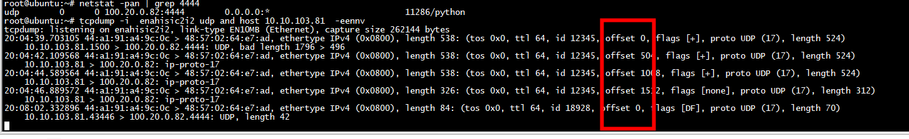
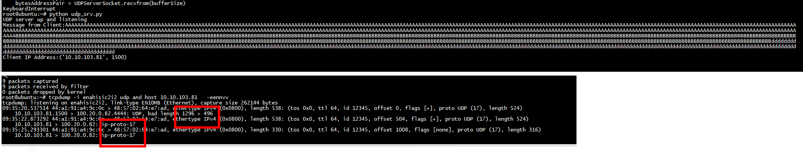
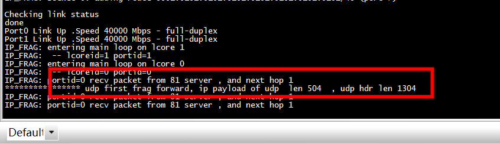
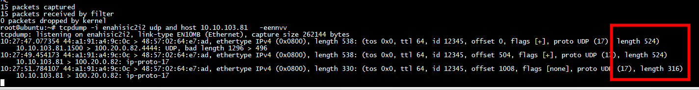

# ip_fragmentation

```
 ./build/app/ip_fragmentation -l 0,1  -- -p 0x3
```

# client 发包

```
[root@bogon scapy]# cat frag3.py 
#!/usr/bin/python

from scapy.all import *
sip="10.10.103.81"
dip="100.20.0.82"
#dip="10.10.103.229"
payload="A"*496+"B"*500 +  "d"*300
packet=IP(src=sip,dst=dip,id=12345)/UDP(sport=1500,dport=4444)/payload

frags=fragment(packet,fragsize=500)
counter=1
for fragment in frags:
    print "Packet no#"+str(counter)
    print "==================================================="
    fragment.show() #displays each fragment
    counter+=1
    send(fragment)
```
总长度（496 + 500 + 300） >  IPV4_MTU_DEFAULT_HALF   
总长度（496 + 500 + 300）****小于mtu不需要分片****
# 服务端

```

```


# rte_ipv4_frag_pkt_is_fragmented

```
/* Fragment Offset * Flags. */
#define RTE_IPV4_HDR_DF_SHIFT   14
#define RTE_IPV4_HDR_MF_SHIFT   13
#define RTE_IPV4_HDR_FO_SHIFT   3

#define RTE_IPV4_HDR_DF_FLAG    (1 << RTE_IPV4_HDR_DF_SHIFT)
#define RTE_IPV4_HDR_MF_FLAG    (1 << RTE_IPV4_HDR_MF_SHIFT)

#define RTE_IPV4_HDR_OFFSET_MASK        ((1 << RTE_IPV4_HDR_MF_SHIFT) - 1)
static inline int
rte_ipv4_frag_pkt_is_fragmented(const struct rte_ipv4_hdr *hdr)
{
        uint16_t flag_offset, ip_flag, ip_ofs;

        flag_offset = rte_be_to_cpu_16(hdr->fragment_offset);
        ip_ofs = (uint16_t)(flag_offset & RTE_IPV4_HDR_OFFSET_MASK);
        ip_flag = (uint16_t)(flag_offset & RTE_IPV4_HDR_MF_FLAG);

        return ip_flag != 0 || ip_ofs  != 0;
}
```

# rte_ipv4_fragment_packet
rte_ipv4_fragment_packet -->  __fill_ipv4hdr_frag   


```
static inline void __fill_ipv4hdr_frag(struct rte_ipv4_hdr *dst,
		const struct rte_ipv4_hdr *src, uint16_t header_len,
		uint16_t len, uint16_t fofs, uint16_t dofs, uint32_t mf)
{
	rte_memcpy(dst, src, header_len);
	fofs = (uint16_t)(fofs + (dofs >> RTE_IPV4_HDR_FO_SHIFT));
	fofs = (uint16_t)(fofs | mf << RTE_IPV4_HDR_MF_SHIFT);
	dst->fragment_offset = rte_cpu_to_be_16(fofs);
	dst->total_length = rte_cpu_to_be_16(len);
	dst->hdr_checksum = 0;
}
```
更新ip头的total_length、fragment_offset，没有更新checksum    

# the first fragment.

```
struct rte_mbuf *
ip_frag_process(struct ip_frag_pkt *fp, struct rte_ip_frag_death_row *dr,
	struct rte_mbuf *mb, uint16_t ofs, uint16_t len, uint16_t more_frags)
{
	uint32_t idx;

	fp->frag_size += len;

	/* this is the first fragment. */
	if (ofs == 0) {
		idx = (fp->frags[IP_FIRST_FRAG_IDX].mb == NULL) ?
				IP_FIRST_FRAG_IDX : UINT32_MAX;

	/* this is the last fragment. */
	} else if (more_frags == 0) {
		fp->total_size = ofs + len;
		idx = (fp->frags[IP_LAST_FRAG_IDX].mb == NULL) ?
				IP_LAST_FRAG_IDX : UINT32_MAX;

	/* this is the intermediate fragment. */
	}
```

# 加上udp_first_pkt_forward




```
static inline void udp_first_pkt_forward(struct rte_mbuf *m)
{
    uint16_t flag_offset,  ip_ofs;
    struct rte_ether_hdr * eth_h = rte_pktmbuf_mtod(m, struct rte_ether_hdr *);
    /* Read the ipv4 ip (i.e. ip_dst, ip_src) from the input packet */
    struct rte_ipv4_hdr* ip_hdr = (struct rte_ipv4_hdr *)(struct rte_ipv4_hdr *)(eth_h + 1);;
    struct rte_udp_hdr *udp_hdr = NULL;
    unsigned header_len = (ip_hdr-> version_ihl & 0xf)* 4, udp_total;
    flag_offset = rte_be_to_cpu_16(ip_hdr->fragment_offset);
    ip_ofs = (uint16_t)(flag_offset & RTE_IPV4_HDR_OFFSET_MASK);
    if(ip4_is_frag(ip_hdr) && 0 == ip_ofs)
    {
        if(ip_hdr->next_proto_id == IP_PROTO_UDP)
        //if(ip_hdr->next_proto_id == IP_PROTO_ICMP)
        {
              udp_hdr = (struct rte_udp_hdr *)((char*)ip_hdr + header_len);
              udp_total = rte_be_to_cpu_16(ip_hdr->total_length) - header_len;
              printf("**************** udp first frag forward, ip payload of udp  len %u  , udp hdr len %u\n", udp_total,  rte_be_to_cpu_16(udp_hdr->dgram_len));
              // Set the UDP checksum to zero for simplicity. This is perfectly legal. It
              // just tells the the receiver not to check the checksum.
              //udp_hdr->dgram_cksum = 0;
              //rte_ipv4_udptcp_cksum(ip_hdr, (const void *)udp_hdr);
        }
    }
}
```
ip payload of udp  len 504  , udp hdr len 1304:  
1) udp header(8) + udp payload(496 + 500 + 300) = 1304   
2) rte_be_to_cpu_16(ip_hdr->total_length) - header_len = 504, tcpdump 显示的长度524包含ip头   

 