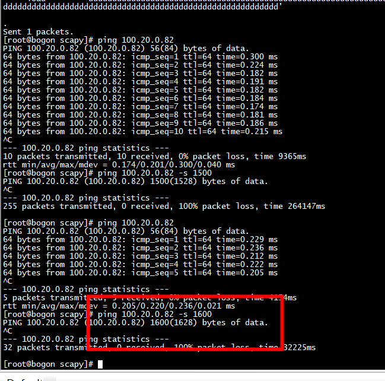

# m->packet_type

```
                if (check_ptype(portid) == 0) {
                        rte_eth_add_rx_callback(portid, 0, cb_parse_ptype, NULL);
                        printf("Add Rx callback function to detect L3 packet type by SW :"
                                " port = %d\n", portid);
                }
```

# mac address

```
static struct rte_ether_addr srv81_ether_addr =
    {{0x48,0x57,0x02,0x64,0xea,0x1e}};

static struct rte_ether_addr srv82_ether_addr =
    {{0x48,0x57,0x02,0x64,0xe7,0xad}};
```

#  ./usertools/dpdk-devbind.py  -s

```Shell
./usertools/dpdk-devbind.py  -s
./usertools/dpdk-devbind.py  -u  0000:06:00.0
./usertools/dpdk-devbind.py  -u  0000:05:00.0
./usertools/dpdk-devbind.py   --bind=vfio-pci  0000:06:00.0
./usertools/dpdk-devbind.py   --bind=vfio-pci  0000:05:00.0
```

# dpdk

```

./build/app/ip_reassembly -l 0,1  -- -p 0x3 -q 4  --maxflows=1024 --flowttl=10s
```
运行下述命令出现rte_ip_frag_free_death_row  
```
./build/app/ip_reassembly -l 0,1  -- -p 0x3 -q 4 
```


# 81 node
```
[root@bogon ~]# route add -host 100.20.0.82   gw 10.10.103.251
[root@bogon ~]#  ip neigh add 10.10.103.251  lladdr 44:A1:91:A4:9C:0B dev enahisic2i3

```


# 82 node
```
 route add -host 10.10.103.81   gw 100.20.0.251
ip neigh add  100.20.0.251  lladdr 44:A1:91:A4:9C:0C dev enahisic2i2
```

# 重组mbuf管理
以两个分片重组一个数据包为例。     

分片重组的过程中不会使用新的mbuf，只是在原来的mbuf的基础上做一些修改。当然了，原来的分片信息并没有被清掉，如果在重组完成后利用原来的分片ip头部信息，通过Data指针偏移即可访问。重组后的mbuf有一下特点：   
+ 1、mbuf通过next指针将分片链接为一个完整的以太网包，其中第一个分片所在的mbuf中存储了整个以太网包的长度，完整的新的IP头等信息。**查看debug_frag**   
+ 2、包含有第一个分片的mbuf的数据buf_addr指针在l2的位置，其他分片的buf_addr指针在data_off+l2_len+l3_len的位置，即buf_addr指向ipv4负载。   
+ 3、当发生分片丢失造成超时时，超时分片会被加入到death_raw链表上(初始化frag_table时指定)，在处理业务时，需要显示调用rte_ip_frag_free_death_row()来回收超时的分片。   
```
void
rte_ip_frag_free_death_row(struct rte_ip_frag_death_row *dr,
                uint32_t prefetch)
{
        uint32_t i, k, n;

        k = RTE_MIN(prefetch, dr->cnt);
        n = dr->cnt;

        for (i = 0; i != k; i++)
                rte_prefetch0(dr->row[i]);

        for (i = 0; i != n - k; i++) {
                rte_prefetch0(dr->row[i + k]);
                rte_pktmbuf_free(dr->row[i]);
        }

        for (; i != n; i++)
                rte_pktmbuf_free(dr->row[i]);

        dr->cnt = 0;
}
```

#  xmit处理mbuf->next
 hinic_xmit_pkts  -->  hinic_mbuf_dma_map_sge    


# ping test1

```
[root@bogon scapy]# ping 100.20.0.82 
PING 100.20.0.82 (100.20.0.82) 56(84) bytes of data.
64 bytes from 100.20.0.82: icmp_seq=1 ttl=64 time=0.229 ms
64 bytes from 100.20.0.82: icmp_seq=2 ttl=64 time=0.236 ms
64 bytes from 100.20.0.82: icmp_seq=3 ttl=64 time=0.212 ms
64 bytes from 100.20.0.82: icmp_seq=4 ttl=64 time=0.222 ms
64 bytes from 100.20.0.82: icmp_seq=5 ttl=64 time=0.205 ms
^C
--- 100.20.0.82 ping statistics ---
5 packets transmitted, 5 received, 0% packet loss, time 4154ms
rtt min/avg/max/mdev = 0.205/0.220/0.236/0.021 ms
[root@bogon scapy]# 
```

## 采用大包   



采用大包ping失败，因为dpdk app对于packet（1600）大于mtu没有fragment   

采用scapy发包，fragsize=500 发送一个小于ether mtu的报文
```
[root@bogon scapy]# cat frag4.py 
#!/usr/bin/python

from scapy.all import *
sip="10.10.103.81"
dip="100.20.0.82"
#dip="10.10.103.229"
payload="A"*496+"B"*500 +  "d"*300
packet=IP(src=sip,dst=dip,id=12345)/UDP(sport=1500,dport=4444)/payload

frags=fragment(packet,fragsize=500)
counter=1
for fragment in frags:
    print "Packet no#"+str(counter)
    print "==================================================="
    fragment.show() #displays each fragment
    counter+=1
    send(fragment)
```

+ 1) ping 100.20.0.82 -s 1600， reassemble后的total_length: 1628（udp payload + udp header + ip header ）   
+ 2)   python frag4.py , reassemble后的total_length: 1324（udp payload + udp header + ip header ）  

# 最大分片数

```
#define MAX_FRAG_NUM RTE_LIBRTE_IP_FRAG_MAX_FRAG
#define RTE_LIBRTE_IP_FRAG_MAX_FRAG 4
```

#  rte_ip_frag_table_create

```
    if ((rxq->frag_tbl = rte_ip_frag_table_create(max_flow_num,
                        IP_FRAG_TBL_BUCKET_ENTRIES, max_flow_num, frag_cycles,
                        socket)) == NULL) {
                RTE_LOG(ERR, IP_RSMBL, "ip_frag_tbl_create(%u) on "
                        "lcore: %u for queue: %u failed\n",
                        max_flow_num, lcore, queue);
                return -1;
        
```

# rte_ipv4_frag_reassemble_packet

使用rte_ipv4_frag_reassemble_packet之前要设置m->l2_len、m->l3_len
```
            // prepare mbuf (setup l2_len/l3_len)
            m->l2_len = sizeof(*eth_hdr);
            m->l3_len = sizeof(*ip_hdr);

            // Handle this fragment (returns # of fragments if all already received, NULL otherwise)
            mo = rte_ipv4_frag_reassemble_packet(tbl, dr, m, tms, ip_hdr);
```


# references
[IP Reassembly Tests](https://dpdk-test-plans.readthedocs.io/en/latest/ipv4_reassembly_test_plan.html)  
[dpdk样例源码解析之四：dpdk-ip_reassembly](https://blog.csdn.net/weixin_42571882/article/details/126411973)