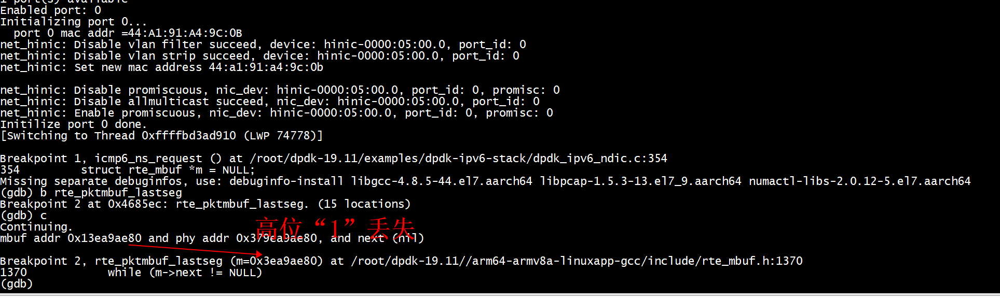

# run

```
./build/app/dpdk-ipv6 -c 0x3 -- -p 0
```
+ 配置
   + 本地IP6   
const char *ip6str = "fe80::4a57:2ff:fe64:e7a7";   
   + gw IP6   
const char *gwip6str= "fe80::4a57:2ff:fe64:e7ae";   
   + 使用的网卡  DEFAULT_PORTID = 0   

## dpdk开启混杂

```
rte_eth_promiscuous_enable(portid);
```

## cmd

```
ip -6 neighbor show
 ip -6 route show
```

## II ping6

在另外一台机器上执行ping6
```
5: enahisic2i3: <BROADCAST,MULTICAST,UP,LOWER_UP> mtu 1500 qdisc mq state UP group default qlen 1000
    link/ether 48:57:02:64:e7:ae brd ff:ff:ff:ff:ff:ff
    inet 10.10.103.82/24 scope global enahisic2i3
       valid_lft forever preferred_lft forever
    inet6 fe80::4a57:2ff:fe64:e7ae/64 scope link tentative 
       valid_lft forever preferred_lft forever
root@ubuntu:~# ping6  fe80::4a57:2ff:fe64:e7a7%enahisic2i3
```
源ip: fe80::4a57:2ff:fe64:e7ae/64

+ tcpdump neighbor solicitation
```
 tcpdump -vvvv -ttt -i enahisic2i3 ip6  and host ff02::1:ff64:e7a7
  00:00:01.023989 IP6 (hlim 255, next-header ICMPv6 (58) payload length: 32) ubuntu > ff02::1:ff64:e7a7: [icmp6 sum ok] ICMP6, neighbor solicitation, length 32, who has fe80::4a57:2ff:fe64:e7a7
          source link-address option (1), length 8 (1): 48:57:02:64:e7:ae
            0x0000:  4857 0264 e7ae
 00:00:01.023992 IP6 (hlim 255, next-header ICMPv6 (58) payload length: 32) ubuntu > ff02::1:ff64:e7a7: [icmp6 sum ok] ICMP6, neighbor solicitation, length 32, who has fe80::4a57:2ff:fe64:e7a7
          source link-address option (1), length 8 (1): 48:57:02:64:e7:ae
```
源ip: ff02::1:ff64:e7a7
+  tcpdump icmp echo request
ip: fe80::4a57:2ff:fe64:e7ae/64
```
root@ubuntu:~#  tcpdump -vvvv -ttt -i enahisic2i3 ip6  and host  fe80::4a57:2ff:fe64:e7a7
tcpdump: listening on enahisic2i3, link-type EN10MB (Ethernet), capture size 262144 bytes
 00:00:00.000000 IP6 (flowlabel 0x307ad, hlim 64, next-header ICMPv6 (58) payload length: 64) ubuntu > fe80::4a57:2ff:fe64:e7a7: [icmp6 sum ok] ICMP6, echo request, seq 16
 00:00:01.023966 IP6 (flowlabel 0x307ad, hlim 64, next-header ICMPv6 (58) payload length: 64) ubuntu > fe80::4a57:2ff:fe64:e7a7: [icmp6 sum ok] ICMP6, echo request, seq 17
 00:00:01.024035 IP6 (flowlabel 0x307ad, hlim 64, next-header ICMPv6 (58) payload length: 64) ubuntu > fe80::4a57:2ff:fe64:e7a7: [icmp6 sum ok] ICMP6, echo request, seq 18
```
+  ip6 and ether src 
```
tcpdump -i enahisic2i3  icmp6 and ether src 44:a1:91:a4:9c:0b -vvv -ttt
root@ubuntu:~#  tcpdump -i enahisic2i3  ip6 and ether src 44:a1:91:a4:9c:0b -vvv -ttt
tcpdump: listening on enahisic2i3, link-type EN10MB (Ethernet), capture size 262144 bytes
 00:00:00.000000 IP6 (hlim 255, next-header ICMPv6 (58) payload length: 32) fe80::4a57:2ff:fe64:e7a7 > ff02::1:ff64:e7ae: [icmp6 sum ok] ICMP6, neighbor solicitation, length 32, who has fe80::4a57:2ff:fe64:e7ae
          source link-address option (1), length 8 (1): 44:a1:91:a4:9c:0b
            0x0000:  44a1 91a4 9c0b
 00:00:01.000094 IP6 (hlim 255, next-header Fragment (44) payload length: 1456) fe80::4a57:2ff:fe64:e7a7 > fe80::4a57:2ff:fe64:e7ae: frag (0x00000000:0|1448) ICMP6, echo request, seq 17767
```

## Filter ICMPv6 with tcpdump
```
root@ubuntu:~#  tcpdump  -i enahisic2i3 icmp6  and  icmp6[0] == 128 
tcpdump: IPv6 upper-layer protocol is not supported by proto[x]
root@ubuntu:~# 
```
 128表示过滤Echo Request报文，icmp6[0] == 129表示过滤Echo Reply报文  
Instead you can parse directly the IPv6 payload. An IPv6 packet is 40 bytes long, and the first 8 bits of the ICMPv6 header specify its type:

```
root@ubuntu:~# tcpdump -i enahisic2i3  "icmp6 && (ip6[40] == 128 or ip6[40] ==129)" -vvv -ttt
tcpdump: listening on enahisic2i3, link-type EN10MB (Ethernet), capture size 262144 bytes
 00:00:00.000000 IP6 (flowlabel 0x307ad, hlim 64, next-header ICMPv6 (58) payload length: 64) ubuntu > fe80::4a57:2ff:fe64:e7a7: [icmp6 sum ok] ICMP6, echo request, seq 61
 00:00:00.000040 IP6 (flowlabel 0x307ad, hlim 64, next-header ICMPv6 (58) payload length: 64) ubuntu > ubuntu: [icmp6 sum ok] ICMP6, echo reply, seq 61
 00:00:01.023956 IP6 (flowlabel 0x307ad, hlim 64, next-header ICMPv6 (58) payload length: 64) ubuntu > fe80::4a57:2ff:fe64:e7a7: [icmp6 sum ok] ICMP6, echo request, seq 62
 00:00:00.000045 IP6 (flowlabel 0x307ad, hlim 64, next-header ICMPv6 (58) payload length: 64) ubuntu > ubuntu: [icmp6 sum ok] ICMP6, echo reply, seq 62
```
#   Neighbor Solicitation 

  dst       = 33:33:00:00:00:01 不是全F   
```
[root@centos7 tcpreplay]# python3 send_nd.py  -t ns --src_mac "48:57:02:64:e7:ae"  --src_addr "fe80::4a57:2ff:fe64:e7a7"
###[ Ethernet ]### 
  dst       = 33:33:00:00:00:01
  src       = 48:57:02:64:e7:ae
  type      = IPv6
###[ IPv6 ]### 
     version   = 6
     tc        = 0
     fl        = 0
     plen      = 32
     nh        = ICMPv6
     hlim      = 255
     src       = fe80::4a57:2ff:fe64:e7a7
     dst       = ff02::1
###[ ICMPv6 Neighbor Discovery - Neighbor Solicitation ]### 
        type      = Neighbor Solicitation
        code      = 0
        cksum     = 0xe26d
        res       = 0
        tgt       = fe80::4a57:2ff:fe64:e7a7
###[ ICMPv6 Neighbor Discovery Option - Source Link-Layer Address ]### 
           type      = 1
           len       = 1
           lladdr    = 48:57:02:64:e7:ae

.
Sent 1 packets.
```

#  Neighbor Advertisement
dst       = ff:ff:ff:ff:ff:ff 全是f  
```
[root@centos7 tcpreplay]# python3 send_nd.py  -t na --src_mac "48:57:02:64:e7:ae"  --src_addr "fe80::4a57:2ff:fe64:e7a7" --dst_addr "fe80::4a57:2ff:fe64:e7ae"
WARNING: Mac address to reach destination not found. Using broadcast.
###[ Ethernet ]### 
  dst       = ff:ff:ff:ff:ff:ff
  src       = 48:57:02:64:e7:ae
  type      = IPv6
###[ IPv6 ]### 
     version   = 6
     tc        = 0
     fl        = 0
     plen      = 24
     nh        = ICMPv6
     hlim      = 255
     src       = fe80::4a57:2ff:fe64:e7a7
     dst       = fe80::4a57:2ff:fe64:e7ae
###[ ICMPv6 Neighbor Discovery - Neighbor Advertisement ]### 
        type      = Neighbor Advertisement
        code      = 0
        cksum     = 0xc1f9
        R         = 0
        S         = 0
        O         = 1
        res       = 0x0
        tgt       = fe80::4a57:2ff:fe64:e7a7

WARNING: Mac address to reach destination not found. Using broadcast.
.
Sent 1 packets.
```

#  ip6_hdr

```
struct ip6_hdr
  {
    union
      {
        struct ip6_hdrctl
          {
            uint32_t ip6_un1_flow;   /* 4 bits version, 8 bits TC, 20 bits flow-ID */
            uint16_t ip6_un1_plen;   /* payload length */
            uint8_t  ip6_un1_nxt;    /* next header */
            uint8_t  ip6_un1_hlim;   /* hop limit */
          } ip6_un1;
        uint8_t ip6_un2_vfc;       /* 4 bits version, top 4 bits tclass */
      } ip6_ctlun;
    struct in6_addr ip6_src;      /* source address */
    struct in6_addr ip6_dst;      /* destination address */
  };
 #define ip6_vfc   ip6_ctlun.ip6_un2_vfc
 #define ip6_flow  ip6_ctlun.ip6_un1.ip6_un1_flow
 #define ip6_plen  ip6_ctlun.ip6_un1.ip6_un1_plen
 #define ip6_nxt   ip6_ctlun.ip6_un1.ip6_un1_nxt
 #define ip6_hlim  ip6_ctlun.ip6_un1.ip6_un1_hlim
 #define ip6_hops  ip6_ctlun.ip6_un1.ip6_un1_hlim
```

#  icmp6_hdr
```
struct icmp6_hdr
  {
    uint8_t     icmp6_type;   /* type field */
    uint8_t     icmp6_code;   /* code field */
    uint16_t    icmp6_cksum;  /* checksum field */
    union
      {
	uint32_t  icmp6_un_data32[1]; /* type-specific field */
	uint16_t  icmp6_un_data16[2]; /* type-specific field */
	uint8_t   icmp6_un_data8[4];  /* type-specific field */
      } icmp6_dataun;
  };
 
#define icmp6_data32    icmp6_dataun.icmp6_un_data32
#define icmp6_data16    icmp6_dataun.icmp6_un_data16
#define icmp6_data8     icmp6_dataun.icmp6_un_data8
#define icmp6_pptr      icmp6_data32[0]  /* parameter prob */
#define icmp6_mtu       icmp6_data32[0]  /* packet too big */
#define icmp6_id        icmp6_data16[0]  /* echo request/reply */
#define icmp6_seq       icmp6_data16[1]  /* echo request/reply */
#define icmp6_maxdelay  icmp6_data16[0]  /* mcast group membership */

```
ipv6 len
```
	icmp6->icmp6_type = ICMP6_ECHO_REQUEST;
	icmp6->icmp6_code = 0;
	icmp6->icmp6_cksum = 0;
	icmp6->icmp6_data16[0]= htons(getpid());	/* Identifier */
	icmp6->icmp6_data16[1]= htons(random());	/* Sequence Number */
```

# mtu

从协议头来看 v4 和 v6 有一个比较重要的差异就是 Don’t Fragment bit 这个位一直开的，也就是由于一直是开的所以在 IPv6 的头里面就没有明示这个字段，如果有fragment 就会增加一个 Fragemention Header。由于网络中间支持 v6 的路由器不会对对 IPv6 包进行分片，所以如果一个包过大那么路由器会产生 ICMP6 Type2 数据包，内含 Packet Too Big (PTB) 和 MTU 信息返回给发送方，这样机制看上去比较好，但是由于中间设备可能会过滤掉 PTB 数据包造成这样的通知发送方收不到影响正常传输，因此发送方最好在开始的时候就不要发送过大的数据包，目前一个建议参考值 MTU 是1280字节。 
```
	case ICMP6_PACKET_TOO_BIG:
		(void)printf("Packet too big mtu = %d\n",
		    (int)ntohl(icp->icmp6_mtu));
		pr_retip((struct ip6_hdr *)(icp + 1), end);
		break;
	case ICMP6_TIME_EXCEEDED:
		switch (icp->icmp6_code) {
		case ICMP6_TIME_EXCEED_TRANSIT:
			(void)printf("Time to live exceeded\n");
			break;
		case ICMP6_TIME_EXCEED_REASSEMBLY:
			(void)printf("Frag reassembly time exceeded\n");
			break;
		default:
			(void)printf("Time exceeded, Bad Code: %d\n",
			    icp->icmp6_code);
			break;
		}
		pr_retip((struct ip6_hdr *)(icp + 1), end);
		break;
```

#   MBUF_USERDATA
```
#define MBUF_USERDATA(m, type, field) \
    (*((type *)(mbuf_userdata((m), (field)))))

#define MBUF_USERDATA_CONST(m, type, field) \
    (*((type *)(mbuf_userdata_const((m), (field)))))

typedef union {
    void *hdr;
    struct {
        uint64_t l2_len:RTE_MBUF_L2_LEN_BITS;           /* L2 Header Length */
        uint64_t l3_len:RTE_MBUF_L3_LEN_BITS;           /* L3 Header Length */
        uint64_t l4_len:RTE_MBUF_L4_LEN_BITS;           /* L4 Header Length */
        uint64_t outer_l2_len:RTE_MBUF_OUTL2_LEN_BITS;  /* Outer L2 Header Length */
        uint64_t outer_l3_len:RTE_MBUF_OUTL3_LEN_BITS;  /* Outer L3 Header Length */
    };
} mbuf_userdata_field_proto_t;
```

# frag

```
while (payload > 0) {

  /* lets pull off the trailing 8 (or so bytes) into a fragmented trailer */
  if (payload < 1200) {
    tcp_seg_len = payload ;
    this_frag = ((payload / 8) - 1) * 8 ;
    }

  /* lets re-segment the packet */
  if (payload >= 1200) {
    tcp_seg_len = 1200 ;
    this_frag = 1200 - 256 ;
    }

  /* start constructing the IPv6 header in the Ethernet frame
     by writing in the IPv6 payload length and next header fields */
  e_iphdr = (struct ip6_hdr *) (ether_frame + ETH_HDRLEN) ;
  e_iphdr->ip6_plen = htons(8 + tcp_hdr_len + this_frag);
  e_iphdr->ip6_nxt = 44 ; // Fragmentation header

  /* now set up the frag header */
  fhdr = (struct ip6_frag *) ðer_frame[ETH_HDRLEN+40] ;
  fhdr->ip6f_nxt = IPPROTO_TCP ;
  fhdr->ip6f_reserved = 0 ;
  fhdr->ip6f_offlg = htons(1); // Offset is zero and Set more-fragments flag
  fhdr->ip6f_ident = rand() % 4294967296 ;

  /* for the first frag, copy across the TCP header */
  memcpy(ether_frame + ETH_HDRLEN + 40 + 8, &out_packet_buffer[40], tcp_hdr_len);

  /* copy across the entire payload (in order to generate the correct tcp checksum) */
  memcpy(ether_frame + ETH_HDRLEN + 40 + 8 + tcp_hdr_len, pptr, tcp_seg_len);

  /* put in the adjusted sequence number and the new checksum */
  e_tcp = (struct tcphdr *) (ether_frame + ETH_HDRLEN + 40 + 8) ;
  e_tcp->th_seq = htonl(tcp_sequence) ;
  e_tcp->th_sum = 0 ;
  e_tcp->th_sum = tcp_checksum(e_tcp,tcp_hdr_len + tcp_seg_len, 
                        tcp_hdr_len + tcp_seg_len,
                        &(e_iphdr->ip6_src),&(e_iphdr->ip6_dst)) ;

  /* send the leading fragment to the Ethernet interface */
  frame_length = ETH_HDRLEN + 40 + 8 + tcp_hdr_len + this_frag ;

  if ((bytes = sendto (sd, ether_frame, frame_length, 0, (struct sockaddr *) &device, 
               sizeof (device))) <= 0) {
    perror ("sendto() failed");
    exit (EXIT_FAILURE);
    }

  pptr += this_frag;
  offset = (this_frag + tcp_hdr_len) >> 3;
  remainder = tcp_seg_len - this_frag ;

  /* now adjust the frag header for the trailing frag */
  fhdr->ip6f_offlg = htons(offset << 3); // Offset
  this_frag = remainder ;
  e_iphdr->ip6_plen = htons(8 + this_frag);

  /* copy across the remainder of the payload immediately folloing the frag header */
  memcpy(ether_frame + ETH_HDRLEN + 40 + 8, pptr, this_frag);

  /* send the trailing fragment */
  frame_length = ETH_HDRLEN + 40 + 8 + this_frag ;

  if ((bytes = sendto (sd, ether_frame, frame_length, 0, (struct sockaddr *) &device,
                 sizeof (device))) <= 0) {
    perror ("sendto() failed");
    exit (EXIT_FAILURE);
    }

  pptr += this_frag ;
  tcp_sequence += tcp_seg_len ;
  payload -= tcp_seg_len ;
  }
```

# Fault event report received, func_id: 0
```
net_hinic: Fault event report received, func_id: 0
net_hinic: fault type:    0 [chip]
net_hinic: fault val[0]:  0x00710203
net_hinic: fault val[1]:  0x05801550
net_hinic: fault val[2]:  0x48078819
net_hinic: fault val[3]:  0x05800000
net_hinic: err_level:     2 [flr]
net_hinic: flr func_id:   0
net_hinic: node_id(12),err_csr_addr(0x5801550),err_csr_val(0x48078819),err_level(0x2),err_type(0x71)
net_hinic: Hilink info report after link up
```
传给rte_eth_tx_burst的是个二级指针  
```
uint16_t nb_tx = rte_eth_tx_burst(port_id, 0, mbuf, burst_num);

```
改成：   
```
uint16_t nb_tx = rte_eth_tx_burst(port_id, 0, &mbuf, burst_num);

```
# Cannot access memory at address 0x3ea9aed0
```
Missing separate debuginfos, use: debuginfo-install libgcc-4.8.5-44.el7.aarch64 libpcap-1.5.3-13.el7_9.aarch64 numactl-libs-2.0.12-5.el7.aarch64
(gdb) bt
#0  rte_pktmbuf_lastseg (m=0x3ea9ae80) at /root/dpdk-19.11//arm64-armv8a-linuxapp-gcc/include/rte_mbuf.h:1370
#1  0x000000000046d83c in rte_pktmbuf_append (m=0x3ea9ae80, len=14) at /root/dpdk-19.11//arm64-armv8a-linuxapp-gcc/include/rte_mbuf.h:1457
#2  0x000000000046e2e0 in icmp6_ns_eth_hdr_push (m=0x3ea9ae80) at /root/dpdk-19.11/examples/dpdk-ipv6-stack/dpdk_ipv6_ndic.c:292
#3  0x000000000046e568 in icmp6_ns_request () at /root/dpdk-19.11/examples/dpdk-ipv6-stack/dpdk_ipv6_ndic.c:361
#4  0x0000000000465ef8 in server_loop () at /root/dpdk-19.11/examples/dpdk-ipv6-stack/main.c:222
#5  0x0000000000465f50 in pong_launch_one_lcore (dummy=0x0) at /root/dpdk-19.11/examples/dpdk-ipv6-stack/main.c:234
#6  0x000000000059ab78 in eal_thread_loop (arg=0x0) at /root/dpdk-19.11/lib/librte_eal/linux/eal/eal_thread.c:153
#7  0x0000ffffbe5b7d38 in start_thread (arg=0xffffbd3ad910) at pthread_create.c:309
#8  0x0000ffffbe4ff690 in thread_start () at ../sysdeps/unix/sysv/linux/aarch64/clone.S:91
(gdb) p m->next
Cannot access memory at address 0x3ea9aed0
(gdb) 
```
That is probably intentional. Core dumps don't dump huge page memory (to save space).    


原来是struct rte_mbuf * get_mbuf();函数在 util.c中实现了，但是没有在util.h中声明   
# dhcp

```
IP6 fe80::32e9:8eff:fe90:17b9.dhcpv6-client > ff02::1:2.dhcpv6-server: dhcp6 solicit
```


# references 
[suricata-3.2.1-dpdk/src/decode-icmpv6.c](https://github.com/promisechen/suricata/blob/2633de3a3cebf1caba82c330c28432b2165a601a/suricata-3.2.1-dpdk/src/decode-icmpv6.c)
   
     
[u-boot-som/net/ndisc.c](0b981f2cab39e5cdec9c18e585543459de2cccf2)