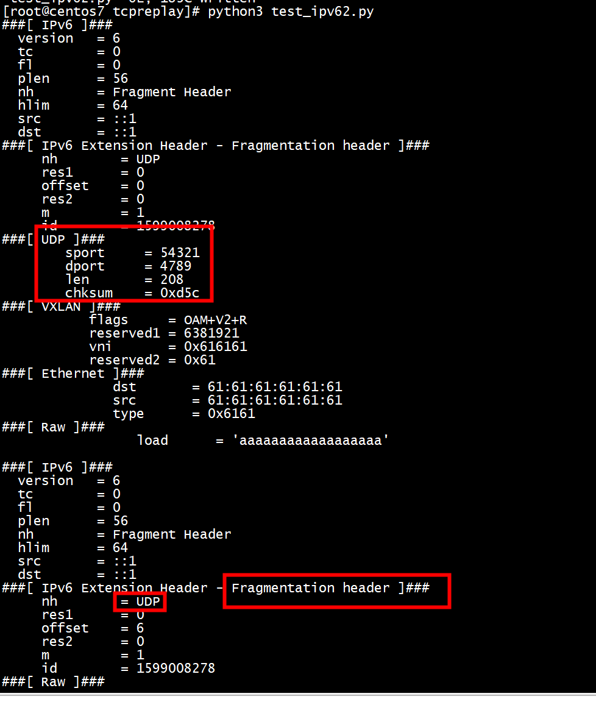

# test1
```
 cat test_ipv6.py 
from scapy.all import *
I=IPv6(dst="2001:db8::1")
ICMP=ICMPv6EchoRequest(data='A'*300)
#ICMP=ICMPv6EchoRequest(data='A'*1000)
FH=IPv6ExtHdrFragment()
packets=fragment6(I/FH/ICMP,100)
for f in packets:
   f.show2()
```


```Shell
[root@centos7 tcpreplay]# python3 test_ipv6.py 
WARNING: No route found for IPv6 destination 2001:db8::1 (no default route?)
WARNING: No route found for IPv6 destination 2001:db8::1 (no default route?)
WARNING: more No route found for IPv6 destination 2001:db8::1 (no default route?)
###[ IPv6 ]### 
  version   = 6
  tc        = 0
  fl        = 0
  plen      = 56
  nh        = Fragment Header
  hlim      = 64
  src       = ::
  dst       = 2001:db8::1
###[ IPv6 Extension Header - Fragmentation header ]### 
     nh        = ICMPv6
     res1      = 0
     offset    = 0
     res2      = 0
     m         = 1
     id        = 487343445
###[ ICMPv6 Echo Request ]### 
        type      = Echo Request
        code      = 0
        cksum     = 0x149b
        id        = 0x0
        seq       = 0x0
        data      = 'AAAAAAAAAAAAAAAAAAAAAAAAAAAAAAAAAAAAAAAA'

###[ IPv6 ]### 
  version   = 6
  tc        = 0
  fl        = 0
  plen      = 56
  nh        = Fragment Header
  hlim      = 64
  src       = ::
  dst       = 2001:db8::1
###[ IPv6 Extension Header - Fragmentation header ]### 
     nh        = ICMPv6
     res1      = 0
     offset    = 6
     res2      = 0
     m         = 1
     id        = 487343445
###[ Raw ]### 
        load      = 'AAAAAAAAAAAAAAAAAAAAAAAAAAAAAAAAAAAAAAAAAAAAAAAA'

###[ IPv6 ]### 
  version   = 6
  tc        = 0
  fl        = 0
  plen      = 56
  nh        = Fragment Header
  hlim      = 64
  src       = ::
  dst       = 2001:db8::1
###[ IPv6 Extension Header - Fragmentation header ]### 
     nh        = ICMPv6
     res1      = 0
     offset    = 12
     res2      = 0
     m         = 1
     id        = 487343445
###[ Raw ]### 
        load      = 'AAAAAAAAAAAAAAAAAAAAAAAAAAAAAAAAAAAAAAAAAAAAAAAA'

###[ IPv6 ]### 
  version   = 6
  tc        = 0
  fl        = 0
  plen      = 56
  nh        = Fragment Header
  hlim      = 64
  src       = ::
  dst       = 2001:db8::1
###[ IPv6 Extension Header - Fragmentation header ]### 
     nh        = ICMPv6
     res1      = 0
     offset    = 18
     res2      = 0
     m         = 1
     id        = 487343445
###[ Raw ]### 
        load      = 'AAAAAAAAAAAAAAAAAAAAAAAAAAAAAAAAAAAAAAAAAAAAAAAA'

###[ IPv6 ]### 
  version   = 6
  tc        = 0
  fl        = 0
  plen      = 56
  nh        = Fragment Header
  hlim      = 64
  src       = ::
  dst       = 2001:db8::1
###[ IPv6 Extension Header - Fragmentation header ]### 
     nh        = ICMPv6
     res1      = 0
     offset    = 24
     res2      = 0
     m         = 1
     id        = 487343445
###[ Raw ]### 
        load      = 'AAAAAAAAAAAAAAAAAAAAAAAAAAAAAAAAAAAAAAAAAAAAAAAA'

###[ IPv6 ]### 
  version   = 6
  tc        = 0
  fl        = 0
  plen      = 56
  nh        = Fragment Header
  hlim      = 64
  src       = ::
  dst       = 2001:db8::1
###[ IPv6 Extension Header - Fragmentation header ]### 
     nh        = ICMPv6
     res1      = 0
     offset    = 30
     res2      = 0
     m         = 1
     id        = 487343445
###[ Raw ]### 
        load      = 'AAAAAAAAAAAAAAAAAAAAAAAAAAAAAAAAAAAAAAAAAAAAAAAA'

###[ IPv6 ]### 
  version   = 6
  tc        = 0
  fl        = 0
  plen      = 28
  nh        = Fragment Header
  hlim      = 64
  src       = ::
  dst       = 2001:db8::1
###[ IPv6 Extension Header - Fragmentation header ]### 
     nh        = ICMPv6
     res1      = 0
     offset    = 36
     res2      = 0
     m         = 0
     id        = 487343445
###[ Raw ]### 
        load      = 'AAAAAAAAAAAAAAAAAAAA'
```

# test2

```
from scapy.all import *
pkt_size = 200
fragsize = 100
frags = fragment6(IPv6()/IPv6ExtHdrFragment()/UDP(sport=54321,dport=4789)/("a"*pkt_size), fragsize)
for f in frags:
   f.show2()
```

```
[root@centos7 tcpreplay]# python3 test_ipv62.py 
###[ IPv6 ]### 
  version   = 6
  tc        = 0
  fl        = 0
  plen      = 56
  nh        = Fragment Header
  hlim      = 64
  src       = ::1
  dst       = ::1
###[ IPv6 Extension Header - Fragmentation header ]### 
     nh        = UDP
     res1      = 0
     offset    = 0
     res2      = 0
     m         = 1
     id        = 1599008278
###[ UDP ]### 
        sport     = 54321
        dport     = 4789
        len       = 208
        chksum    = 0xd5c
###[ VXLAN ]### 
           flags     = OAM+V2+R
           reserved1 = 6381921
           vni       = 0x616161
           reserved2 = 0x61
###[ Ethernet ]### 
              dst       = 61:61:61:61:61:61
              src       = 61:61:61:61:61:61
              type      = 0x6161
###[ Raw ]### 
                 load      = 'aaaaaaaaaaaaaaaaaa'

###[ IPv6 ]### 
  version   = 6
  tc        = 0
  fl        = 0
  plen      = 56
  nh        = Fragment Header
  hlim      = 64
  src       = ::1
  dst       = ::1
###[ IPv6 Extension Header - Fragmentation header ]### 
     nh        = UDP
     res1      = 0
     offset    = 6
     res2      = 0
     m         = 1
     id        = 1599008278
###[ Raw ]### 
        load      = 'aaaaaaaaaaaaaaaaaaaaaaaaaaaaaaaaaaaaaaaaaaaaaaaa'

###[ IPv6 ]### 
  version   = 6
  tc        = 0
  fl        = 0
  plen      = 56
  nh        = Fragment Header
  hlim      = 64
  src       = ::1
  dst       = ::1
###[ IPv6 Extension Header - Fragmentation header ]### 
     nh        = UDP
     res1      = 0
     offset    = 12
     res2      = 0
     m         = 1
     id        = 1599008278
###[ Raw ]### 
        load      = 'aaaaaaaaaaaaaaaaaaaaaaaaaaaaaaaaaaaaaaaaaaaaaaaa'

###[ IPv6 ]### 
  version   = 6
  tc        = 0
  fl        = 0
  plen      = 56
  nh        = Fragment Header
  hlim      = 64
  src       = ::1
  dst       = ::1
###[ IPv6 Extension Header - Fragmentation header ]### 
     nh        = UDP
     res1      = 0
     offset    = 18
     res2      = 0
     m         = 1
     id        = 1599008278
###[ Raw ]### 
        load      = 'aaaaaaaaaaaaaaaaaaaaaaaaaaaaaaaaaaaaaaaaaaaaaaaa'

###[ IPv6 ]### 
  version   = 6
  tc        = 0
  fl        = 0
  plen      = 24
  nh        = Fragment Header
  hlim      = 64
  src       = ::1
  dst       = ::1
###[ IPv6 Extension Header - Fragmentation header ]### 
     nh        = UDP
     res1      = 0
     offset    = 24
     res2      = 0
     m         = 0
     id        = 1599008278
###[ Raw ]### 
        load      = 'aaaaaaaaaaaaaaaa'
```



# test3

```
from scapy.all import *
pkt_size = 200
fragsize = 100
frags = fragment6(IPv6()/IPv6ExtHdrFragment()/TCP(sport=54321,dport=80)/("a"*pkt_size), fragsize)
#frags = fragment6(IPv6()/IPv6ExtHdrFragment()/UDP(sport=54321,dport=4789)/("a"*pkt_size), fragsize)
for f in frags:
   f.show2()
```

```
[root@centos7 tcpreplay]# python3 test_ipv62.py 
###[ IPv6 ]### 
  version   = 6
  tc        = 0
  fl        = 0
  plen      = 56
  nh        = Fragment Header
  hlim      = 64
  src       = ::1
  dst       = ::1
###[ IPv6 Extension Header - Fragmentation header ]### 
     nh        = TCP
     res1      = 0
     offset    = 0
     res2      = 0
     m         = 1
     id        = 2501625672
###[ TCP ]### 
        sport     = 54321
        dport     = http
        seq       = 0
        ack       = 0
        dataofs   = 5
        reserved  = 0
        flags     = S
        window    = 8192
        chksum    = 0xb08d
        urgptr    = 0
        options   = []
###[ Raw ]### 
           load      = 'aaaaaaaaaaaaaaaaaaaaaaaaaaaa'

###[ IPv6 ]### 
  version   = 6
  tc        = 0
  fl        = 0
  plen      = 56
  nh        = Fragment Header
  hlim      = 64
  src       = ::1
  dst       = ::1
###[ IPv6 Extension Header - Fragmentation header ]### 
     nh        = TCP
     res1      = 0
     offset    = 6
     res2      = 0
     m         = 1
     id        = 2501625672
###[ Raw ]### 
        load      = 'aaaaaaaaaaaaaaaaaaaaaaaaaaaaaaaaaaaaaaaaaaaaaaaa'

###[ IPv6 ]### 
  version   = 6
  tc        = 0
  fl        = 0
  plen      = 56
  nh        = Fragment Header
  hlim      = 64
  src       = ::1
  dst       = ::1
###[ IPv6 Extension Header - Fragmentation header ]### 
     nh        = TCP
     res1      = 0
     offset    = 12
     res2      = 0
     m         = 1
     id        = 2501625672
###[ Raw ]### 
        load      = 'aaaaaaaaaaaaaaaaaaaaaaaaaaaaaaaaaaaaaaaaaaaaaaaa'

###[ IPv6 ]### 
  version   = 6
  tc        = 0
  fl        = 0
  plen      = 56
  nh        = Fragment Header
  hlim      = 64
  src       = ::1
  dst       = ::1
###[ IPv6 Extension Header - Fragmentation header ]### 
     nh        = TCP
     res1      = 0
     offset    = 18
     res2      = 0
     m         = 1
     id        = 2501625672
###[ Raw ]### 
        load      = 'aaaaaaaaaaaaaaaaaaaaaaaaaaaaaaaaaaaaaaaaaaaaaaaa'

###[ IPv6 ]### 
  version   = 6
  tc        = 0
  fl        = 0
  plen      = 36
  nh        = Fragment Header
  hlim      = 64
  src       = ::1
  dst       = ::1
###[ IPv6 Extension Header - Fragmentation header ]### 
     nh        = TCP
     res1      = 0
     offset    = 24
     res2      = 0
     m         = 0
     id        = 2501625672
###[ Raw ]### 
        load      = 'aaaaaaaaaaaaaaaaaaaaaaaaaaaa'
```