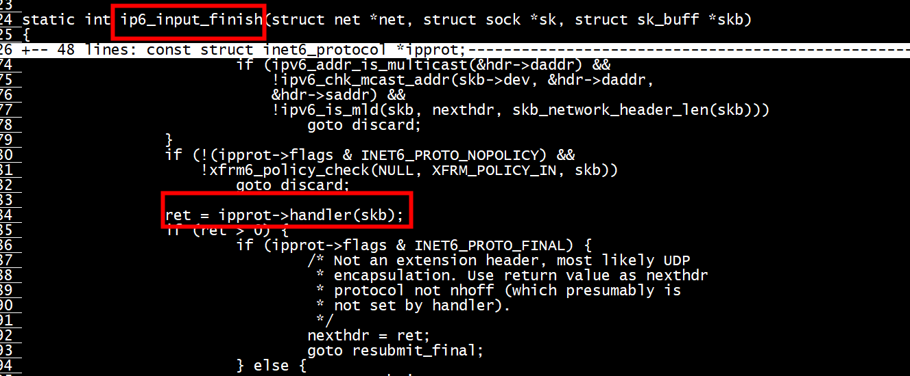

# sizeof(struct ipv6_extension_fragment) = 8
```
struct ipv6_extension_fragment {
        uint8_t next_header;            /**< Next header type */
        uint8_t reserved;               /**< Reserved */
        uint16_t frag_data;             /**< All fragmentation data */
        uint32_t id;                    /**< Packet ID */
} __attribute__((__packed__));
```

# I kernel  cksum

```
        /* And finally the ICMP checksum */
        icmph->icmp6_cksum = ~csum_ipv6_magic(&iph->saddr, &iph->daddr,
                                              skb->len - icmp_offset,
                                              IPPROTO_ICMPV6, 0);
```


## II kernel  cksum error
```
static int icmpv6_rcv(struct sk_buff *skb)
{
        if (skb_checksum_validate(skb, IPPROTO_ICMPV6, ip6_compute_pseudo)) {
                net_dbg_ratelimited("ICMPv6 checksum failed [%pI6c > %pI6c]\n",
                                    saddr, daddr);
                goto csum_error;
        }
}
```

```
root@ubuntu:~# dmesg | grep 'ICMPv6 checksum failed' | tail -n 5 
[2492747.388806] ICMPv6 checksum failed [fe80::4a57:2ff:fe64:e7a7 > fe80::4a57:2ff:fe64:e7ae]
[2492749.388839] ICMPv6 checksum failed [fe80::4a57:2ff:fe64:e7a7 > fe80::4a57:2ff:fe64:e7ae]
[2492751.388837] ICMPv6 checksum failed [fe80::4a57:2ff:fe64:e7a7 > fe80::4a57:2ff:fe64:e7ae]
[2492753.388896] ICMPv6 checksum failed [fe80::4a57:2ff:fe64:e7a7 > fe80::4a57:2ff:fe64:e7ae]
[2492755.388933] ICMPv6 checksum failed [fe80::4a57:2ff:fe64:e7a7 > fe80::4a57:2ff:fe64:e7ae]
```

## II net_dbg_ratelimited
```
sysctl -a | grep 'net.core.message'
net.core.message_burst = 10
net.core.message_cost = 5
root@ubuntu:~# cat /boot/config-5.0.0-23-generic | grep -i CONFIG_DYNAMIC_DEBUG
CONFIG_DYNAMIC_DEBUG=y
```


# 内核reasm




# frag offset
fh->frag_data = rte_cpu_to_be_16(RTE_IPV6_SET_FRAG_DATA(fofs, mf))   
```
static inline void
__fill_ipv6hdr_frag(struct rte_ipv6_hdr *dst,
		const struct rte_ipv6_hdr *src, uint16_t len, uint16_t fofs,
		uint32_t mf)
{
	struct rte_ipv6_fragment_ext *fh;

	rte_memcpy(dst, src, sizeof(*dst));
	dst->payload_len = rte_cpu_to_be_16(len);
	dst->proto = IPPROTO_FRAGMENT;

	fh = (struct rte_ipv6_fragment_ext *) ++dst;
	fh->next_header = src->proto;
	fh->reserved = 0;
	fh->frag_data = rte_cpu_to_be_16(RTE_IPV6_SET_FRAG_DATA(fofs, mf));
	fh->id = 0;
}

```

#  NEXTHDR_FRAGMENT

```
      if (ip6->ip6_nxt == IPPROTO_FRAGMENT) {
        struct ip6_frag *frag = (struct ip6_frag *) (ip6 + 1);
        ASSERT_GE(len, sizeof(*ip6) + sizeof(*frag))
            << msg << ": IPv6 fragment: short fragment header\n";
        protocol = frag->ip6f_nxt;
        payload = frag + 1;
        // Even though the packet has a Fragment header, it might not be a fragment.
        if (!is_ipv6_fragment(ip6, len)) {
          payload_length = len - sizeof(*ip6) - sizeof(*frag);
        }
      } else {
        // Since there are no extension headers except Fragment, this must be the payload.
        protocol = ip6->ip6_nxt;
        payload = ip6 + 1;
        payload_length = len - sizeof(*ip6);
      }
```
#  send_udp_frags

[ip_defrag.c](https://github.com/BlissRoms-x86/kernel_common/blob/a15ebd8cde50e85ac7147b0ee1ff30a17ee35922/tools/testing/selftests/net/ip_defrag.c#L220)

```
static void send_udp_frags(int fd_raw, struct sockaddr *addr,
				socklen_t alen, bool ipv6)
{
	struct ip *iphdr = (struct ip *)ip_frame;
	struct ip6_hdr *ip6hdr = (struct ip6_hdr *)ip_frame;
	int res;
	int offset;
	int frag_len;

	/* Send the UDP datagram using raw IP fragments: the 0th fragment
	 * has the UDP header; other fragments are pieces of udp_payload
	 * split in chunks of frag_len size.
	 *
	 * Odd fragments (1st, 3rd, 5th, etc.) are sent out first, then
	 * even fragments (0th, 2nd, etc.) are sent out.
	 */
	if (ipv6) {
		struct ip6_frag *fraghdr = (struct ip6_frag *)(ip_frame + IP6_HLEN);
		((struct sockaddr_in6 *)addr)->sin6_port = 0;
		memset(ip6hdr, 0, sizeof(*ip6hdr));
		ip6hdr->ip6_flow = htonl(6<<28);  /* Version. */
		ip6hdr->ip6_nxt = IPPROTO_FRAGMENT;
		ip6hdr->ip6_hops = 255;
		ip6hdr->ip6_src = addr6;
		ip6hdr->ip6_dst = addr6;
		fraghdr->ip6f_nxt = IPPROTO_UDP;
		fraghdr->ip6f_reserved = 0;
		fraghdr->ip6f_ident = htonl(ip_id++);
	} else {
		memset(iphdr, 0, sizeof(*iphdr));
		iphdr->ip_hl = 5;
		iphdr->ip_v = 4;
		iphdr->ip_tos = 0;
		iphdr->ip_id = htons(ip_id++);
		iphdr->ip_ttl = 0x40;
		iphdr->ip_p = IPPROTO_UDP;
		iphdr->ip_src.s_addr = htonl(INADDR_LOOPBACK);
		iphdr->ip_dst = addr4;
		iphdr->ip_sum = 0;
	}
```

#  reassemble6/pf_refragment6

[reassemble6](https://github.com/zfsrogue/freebsd-crypto/blob/d9e5dc5b3604ea46260671ce3ffa3bd9f47ec022/sys/netpfil/pf/pf_norm.c#L146)

```
pf_reassemble6(struct mbuf **m0, struct ip6_hdr *ip6, struct ip6_frag *fraghdr,
    uint16_t hdrlen, uint16_t extoff, u_short *reason)
int
pf_refragment6(struct ifnet *ifp, struct mbuf **m0, struct m_tag *mtag)
ip6_fragment
```


```
(RTE_ETH_IS_IPV6_HDR(m->packet_type)) {
		/* if packet is IPv6 */
		struct ipv6_extension_fragment *frag_hdr;
		struct ipv6_hdr *ip_hdr;
		ip_hdr = (struct ipv6_hdr *)(eth_hdr + 1);
		frag_hdr = rte_ipv6_frag_get_ipv6_fragment_header(ip_hdr);
		if (frag_hdr != NULL) {
			struct rte_mbuf *mo;
			tbl = rxq->frag_tbl;
			dr  = &qconf->death_row;
			/* prepare mbuf: setup l2_len/l3_len. */
			m->l2_len = sizeof(*eth_hdr);
			m->l3_len = sizeof(*ip_hdr) + sizeof(*frag_hdr);
			mo = rte_ipv6_frag_reassemble_packet(tbl, dr, m, tms, ip_hdr, frag_hdr);
			if (mo == NULL)
				return;
			if (mo != m) {
				m = mo;
				eth_hdr = rte_pktmbuf_mtod(m, struct ether_hdr *);
				ip_hdr = (struct ipv6_hdr *)(eth_hdr + 1);
			}
		}

```