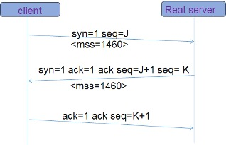
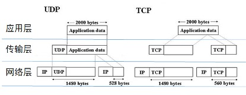

# DPDK负载均衡如何处理转发中的IP分片问题  

在介绍IP分片包的处理前，我们先介绍一些名词  

- MTU（最大传输单元）   
  链路层最大传输单元MTU（Maxitum Transmission Unit），是链路层中的网络对数据帧的一个限制，不同的网络类型都有一个上限值。以太网的MTU是1500，可以用 netstat -i 命令查看这个值。 
- MSS（最大分段大小）  
  MSS是TCP里的一个概念（首部的选项字段中）。MSS是TCP数据包每次可以传输的最大数据分段，TCP报文段的长度大于MSS时，要进行分段传输。  

## IP分片的原理
      
   如果IP层有数据包要传，而且数据包的长度超过了MTU，那么IP层就要对数据包进行分片（fragmentation）操作，使每一片的长度都小于或等于MTU。IP分片发生在IP层，不仅源端主机会进行分片，中间的路由器也有可能分片（可能不止一次），因为不同的网络的MTU是不一样的，如果传输路径上的某个网络的MTU比源端网络的MTU要小，路由器就可能对IP数据报再次进行分片。而分片数据的重组只会发生在目的端的IP层。  
   
 

片偏移字段指的是该片偏移原始数据报开始处的位置,当数据报被分片后，每个片的总长度值要改为该片的长度值。在分片时，除最后一片外，其他每一片中的数据部分（除IP首部外的其余部分）必须是8字节的整数倍。
- 第一个分片:如果MF为1而 Fragment Offset = 0，表示该IP报文为第一个分片，而且后续有分片；
- 中间分片:如果MF为1而Fragment Offset不是0，表示该IP报文为中间的一个分片；
- 最后分片:如果MF为0而Fragment Offset不是0，表示该报文是最后一个分片;

IP分片是发生在网络的第三层，那么它的上层（第四层）是如何处理这种长数据包的呢？  
> UDP和ICMP协议没有考虑分片的问题，它的协议可以认为网络层没有长度限制，所以如果我们在UDP协议中，发送大的数据时，就必然触发IP层分片。  
> TCP协议本身支持分段，TCP协议在建立连接时会协商MSS（Maxitum Segment Size），这个协商的过程发生在建立TCP连接的过程中。如下图：

 
 
MSS加包头数据就等于MTU。拿TCP包做例子，报文传输MSS=1460字节的数据的话，再加上20字节IP包头，20字节TCP包头，那么MTU就是（1500）。
client 和 real server  分别根据自己MTU计算出支持的最大MSS发送给对方，双方根据最小的MSS达成协议。
下图用来说明，TCP协议分段和UDP协议触发的IP层分片的区别。
 
 
 
 但是也不能认为，TCP协议就不会触发IP层分片；因为在TCP协议握手时，client 和 real server只是取了自己网卡的MTU， 但是它们之间可能经过了很多的路由器，这些子网的MTU可能小于它们的MTU，所以在外部的复杂网络上，很多TCP协议也会触发IP层分片。  
 我们用上面这个图的目的，就是让大家有个直观的认识，被IP层分片的数据包不会带上4层的协议头（TCP头、UDP头）。  
 
 
 
 
## Linux系统如何处理IP分片重组

### 网卡驱动支持 
很多网卡设备支持数据包分片、重组功能，包括 LSO/LRO、GSO/GRO等
- LRO(Large Receive Offload)，当网卡收到很多分片包的时候，LRO 可以辅助自动组合成一段较大的数据，一次性提交给 OS处理
- GRO(Generic Receive Offload), 比LRO更通用，自动检测网卡支持特性，如果没有GRO，则会被一个个送到协议栈，有了GRO之后，就会把接收数据包组合成大包，再传递给OS处理。
可以用这个命令查询网卡是否支持，

```text
#ethtool -k enp129s0f0
generic-receive-offload: on
large-receive-offload: off
```

不过这些LRO/GRO功能在负载均衡这种大流量的机器上建议关闭，参考阿里在一篇LVS的分享中也遇到这个问题，也建议关闭这个功能。  

### Linux协议栈处理方式  
Linux 内核实现IP重组的基本函数为ip_defrag()，在net/ipv4/ip_fragment.c中实现，底层有个hash查找表，类似java的hashmap结构；保存同一个连接的分片，当分片都到达之后进行数据包重组，或者在一定时间内所有碎片包不能到达而释放掉，并给发送端发送一个ICMP分片包超时消息。  

### LVS的处理方式  
linux对分片包的处理，和LVS的收包入口都是在内核netfilter模块， hook在（NF_INET_PRE_ROUTING），但是对分片包处理的hook在LVS之前执行（priority = NF_IP_PRI_CONNTRACK_DEFRAG）。可见，在LVS收包函数（ip_vs_in）调用之前，linux 系统已经对分片包合并了。
>1. 网络转发到LVS的分片包，会由linux内核先对分片包重组  
>2. LVS对Real Server转发时，如果数据包大于MTU ，就直接发送一个ICMP通知给客户端，通知客户的改TCP连接时的MSS  

## 负载均衡解决的分片问题

  负载均衡的转发是根据（源IP、源端口、目的IP、目的端口、协议）5元组hash，指向后端的real server的；当发生拆包的IP包经过VGW时，拆包的IP包中就没有了4层的（源端口、目的端口）信息，无法找到之前建立的tcp连接表。  
分片包转发方式选择:  
- 重组:收到全部的分片包,组合成一个包后,再一起处理,如果少一个包就由VGW发送icmp分片包超时通知给客户端。(LVS的实现方式)
- 映射:不重组分片包,收到第一个分片包后就转发给后端RealServer,由RealServer校验, 如果少一个包就有RealServer发送icmp分片包超时通知(google一篇论文上提到的方式：Maglev: A Fast and Reliable Software Network Load Balancer)
- 透传：对后端的转发根据（源IP、目的IP、协议）为hash key，这样同一个IP的就会hash到同一台real server上，这样就避开了负载均衡处理分片包的问题；但是缺点是对后端的流量调度就不够均衡了。（美团的MGW用的这种方式）  

下面介绍一下google论文中maglev的实现方式。  
> 如果负载均衡先收到了第一个分片包，而且这个分片包中有TCP头信息，可以读取到源端口和目标端口，这时查询连接表直接转发分片包到后端的RS服务器，并保存此分片包的(源IP、目标IP、协议类型、Identification)；    
> 当再收到其它的分片包后，根据上面信息可以对应到他的源端口和目标端口，这时查询连接表直接转发分片包到后端的RealServer服务器上。
> 如果负载均衡先收到了后面的分片包，由于没有TCP头信息，只能先记录下（源IP、目标IP、协议类型、Identification）信息，并缓存该分片包；  
> 再收到第一个分片包后，再将之前的分片包一起转发出去。


## 负载均衡如何防止分片包攻击  
 因为系统需要对分片包重组，而在网络中IP协议可能乱序，所以先收到后面的分片包再收到第一个分片包是正常现象，任何分片重组模块都要支持缓存分片包的逻辑，这就给网络攻击者提供了一个机会，发送大量的不完整的分片包，使系统无法完成分片包重组，而占用大量缓存。

 

 负载均衡的缓存使用了一个LRU的数据结构缓存全局的分片包，当分片包过多时，按照最后访问时间来淘汰历史的分片数据。并且对每个连接的分片包数量做了限制，来保护后端的 real server ，避免分片包攻击。
