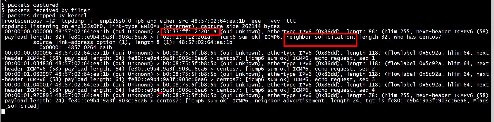
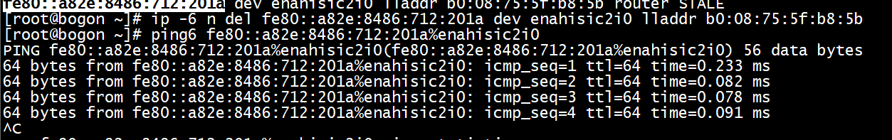
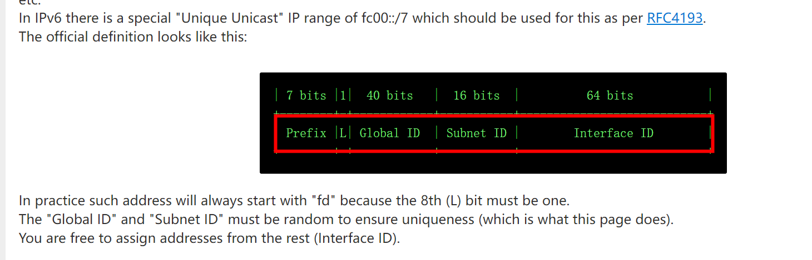
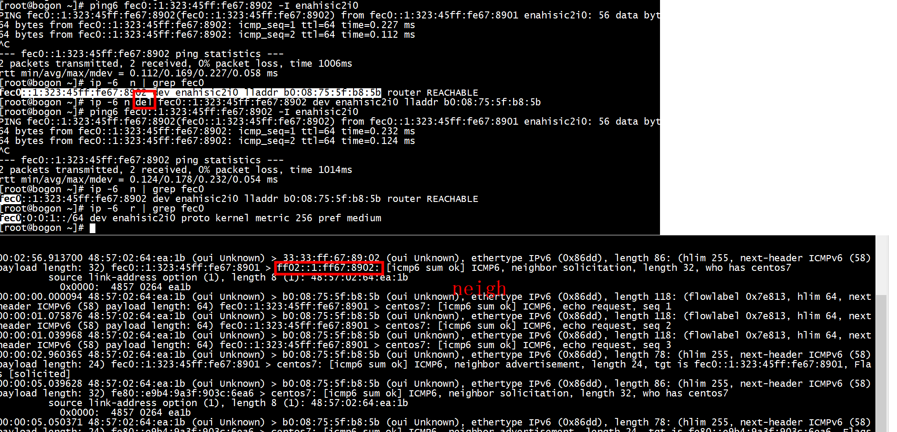
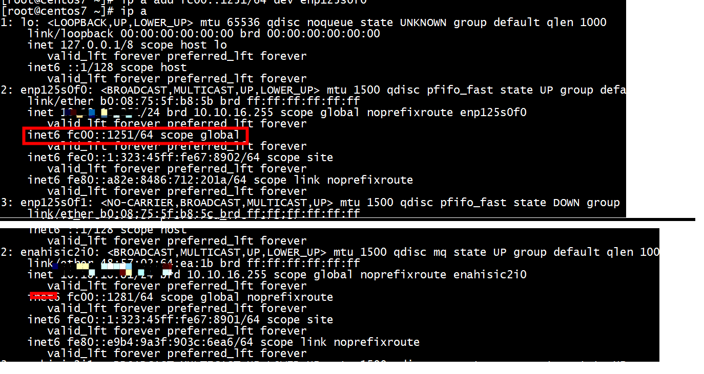
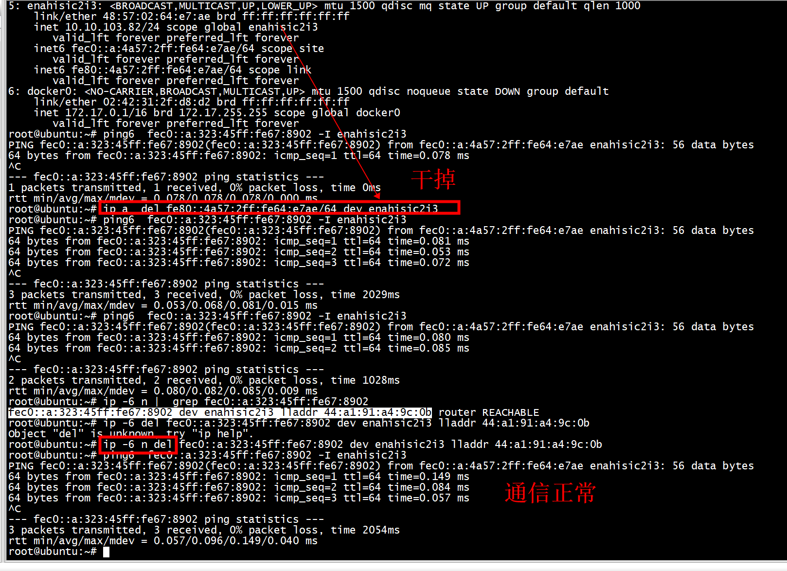
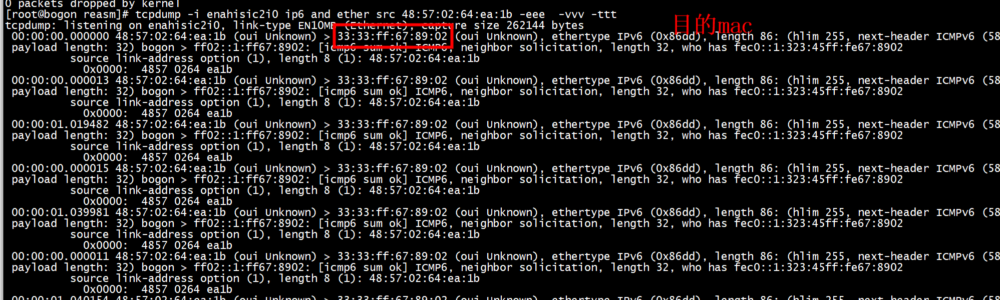
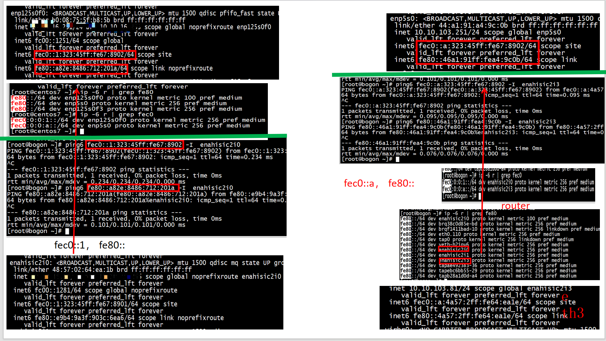

# 关闭防火墙

```
[root@centos7 ~]# iptables -F
[root@centos7 ~]# 
```
#  disable

```
sysctl -a | grep enahisic2i3 | grep ipv6 |  grep disable
net.ipv6.conf.enahisic2i3.disable_ipv6 = 0
net.ipv6.conf.enahisic2i3.disable_policy = 0
```

# multicast

```
ip -6 l set  enp125s0f0 multicast on
```

# IPv6的组播MAC地址

固定前缀33:33+组播地址后32bit，中间为0

```
            0x0000:  4857 0264 ea1e
 00:00:00.000020 48:57:02:64:ea:1e (oui Unknown) > 33:33:ff:67:89:03 (oui Unknown), ethertype IPv6 (0x86dd), length 86: (hlim 255, next-header ICMPv6 (58) payload length: 32) bogon > ff02::1:ff67:8903: [icmp6 sum ok] ICMP6, neighbor solicitation, length 32, who has fc00::a:823:45ff:fe67:8903
          source link-address option (1), length 8 (1): 48:57:02:64:ea:1e
            0x0000:  4857 0264 ea1e
```
33:33:ff:67:89:03     
ff02::1:ff3a:a9d1（不同于ip maddr add ff99::1/8 dev p2p1）   
首先ff02::1是一个组播地址，简单理解组播地址就是同一个组的地址都能接受到该报文     
IPV6组播地址：ff02::1:ff3a:a9d1   
组播MAC地址低位32位：ff:3a:a9:d1   
完成符合IANA规定的组播MA    


# ipv4 to ipv6addr

```
ipv6calc --in ipv4addr --out ipv6addr --action conv6to4 193.100.0.1
[root@bogon data]# ipv6calc --in ipv4addr --out ipv6addr --action conv6to4 10.10.103.82
Support for GeoIP (MaxMindDB) disabled, no MaxMindDB library found: libmaxminddb.so.0
Support for db-ip.com (MaxMindDB) disabled, no MaxMindDB library found: libmaxminddb.so.0
2002:a0a:6752::

```

# ipv6calc -vv
[ipv6calc](https://www.linux.com/topic/networking/manipulate-ipv6-addresses-ipv6calc/)   

##  Compression and Decompression
```Text
Remember how we can compress those long IPv6 addresses by condensing the zeroes? ipv6calc does this for you:

$ ipv6calc --addr2compaddr 2001:0db8:0000:0000:0000:0000:0000:0001
2001:db8::1
You might recall from Practical Networking for Linux Admins: Real IPv6 that the 2001:0DB8::/32 block is reserved for documentation and testing. You can uncompress IPv6 addresses:

$ ipv6calc --addr2uncompaddr 2001:db8::1
2001:db8:0:0:0:0:0:1
Uncompress it completely with the --addr2fulluncompaddr option:

$ ipv6calc --addr2fulluncompaddr 2001:db8::1
2001:0db8:0000:0000:0000:0000:0000:0001
```

## Anonymizing Addresses

```Text

Anonymize any address this way:

$ ipv6calc --action anonymize 2001:db8::1
No input type specified, try autodetection...found type: ipv6addr
No output type specified, try autodetection...found type: ipv6addr
2001:db8::9:a929:4291:c02d:5d15
If you get tired of “no input type” messages, you can specify the input and output types:

$ ipv6calc --in ipv6addr --out ipv6addr  --action anonymize 2001:db8::1
2001:db8::9:a929:4291:c02d:5d15
Or use the “quiet” option to suppress the messages:

$ ipv6calc -q --action anonymize 2001:db8::1
2001:db8::9:a929:4291:c02d:5d15
```

## Getting Information

```Text
$ ipv6calc -qi 2001:db8::1
Address type: unicast, global-unicast, productive, iid, iid-local
Registry for address: reserved(RFC3849#4)
Address type has SLA: 0000
Interface identifier: 0000:0000:0000:0001
Interface identifier is probably manual set

$ ipv6calc -qi fe80::b07:5c7e:2e69:9d41
Address type: unicast, link-local, iid, iid-global, iid-eui64
Registry for address: reserved(RFC4291#2.5.6)
Interface identifier: 0b07:5c7e:2e69:9d41
EUI-64 identifier: 09:07:5c:7e:2e:69:9d:41
EUI-64 identifier is a global unique one

```

#  I fe80

##  节点1

```
enp125s0f0: <BROADCAST,MULTICAST,UP,LOWER_UP> mtu 1500 qdisc pfifo_fast state UP group default qlen 1000
    link/ether b0:08:75:5f:b8:5b brd ff:ff:ff:ff:ff:ff
    inet 10.11.11.251/24 brd 10.11.11.255 scope global noprefixroute enp125s0f0
       valid_lft forever preferred_lft forever
    inet6 fc00::1251/64 scope global 
       valid_lft forever preferred_lft forever
    inet6 fec0::1:323:45ff:fe67:8902/64 scope site 
       valid_lft forever preferred_lft forever
    inet6 fe80::a82e:8486:712:201a/64 scope link noprefixroute 
       valid_lft forever preferred_lft forever
```

## II 节点2
```
2: enahisic2i0: <BROADCAST,MULTICAST,UP,LOWER_UP> mtu 1500 qdisc mq state UP group default qlen 1000
    link/ether 48:57:02:64:ea:1b brd ff:ff:ff:ff:ff:ff
    inet 10.11.11.81/24 brd 10.11.11.255 scope global noprefixroute enahisic2i0
       valid_lft forever preferred_lft forever
    inet6 fc00::1281/64 scope global noprefixroute 
       valid_lft forever preferred_lft forever
    inet6 fec0::1:323:45ff:fe67:8901/64 scope site 
       valid_lft forever preferred_lft forever
    inet6 fe80::e9b4:9a3f:903c:6ea6/64 scope link noprefixroute 
       valid_lft forever preferred_lft forever
```
 
 
+  广播mac 48:57:02:64:ea:1b (oui Unknown) > 33:33:ff:12:20:1a   
+  广播ipv6 fe80::e9b4:9a3f:903c:6ea6 > ff02::1:ff12:201a:    
+   fe80::a82e:8486:712:201a/64  和fe80::e9b4:9a3f:903c:6ea6/64的前缀（前64位匹配），可以ping6   
 
 
+ 采用上述ip发送ping fragment,对端可以发送reply消息   
```

SRC_IF =  'enahisic2i0'
SRC_MAC = "48:57:02:64:ea:1b"
DST_MAC = "b0:08:75:5f:b8:5b"
DST_IN6 = "fe80::a82e:8486:712:201a"
SRC_OUT6 = "fe80::e9b4:9a3f:903c:6ea6"
def send_big_icmp6():
        pid=os.getpid()
        eid=pid & 0xffff
        eth=[]
        # fragSize = 1500 ,fragSize = 1400
        packets = fragment6(IPv6(src=SRC_OUT6, dst=DST_IN6, hlim=63, fl=0)/IPv6ExtHdrFragment(id=random.randint(0, 65535),nh=58)/ ICMPv6EchoRequest(id=eid,seq=0x865,data='A'*2500), fragSize=1424)
        #packets = fragment6(Ether(src=SRC_MAC, dst=DST_MAC,type =ETH_P_IPV6)/IPv6(src=SRC_OUT6, dst=DST_IN6, hlim=63, fl=0)/IPv6ExtHdrFragment(id=random.randint(0, 65535),nh=58)/ ICMPv6EchoRequest(id=eid,seq=0x8765,data='A'*2500), fragSize=1024)
        for f in packets:
            eth.append(Ether(src=SRC_MAC, dst=DST_MAC,type =ETH_P_IPV6)/f)
            #sendp(f, iface=SRC_IF)
        sendp(eth, iface=SRC_IF)
        time.sleep(10)
```

# mac_to_eui64
+ 48:57:02:64:ea:1b: mac地址   
+ fe80前缀    
链路本地地址（FE80::/10）：仅用于单个链路（链路层不能跨VLAN）   
```
yum install -y ipv6calc
[root@bogon data]# ip a del fe80::a82e:8486:712:2011/64 dev  enahisic2i0
[root@bogon data]#  ipv6calc --action prefixmac2ipv6 --in prefix+mac --out ipv6addr fe80:: 48:57:02:64:ea:1b
Support for GeoIP (MaxMindDB) disabled, no MaxMindDB library found: libmaxminddb.so.0
Support for db-ip.com (MaxMindDB) disabled, no MaxMindDB library found: libmaxminddb.so.0
fe80::4a57:2ff:fe64:ea1b
[root@bogon data]#  ipv6calc --action prefixmac2ipv6 --in prefix+mac --out ipv6addr fe80::  b0:08:75:5f:b8:5b
Support for GeoIP (MaxMindDB) disabled, no MaxMindDB library found: libmaxminddb.so.0
Support for db-ip.com (MaxMindDB) disabled, no MaxMindDB library found: libmaxminddb.so.0
fe80::b208:75ff:fe5f:b85b
[root@bogon data]# 
```
用 mac_to_eui64生成的地址前16位相同   

## 节点1

```
[root@centos7 net]# ip -6 r | grep fe80
fe80::/64 dev enp125s0f0 proto kernel metric 100 pref medium
fe80::/64 dev enp125s0f0 metric 1024 pref medium
fe80::/16 dev enp125s0f0 proto kernel metric 256 pref medium
fe80::/16 dev enp125s0f0 metric 1024 pref medium
[root@centos7 net]# ip a sh enp125s0f0
2: enp125s0f0: <BROADCAST,MULTICAST,UP,LOWER_UP> mtu 1500 qdisc pfifo_fast state UP group default qlen 1000
    link/ether b0:08:75:5f:b8:5b brd ff:ff:ff:ff:ff:ff
    inet DST_IN6.251/24 brd DST_IN6.255 scope global noprefixroute enp125s0f0
       valid_lft forever preferred_lft forever
    inet6 fc00::1251/64 scope global noprefixroute 
       valid_lft forever preferred_lft forever
    inet6 fe80::b208:75ff:fe5f:b85b/16 scope link 
       valid_lft forever preferred_lft forever
[root@centos7 net]# 
```
**IP fe80::b208:75ff:fe5f:b85b/16** ,16位前缀   
## 节点2


```
[root@bogon data]# ip -6 r | grep fe80
fe80::4a57:2ff:fe64:e7ac dev br0 metric 2048 pref medium
fe80::/64 dev enahisic2i0 proto kernel metric 100 pref medium
fe80::/64 dev brq38c0d85e-bd proto kernel metric 256 pref medium
fe80::/64 dev brqf1411bad-10 proto kernel metric 256 pref medium
fe80::/64 dev eth0.110 proto kernel metric 256 pref medium
fe80::/64 dev tap0 proto kernel metric 256 linkdown pref medium
fe80::/64 dev br0 proto kernel metric 256 pref medium
fe80::/64 dev veth-h2ipv6 proto kernel metric 256 pref medium
fe80::/64 dev enahisic2i3 proto kernel metric 256 pref medium
fe80::/64 dev enahisic2i0 proto kernel metric 256 pref medium
fe80::/16 dev enahisic2i0 proto kernel metric 256 pref medium
[root@bogon data]# ip a sh enahisic2i0
2: enahisic2i0: <BROADCAST,MULTICAST,UP,LOWER_UP> mtu 1500 qdisc mq state UP group default qlen 1000
    link/ether 48:57:02:64:ea:1b brd ff:ff:ff:ff:ff:ff
    inet DST_IN6.81/24 brd DST_IN6.255 scope global noprefixroute enahisic2i0
       valid_lft forever preferred_lft forever
    inet6 fc00::1281/64 scope global noprefixroute 
       valid_lft forever preferred_lft forever
    inet6 fe80::4a57:2ff:fe64:ea1b/16 scope link 
       valid_lft forever preferred_lft forever
[root@bogon data]# 
```
**IP fe80::4a57:2ff:fe64:ea1b/16**,16位前缀   

#  ping6 
```
[root@bogon data]# ping6 fe80::b208:75ff:fe5f:b85b -I enahisic2i0
PING fe80::b208:75ff:fe5f:b85b(fe80::b208:75ff:fe5f:b85b) from fe80::4a57:2ff:fe64:ea1b%enahisic2i0 enahisic2i0: 56 data bytes
64 bytes from fe80::b208:75ff:fe5f:b85b%enahisic2i0: icmp_seq=1 ttl=64 time=0.118 ms
64 bytes from fe80::b208:75ff:fe5f:b85b%enahisic2i0: icmp_seq=2 ttl=64 time=0.119 ms
64 bytes from fe80::b208:75ff:fe5f:b85b%enahisic2i0: icmp_seq=3 ttl=64 time=0.087 ms
^C
--- fe80::b208:75ff:fe5f:b85b ping statistics ---
3 packets transmitted, 3 received, 0% packet loss, time 2097ms
rtt min/avg/max/mdev = 0.087/0.108/0.119/0.014 ms
[root@bogon data]# 
```


+ 采用上述ip发送ping fragment,对端可以发送reply消息   
```

SRC_IF =  'enahisic2i0'
SRC_MAC = "48:57:02:64:ea:1b"
DST_MAC = "b0:08:75:5f:b8:5b"
DST_IN6 = "fe80::b208:75ff:fe5f:b85b"
SRC_OUT6 = "fe80::4a57:2ff:fe64:ea1b"
def send_big_icmp6():
        pid=os.getpid()
        eid=pid & 0xffff
        eth=[]
        # fragSize = 1500 ,fragSize = 1400
        packets = fragment6(IPv6(src=SRC_OUT6, dst=DST_IN6, hlim=63, fl=0)/IPv6ExtHdrFragment(id=random.randint(0, 65535),nh=58)/ ICMPv6EchoRequest(id=eid,seq=0x865,data='A'*2500), fragSize=1424)
        #packets = fragment6(Ether(src=SRC_MAC, dst=DST_MAC,type =ETH_P_IPV6)/IPv6(src=SRC_OUT6, dst=DST_IN6, hlim=63, fl=0)/IPv6ExtHdrFragment(id=random.randint(0, 65535),nh=58)/ ICMPv6EchoRequest(id=eid,seq=0x8765,data='A'*2500), fragSize=1024)
        for f in packets:
            eth.append(Ether(src=SRC_MAC, dst=DST_MAC,type =ETH_P_IPV6)/f)
            #sendp(f, iface=SRC_IF)
        sendp(eth, iface=SRC_IF)
        time.sleep(10)
```

# 私有地址 fc00::/7 

 

+ 所有前缀64位   


##  II fec0
fec0::/10其后54位用作子网id,最后64位用作主机Id    
```
[root@bogon data]# ipv6calc --in prefix+mac fec0:0:0:1:: 01:23:45:67:89:01
Support for GeoIP (MaxMindDB) disabled, no MaxMindDB library found: libmaxminddb.so.0
Support for db-ip.com (MaxMindDB) disabled, no MaxMindDB library found: libmaxminddb.so.0
No action type specified, try autodetection...found type: prefixmac2ipv6
fec0::1:323:45ff:fe67:8901
[root@bogon data]# ipv6calc --in prefix+mac fec0:0:0:1:: 01:23:45:67:89:02
Support for GeoIP (MaxMindDB) disabled, no MaxMindDB library found: libmaxminddb.so.0
Support for db-ip.com (MaxMindDB) disabled, no MaxMindDB library found: libmaxminddb.so.0
No action type specified, try autodetection...found type: prefixmac2ipv6
fec0::1:323:45ff:fe67:8902
[root@bogon data]# 
```

+ ip add 

```
[root@bogon data]# ip a add  fec0::1:323:45ff:fe67:8901/64 dev enahisic2i0
[root@centos7 dpdk-19.11]#  ip a add  fec0::1:323:45ff:fe67:8902/64 dev enp125s0f0
```
+ 不能用ping6 fec0::1:323:45ff:fe67:8901%enahisic2i0    
```
[root@bogon data]# ping6 fec0::1:323:45ff:fe67:8901%enahisic2i0
ping: fec0::1:323:45ff:fe67:8901%enahisic2i0: Name or service not known
[root@bogon data]# ping6 fec0::1:323:45ff:fe67:8901 -I enahisic2i0
PING fec0::1:323:45ff:fe67:8901(fec0::1:323:45ff:fe67:8901) from fec0::1:323:45ff:fe67:8901 enahisic2i0: 56 data bytes
64 bytes from fec0::1:323:45ff:fe67:8901: icmp_seq=1 ttl=64 time=0.075 ms
64 bytes from fec0::1:323:45ff:fe67:8901: icmp_seq=2 ttl=64 time=0.093 ms
64 bytes from fec0::1:323:45ff:fe67:8901: icmp_seq=3 ttl=64 time=0.087 ms
^C
--- fec0::1:323:45ff:fe67:8901 ping statistics ---
3 packets transmitted, 3 received, 0% packet loss, time 2075ms
rtt min/avg/max/mdev = 0.075/0.085/0.093/0.007 ms
```
 
###  III fc00::1281/64 scope global noprefixroute  
 
 
###  III fc00和fe80

干掉fe80的ip 不影响fc00
###  III 广播mac




+ 采用上述ip发送ping fragment,对端可以发送reply消息   
```

SRC_IF =  'enahisic2i0'
SRC_MAC = "48:57:02:64:ea:1b"
DST_MAC = "b0:08:75:5f:b8:5b"
DST_IN6 = "fec0::1:323:45ff:fe67:8902"
SRC_OUT6 = "fec0::1:323:45ff:fe67:8901"
def send_big_icmp6():
        pid=os.getpid()
        eid=pid & 0xffff
        eth=[]
        # fragSize = 1500 ,fragSize = 1400
        packets = fragment6(IPv6(src=SRC_OUT6, dst=DST_IN6, hlim=63, fl=0)/IPv6ExtHdrFragment(id=random.randint(0, 65535),nh=58)/ ICMPv6EchoRequest(id=eid,seq=0x865,data='A'*2500), fragSize=1424)
        #packets = fragment6(Ether(src=SRC_MAC, dst=DST_MAC,type =ETH_P_IPV6)/IPv6(src=SRC_OUT6, dst=DST_IN6, hlim=63, fl=0)/IPv6ExtHdrFragment(id=random.randint(0, 65535),nh=58)/ ICMPv6EchoRequest(id=eid,seq=0x8765,data='A'*2500), fragSize=1024)
        for f in packets:
            eth.append(Ether(src=SRC_MAC, dst=DST_MAC,type =ETH_P_IPV6)/f)
            #sendp(f, iface=SRC_IF)
        sendp(eth, iface=SRC_IF)
```

# I 双网卡测试

##  II 节点1
```
2: enp125s0f0: <BROADCAST,MULTICAST,UP,LOWER_UP> mtu 1500 qdisc pfifo_fast state UP group default qlen 1000
    link/ether b0:08:75:5f:b8:5b brd ff:ff:ff:ff:ff:ff
    inet 10.11.11.251/24 brd 10.11.11.255 scope global noprefixroute enp125s0f0
       valid_lft forever preferred_lft forever
    inet6 fc00::1251/64 scope global 
       valid_lft forever preferred_lft forever
    inet6 fec0::1:323:45ff:fe67:8902/64 scope site 
       valid_lft forever preferred_lft forever
    inet6 fe80::a82e:8486:712:201a/64 scope link noprefixroute 
       valid_lft forever preferred_lft forever
6: enp5s0: <BROADCAST,MULTICAST,UP,LOWER_UP> mtu 1500 qdisc mq state UP group default qlen 1000
    link/ether 44:a1:91:a4:9c:0b brd ff:ff:ff:ff:ff:ff
    inet 10.10.103.251/24 scope global enp5s0
       valid_lft forever preferred_lft forever
    inet6 fec0::a:323:45ff:fe67:8902/64 scope site 
       valid_lft forever preferred_lft forever
    inet6 fe80::46a1:91ff:fea4:9c0b/64 scope link 
       valid_lft forever preferred_lft forever
```

##  II 节点2
```
enahisic2i0: <BROADCAST,MULTICAST,UP,LOWER_UP> mtu 1500 qdisc mq state UP group default qlen 1000
    link/ether 48:57:02:64:ea:1b brd ff:ff:ff:ff:ff:ff
    inet 10.11.11.81/24 brd 10.11.11.255 scope global noprefixroute enahisic2i0
       valid_lft forever preferred_lft forever
    inet6 fc00::1281/64 scope global noprefixroute 
       valid_lft forever preferred_lft forever
    inet6 fec0::1:323:45ff:fe67:8901/64 scope site 
       valid_lft forever preferred_lft forever
    inet6 fe80::e9b4:9a3f:903c:6ea6/64 scope link noprefixroute 
       valid_lft forever preferred_lft forever
5: enahisic2i3: <BROADCAST,MULTICAST,UP,LOWER_UP> mtu 1500 qdisc mq state UP group default qlen 1000
    link/ether 48:57:02:64:ea:1e brd ff:ff:ff:ff:ff:ff
    inet 10.10.103.81/24 scope global enahisic2i3
       valid_lft forever preferred_lft forever
    inet6 fec0::a:4a57:2ff:fe64:ea1e/64 scope site 
       valid_lft forever preferred_lft forever
    inet6 fe80::4a57:2ff:fe64:ea1e/64 scope link 
       valid_lft forever preferred_lft forever
```

# subnetcalc
```
[root@bogon data]# subnetcalc fd00::9876:256:7bff:fe1b:3255 56 -uniquelocalhq
Generating Unique Local IPv6 address (using /dev/random) ...
Address       = fd70:197a:e8b7:9876:256:7bff:fe1b:3255
                   fd70 = 11111101 01110000
                   197a = 00011001 01111010
                   e8b7 = 11101000 10110111
                   9876 = 10011000 01110110
                   0256 = 00000010 01010110
                   7bff = 01111011 11111111
                   fe1b = 11111110 00011011
                   3255 = 00110010 01010101
Network       = fd70:197a:e8b7:9800:: / 56
Netmask       = ffff:ffff:ffff:ff00::
Wildcard Mask = ::ff:ffff:ffff:ffff:ffff
Hosts Bits    = 72
Max. Hosts    = 4722366482869645213696   (2^72 - 1)
Host Range    = { fd70:197a:e8b7:9800::1 - fd70:197a:e8b7:98ff:ffff:ffff:ffff:ffff }
Properties    =
   - fd70:197a:e8b7:9876:256:7bff:fe1b:3255 is a HOST address in fd70:197a:e8b7:9800::/56
   - Unique Local Unicast Properties:
      + Locally chosen
      + Global ID    = 70197ae8b7
      + Subnet ID    = 9876
      + Interface ID = 0256:7bff:fe1b:3255
      + MAC address  = 00:56:7b:1b:32:55
      + Sol. Node MC = ff02::1:ff1b:3255
GeoIP Country = Unknown (??)
DNS Hostname  = (Name or service not known)
```
  


