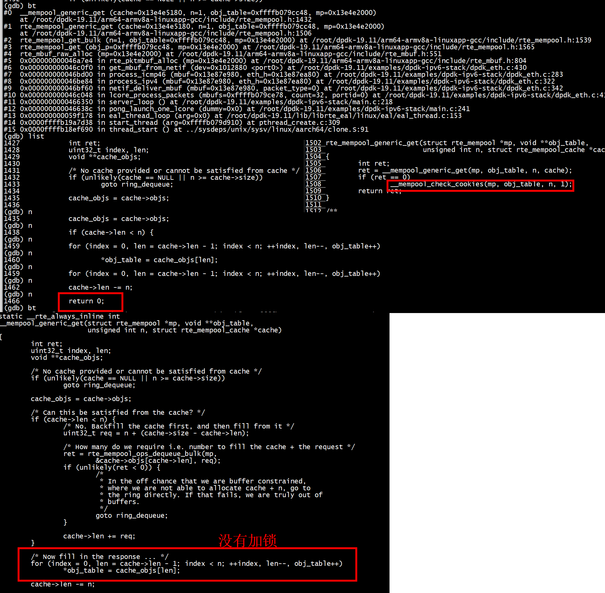
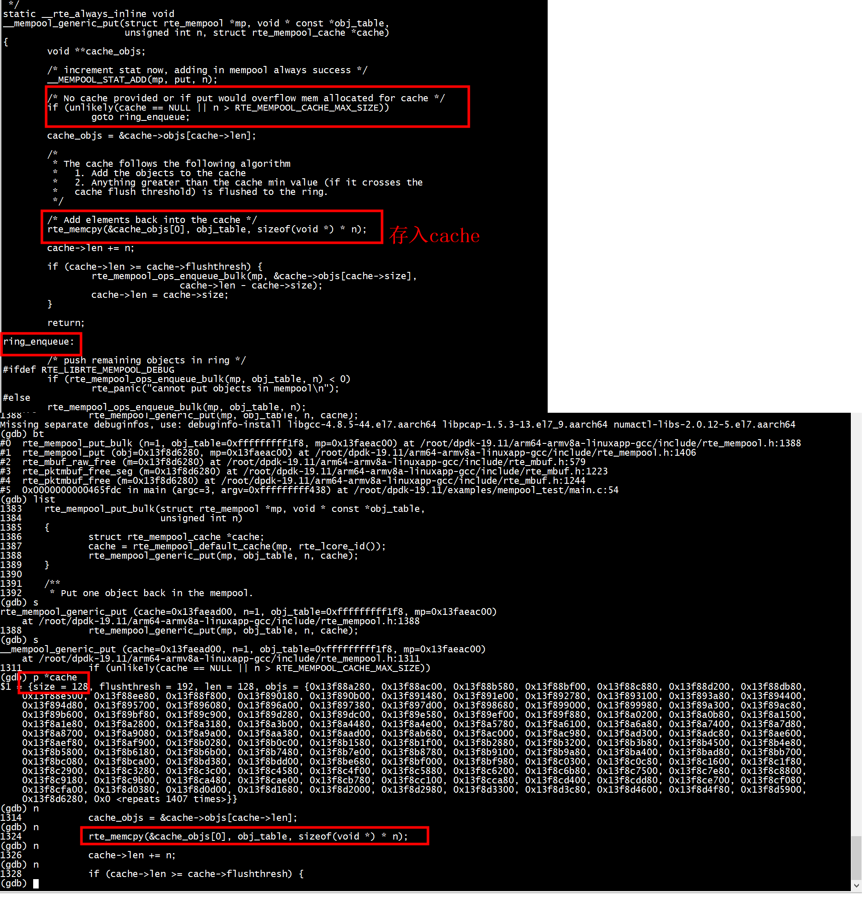
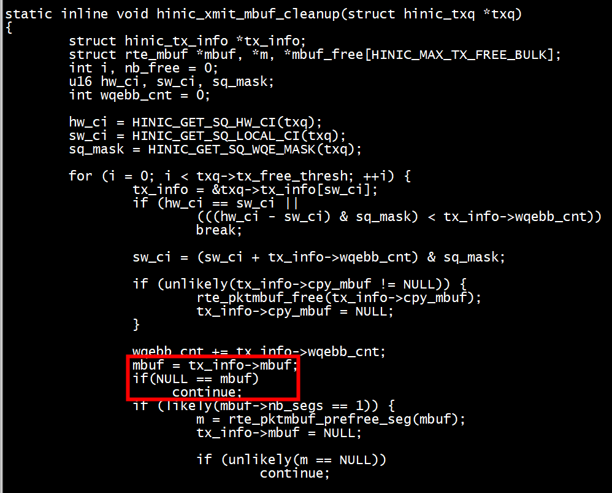
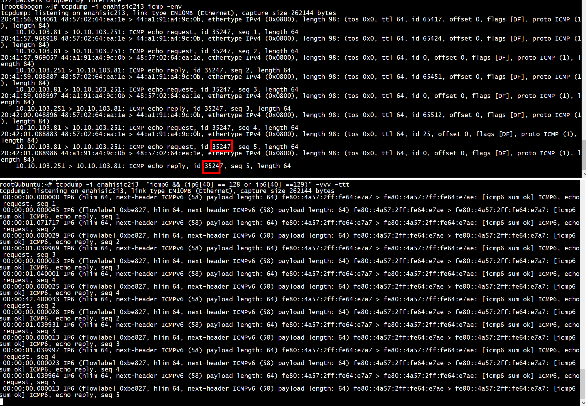

# ipv6  

```
#define DPAA_IPv6_DEFAULT_VTC_FLOW	0x60000000
```

```
* Fill up the outer IP header. */
		outer_ip6hdr->vtc_flow = rte_cpu_to_be_32(
			IPv6_DEFAULT_VTC_FLOW | (priority << 22));
		outer_ip6hdr->proto = IPPROTO_IPIP; 
		outer_ip6hdr->hop_limits = IPv6_DEFAULT_HOP_LIMITS;

		rte_memcpy(outer_ip6hdr->src_addr, info->flow.f.v6.src,
			sizeof(info->flow.f.v6.src));
		rte_memcpy(outer_ip6hdr->dst_addr, info->flow.f.v6.dst,
			sizeof(info->flow.f.v6.dst));

		outer_ip6hdr->payload_len = rte_cpu_to_be_16(pkt->data_len
			- sizeof(struct ether_hdr) - sizeof(struct ipv6_hdr));

```

# ip4


```
#define DPVS_TCP_DEFAULT_TIME    90
#define DPVS_IPV4_HDR_DF_FLAG 0x4000
#define DPVS_IPV4_DEFAULT_TTL    60
#define DPVS_IPV4_DEFAULT_VERSION_IHL    0x45
#define DPVS_IPV6_DEFAULT_VTC_FLOW		0x60000000
#define DPVS_IPV6_DEFAULT_HOT_LIMIT		60
```
RTE_IPV4_HDR_DF_FLAG 也就是 #define DPVS_IPV4_HDR_DF_FLAG 0x4000
```
     ip4h->version_ihl     = ((4 << 4) | 5);
    ip4h->type_of_service = 0;
    ip4h->total_length    = htons(mbuf_nat6to4_len(mbuf));
    ip4h->fragment_offset = htons(RTE_IPV4_HDR_DF_FLAG);
    ip4h->time_to_live    = ttl;
    ip4h->next_proto_id   = next_prot;
    ip4h->hdr_checksum    = 0;
    ip4h->src_addr        = saddr->s_addr;
    ip4h->dst_addr        = daddr->s_addr;
    ip4h->packet_id       = 0; // NO FRAG, so 0 is OK?
```


# mem pool

```
static inline void netif_pktmbuf_pool_init(void)
{
    int i;
    char poolname[32];
    for (i = 0; i < get_numa_nodes(); i++) {
        snprintf(poolname, sizeof(poolname), "mbuf_pool_%d", i);
        pktmbuf_pool[i] = rte_pktmbuf_pool_create(poolname, netif_pktpool_nb_mbuf,
                netif_pktpool_mbuf_cache, 0, RTE_MBUF_DEFAULT_BUF_SIZE, i);
        if (!pktmbuf_pool[i])
            rte_exit(EXIT_FAILURE, "Cannot init mbuf pool on socket %d", i);
    }
}
```

***dev->mbuf_pool = pktmbuf_pool[dev->socket];***

 

mempool中存储的每一个对象的结构分3部分，首部，数据和尾部。每一部分都填充以做到字节对齐，在调试模式首部和尾部还可以加上cookie    
```
static void
mempool_add_elem(struct rte_mempool *mp, void *obj, phys_addr_t physaddr)
{
    struct rte_mempool_objhdr *hdr;
    struct rte_mempool_objtlr *tlr __rte_unused;

    /* set mempool ptr in header */
    hdr = RTE_PTR_SUB(obj, sizeof(*hdr));
    hdr->mp = mp;
    hdr->physaddr = physaddr;
    STAILQ_INSERT_TAIL(&mp->elt_list, hdr, next);
    mp->populated_size++;

#ifdef RTE_LIBRTE_MEMPOOL_DEBUG
    hdr->cookie = RTE_MEMPOOL_HEADER_COOKIE2;
    tlr = __mempool_get_trailer(obj);
    tlr->cookie = RTE_MEMPOOL_TRAILER_COOKIE;
#endif

    /* enqueue in ring */
    rte_mempool_ops_enqueue_bulk(mp, &obj, 1);
}
```
# 每个CPU公用一个local_cache（同一个cpu上的进程和线程可以共享）
```
1534 static __rte_always_inline int
1535 rte_mempool_get_bulk(struct rte_mempool *mp, void **obj_table, unsigned int n)
1536 {
1537         struct rte_mempool_cache *cache;
1538         cache = rte_mempool_default_cache(mp, rte_lcore_id());
1539         return rte_mempool_generic_get(mp, obj_table, n, cache);
1540 }

1257 static __rte_always_inline struct rte_mempool_cache *
1258 rte_mempool_default_cache(struct rte_mempool *mp, unsigned lcore_id)
1259 {
1260         if (mp->cache_size == 0)
1261                 return NULL;
1262 
1263         if (lcore_id >= RTE_MAX_LCORE)
1264                 return NULL;
1265 
1266         return &mp->local_cache[lcore_id];
1267 }
```
## II  put obj to cache
 

## II double free mbuf 造成的问题
+ double free 了 mbuf, mbuf 会插入到内存池的空闲队列中两次。
+ 在收包的时候，同一个 mbuf 在两次不同的 alloc 给返回。也就是说用 同一个 mbuf 会被用来接收两个不同的报文了。
后面的报文就会覆盖前面的报文，最后造成 mbuf 的内容被篡改。从而出现段错误。

## III 为什么会导致 double free?
 
+ 内存池的调试开关
以 19.05 的 dpdk 为例子，修改文件 config/common_bash 中的
CONFIG_RTE_LIBRTE_MEMPOOL_DEBUG=y   
可以打开 dpdk 内存池的调试功能。   

mbuf 会加入 cookies，并且在 alloc 和 free 的时候。检查 mbuf 是否有 double alloc 或者 double
free。
+ 1. double alloc 输出，MEMPOOL： bad header cookie (get)
+ 2. double free 输出，MEMPOOL： bad header cookie (put)


###  III double alloc mbuf 造成的问题
原因：
1. 使用了多进程。并且两个进程都绑定到同一个 lcore.  
2. 内存池使用了 cache。  
因为 内存池 的 cache 虽然是在不同的 lcore 上看到的是不同的。但是相同 lcore 上的 cache 却是共
享的。当两个进程都 alloc 的时候，内存池 的 cache 中的 mbuf 就又可能被分配两池。从而导致 double
alloc。现象表现为, 报文被改写。   


### III  是否开启cache_size
rte_mempool_create_empty  
```
        /* Init all default caches. */
        if (cache_size != 0) {
                for (lcore_id = 0; lcore_id < RTE_MAX_LCORE; lcore_id++)
                        mempool_cache_init(&mp->local_cache[lcore_id],
                                           cache_size);
        }
```
### III   CONFIG_RTE_LIBRTE_MEMPOOL_DEBUG

```
/* check and update cookies or panic (internal) */
void rte_mempool_check_cookies(const struct rte_mempool *mp,
        void * const *obj_table_const, unsigned n, int free)
{
#ifdef RTE_LIBRTE_MEMPOOL_DEBUG
```
#  hinic_xmit_mbuf_cleanup
 
# config

+ client  
```
struct rte_ether_addr cli_mac
static uint32_t client_ip_addr = RTE_IPV4(10,10,103,81)
rte_ether_addr_copy(&eth_h->s_addr, &cli_mac);
```

+ server   

```
uint32_t server_ip_addr = RTE_IPV4(10,10,103,251);
const char *ip6str = "fe80::4a57:2ff:fe64:e7a7";
net_ethaddr
```

+  target  

```
const char *gwip6str= "fe80::4a57:2ff:fe64:e7ae";
gw_mac
gw_ip6
``` 

# test


+ server  
```
./build/app/dpdk-ipv6 -c 0x3 -- -p 0
```
+ client    

```
[root@bogon ~]# ping  10.10.103.251 -i 1
PING 10.10.103.251 (10.10.103.251) 56(84) bytes of data.
64 bytes from 10.10.103.251: icmp_seq=1 ttl=64 time=0.201 ms
64 bytes from 10.10.103.251: icmp_seq=2 ttl=64 time=0.138 ms
64 bytes from 10.10.103.251: icmp_seq=3 ttl=64 time=0.124 ms
64 bytes from 10.10.103.251: icmp_seq=4 ttl=64 time=0.135 ms
^C
--- 10.10.103.251 ping statistics ---
4 packets transmitted, 4 received, 0% packet loss, time 3151ms
rtt min/avg/max/mdev = 0.124/0.149/0.201/0.032 ms
[root@bogon ~]# 
```
+  target   
```
 tcpdump -i enahisic2i3  "icmp6 && (ip6[40] == 128 or ip6[40] ==129)" -vvv -ttt
```
 
 
 
# static inline int icmp4_to_icmp6(struct __sk_buff *skb, int nh_off)

[icmp4_to_icmp6](https://github.com/polyverse-security/cilium/blob/3466465075267652f6baea6ad22733ab9324c0b0/bpf/lib/nat46.h#L64)   


# vpp

[nat64](https://github.com/FDio/vpp/blob/4504df795b0ffc4863b12b0d97786423d8b63562/src/plugins/nat/nat64/nat64_in2out.c)  