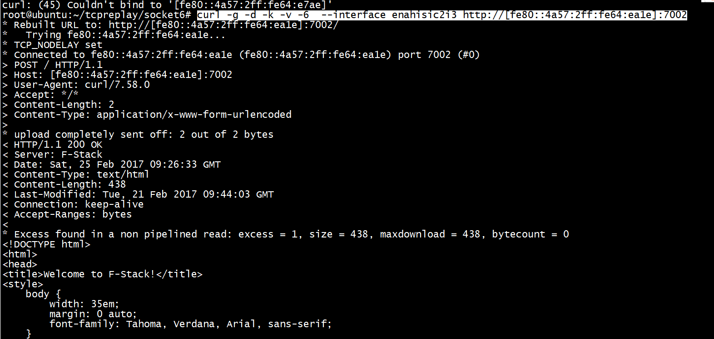
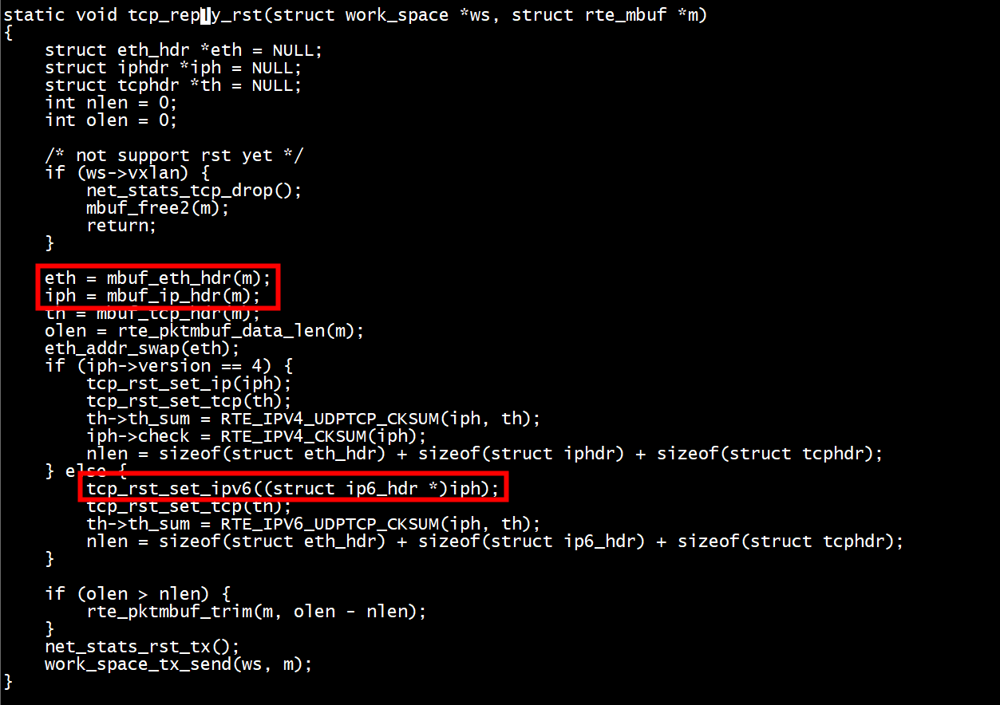

# telnet ipv6

```
root@ubuntu:~# telnet fe80::4a57:2ff:fe64:e7a7%enahisic2i3 80
Trying fe80::4a57:2ff:fe64:e7a7%enahisic2i3...
telnet: Unable to connect to remote host: Connection timed out
```
# curl ipv6

```
curl -g -d -k -v -6  --interface enahisic2i3 http://[fe80::4a57:2ff:fe64:ea1e]:7002
```


# tcpdump tcp

```
root@ubuntu:~# tcpdump -i enahisic2i3 ip6 and "ip6[6]==0x6" -vvv -ttt 
tcpdump: listening on enahisic2i3, link-type EN10MB (Ethernet), capture size 262144 bytes
 00:00:00.000000 IP6 (flowlabel 0x0fee3, hlim 64, next-header TCP (6) payload length: 40) fe80::4a57:2ff:fe64:e7ae.8788 > fe80::4a57:2ff:fe64:e7a7.afs3-prserver: Flags [S], cksum 0x63fd (incorrect -> 0x3d4e), seq 1409924728, win 64800, options [mss 1440,sackOK,TS val 3161169210 ecr 0,nop,wscale 7], length 0
 00:00:01.018576 IP6 (flowlabel 0xb9a60, hlim 64, next-header TCP (6) payload length: 40) fe80::4a57:2ff:fe64:e7ae.8788 > fe80::4a57:2ff:fe64:e7a7.afs3-prserver: Flags [S], cksum 0x63fd (incorrect -> 0x3953), seq 1409924728, win 64800, options [mss 1440,sackOK,TS val 3161170229 ecr 0,nop,wscale 7], length 0
```

# tcp header

```
#define __FAVOR_BSD
#include <netinet/tcp.h>
#undef __FAVOR_BSD
```


# ipaddr_t
```
/*
 * The lower 32 bits represent an IPv6 address.
 * The IPv4 address is in the same position as the lower 32 bits of IPv6.
 * */
typedef struct {
    union {
        struct in6_addr in6;
        struct {
            uint32_t pad[3];
            uint32_t ip;
        };
    };
} ipaddr_t;
```

#   struct iphdr pk  struct ip6_hdr


```
linux/ip.h
struct iphdr {
#if defined(__LITTLE_ENDIAN_BITFIELD)
        __u8    ihl:4,
                version:4;
#elif defined (__BIG_ENDIAN_BITFIELD)
        __u8    version:4,
                ihl:4;
#else
#error  "Please fix <asm/byteorder.h>"
#endif
        __u8    tos;
        __be16  tot_len;
        __be16  id;
        __be16  frag_off;
        __u8    ttl;
        __u8    protocol;
        __sum16 check;
        __be32  saddr;
        __be32  daddr;
        /*The options start here. */
};
```


```
struct ip6_hdr
  {
    union
      {
        struct ip6_hdrctl
          {
            uint32_t ip6_un1_flow;   /* 4 bits version, 8 bits TC,
                                        20 bits flow-ID */
            uint16_t ip6_un1_plen;   /* payload length */
            uint8_t  ip6_un1_nxt;    /* next header */
            uint8_t  ip6_un1_hlim;   /* hop limit */
          } ip6_un1;
        uint8_t ip6_un2_vfc;       /* 4 bits version, top 4 bits tclass */
      } ip6_ctlun;
    struct in6_addr ip6_src;      /* source address */
    struct in6_addr ip6_dst;      /* destination address */
  };
```
# I test

+ dpdk reply 报文的dst  mac   
```
    if (rte_eth_addr_is_zero(&eth->d_addr))
    {
       rte_ether_addr_copy(&gw_mac, &eth->d_addr);
    }
```
+ server port 、 client port设置    
```
    .listen = 80,
    .listen_num = 2,
    // lport_min is client port min, lport_max is client port max
    .lport_min = 8788,
    .lport_max = 8798,
    .tx_burst = 1,
```

+ server ip 、 client ip设置   
```
int init_config(void)
{
    struct config *cfg = &g_config;
    ipaddr_t ip;
    struct ip_range *ip_range = NULL;
    struct ip_group *ip_group = &cfg->client_ip_group;
    struct netif_port *port = NULL;
    port = config_port_get(cfg, 0, NULL);
    if (inet_pton(AF_INET6, TCP_CLIENT82_IP6, &ip.in6)< 0)
    {
        return -1;
    }
    ip_range = &ip_group->ip_range[ip_group->num];
    ip_range_init(ip_range, ip, 1);
    ip_group->num++;
    if (ip_range_init(&port->client_ip_range, ip, 1) < 0) {
        printf("bad server ip range \n");
        exit(0);
    }
    ip.in6 = net_ip6;
    if (ip_range_init(&port->server_ip_range, ip, 1) < 0) {
        printf("bad server ip range \n");
        exit(0);
    }
    return 0;
}
```
> ## socket

```
static void socket_init(struct work_space *ws, struct socket *sk, uint32_t client_ip, uint16_t client_port,
     uint32_t server_ip, uint16_t server_port)
{
    uint32_t seed = 0;
    struct config *cfg = NULL;
    FILE *log = g_work_space->log;
    cfg = ws->cfg;
    sk->state = 0; /* TCP_CLOSED; */
    sk->keepalive = ws->cfg->keepalive;

    if (ws->server) {
        sk->laddr = server_ip;
        sk->faddr = client_ip;
        sk->lport = server_port;
        sk->fport = client_port;
    } else {
        sk->faddr = server_ip;
        sk->laddr = client_ip;
        sk->fport = server_port;
        sk->lport = client_port;
    }

    seed = (uint32_t)rte_rdtsc();
    sk->snd_nxt = rand_r(&seed);

    fprintf(stdout,
            IPV4_FMT ": %u" "->" IPV4_FMT ": %u \n", \
            IPV4_STR(server_ip), ntohs(server_port),\
            IPV4_STR(client_ip), ntohs(client_port));
    csum_init_socket(ws, sk);
    socket_node_init(&sk->node);
}
```

+ **sk->snd_nxt = rand_r(&seed);**

> ## II replay数据

```
static inline struct rte_mbuf *tcp_new_packet(struct work_space *ws, struct socket *sk, uint8_t tcp_flags)
{
    if (rte_eth_addr_is_zero(&gw_mac))
    {
        return NULL;
    }
    if (tcp_flags & TH_SYN) {
        p = &ws->tcp_opt;
        csum_tcp = sk->csum_tcp_opt;
        csum_ip = sk->csum_ip_opt;
    } else if (tcp_flags & TH_PUSH) {
        p = &ws->tcp_data;
        csum_tcp = sk->csum_tcp_data;
        csum_ip = sk->csum_ip_data;
        snd_una = p->data.data_len;
    } else {
        p = &ws->tcp;
        csum_tcp = sk->csum_tcp;
        csum_ip = sk->csum_ip;
    }
}
```

> ## check sum offload
+  RTE_ETH_TX_OFFLOAD_IPV4_CKSUM,g_dev_tx_offload_ipv4_cksum,iph->check     
+  RTE_ETH_TX_OFFLOAD_TCP_CKSUM|RTE_ETH_TX_OFFLOAD_UDP_CKSUM, g_dev_tx_offload_tcpudp_cksum,th->th_sum    
```
static inline void csum_offload_ip_tcpudp(struct rte_mbuf *m, uint64_t ol_flags)
{
    struct ip6_hdr *ip6h = NULL;
    struct iphdr *iph = NULL;
    struct tcphdr *th = NULL;

    iph = mbuf_ip_hdr(m);
    th = mbuf_tcp_hdr(m);
    m->l2_len = sizeof(struct eth_hdr);

    if (iph->version == 4) {
        m->l3_len = sizeof(struct iphdr);
        iph->ttl = DEFAULT_TTL;
        iph->check = 0;

        if (unlikely(g_dev_tx_offload_tcpudp_cksum == 0)) {
            th->th_sum = 0;
            th->th_sum = RTE_IPV4_UDPTCP_CKSUM(iph, th);
        } else {
            m->ol_flags = ol_flags | RTE_MBUF_F_TX_IPV4;
        }

        if (g_dev_tx_offload_ipv4_cksum) {
            m->ol_flags |= RTE_MBUF_F_TX_IP_CKSUM | RTE_MBUF_F_TX_IPV4;
        } else {
            iph->check = RTE_IPV4_CKSUM(iph);
        }
    } else {
        ip6h = (struct ip6_hdr *)iph;
        ip6h->ip6_hops = DEFAULT_TTL;
        if (unlikely(g_dev_tx_offload_tcpudp_cksum == 0)) {
            th->th_sum = 0;
            th->th_sum = RTE_IPV6_UDPTCP_CKSUM(ip6h, th);
        } else {
            m->l3_len = sizeof(struct ip6_hdr);
            m->ol_flags = ol_flags | RTE_MBUF_F_TX_IPV6;
        }
    }
}
```

>  ## II  client

```
root@ubuntu:~/tcpreplay/socket6# ./client 
connect to server sussessfully
send  GET /
 to server
Received HTTP/1.1 200 OK
Serv:dperf
Content-Length:  11
Connection:keep-alive

hello world from server
root@ubuntu:~/tcpreplay/socket6#
```

> ## II tcp


+ tcp.analysis.lost_segment：表明已经在抓包中看到不连续的序列号。报文丢失会造成重复的ACK，这会导致重传。   
tcp.analysis.duplicate_ack：显示被确认过不止一次的报文。大凉的重复ACK是TCP端点之间高延时的迹象。   
tcp.analysis.retransmission：显示抓包中的所有重传。如果重传次数不多的话还是正常的，过多重传可能有问题。这通常意味着应用性能缓慢和/或用户报文丢失。   
tcp.analysis.window_update：将传输过程中的TCP window大小图形化。如果看到窗口大小下降为零，这意味着发送方已经退出了，并等待接收方确认所有已传送数据。这可能表明接收端已经不堪重负了。   
+ +   1 TCP Window Update,服务端告知客户端服务端有足够的缓存大小(8192)，可以正常接收客户端数据。若出现了TCP Window Full包表示缓存区已满，客户端会停止发送，直到接收到了TCP Window Update包。(Window值表示滑动窗口，允许接收到多个包同时响应一个ACK包)
+  tcp.analysis.bytes_in_flight：某一时间点网络上未确认字节数。未确认字节数不能超过你的TCP窗口大小（定义于最初3此TCP握手），为了最大化吞吐量你想要获得尽可能接近TCP窗口大小。如果看到连续低于TCP窗口大小，可能意味着报文丢失或路径上其他影响吞吐量的问题。   
+ tcp.analysis.ack_rtt：衡量抓取的TCP报文与相应的ACK。如果这一时间间隔比较长那可能表示某种类型的网络延时（报文丢失，拥塞，等等）。   
   
[使用wireshark抓取TCP包传输分析](https://cloud.tencent.com/developer/article/1552713)   
[Linux内核协议栈中一些关于 TCP MSS 的细节](https://switch-router.gitee.io/blog/tcp-mss/)   
[笔记：TCP 头部时间戳选项（TCP Timestamps Option，TSopt）](https://zhuanlan.zhihu.com/p/612010050)   
> + process syn from client

```
socket_server_open(&ws->socket_table, sk, th)
 tcp_reply(ws, sk, TH_SYN | TH_ACK)
    tcp_new_packet
 socket_start_retransmit_timer
```
+  syn '+' ack带有mss option, 从 mbuf_cache_init_tcp(&ws->tcp_opt, ws, "tcp_opt", ws->cfg->mss, NULL),


>>  ### II  TCP options
TCP options (MSS, Window Scale and SACK) 

+ 1 窗口缩放选项（window scaleing）可以在tcp握手时候在SYN分组中的连接期间仅发送一次。可以通过修改TCP标头中的窗口字段的值来动态调整窗口大小，但是在TCP连接的持续时间内，标度乘数保持静态。仅当两端都包含选项时，缩放才有效;如果只有连接的一端支持窗口缩放，则不会在任一方向上启用它。最大有效比例值为14


>>>  #### TCP SO_SNDBUF

+ server
```
 nc -kl 11111 
```
+ client 

```
#include <stdio.h>
#include <stdlib.h>
#include <unistd.h>
#include <arpa/inet.h>

int main(int argc, char *argv[])
{
  int sock, sendbuff;
  struct sockaddr_in server;
  socklen_t optlen;

  sock = socket(AF_INET, SOCK_STREAM, 0);
  server.sin_family = AF_INET;
  server.sin_port = htons(11111);
  server.sin_addr.s_addr = inet_addr("10.10.16.81");

  connect(sock, (struct sockaddr *)&server, sizeof(server));

  optlen = sizeof(sendbuff);
  getsockopt(sock, SOL_SOCKET, SO_SNDBUF, (void *)&sendbuff, (socklen_t *)&optlen);
  printf("send buffer size(before) = %d\n",sendbuff);

  sendbuff = atoi(argv[1]);
  setsockopt(sock, SOL_SOCKET, SO_SNDBUF, (void *)&sendbuff, (socklen_t )optlen);

  getsockopt(sock, SOL_SOCKET, SO_SNDBUF, (void *)&sendbuff, (socklen_t *)&optlen);
  printf("send buffer size(after) = %d\n",sendbuff);

  close(sock);
  return 0;
}
```

```
[root@centos7 test]# gcc tcp_win.c  -o tcp_win
[root@centos7 test]# ./tcp_win  2303
send buffer size(before) = 87040
send buffer size(after) = 4608
[root@centos7 test]# ./tcp_win  2304
send buffer size(before) = 87040
send buffer size(after) = 4608
[root@centos7 test]# ./tcp_win  2305
send buffer size(before) = 87040
send buffer size(after) = 4610
[root@centos7 test]# ./tcp_win  2306
send buffer size(before) = 87040
send buffer size(after) = 4612
[root@centos7 test]# ./tcp_win  212990
send buffer size(before) = 87040
send buffer size(after) = 425980
[root@centos7 test]# 
```
