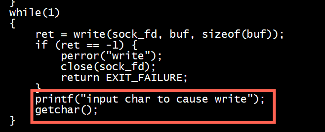
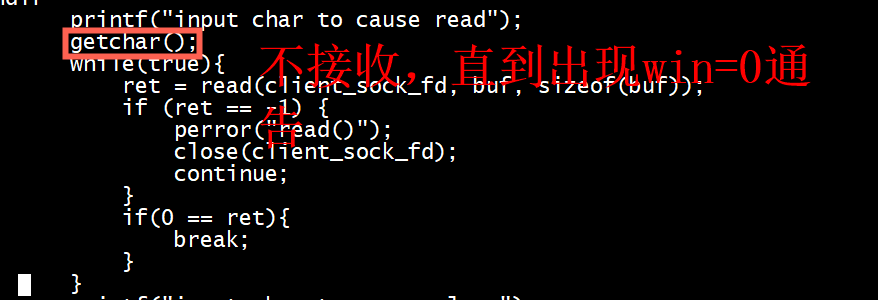
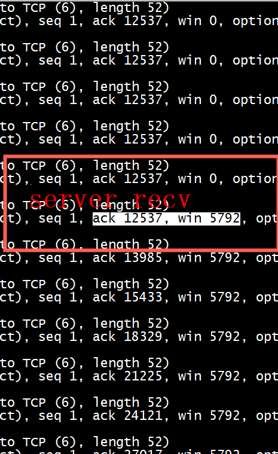
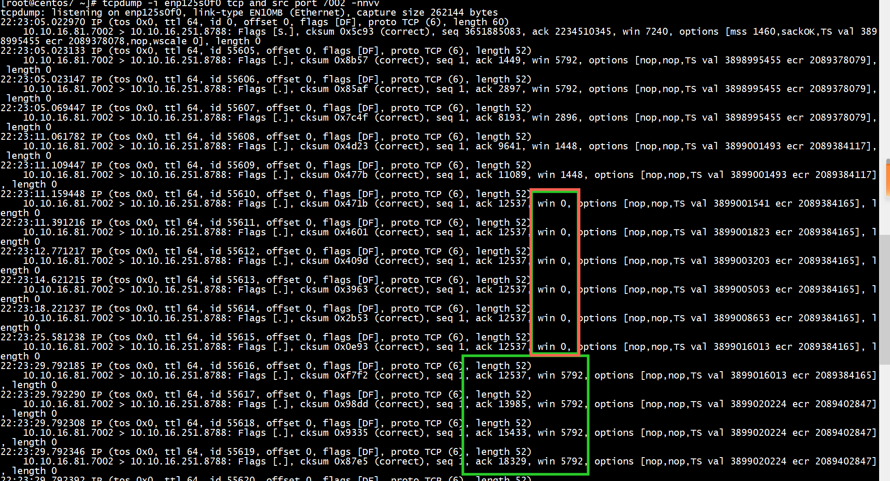
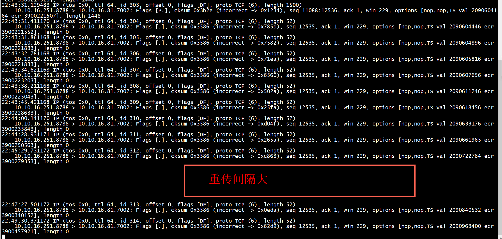
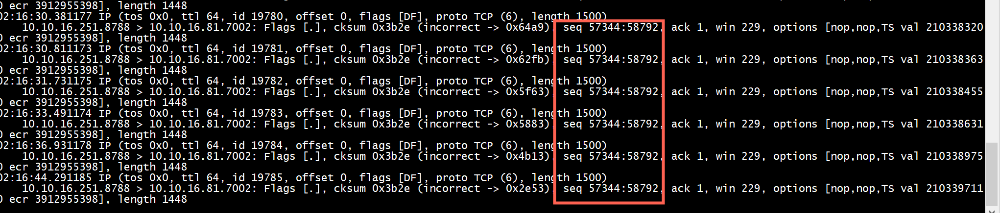

# tcp window
*  1） client 不断发送，server不进行接收。直到server发送 ack 12537, win 0通告


*  2） 直到server发送 ack 12537, win 0通告后。client停止发送，server进行接收，直到接收缓冲没有数据
*  3）  client停止发送，server进行接收，server会给client发送ack 12537, win 5792通告

* 4） tcpdump
```
tcpdump -i enp125s0f0 tcp and src port 7002 -nnvv
```


* 5)  server 发送 win 0通告后,对于 client发送的数据由于没有空间缓冲，会导致client 重传
```
tcpdump -i enp125s0f0 tcp and dst  port 7002 -nnvv
```



> ## TCP window full 与 TCP zero window
+ TCP Window Full 是站在发送端角度说的，表示在途字节数等于对方接收窗口的情况，此时发送端不能再发数据给对方直到发送的数据包得到 ACK。    
+ TCP zero window 是站在接收端角度来说的，是接收端接收窗口满，告知对方不能再发送数据给自己。    

> ## Zero Window Probe
TCP使用了Zero Window Probe技术，缩写为ZWP，也就是说，发送端在窗口变成0后，会发ZWP的包给接收方，让接收方来ack他的Window尺寸，一般这个值会设置成3次，第次大约30-60秒（不同的实现可能会不一样）。如果3次过后还是0的话，有的TCP实现就会发RST把链接断了。    

> ##  D-SACK

Duplicate SACK 又称 D-SACK，其主要使用了 SACK 来告诉「发送方」有哪些数据被重复接收了。   

[Duplicate SACK](https://www.xiaolincoding.com/network/3_tcp/tcp_feature.html#duplicate-sack)   

```Text
可见，D-SACK 有这么几个好处：  
可以让「发送方」知道，是发出去的包丢了，还是接收方回应的 ACK 包丢了;
可以知道是不是「发送方」的数据包被网络延迟了;
可以知道网络中是不是把「发送方」的数据包给复制了;
```
# retransmit
在server端，win窗口不是0的情况下，丢包。让client重传

```
iptables -A INPUT -i enahisic2i0  -p tcp --dport 7002  -m state --state   ESTABLISHED -j DROP
```



# snd_una snd_nxt

```
SOCK_DEBUG(sk, "Ack %u after %u:%u\n", ack, tp->snd_una, tp->snd_nxt);
```
