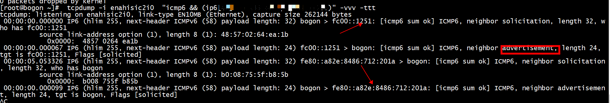

# ipv6 solicit
+ ping6   
fe80::a82e:8486:712:201b地址不存在   
```
[root@bogon ~]# ping6 fe80::a82e:8486:712:201b%enahisic2i0
PING fe80::a82e:8486:712:201b%enahisic2i0(fe80::a82e:8486:712:201b%enahisic2i0) 56 data bytes
From fe80::997e:ea4a:6f5d:f076%enahisic2i0 icmp_seq=1 Destination unreachable: Address unreachable
From fe80::997e:ea4a:6f5d:f076%enahisic2i0 icmp_seq=2 Destination unreachable: Address unreachable
From fe80::997e:ea4a:6f5d:f076%enahisic2i0 icmp_seq=3 Destination unreachable: Address unreachable
```

```
2: enahisic2i0: <BROADCAST,MULTICAST,UP,LOWER_UP> mtu 1500 qdisc mq state UP group default qlen 1000
    link/ether 48:57:02:64:ea:1b brd ff:ff:ff:ff:ff:ff
    inet 10.11.15.81/24 brd 10.10.16.255 scope global noprefixroute enahisic2i0
       valid_lft forever preferred_lft forever
    inet6 fe80::997e:ea4a:6f5d:f076/64 scope link noprefixroute 
       valid_lft forever preferred_lft forever
```

+ icmp_dump.py    
```
[root@centos7 tcpreplay]# python3 icmp_dump.py 
solicit, src:  :: dst:  ff02::1:ffb8:733b type:  135 tgt:  fe80::7863:c7aa:bb8:733b
solicit, src:  fe80::997e:ea4a:6f5d:f076 dst:  ff02::1:ff12:201b type:  135 tgt:  fe80::a82e:8486:712:201b
solicit, src:  fe80::997e:ea4a:6f5d:f076 dst:  ff02::1:ff12:201b type:  135 tgt:  fe80::a82e:8486:712:201b
solicit, src:  fe80::997e:ea4a:6f5d:f076 dst:  ff02::1:ff12:201b type:  135 tgt:  fe80::a82e:8486:712:201b
```
**ff02::1:ff12:201b**是ip层目的地址

# ipv6 地址
+ 全0的地址::/128为未定义地址，大家不要去使用   
+  除了最后一位是1，其它都是0的地址::1/128为本地环回地址，同IPv4里面的127.0.0.1   
+  FF00::/8这个网段的地址都是多播地址   
+ FE80::/10为Link-Local的单播地址，这类地址不能穿过路由器   
+ FC00::/7为本地的单播地址，可以穿过本地的路由器，但不能穿过外网的路由器，即只可以在本地使用，和IPv4里面的192.168.0.0/16相似   

+ ping6 lo的环回地址
```
 ping6 ::1
PING ::1(::1) 56 data bytes
64 bytes from ::1: icmp_seq=1 ttl=64 time=0.071 ms
64 bytes from ::1: icmp_seq=2 ttl=64 time=0.027 ms
^C
```
+  ping类型为“Scope:Global”的地址
```
[root@centos7 dpdk]# ping6 fd00::1
connect: Network is unreachable
[root@centos7 dpdk]# ping6 2001::1
connect: Network is unreachable
[root@centos7 dpdk]# 
```
+  ping6一个多播（Multicast）地址，ff02::1代表子网中的所有机器
```
[root@centos7 dpdk]# ping6 -I enp125s0f0 ff02::1
PING ff02::1(ff02::1) from fe80::a82e:8486:712:201a%enp125s0f0 enp125s0f0: 56 data bytes
64 bytes from fe80::a82e:8486:712:201a%enp125s0f0: icmp_seq=1 ttl=64 time=0.088 ms
64 bytes from fe80::b208:75ff:fe5f:c981%enp125s0f0: icmp_seq=1 ttl=64 time=1.61 ms (DUP!)
64 bytes from fe80::b208:75ff:fe5f:b7d9%enp125s0f0: icmp_seq=1 ttl=64 time=2.25 ms (DUP!)
64 bytes from fe80::f679:60ff:fefe:466a%enp125s0f0: icmp_seq=1 ttl=64 time=2.27 ms (DUP!)
64 bytes from fe80::2265:8eff:feff:d4d4%enp125s0f0: icmp_seq=1 ttl=64 time=2.29 ms (DUP!)
64 bytes from fe80::4a57:2ff:fe64:e3eb%enp125s0f0: icmp_seq=1 ttl=64 time=2.32 ms (DUP!)
64 bytes from fe80::4a57:2ff:fe64:f8eb%enp125s0f0: icmp_seq=1 ttl=64 time=2.33 ms (DUP!)
64 bytes from fe80::b605:5dff:fefa:fbf9%enp125s0f0: icmp_seq=1 ttl=64 time=2.33 ms (DUP!)
```
可以看到局域网中的其它机器回复的结果，这些IP都是其它机器的“Scope:Link”地址  
这里(DUP!)是由于ping多播地址时会收到多个回复，导致ping认为有重复的应答，其实是正常情况   

## II  fe80::/10

fe80 开头的ip地址在ipv6中是链路本地地址。 ipv4中的地址块是 169.254.0.0/16， ipv6中的地址块是fe80::/10。这类主机通常不需要外部互联网服务，仅有主机间相互通讯的需求。   

## II ipv6  Solicited-node组播地址
```Text
请求节点组播地址（Solicited-Node Address）生成过程：
IPv6地址的后24位：xx:xxxx
再加上前缀地址：FF02:0:0:0:0:1:FF
就得到了请求节点组播地址：FF02:0:0:0:0:1:FFxx:xxxx
```
```Text
举个栗子（例子）：

主机的MAC地址为：00-02-B3-1E-83-29
通过EUI-64自动生成的link-local地址为：FE80::0202:B3FF:FE1E:8329
请求节点组播地址为：FF02:0:0:0:0:1:FF1E:8329
或者：

手动配置的IPv6地址为：2001::11:1111
请求节点组播地址为：FF02:0:0:0:0:1:FF::11:1111
``` 
## II ip add ipv6
+ host1
```
[root@centos7 lib]# ip a add fc00::1251/64 dev enp125s0f0
[root@centos7 lib]# ping6  fc00::1281%enp125s0f0
ping: fc00::1281%enp125s0f0: Name or service not known
2: enp125s0f0: <BROADCAST,MULTICAST,UP,LOWER_UP> mtu 1500 qdisc pfifo_fast state UP group default qlen 1000
    link/ether b0:08:75:5f:b8:5b brd ff:ff:ff:ff:ff:ff
    inet 10.10.16.251/24 brd 10.10.16.255 scope global noprefixroute enp125s0f0
       valid_lft forever preferred_lft forever
    inet6 fc00::1251/64 scope global 
       valid_lft forever preferred_lft forever
    inet6 fe80::a82e:8486:712:201a/64 scope link noprefixroute 
       valid_lft forever preferred_lft forever
```
***fc00::1251/64 scope global***

```
[root@centos7 lib]# ping6  fc00::1281 -I enp125s0f0
PING fc00::1281(fc00::1281) from fc00::1251 enp125s0f0: 56 data bytes
64 bytes from fc00::1281: icmp_seq=1 ttl=64 time=0.139 ms
64 bytes from fc00::1281: icmp_seq=2 ttl=64 time=0.086 ms
64 bytes from fc00::1281: icmp_seq=3 ttl=64 time=0.101 ms
```
+ host2
```
[root@bogon ~]#  ip address add fc00::1281/64 dev enahisic2i0
2: enahisic2i0: <BROADCAST,MULTICAST,UP,LOWER_UP> mtu 1500 qdisc mq state UP group default qlen 1000
    link/ether 48:57:02:64:ea:1b brd ff:ff:ff:ff:ff:ff
    inet 10.10.16.81/24 brd 10.10.16.255 scope global noprefixroute enahisic2i0
       valid_lft forever preferred_lft forever
    inet6 fc00::1281/64 scope global 
       valid_lft forever preferred_lft forever
    inet6 fe80::997e:ea4a:6f5d:f076/64 scope link noprefixroute 
       valid_lft forever preferred_lft forever
```
***fc00::1281/64 scope global***

 
 **Flags [solicited]**    
Solicited标志位用于表示是否为一个Solicited NeighborAdvertisement(SNA)报文。SNA报文是在邻居节点请求地址解析时发送的一种特殊类型的NA报文。