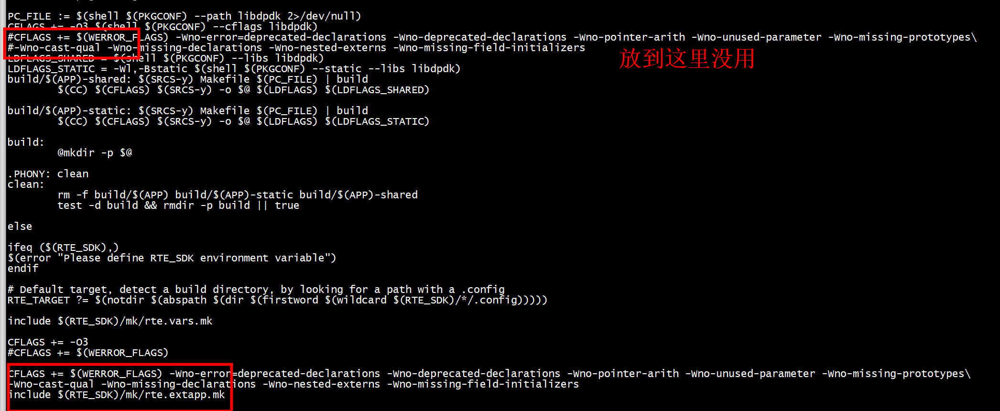

# 大页内存

```
 ./usertools/dpdk-setup.sh
```

# 添加include目录 和忽略警告

```
CFLAGS += -O3
CFLAGS += -I$(SRCDIR)/inc
CFLAGS += $(WERROR_FLAGS) -Wno-error=deprecated-declarations -Wno-deprecated-declarations -Wno-pointer-arith -Wno-unused-parameter -Wno-missing-prototypes\
-Wno-cast-qual -Wno-missing-declarations -Wno-nested-externs -Wno-missing-field-initializers
```
 
 
 ```
#pragma GCC diagnostic push
#pragma GCC diagnostic ignored "-Wdeprecated-declarations"
    ret = rte_eth_dev_filter_supported(port_id, RTE_ETH_FILTER_HASH);
#pragma GCC diagnostic pop
 ```
 
# pragma 忽略警告

```
#pragma GCC diagnostic ignored "-Waddress-of-packed-member"
#include "icmp.h"
#include "netdev.h"
#include "util.h"
#include <rte_ether.h>
#include <rte_ip.h>
#include <rte_icmp.h>
```
 
#   RTE_SDK

```
export RTE_SDK=~/dpdk-19.11
```

# arm平台  implicit declaration of function ‘rte_rdtsc’
```
#ifndef RTE_ARM_EAL_RDTSC_USE_PMU
/**
 * This call is portable to any ARMv8 architecture, however, typically
 * cntvct_el0 runs at <= 100MHz and it may be imprecise for some tasks.
 */
static inline uint64_t
rte_rdtsc(void)
{
        uint64_t tsc;

        asm volatile("mrs %0, cntvct_el0" : "=r" (tsc));
        return tsc;
}
#else
/**
 * This is an alternative method to enable rte_rdtsc() with high resolution
 * PMU cycles counter.The cycle counter runs at cpu frequency and this scheme
 * uses ARMv8 PMU subsystem to get the cycle counter at userspace, However,
 * access to PMU cycle counter from user space is not enabled by default in
 * arm64 linux kernel.
 * It is possible to enable cycle counter at user space access by configuring
 * the PMU from the privileged mode (kernel space).
 *
 * asm volatile("msr pmintenset_el1, %0" : : "r" ((u64)(0 << 31)));
 * asm volatile("msr pmcntenset_el0, %0" :: "r" BIT(31));
 * asm volatile("msr pmuserenr_el0, %0" : : "r"(BIT(0) | BIT(2)));
 * asm volatile("mrs %0, pmcr_el0" : "=r" (val));
 * val |= (BIT(0) | BIT(2));
 * isb();
 * asm volatile("msr pmcr_el0, %0" : : "r" (val));
 *
 */
static inline uint64_t
rte_rdtsc(void)
{
        uint64_t tsc;

        asm volatile("mrs %0, pmccntr_el0" : "=r"(tsc));
        return tsc;
}
#endif
```
# undefined reference to `rte_pmd_i40e_get_fdir_info' (dpdk-stable-22.11.1)
```
test_rss.c:(.text+0xe48): undefined reference to `rte_pmd_i40e_get_fdir_info'
test_rss.c:(.text+0xebe): undefined reference to `rte_pmd_i40e_get_fdir_stats'
```
加上LDFLAGS_SHARED += -lrte_net_i40e    
加上LDFLAGS_SHARED += -lrte_net_i40e    


#  RTE_TARGET

```
make config T=x86_64-native-linuxapp-gcc
Configuration done using x86_64-native-linuxapp-gcc
make install T=x86_64-native-linuxapp-gcc  DESTDIR=/home/ubuntu/dpdk-19.11/install -j 64
```


```
RTE_TARGET ?= x86_64-native-linuxapp-gcc
```