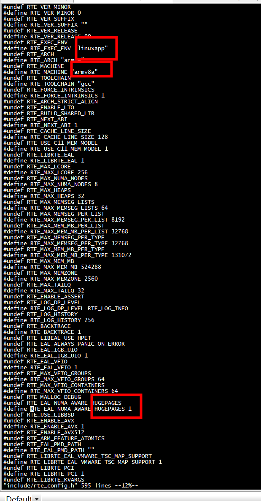
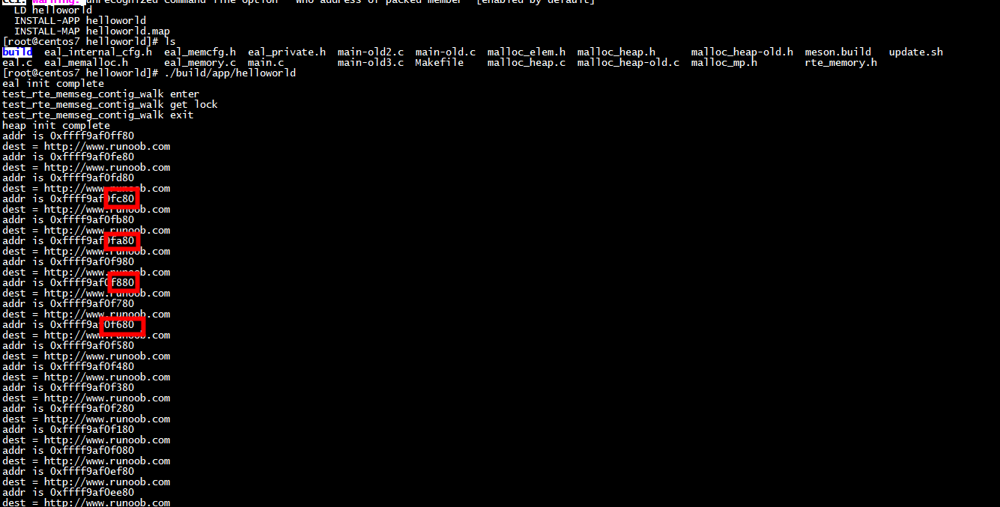

 ***移植dpdk malloc***
 
 # os
 
 ```
[root@centos7 helloworld]# uname -a
Linux centos7 4.14.0-115.el7a.0.1.aarch64 #1 SMP Sun Nov 25 20:54:21 UTC 2018 aarch64 aarch64 aarch64 GNU/Linux
[root@centos7 helloworld]# 

 ```
 
 # arch 
 
 


```
//#undef RTE_EAL_IGB_UIO
//#define RTE_EAL_IGB_UIO 1
//#undef RTE_EAL_VFIO
//#define RTE_EAL_VFIO 1
//#undef RTE_MAX_VFIO_GROUPS
//#define RTE_MAX_VFIO_GROUPS 64
//#undef RTE_MAX_VFIO_CONTAINERS
//#define RTE_MAX_VFIO_CONTAINERS 64
//#undef RTE_MALLOC_DEBUG
//#undef RTE_EAL_NUMA_AWARE_HUGEPAGES
//#define RTE_EAL_NUMA_AWARE_HUGEPAGES 1
```
 
 # make and run
 
 ```
[root@centos7 helloworld]# pwd
/root/dpdk-19.11/examples/helloworld
[root@centos7 helloworld]# export RTE_SDK=/root/dpdk-19.11
[root@centos7 helloworld]# export RTE_TARGET=arm64-armv8a-linuxapp-gcc
[root@centos7 helloworld]# make clean
[root@centos7 helloworld]# make -j 8
 ```
 
 
 
 # macro   HAVE_USE
 
 ```
#define USING_HUGE 0
#define USING_RTE_EXTMEM 0
 ```
 
 采用HAVE_USE宏干掉huge page相关的结构
 
 ```
eal_internal_cfg.h:4:#define HAVE_USE  0
eal_internal_cfg.h:46:#if HAVE_USE 
main.c:26:#define HAVE_USE 0
 ```
 采用HAVE_USE宏干掉 如下代码
 
 ```C
 #if HAVE_USE
//##################################will cause dead ########################
        if (register_mp_requests()) {
                RTE_LOG(ERR, EAL, "Couldn't register malloc multiprocess actions\n");
                rte_mcfg_mem_read_unlock();
                return -1;
        }
        /* unlock mem hotplug here. it's safe for primary as no requests can
         * even come before primary itself is fully initialized, and secondaries
         * do not need to initialize the heap.
         */
        rte_mcfg_mem_read_unlock();
#endif
 ```
 
 
# rte_mcfg_mem_read_lock

函数头文件： #include <stdio.h>

```
rte_mcfg_mem_read_lock(void)
{
        struct rte_mem_config *mcfg = rte_eal_get_configuration()->mem_config;
        rte_rwlock_read_lock(&mcfg->memory_hotplug_lock);
}
```
# unknown type name ‘_IO_cookie_io_functions_t’

```
stdio.h:314:6: error: unknown type name ‘_IO_cookie_io_functions_t’


```
Adding CPPFLAGS=-D_GNU_SOURCE

## fopencookie函数详解

```
typedef struct {
cookie_read_function_t *read;
cookie_write_function_t *write;
cookie_seek_function_t *seek;
cookie_close_function_t *close;
} cookie_io_functions_t;

```

Adding CPPFLAGS=-D_GNU_SOURCE

# numa

```
librte_eal/linux/eal/eal_memalloc.c:165:prepare_numa(int *oldpolicy, struct bitmask *oldmask, int socket_id)
librte_eal/linux/eal/eal_memalloc.c:182:restore_numa(int *oldpolicy, struct bitmask *oldmask)
```

# log

```
RTE_LOGTYPE_MEMPOOL
RTE_LOG(ERR, MEMPOOL, "addr is %p\n",p);
```

# cleanup

```
int
rte_eal_cleanup(void)
{
        /* if we're in a primary process, we need to mark hugepages as freeable
         * so that finalization can release them back to the system.
         */
        if (rte_eal_process_type() == RTE_PROC_PRIMARY)
                rte_memseg_walk(mark_freeable, NULL);
        rte_service_finalize();
        rte_mp_channel_cleanup();
        eal_cleanup_config(&internal_config);
        return 0;
}
```

# per_lcore__lcore_id

```
int __thread per_lcore__rte_errno __attribute__((weak));
RTE_DECLARE_PER_LCORE(unsigned, _lcore_id);  /**< Per thread "lcore id". */
RTE_DECLARE_PER_LCORE(rte_cpuset_t, _cpuset); /**< Per thread "cpuset". */


#ifdef __cplusplus
extern "C" {
#endif

#include <pthread.h>

/**
 * Macro to define a per lcore variable "var" of type "type", don't
 * use keywords like "static" or "volatile" in type, just prefix the
 * whole macro.
 */
#define RTE_DEFINE_PER_LCORE(type, name)                        \
        __thread __typeof__(type) per_lcore_##name

/**
 * Macro to declare an extern per lcore variable "var" of type "type"
 */
#define RTE_DECLARE_PER_LCORE(type, name)                       \
        extern __thread __typeof__(type) per_lcore_##name

/**
 * Read/write the per-lcore variable value
 */
#define RTE_PER_LCORE(name) (per_lcore_##name)

#ifdef __cplusplus
}
#endif

#endif /* _RTE_PER_LCORE_H_ */
```

