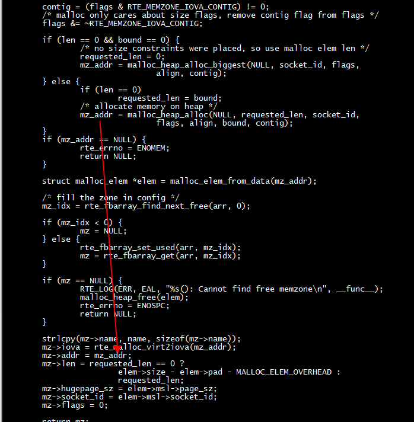
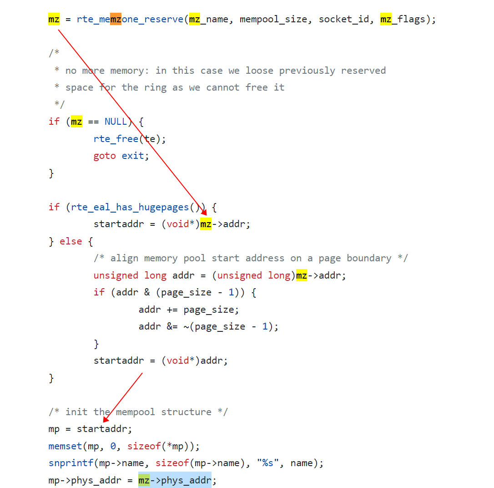
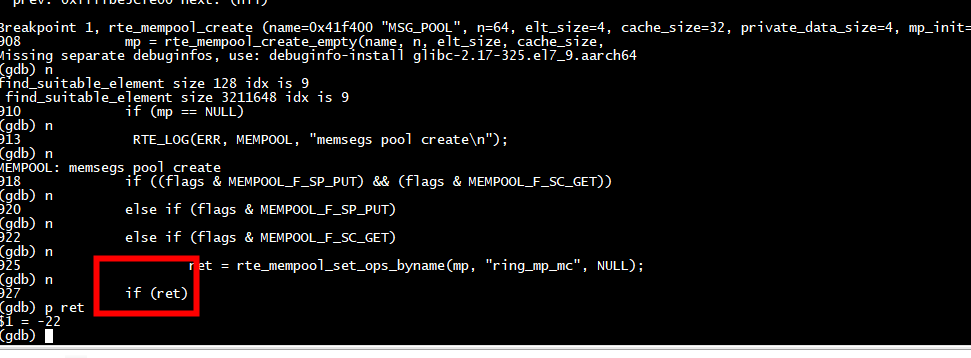
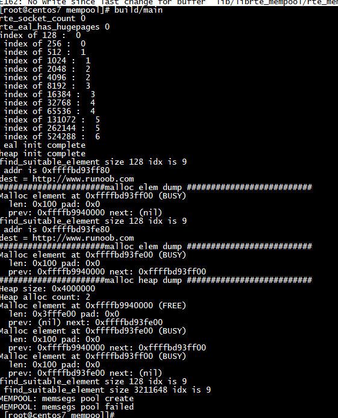

# headers

删除arm64-armv8a-include 中这些头文件： ***rte_memzone.h   rte_per_lcore.h rte_lcore.h rte_eal.h  rte_malloc.h rte_mempool.h***

```
file_paths=($(find ./lib -name '*.h' |  sed 's#.*/##'))
for file in ${file_paths[@]}
do
    echo ${file}
    #find ./arm64-armv8a-include -name ${file} | xargs rm -rf
    file2=($(find ./arm64-armv8a-include -name ${file} |  sed 's#.*/##'))
    if test -z "${file2}"  
    then  
         echo  "not find:"${file}
    else    
         echo  "find:"${file}
    fi   
done 
```

#   需要rte_mempool_tailq

```

EAL_REGISTER_TAILQ(rte_mempool_tailq)
```

# log

```

         RTE_LOG(ERR, MEMPOOL, "memsegs pool create\n");
```

# deps

***rte_memzone_reserve***

```
undefined reference to `rte_eal_tailq_register'
rte_mempool.o: In function `rte_mempool_memchunk_mz_free':
 undefined reference to `rte_memzone_free'
rte_mempool.o: In function `rte_mempool_free_memchunks':
 undefined reference to `rte_free'
rte_mempool.o: In function `rte_mempool_populate_iova':
 undefined reference to `rte_zmalloc'
 undefined reference to `rte_free'
rte_mempool.o: In function `rte_mempool_populate_default':
 undefined reference to `rte_memzone_reserve_aligned'
 undefined reference to `rte_memzone_reserve_aligned'
 undefined reference to `rte_memzone_free'
 undefined reference to `rte_memzone_free'
rte_mempool.o: In function `rte_mempool_free':
 undefined reference to `rte_free'
 undefined reference to `rte_memzone_free'
rte_mempool.o: In function `rte_mempool_cache_create':
 undefined reference to `rte_zmalloc_socket'
rte_mempool.o: In function `rte_mempool_cache_free':
 undefined reference to `rte_free'
rte_mempool.o: In function `rte_mempool_create_empty':
 undefined reference to `rte_zmalloc'
 undefined reference to `rte_memzone_reserve'
 undefined reference to `rte_free'
rte_mempool.o: In function `rte_mempool_get_page_size':
 undefined reference to `rte_malloc_heap_socket_is_external'
```

# zone addr

***调用malloc_heap_alloc分配堆内存***




***从zone addr上创建mempool***




# create mempool

由于没有注册ops，所以调用rte_mempool_set_ops_byname会失败

```
    if ((flags & MEMPOOL_F_SP_PUT) && (flags & MEMPOOL_F_SC_GET))
                ret = rte_mempool_set_ops_byname(mp, "ring_sp_sc", NULL);
        else if (flags & MEMPOOL_F_SP_PUT)
                ret = rte_mempool_set_ops_byname(mp, "ring_sp_mc", NULL);
        else if (flags & MEMPOOL_F_SC_GET)
                ret = rte_mempool_set_ops_byname(mp, "ring_mp_sc", NULL);
        else
                ret = rte_mempool_set_ops_byname(mp, "ring_mp_mc", NULL);

        if (ret)
                goto fail;
```




