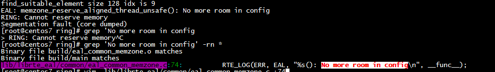
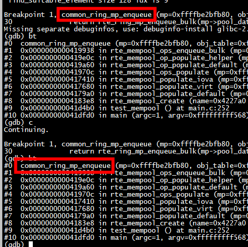
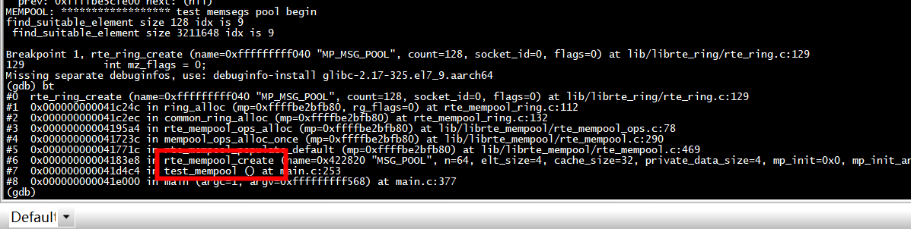
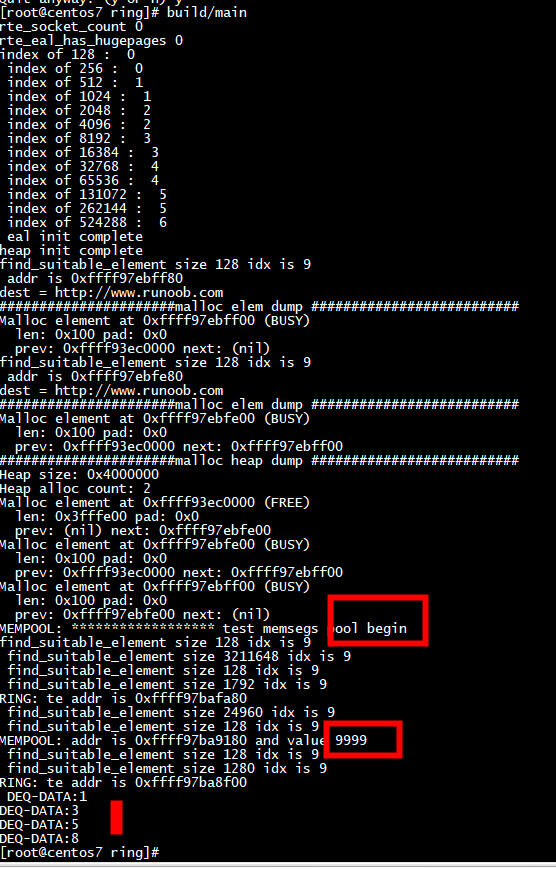

# headers

删除arm64-armv8a-include 中这些头文件： ***rte_memzone.h   rte_per_lcore.h rte_lcore.h rte_eal.h  rte_malloc.h  rte_mempool.h***
***rte_ring.h rte_tailq.h***
```
file_paths=($(find ./lib -name '*.h' |  sed 's#.*/##'))
for file in ${file_paths[@]}
do
    echo ${file}
    #find ./arm64-armv8a-include -name ${file} | xargs rm -rf
    file2=($(find ./arm64-armv8a-include -name ${file} |  sed 's#.*/##'))
    if test -z "${file2}"  
    then  
         echo  "not find:"${file}
    else    
         echo  "find:"${file}
    fi   
done 
```

#   需要rte_ring_tailq

```
 
EAL_REGISTER_TAILQ(rte_ring_tailq)
EAL_REGISTER_TAILQ(rte_mempool_tailq)
 
```

# log

 

 
```
 RTE_LOG(ERR, MEMPOOL, "addr is %p and value %d \n",p, *(int*)p);
```

# EAL: memzone_reserve_aligned_thread_unsafe(): No more room in config

 要调用 test_rte_eal_memzone_init();

# enqueue



# mempool create ring

 




# run




