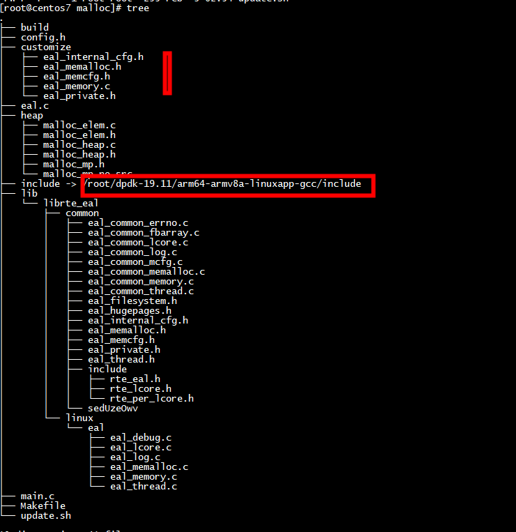
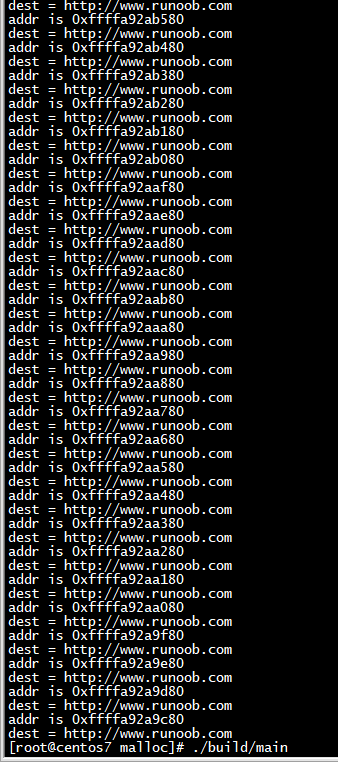
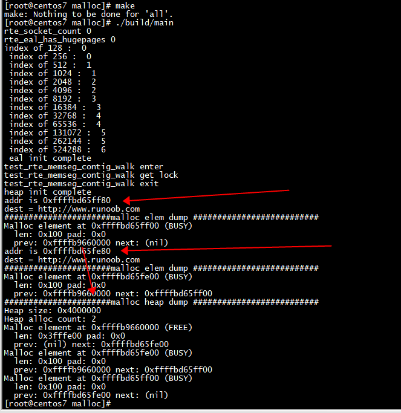

# code




## arch

```
#undef RTE_ARCH
#define RTE_ARCH "arm64"
#undef RTE_MACHINE
#define RTE_MACHINE "armv8a
```

# make

```
mkdir build
make
```

# run




# test

***malloc_elem_free_list_index(size)***: 获取size对应的index  
***malloc_elem_from_data*** : 将 test_rte_malloc_socket返回的地址转成struct malloc_elem   
```
int
main(int argc, char **argv)
{
        void * addr;
        struct rte_mem_config *mcfg;
        struct rte_memseg_list *msl;
        struct malloc_heap *heap;
        int msl_idx, heap_idx;
        int begin = 128;
        struct malloc_elem *elem;
        heap = &mcfg->malloc_heaps[heap_idx];
        const char src[50] = "http://www.runoob.com";
        int loop = 2;
        test_rte_eal_get_configuration()->process_type =  RTE_PROC_PRIMARY;
        internal_config.memory = MEMSIZE_IF_NO_HUGE_PAGE;
        internal_config.memory = MEMSIZE_IF_NO_HUGE_PAGE;
        internal_config.no_hugetlbfs = 1;
        internal_config.legacy_mem = 1;
        printf("rte_socket_count %d \n", rte_socket_count());
        printf("rte_eal_has_hugepages %d \n", rte_eal_has_hugepages());
        while(begin < 1024*1024)
        {
            printf("index of %d :  %d \n ", begin, malloc_elem_free_list_index(begin));
            begin *=2;
        }
        //printf("\n");
        //printf("index of 128 %d , index of 1024 %d \n", malloc_elem_free_list_index(128), malloc_elem_free_list_index(1024));
        //test_rte_eal_hugepage_init();
        test_eal_legacy_hugepage_init();
        printf("eal init complete \n");
        test_rte_eal_malloc_heap_init();
        printf("heap init complete \n");
        while(--loop >= 0)
        {
            addr = test_rte_malloc_socket("test", 128,8, 0);
            printf("addr is %p \n", addr);
            memcpy(addr, src, strlen(src)+1);
            printf("dest = %s\n", addr);
            //test_rte_free(addr);
            elem = malloc_elem_from_data(addr);
            //elem = (struct malloc_elem *) addr;
            printf("######################malloc elem dump ########################## \n");
            malloc_elem_dump(elem, stdout);
        }
        mcfg = test_rte_eal_get_configuration()->mem_config;
        msl = &mcfg->memsegs[0];
        heap_idx = test_malloc_socket_to_heap_id(msl->socket_id);
        if (heap_idx < 0) {
                RTE_LOG(ERR, EAL, "Memseg list has invalid socket id\n");
                return -1;
        }
        heap = &mcfg->malloc_heaps[heap_idx];
        printf("######################malloc heap dump ########################## \n");
        test_malloc_heap_dump(heap,stdout);

        test_eal_legacy_hugepage_destroy();
        return 0;
}
```

```
[root@centos7 malloc]# ./build/main 
rte_socket_count 0 
rte_eal_has_hugepages 0 
index of 128 :  0 
 index of 256 :  0 
 index of 512 :  1 
 index of 1024 :  1 
 index of 2048 :  2 
 index of 4096 :  2 
 index of 8192 :  3 
 index of 16384 :  3 
 index of 32768 :  4 
 index of 65536 :  4 
 index of 131072 :  5 
 index of 262144 :  5 
 index of 524288 :  6 
 eal init complete 
test_rte_memseg_contig_walk enter 
test_rte_memseg_contig_walk get lock
test_rte_memseg_contig_walk exit 
heap init complete 
addr is 0xffff8583ff80 
dest = http://www.runoob.com
######################malloc elem dump ########################## 
Malloc element at 0xffff8583ff00 (BUSY)
  len: 0x100 pad: 0x0
  prev: 0xffff81840000 next: (nil)
addr is 0xffff8583fe80 
dest = http://www.runoob.com
######################malloc elem dump ########################## 
Malloc element at 0xffff8583fe00 (BUSY)
  len: 0x100 pad: 0x0
  prev: 0xffff81840000 next: 0xffff8583ff00
######################malloc heap dump ########################## 
Heap size: 0x4000000
Heap alloc count: 2
Malloc element at 0xffff81840000 (FREE)
  len: 0x3fffe00 pad: 0x0
  prev: (nil) next: 0xffff8583fe00
Malloc element at 0xffff8583fe00 (BUSY)
  len: 0x100 pad: 0x0
  prev: 0xffff81840000 next: 0xffff8583ff00
Malloc element at 0xffff8583ff00 (BUSY)
  len: 0x100 pad: 0x0
  prev: 0xffff8583fe00 next: (nil)
```



# useless

```
rte_eal_hugepage_attach
```
