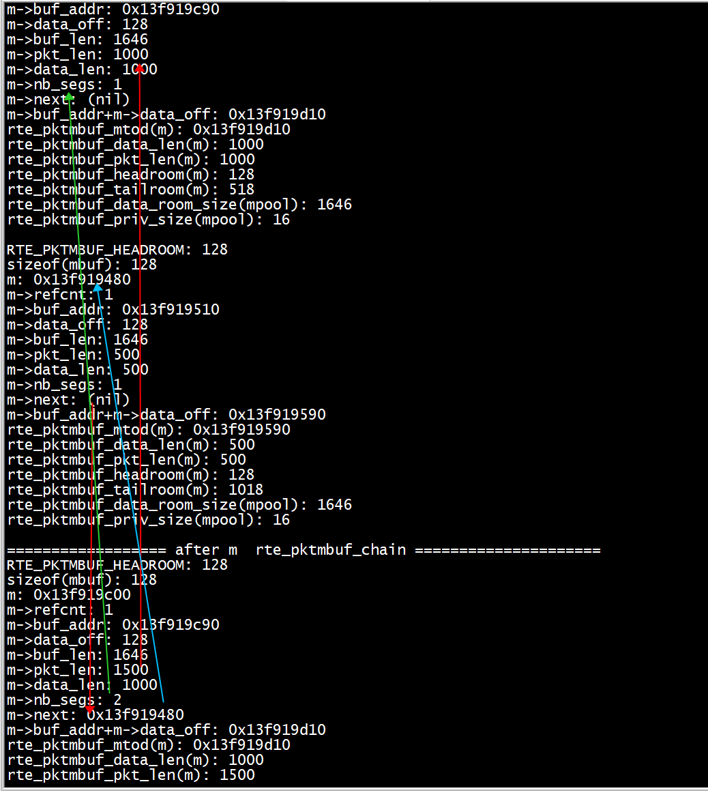
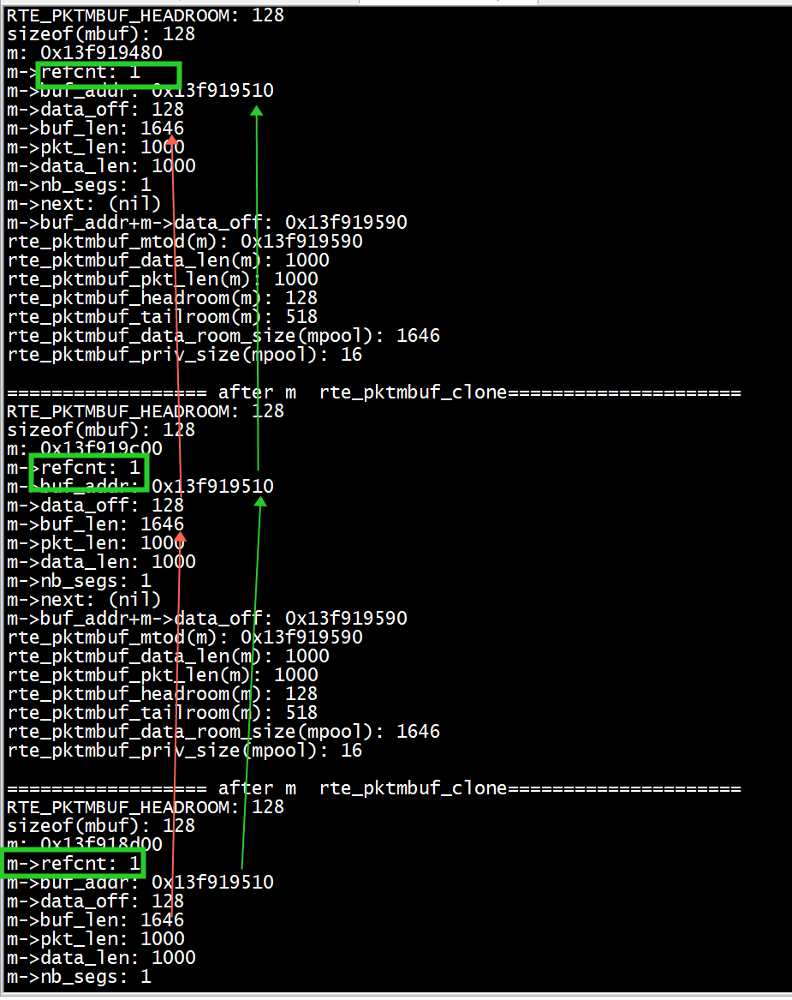

# rte_pktmbuf_chai
我们创建两个mbuf m和m2, m数据长度1000字节, m2 500字节. 创建后输出其元信息:   

m的输出:   
```C
mbuf_size: 1920
elt_size: 1792, header_size: 128, trailer_size: 0, total_size: 1920
RTE_PKTMBUF_HEADROOM: 128
sizeof(mbuf): 128
m: 0x13f919c00
m->refcnt: 1
m->buf_addr: 0x13f919c90
m->data_off: 128
m->buf_len: 1646
m->pkt_len: 1000
m->data_len: 1000
m->nb_segs: 1
m->next: (nil)
m->buf_addr+m->data_off: 0x13f919d10
rte_pktmbuf_mtod(m): 0x13f919d10
rte_pktmbuf_data_len(m): 1000
rte_pktmbuf_pkt_len(m): 1000
rte_pktmbuf_headroom(m): 128
rte_pktmbuf_tailroom(m): 518
rte_pktmbuf_data_room_size(mpool): 1646
rte_pktmbuf_priv_size(mpool): 16
```
m2的输出(省略部分内容, 下同):   
```C
RTE_PKTMBUF_HEADROOM: 128
sizeof(mbuf): 128
m: 0x13f919480
m->refcnt: 1
m->buf_addr: 0x13f919510
m->data_off: 128
m->buf_len: 1646
m->pkt_len: 500
m->data_len: 500
m->nb_segs: 1
m->next: (nil)
m->buf_addr+m->data_off: 0x13f919590
rte_pktmbuf_mtod(m): 0x13f919590
rte_pktmbuf_data_len(m): 500
rte_pktmbuf_pkt_len(m): 500
rte_pktmbuf_headroom(m): 128
rte_pktmbuf_tailroom(m): 1018
rte_pktmbuf_data_room_size(mpool): 1646
rte_pktmbuf_priv_size(mpool): 16
```
m与m2构成mbuf chain:   
```C
rte_pktmbuf_chain(m, m2);
mbuf_dump(m);
```
此时m成为mbuf chain首节点, 输出为:   
```C


================== after m  rte_pktmbuf_chain ===================== 
RTE_PKTMBUF_HEADROOM: 128
sizeof(mbuf): 128
m: 0x13f919c00
m->refcnt: 1
m->buf_addr: 0x13f919c90
m->data_off: 128
m->buf_len: 1646
m->pkt_len: 1500
m->data_len: 1000
m->nb_segs: 2
m->next: 0x13f919480
m->buf_addr+m->data_off: 0x13f919d10
rte_pktmbuf_mtod(m): 0x13f919d10
rte_pktmbuf_data_len(m): 1000
rte_pktmbuf_pkt_len(m): 1500
rte_pktmbuf_headroom(m): 128
rte_pktmbuf_tailroom(m): 518
rte_pktmbuf_data_room_size(mpool): 1646
rte_pktmbuf_priv_size(mpool): 16

```
+ 1) m->nb_segs 从1 变为2  
+ 2） m->next 从nil 变为0x13f919480   
+ 3） m->pkt_len 从1000变为1500    


通过 rte_pktmbuf_free 释放m即可释放整个mbuf chain（2个）:   
```
    printf("mempool count before free: %u\n", rte_mempool_avail_count(mpool));
    rte_pktmbuf_free(m);
    printf("mempool count after free: %u\n\n", rte_mempool_avail_count(mpool));
```
输出    
```

mempool count before free: 1021
mempool count after free: 1023
```

# Direct/Indirect mbuf

创建一个direct mbuf m, 再创建2个m的拷贝m2, m3:   
```
m = rte_pktmbuf_alloc(mpool);
rte_pktmbuf_append(m, 1000);
mbuf_dump(m);
m2 = rte_pktmbuf_clone(m, mpool);
mbuf_dump(m2);
m3 = rte_pktmbuf_clone(m, mpool);
mbuf_dump(m3);
```
输出如下, 可见这3个mbuf的首地址不同, 但涉及到数据的偏移和指针(如buf_addr, data_off等)都是一样的:   
+ m1  
```C
RTE_PKTMBUF_HEADROOM: 128
sizeof(mbuf): 128
m: 0x13f919480
m->refcnt: 1
m->buf_addr: 0x13f919510
m->data_off: 128
m->buf_len: 1646
m->pkt_len: 1000
m->data_len: 1000
m->nb_segs: 1
m->next: (nil)
m->buf_addr+m->data_off: 0x13f919590
rte_pktmbuf_mtod(m): 0x13f919590
rte_pktmbuf_data_len(m): 1000
rte_pktmbuf_pkt_len(m): 1000
rte_pktmbuf_headroom(m): 128
rte_pktmbuf_tailroom(m): 518
rte_pktmbuf_data_room_size(mpool): 1646
rte_pktmbuf_priv_size(mpool): 16
```
m->refcnt等于 1(clone之前)  
+ m2  
```C
================== after m  rte_pktmbuf_clone===================== 
RTE_PKTMBUF_HEADROOM: 128
sizeof(mbuf): 128
m: 0x13f919c00
m->refcnt: 1
m->buf_addr: 0x13f919510
m->data_off: 128
m->buf_len: 1646
m->pkt_len: 1000
m->data_len: 1000
m->nb_segs: 1
m->next: (nil)
m->buf_addr+m->data_off: 0x13f919590
rte_pktmbuf_mtod(m): 0x13f919590
rte_pktmbuf_data_len(m): 1000
rte_pktmbuf_pkt_len(m): 1000
rte_pktmbuf_headroom(m): 128
rte_pktmbuf_tailroom(m): 518
rte_pktmbuf_data_room_size(mpool): 1646
rte_pktmbuf_priv_size(mpool): 16
```
m->refcnt等于 1  
+ m3  
```C
================== after m  rte_pktmbuf_clone===================== 
RTE_PKTMBUF_HEADROOM: 128
sizeof(mbuf): 128
m: 0x13f918d00
m->refcnt: 1
m->buf_addr: 0x13f919510
m->data_off: 128
m->buf_len: 1646
m->pkt_len: 1000
m->data_len: 1000
m->nb_segs: 1
m->next: (nil)
m->buf_addr+m->data_off: 0x13f919590
rte_pktmbuf_mtod(m): 0x13f919590
rte_pktmbuf_data_len(m): 1000
rte_pktmbuf_pkt_len(m): 1000
rte_pktmbuf_headroom(m): 128
rte_pktmbuf_tailroom(m): 518
rte_pktmbuf_data_room_size(mpool): 1646
rte_pktmbuf_priv_size(mpool): 16
```
m->refcnt等于 1  


此时原始direct mbuf m的refcnt是3. 依次对m, m2, m3, m调用释放接口, 并检查m的引用计数和mbuf内存池节点数量:
```

    printf("mempool count before free: %u\n", rte_mempool_avail_count(mpool));
    printf("m->refcnt: %u\n", m->refcnt);
    rte_pktmbuf_free(m);
    printf("mempool count after free: %u\n", rte_mempool_avail_count(mpool));
    printf("m->refcnt: %u\n", m->refcnt);
    rte_pktmbuf_free(m3);
    printf("mempool count after free: %u\n", rte_mempool_avail_count(mpool));
    printf("m->refcnt: %u\n", m->refcnt);
    rte_pktmbuf_free(m2);
    printf("mempool count after free: %u\n", rte_mempool_avail_count(mpool));
    printf("m->refcnt: %u\n", m->refcnt);
    rte_pktmbuf_free(m);
    printf("mempool count after free: %u\n", rte_mempool_avail_count(mpool));
    printf("m->refcnt: %u\n", m->refcnt);
```

输出:   
```

mempool count before free: 1020
m->refcnt: 3
mempool count after free: 1020
m->refcnt: 2
mempool count after free: 1021
m->refcnt: 1
mempool count after free: 1023
m->refcnt: 1
mempool count after free: 1023
m->refcnt: 1
```

可以看到:  
● 第1次释放m, 由于还有m2,m3还在引用它, 所以并没有真正回收到内存池, 但引用计数-1 = 2   
● 释放m2, 它是indirect mbuf, 直接回收到内存池, 同时它引用的m的引用计数再-1 = 1    
● 释放m3, 它是indirect mbuf, 直接回收到内存池, 同时由于它 引用的m的引用计数已经是1, 表示无人占占用,    所以将m也回收到内存池. 此时所有mbuf都已经还回到内存池   
● 第2次释放m, 这里已经是double free的错误操作了, 任何内存池元素都不应该重复回收. 不过也应该注意所有mbuf的引用计数必定>=1   


```Shell
[root@centos7 mbuf]# pwd
/root/dpdk-19.11/examples/mbuf
[root@centos7 mbuf]# export RTE_SDK=/root/dpdk-19.11
[root@centos7 mbuf]# make
  CC main.o
  LD helloworld
  INSTALL-APP helloworld
  INSTALL-MAP helloworld.map
[root@centos7 mbuf]# ./build/app/helloworld 
EAL: Detected 128 lcore(s)
EAL: Detected 4 NUMA nodes
EAL: Multi-process socket /var/run/dpdk/rte/mp_socket
EAL: Selected IOVA mode 'VA'
EAL: No available hugepages reported in hugepages-2048kB
EAL: Probing VFIO support...
EAL: VFIO support initialized
EAL: PCI device 0000:05:00.0 on NUMA socket 0
EAL:   probe driver: 19e5:200 net_hinic
EAL:   using IOMMU type 1 (Type 1)
net_hinic: Initializing pf hinic-0000:05:00.0 in primary process
net_hinic: Device 0000:05:00.0 hwif attribute:
net_hinic: func_idx:0, p2p_idx:0, pciintf_idx:0, vf_in_pf:0, ppf_idx:0, global_vf_id:15, func_type:2
net_hinic: num_aeqs:4, num_ceqs:4, num_irqs:32, dma_attr:2
net_hinic: Get public resource capability:
net_hinic: host_id: 0x0, ep_id: 0x0, intr_type: 0x0, max_cos_id: 0x7, er_id: 0x0, port_id: 0x0
net_hinic: host_total_function: 0xf2, host_oq_id_mask_val: 0x8, max_vf: 0x78
net_hinic: pf_num: 0x2, pf_id_start: 0x0, vf_num: 0xf0, vf_id_start: 0x10
net_hinic: Get share resource capability:
net_hinic: host_pctxs: 0x0, host_cctxs: 0x0, host_scqs: 0x0, host_srqs: 0x0, host_mpts: 0x0
net_hinic: Get l2nic resource capability:
net_hinic: max_sqs: 0x10, max_rqs: 0x10, vf_max_sqs: 0x4, vf_max_rqs: 0x4
net_hinic: Initialize 0000:05:00.0 in primary successfully
EAL: PCI device 0000:06:00.0 on NUMA socket 0
EAL:   probe driver: 19e5:200 net_hinic
EAL: PCI device 0000:7d:00.0 on NUMA socket 0
EAL:   probe driver: 19e5:a222 net_hns3
EAL: PCI device 0000:7d:00.1 on NUMA socket 0
EAL:   probe driver: 19e5:a221 net_hns3
EAL: PCI device 0000:7d:00.2 on NUMA socket 0
EAL:   probe driver: 19e5:a222 net_hns3
EAL: PCI device 0000:7d:00.3 on NUMA socket 0
EAL:   probe driver: 19e5:a221 net_hns3
mbuf_size: 1920
elt_size: 1792, header_size: 128, trailer_size: 0, total_size: 1920
RTE_PKTMBUF_HEADROOM: 128
sizeof(mbuf): 128
m: 0x13f919c00
m->refcnt: 1
m->buf_addr: 0x13f919c90
m->data_off: 128
m->buf_len: 1646
m->pkt_len: 1000
m->data_len: 1000
m->nb_segs: 1
m->next: (nil)
m->buf_addr+m->data_off: 0x13f919d10
rte_pktmbuf_mtod(m): 0x13f919d10
rte_pktmbuf_data_len(m): 1000
rte_pktmbuf_pkt_len(m): 1000
rte_pktmbuf_headroom(m): 128
rte_pktmbuf_tailroom(m): 518
rte_pktmbuf_data_room_size(mpool): 1646
rte_pktmbuf_priv_size(mpool): 16

RTE_PKTMBUF_HEADROOM: 128
sizeof(mbuf): 128
m: 0x13f919480
m->refcnt: 1
m->buf_addr: 0x13f919510
m->data_off: 128
m->buf_len: 1646
m->pkt_len: 500
m->data_len: 500
m->nb_segs: 1
m->next: (nil)
m->buf_addr+m->data_off: 0x13f919590
rte_pktmbuf_mtod(m): 0x13f919590
rte_pktmbuf_data_len(m): 500
rte_pktmbuf_pkt_len(m): 500
rte_pktmbuf_headroom(m): 128
rte_pktmbuf_tailroom(m): 1018
rte_pktmbuf_data_room_size(mpool): 1646
rte_pktmbuf_priv_size(mpool): 16

================== after m  rte_pktmbuf_chain ===================== 
RTE_PKTMBUF_HEADROOM: 128
sizeof(mbuf): 128
m: 0x13f919c00
m->refcnt: 1
m->buf_addr: 0x13f919c90
m->data_off: 128
m->buf_len: 1646
m->pkt_len: 1500
m->data_len: 1000
m->nb_segs: 2
m->next: 0x13f919480
m->buf_addr+m->data_off: 0x13f919d10
rte_pktmbuf_mtod(m): 0x13f919d10
rte_pktmbuf_data_len(m): 1000
rte_pktmbuf_pkt_len(m): 1500
rte_pktmbuf_headroom(m): 128
rte_pktmbuf_tailroom(m): 518
rte_pktmbuf_data_room_size(mpool): 1646
rte_pktmbuf_priv_size(mpool): 16

mempool count before free: 1021
mempool count after free: 1023

RTE_PKTMBUF_HEADROOM: 128
sizeof(mbuf): 128
m: 0x13f919480
m->refcnt: 1
m->buf_addr: 0x13f919510
m->data_off: 128
m->buf_len: 1646
m->pkt_len: 1000
m->data_len: 1000
m->nb_segs: 1
m->next: (nil)
m->buf_addr+m->data_off: 0x13f919590
rte_pktmbuf_mtod(m): 0x13f919590
rte_pktmbuf_data_len(m): 1000
rte_pktmbuf_pkt_len(m): 1000
rte_pktmbuf_headroom(m): 128
rte_pktmbuf_tailroom(m): 518
rte_pktmbuf_data_room_size(mpool): 1646
rte_pktmbuf_priv_size(mpool): 16

================== after m  rte_pktmbuf_clone===================== 
RTE_PKTMBUF_HEADROOM: 128
sizeof(mbuf): 128
m: 0x13f919c00
m->refcnt: 1
m->buf_addr: 0x13f919510
m->data_off: 128
m->buf_len: 1646
m->pkt_len: 1000
m->data_len: 1000
m->nb_segs: 1
m->next: (nil)
m->buf_addr+m->data_off: 0x13f919590
rte_pktmbuf_mtod(m): 0x13f919590
rte_pktmbuf_data_len(m): 1000
rte_pktmbuf_pkt_len(m): 1000
rte_pktmbuf_headroom(m): 128
rte_pktmbuf_tailroom(m): 518
rte_pktmbuf_data_room_size(mpool): 1646
rte_pktmbuf_priv_size(mpool): 16

================== after m  rte_pktmbuf_clone===================== 
RTE_PKTMBUF_HEADROOM: 128
sizeof(mbuf): 128
m: 0x13f918d00
m->refcnt: 1
m->buf_addr: 0x13f919510
m->data_off: 128
m->buf_len: 1646
m->pkt_len: 1000
m->data_len: 1000
m->nb_segs: 1
m->next: (nil)
m->buf_addr+m->data_off: 0x13f919590
rte_pktmbuf_mtod(m): 0x13f919590
rte_pktmbuf_data_len(m): 1000
rte_pktmbuf_pkt_len(m): 1000
rte_pktmbuf_headroom(m): 128
rte_pktmbuf_tailroom(m): 518
rte_pktmbuf_data_room_size(mpool): 1646
rte_pktmbuf_priv_size(mpool): 16

mempool count before free: 1020
m->refcnt: 3
mempool count after free: 1020
m->refcnt: 2
mempool count after free: 1021
m->refcnt: 1
mempool count after free: 1023
m->refcnt: 1
mempool count after free: 1023
m->refcnt: 1
```