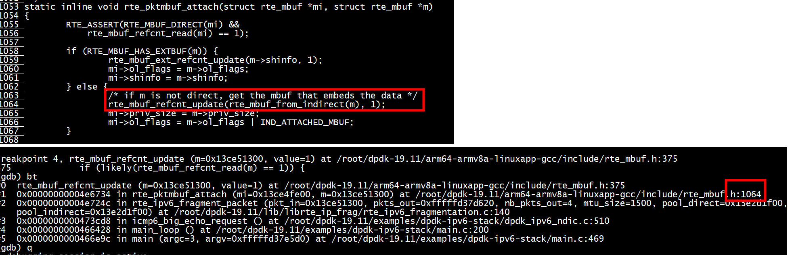

# m->buf_addr  怎么设置
m->buf_addr = (char *)m + mbuf_size;
```
void
rte_pktmbuf_init(struct rte_mempool *mp,
                 __attribute__((unused)) void *opaque_arg,
                 void *_m,
                 __attribute__((unused)) unsigned i)
{
        struct rte_mbuf *m = _m;
        uint32_t mbuf_size, buf_len, priv_size;

        priv_size = rte_pktmbuf_priv_size(mp);
        mbuf_size = sizeof(struct rte_mbuf) + priv_size;
        buf_len = rte_pktmbuf_data_room_size(mp);

        RTE_ASSERT(RTE_ALIGN(priv_size, RTE_MBUF_PRIV_ALIGN) == priv_size);
        RTE_ASSERT(mp->elt_size >= mbuf_size);
        RTE_ASSERT(buf_len <= UINT16_MAX);

        memset(m, 0, mbuf_size);
        /* start of buffer is after mbuf structure and priv data */
        m->priv_size = priv_size;
        m->buf_addr = (char *)m + mbuf_size;
        m->buf_iova = rte_mempool_virt2iova(m) + mbuf_size;
        m->buf_len = (uint16_t)buf_len;

        /* keep some headroom between start of buffer and data */
        m->data_off = RTE_MIN(RTE_PKTMBUF_HEADROOM, (uint16_t)m->buf_len);

        /* init some constant fields */
        m->pool = mp;
        m->nb_segs = 1;
        m->port = MBUF_INVALID_PORT;
        rte_mbuf_refcnt_set(m, 1);
        m->next = NULL;
}
```

# rte_pktmbuf_adj 和rte_pktmbuf_prepend是相反的操作
```
/* Remove the Ethernet header and trailer from the input packet */
	rte_pktmbuf_adj(m, (uint16_t)sizeof(struct ether_hdr));
    len2 = rte_ipv6_fragment_packet(m,
				&qconf->tx_mbufs[port_out].m_table[len],
				(uint16_t)(MBUF_TABLE_SIZE - len),
				IPV6_MTU_DEFAULT,
				rxq->direct_pool, rxq->indirect_pool);
	struct ether_hdr *eth_hdr = (struct ether_hdr *)
			rte_pktmbuf_prepend(m, (uint16_t)sizeof(struct ether_hdr));
```

#  rte_pktmbuf_append 没有改变data off
```
static inline char *rte_pktmbuf_append(struct rte_mbuf *m, uint16_t len)
{
        void *tail;
        struct rte_mbuf *m_last;

        __rte_mbuf_sanity_check(m, 1);

        m_last = rte_pktmbuf_lastseg(m);
        if (unlikely(len > rte_pktmbuf_tailroom(m_last)))
                return NULL;

        tail = (char *)m_last->buf_addr + m_last->data_off + m_last->data_len;
        m_last->data_len = (uint16_t)(m_last->data_len + len);
        m->pkt_len  = (m->pkt_len + len);
        return (char*) tail;
}
```
#  rte_pktmbuf_prepend 向前移动data off
```
static inline char *rte_pktmbuf_prepend(struct rte_mbuf *m,
                                        uint16_t len)
{
        __rte_mbuf_sanity_check(m, 1);

        if (unlikely(len > rte_pktmbuf_headroom(m)))
                return NULL;

        /* NB: elaborating the subtraction like this instead of using
         *     -= allows us to ensure the result type is uint16_t
         *     avoiding compiler warnings on gcc 8.1 at least */
        m->data_off = (uint16_t)(m->data_off - len);
        m->data_len = (uint16_t)(m->data_len + len);
        m->pkt_len  = (m->pkt_len + len);

        return (char *)m->buf_addr + m->data_off;
}
```

# rte_pktmbuf_adj 改变data off
参考examples/ip_fragmentation/main.c   
```
/* Remove the Ethernet header and trailer from the input packet */
	rte_pktmbuf_adj(m, (uint16_t)sizeof(struct ether_hdr));
	/* if this is an IPv4 packet */
	if (RTE_ETH_IS_IPV4_HDR(m->packet_type)) {
		struct ipv4_hdr *ip_hdr;
		uint32_t ip_dst;
		/* Read the lookup key (i.e. ip_dst) from the input packet */
		ip_hdr = rte_pktmbuf_mtod(m, struct ipv4_hdr *);
		ip_dst = rte_be_to_cpu_32(ip_hdr->dst_addr);
```

```
static inline char *rte_pktmbuf_adj(struct rte_mbuf *m, uint16_t len)
{
        __rte_mbuf_sanity_check(m, 1);

        if (unlikely(len > m->data_len))
                return NULL;

        /* NB: elaborating the addition like this instead of using
         *     += allows us to ensure the result type is uint16_t
         *     avoiding compiler warnings on gcc 8.1 at least */
        m->data_len = (uint16_t)(m->data_len - len);
        m->data_off = (uint16_t)(m->data_off + len);
        m->pkt_len  = (m->pkt_len - len);
        return (char *)m->buf_addr + m->data_off;
}
```

#  rte_pktmbuf_attach 更改buf_addr 、data_off
+ attached mbuf(m): rte_mbuf_refcnt_update(rte_mbuf_from_indirect(m), 1)    
+ mi:  mi->ol_flags = m->ol_flags | IND_ATTACHED_MBUF   
```
static inline void rte_pktmbuf_attach(struct rte_mbuf *mi, struct rte_mbuf *m)
{
        RTE_ASSERT(RTE_MBUF_DIRECT(mi) &&
            rte_mbuf_refcnt_read(mi) == 1);

        if (RTE_MBUF_HAS_EXTBUF(m)) {
                rte_mbuf_ext_refcnt_update(m->shinfo, 1);
                mi->ol_flags = m->ol_flags;
                mi->shinfo = m->shinfo;
        } else {
                /* if m is not direct, get the mbuf that embeds the data */
                rte_mbuf_refcnt_update(rte_mbuf_from_indirect(m), 1);
                mi->priv_size = m->priv_size;
                mi->ol_flags = m->ol_flags | IND_ATTACHED_MBUF;
        }

        __rte_pktmbuf_copy_hdr(mi, m);

        mi->data_off = m->data_off;
        mi->data_len = m->data_len;
        mi->buf_iova = m->buf_iova;
        mi->buf_addr = m->buf_addr;
        mi->buf_len = m->buf_len;

        mi->next = NULL;
        mi->pkt_len = mi->data_len;
        mi->nb_segs = 1;

        __rte_mbuf_sanity_check(mi, 1);
        __rte_mbuf_sanity_check(m, 0);
}
/* internal */
static inline void
__rte_pktmbuf_copy_hdr(struct rte_mbuf *mdst, const struct rte_mbuf *msrc)
{
        mdst->port = msrc->port;
        mdst->vlan_tci = msrc->vlan_tci;
        mdst->vlan_tci_outer = msrc->vlan_tci_outer;
        mdst->tx_offload = msrc->tx_offload;
        mdst->hash = msrc->hash;
        mdst->packet_type = msrc->packet_type;
        mdst->timestamp = msrc->timestamp;
        rte_mbuf_dynfield_copy(mdst, msrc);
}
```


```
(gdb) bt
#0  rte_mbuf_refcnt_update (m=0x13ce51300, value=1) at /root/dpdk-19.11/arm64-armv8a-linuxapp-gcc/include/rte_mbuf.h:375
#1  0x00000000004e6734 in rte_pktmbuf_attach (mi=0x13ce4fe00, m=0x13ce51300) at /root/dpdk-19.11/arm64-armv8a-linuxapp-gcc/include/rte_mbuf.h:1064
#2  0x00000000004e724c in rte_ipv6_fragment_packet (pkt_in=0x13ce51300, pkts_out=0xfffffd37d620, nb_pkts_out=4, mtu_size=1500, pool_direct=0x13e2d1f00, 
    pool_indirect=0x13e2d1f00) at /root/dpdk-19.11/lib/librte_ip_frag/rte_ipv6_fragmentation.c:140
#3  0x0000000000473cd8 in icmp6_big_echo_request () at /root/dpdk-19.11/examples/dpdk-ipv6-stack/dpdk_ipv6_ndic.c:510
#4  0x0000000000466428 in main_loop () at /root/dpdk-19.11/examples/dpdk-ipv6-stack/main.c:200
#5  0x0000000000466e9c in main (argc=3, argv=0xfffffd37e5d0) at /root/dpdk-19.11/examples/dpdk-ipv6-stack/main.c:469
```

## attached mbuf free

```
#define RTE_MBUF_DIRECT(mb) \
        (!((mb)->ol_flags & (IND_ATTACHED_MBUF | EXT_ATTACHED_MBUF)))
static __rte_always_inline void
rte_mbuf_raw_free(struct rte_mbuf *m)
{
        RTE_ASSERT(RTE_MBUF_DIRECT(m));
        RTE_ASSERT(rte_mbuf_refcnt_read(m) == 1);
        RTE_ASSERT(m->next == NULL);
        RTE_ASSERT(m->nb_segs == 1);
        __rte_mbuf_sanity_check(m, 0);
        rte_mempool_put(m->pool, m);
}
```

### rte_pktmbuf_prefree_seg


```
int
main(int argc, char **argv)
{
        int ret;
        unsigned lcore_id;
        struct rte_mbuf *mbuf1 = NULL;
        struct rte_mbuf *mbuf2 = NULL;
        ret = rte_eal_init(argc, argv);
        if (ret < 0)
                rte_panic("Cannot init EAL\n");
#if 0
        /* call lcore_hello() on every slave lcore */
        RTE_LCORE_FOREACH_SLAVE(lcore_id) {
                rte_eal_remote_launch(lcore_hello, NULL, lcore_id);
        }
#endif
        pool1 = rte_pktmbuf_pool_create("mbuf_pool1", 1024,
                                                    MEMPOOL_CACHE_SIZE, 0, RTE_MBUF_DEFAULT_BUF_SIZE,
                                                    rte_socket_id());
        if (pool1 == NULL)
            rte_exit(EXIT_FAILURE, "Cannot init mbuf pool1\n");
        mbuf1 = rte_pktmbuf_alloc(pool1);
        mbuf2 = rte_pktmbuf_alloc(pool1);
        printf("mbuf1 %p , mbuf2 %p,indirect of mbuf1 %p, indirect of mbuf2 %p \n",mbuf1,mbuf2,rte_mbuf_from_indirect(mbuf1), rte_mbuf_from_indirect(mbuf2));
        rte_pktmbuf_attach(mbuf2, mbuf1);
        printf("after detach ,mbuf1 %p , mbuf2 %p,indirect of mbuf1 %p, indirect of mbuf2 %p \n",mbuf1,mbuf2,rte_mbuf_from_indirect(mbuf1), rte_mbuf_from_indirect(mbuf2));
        printf("mbuf1 direct %d, refcnt %d \n", RTE_MBUF_DIRECT(mbuf1), rte_mbuf_refcnt_read(mbuf1));
        printf("mbuf2 direct %d, refcnt %d \n", RTE_MBUF_DIRECT(mbuf2), rte_mbuf_refcnt_read(mbuf2));
        printf("begin to free mbuf \n");
        rte_pktmbuf_free(mbuf1);
		rte_pktmbuf_free(mbuf2);
        rte_eal_mp_wait_lcore();
        getchar();
        return 0;
}
```
```
mbuf1 0x13f896180 , mbuf2 0x13f895700,indirect of mbuf1 0x13f896180, indirect of mbuf2 0x13f895700 
after detach ,mbuf1 0x13f896180 , mbuf2 0x13f895700,indirect of mbuf1 0x13f896180, indirect of mbuf2 0x13f896180 
mbuf1 direct 1, refcnt 2 
mbuf2 direct 0, refcnt 1 
begin to free mbuf 
```
+ rte_mbuf_from_indirect(mbuf1)和mbuf1指向同一个地址    
+ 执行detach后，rte_mbuf_from_indirect(mbuf2)发生改变，和rte_mbuf_from_indirect(mbuf1)、mbuf1指向同一个地址     
+ RTE_MBUF_DIRECT(mbuf1)是true,RTE_MBUF_DIRECT(mbuf2)是false   
+ rte_pktmbuf_free(mbuf2) --> rte_pktmbuf_prefree_seg --> rte_pktmbuf_detach --> _rte_pktmbuf_free_direct   


```
static __rte_always_inline struct rte_mbuf *
rte_pktmbuf_prefree_seg(struct rte_mbuf *m)
{
        __rte_mbuf_sanity_check(m, 0);

        if (likely(rte_mbuf_refcnt_read(m) == 1)) {

                if (!RTE_MBUF_DIRECT(m))
                        rte_pktmbuf_detach(m);

                if (m->next != NULL) {
                        m->next = NULL;
                        m->nb_segs = 1;
                }

                return m;

        } else if (__rte_mbuf_refcnt_update(m, -1) == 0) {

                if (!RTE_MBUF_DIRECT(m))
                        rte_pktmbuf_detach(m);

                if (m->next != NULL) {
                        m->next = NULL;
                        m->nb_segs = 1;
                }
                rte_mbuf_refcnt_set(m, 1);

                return m;
        }
        return NULL;
}
```


```
 */
static inline void rte_pktmbuf_detach(struct rte_mbuf *m)
{
        struct rte_mempool *mp = m->pool;
        uint32_t mbuf_size, buf_len;
        uint16_t priv_size;

        if (RTE_MBUF_HAS_EXTBUF(m))
                __rte_pktmbuf_free_extbuf(m);
        else 
                __rte_pktmbuf_free_direct(m);

        priv_size = rte_pktmbuf_priv_size(mp);
        mbuf_size = (uint32_t)(sizeof(struct rte_mbuf) + priv_size);
        buf_len = rte_pktmbuf_data_room_size(mp);

        m->priv_size = priv_size;
        m->buf_addr = (char *)m + mbuf_size;
        m->buf_iova = rte_mempool_virt2iova(m) + mbuf_size;
        m->buf_len = (uint16_t)buf_len;
        rte_pktmbuf_reset_headroom(m);
        m->data_len = 0; 
        m->ol_flags = 0; 
}
```
+ 恢复 m->buf_addr = (char *)m + mbuf_size;   
+ rte_pktmbuf_reset_headroom 恢复  m->data_off  
+ __rte_pktmbuf_free_direct 释放detached mbuf