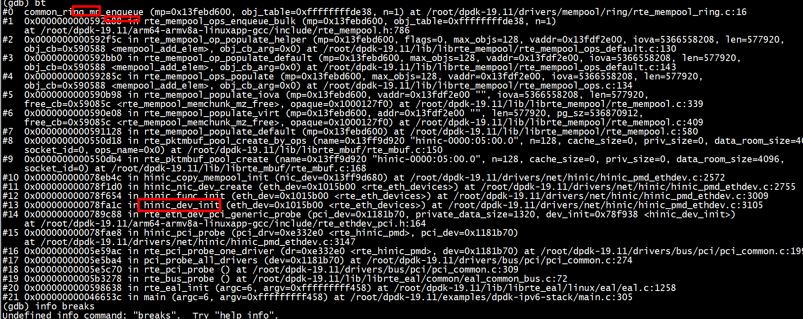
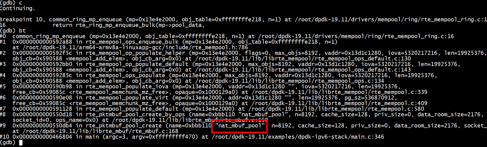
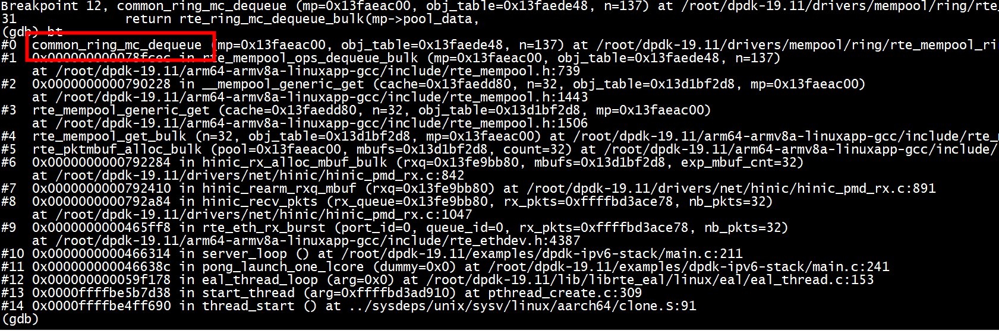

#   rte_mempool_register_ops
 
+ ops_mp_mc
```
Breakpoint 1, rte_mempool_register_ops (h=0xbd9a00 <ops_mp_mc>) at /root/dpdk-19.11/lib/librte_mempool/rte_mempool_ops.c:27
27              rte_spinlock_lock(&rte_mempool_ops_table.sl);
(gdb) bt
#0  rte_mempool_register_ops (h=0xbd9a00 <ops_mp_mc>) at /root/dpdk-19.11/lib/librte_mempool/rte_mempool_ops.c:27
#1  0x000000000059517c in mp_hdlr_init_ops_mp_mc () at /root/dpdk-19.11/drivers/mempool/ring/rte_mempool_ring.c:133
#2  0x0000000000bbac34 in __libc_csu_init ()
#3  0x0000ffffbe4416c8 in __libc_start_main (main=0x466508 <main>, argc=6, argv=0xfffffffff458, init=<optimized out>, fini=<optimized out>, 
    rtld_fini=<optimized out>, stack_end=<optimized out>) at libc-start.c:225
#4  0x0000000000465e3c in _start ()
(gdb) c
Continuing.
```

+ ops_sp_sc
```
Breakpoint 1, rte_mempool_register_ops (h=0xbd9a80 <ops_sp_sc>) at /root/dpdk-19.11/lib/librte_mempool/rte_mempool_ops.c:27
27              rte_spinlock_lock(&rte_mempool_ops_table.sl);
(gdb) bt
#0  rte_mempool_register_ops (h=0xbd9a80 <ops_sp_sc>) at /root/dpdk-19.11/lib/librte_mempool/rte_mempool_ops.c:27
#1  0x0000000000595198 in mp_hdlr_init_ops_sp_sc () at /root/dpdk-19.11/drivers/mempool/ring/rte_mempool_ring.c:134
#2  0x0000000000bbac34 in __libc_csu_init ()
#3  0x0000ffffbe4416c8 in __libc_start_main (main=0x466508 <main>, argc=6, argv=0xfffffffff458, init=<optimized out>, fini=<optimized out>, 
    rtld_fini=<optimized out>, stack_end=<optimized out>) at libc-start.c:225
#4  0x0000000000465e3c in _start ()
(gdb) c
Continuing.
```
+  ops_mp_sc
```
Breakpoint 1, rte_mempool_register_ops (h=0xbd9b00 <ops_mp_sc>) at /root/dpdk-19.11/lib/librte_mempool/rte_mempool_ops.c:27
27              rte_spinlock_lock(&rte_mempool_ops_table.sl);
(gdb) bt
#0  rte_mempool_register_ops (h=0xbd9b00 <ops_mp_sc>) at /root/dpdk-19.11/lib/librte_mempool/rte_mempool_ops.c:27
#1  0x00000000005951b4 in mp_hdlr_init_ops_mp_sc () at /root/dpdk-19.11/drivers/mempool/ring/rte_mempool_ring.c:135
#2  0x0000000000bbac34 in __libc_csu_init ()
#3  0x0000ffffbe4416c8 in __libc_start_main (main=0x466508 <main>, argc=6, argv=0xfffffffff458, init=<optimized out>, fini=<optimized out>, 
    rtld_fini=<optimized out>, stack_end=<optimized out>) at libc-start.c:225
#4  0x0000000000465e
```


+ ops_sp_mc
```
Breakpoint 1, rte_mempool_register_ops (h=0xbd9b80 <ops_sp_mc>) at /root/dpdk-19.11/lib/librte_mempool/rte_mempool_ops.c:27
27              rte_spinlock_lock(&rte_mempool_ops_table.sl);
(gdb) bt
#0  rte_mempool_register_ops (h=0xbd9b80 <ops_sp_mc>) at /root/dpdk-19.11/lib/librte_mempool/rte_mempool_ops.c:27
#1  0x00000000005951d0 in mp_hdlr_init_ops_sp_mc () at /root/dpdk-19.11/drivers/mempool/ring/rte_mempool_ring.c:136
#2  0x0000000000bbac34 in __libc_csu_init ()
#3  0x0000ffffbe4416c8 in __libc_start_main (main=0x466508 <main>, argc=6, argv=0xfffffffff458, init=<optimized out>, fini=<optimized out>, 
    rtld_fini=<optimized out>, stack_end=<optimized out>) at libc-start.c:225
#4  0x0000000000465e3c in _start ()
(gdb) c
Continuing.
```

+  ops_bucket
```
Breakpoint 1, rte_mempool_register_ops (h=0xbee080 <ops_bucket>) at /root/dpdk-19.11/lib/librte_mempool/rte_mempool_ops.c:27
27              rte_spinlock_lock(&rte_mempool_ops_table.sl);
(gdb) bt
#0  rte_mempool_register_ops (h=0xbee080 <ops_bucket>) at /root/dpdk-19.11/lib/librte_mempool/rte_mempool_ops.c:27
#1  0x000000000060c1f0 in mp_hdlr_init_ops_bucket () at /root/dpdk-19.11/drivers/mempool/bucket/rte_mempool_bucket.c:634
#2  0x0000000000bbac34 in __libc_csu_init ()
#3  0x0000ffffbe4416c8 in __libc_start_main (main=0x466508 <main>, argc=6, argv=0xfffffffff458, init=<optimized out>, fini=<optimized out>, 
    rtld_fini=<optimized out>, stack_end=<optimized out>) at libc-start.c:225
#4  0x0000000000465e3c in _start ()
(gdb) c
Continuing.
```

+  ops_stack
```
Breakpoint 1, rte_mempool_register_ops (h=0xe2e880 <ops_stack>) at /root/dpdk-19.11/lib/librte_mempool/rte_mempool_ops.c:27
27              rte_spinlock_lock(&rte_mempool_ops_table.sl);
(gdb) bt
#0  rte_mempool_register_ops (h=0xe2e880 <ops_stack>) at /root/dpdk-19.11/lib/librte_mempool/rte_mempool_ops.c:27
#1  0x000000000060cd78 in mp_hdlr_init_ops_stack () at /root/dpdk-19.11/drivers/mempool/stack/rte_mempool_stack.c:96
#2  0x0000000000bbac34 in __libc_csu_init ()
#3  0x0000ffffbe4416c8 in __libc_start_main (main=0x466508 <main>, argc=6, argv=0xfffffffff458, init=<optimized out>, fini=<optimized out>, 
    rtld_fini=<optimized out>, stack_end=<optimized out>) at libc-start.c:225
#4  0x0000000000465e3c in _start ()
(gdb) c
Continuing.
```
+  ops_lf_stack

```
Breakpoint 1, rte_mempool_register_ops (h=0xe2e900 <ops_lf_stack>) at /root/dpdk-19.11/lib/librte_mempool/rte_mempool_ops.c:27
27              rte_spinlock_lock(&rte_mempool_ops_table.sl);
(gdb) bt
#0  rte_mempool_register_ops (h=0xe2e900 <ops_lf_stack>) at /root/dpdk-19.11/lib/librte_mempool/rte_mempool_ops.c:27
#1  0x000000000060cd94 in mp_hdlr_init_ops_lf_stack () at /root/dpdk-19.11/drivers/mempool/stack/rte_mempool_stack.c:97
#2  0x0000000000bbac34 in __libc_csu_init ()
#3  0x0000ffffbe4416c8 in __libc_start_main (main=0x466508 <main>, argc=6, argv=0xfffffffff458, init=<optimized out>, fini=<optimized out>, 
    rtld_fini=<optimized out>, stack_end=<optimized out>) at libc-start.c:225
#4  0x0000000000465e3c in _start ()
(gdb) c
Continuing.
```
+  dpaa_mpool_ops

```
Breakpoint 1, rte_mempool_register_ops (h=0xbee580 <dpaa_mpool_ops>) at /root/dpdk-19.11/lib/librte_mempool/rte_mempool_ops.c:27
27              rte_spinlock_lock(&rte_mempool_ops_table.sl);
(gdb) bt
#0  rte_mempool_register_ops (h=0xbee580 <dpaa_mpool_ops>) at /root/dpdk-19.11/lib/librte_mempool/rte_mempool_ops.c:27
#1  0x000000000060df70 in mp_hdlr_init_dpaa_mpool_ops () at /root/dpdk-19.11/drivers/mempool/dpaa/dpaa_mempool.c:358
#2  0x0000000000bbac34 in __libc_csu_init ()
#3  0x0000ffffbe4416c8 in __libc_start_main (main=0x466508 <main>, argc=6, argv=0xfffffffff458, init=<optimized out>, fini=<optimized out>, 
    rtld_fini=<optimized out>, stack_end=<optimized out>) at libc-start.c:225
#4  0x0000000000465e3c in _start ()
(gdb) c
Continuing.
````

+  dpaa2_mpool_ops
```
Breakpoint 1, rte_mempool_register_ops (h=0xbeec00 <dpaa2_mpool_ops>) at /root/dpdk-19.11/lib/librte_mempool/rte_mempool_ops.c:27
27              rte_spinlock_lock(&rte_mempool_ops_table.sl);
(gdb) bt
#0  rte_mempool_register_ops (h=0xbeec00 <dpaa2_mpool_ops>) at /root/dpdk-19.11/lib/librte_mempool/rte_mempool_ops.c:27
#1  0x000000000060ef98 in mp_hdlr_init_dpaa2_mpool_ops () at /root/dpdk-19.11/drivers/mempool/dpaa2/dpaa2_hw_mempool.c:449
#2  0x0000000000bbac34 in __libc_csu_init ()
#3  0x0000ffffbe4416c8 in __libc_start_main (main=0x466508 <main>, argc=6, argv=0xfffffffff458, init=<optimized out>, fini=<optimized out>, 
    rtld_fini=<optimized out>, stack_end=<optimized out>) at libc-start.c:225
#4  0x0000000000465e3c in _start ()
(gdb) c
Continuing.
```

```
static const struct rte_mempool_ops ops_mp_mc = {
        .name = "ring_mp_mc",
        .alloc = common_ring_alloc,
        .free = common_ring_free,
        .enqueue = common_ring_mp_enqueue,
        .dequeue = common_ring_mc_dequeue,
        .get_count = common_ring_get_count,
};

static const struct rte_mempool_ops ops_sp_sc = {
        .name = "ring_sp_sc",
        .alloc = common_ring_alloc,
        .free = common_ring_free,
        .enqueue = common_ring_sp_enqueue,
        .dequeue = common_ring_sc_dequeue,
        .get_count = common_ring_get_count,
};

static const struct rte_mempool_ops ops_mp_sc = {
        .name = "ring_mp_sc",
        .alloc = common_ring_alloc,
        .free = common_ring_free,
        .enqueue = common_ring_mp_enqueue,
        .dequeue = common_ring_sc_dequeue,
        .get_count = common_ring_get_count,
};

static const struct rte_mempool_ops ops_sp_mc = {
        .name = "ring_sp_mc",
        .alloc = common_ring_alloc,
        .free = common_ring_free,
        .enqueue = common_ring_sp_enqueue,
        .dequeue = common_ring_mc_dequeue,
        .get_count = common_ring_get_count,
};

MEMPOOL_REGISTER_OPS(ops_mp_mc);
MEMPOOL_REGISTER_OPS(ops_sp_sc);
MEMPOOL_REGISTER_OPS(ops_mp_sc);
MEMPOOL_REGISTER_OPS(ops_sp_mc);
```

## 驱动mempool 和 mbuf mempool默认使用 MP MC



# 同一个mbuf多次free

```
int
main(int argc, char **argv)
{
        int ret;
        unsigned lcore_id;
        struct rte_mbuf *mbuf1 = NULL;
        struct rte_mbuf *mbuf2 = NULL;
        ret = rte_eal_init(argc, argv);
        if (ret < 0)
                rte_panic("Cannot init EAL\n");
#if 0
        /* call lcore_hello() on every slave lcore */
        RTE_LCORE_FOREACH_SLAVE(lcore_id) {
                rte_eal_remote_launch(lcore_hello, NULL, lcore_id);
        }
#endif
        pool1 = rte_pktmbuf_pool_create("mbuf_pool1", 1024,
                                                    MEMPOOL_CACHE_SIZE, 0, RTE_MBUF_DEFAULT_BUF_SIZE,
                                                    rte_socket_id());
        if (pool1 == NULL)
            rte_exit(EXIT_FAILURE, "Cannot init mbuf pool1\n");
        mbuf1 = rte_pktmbuf_alloc(pool1);
        printf("mbuf1 %p \n",mbuf1);
        rte_pktmbuf_free(mbuf1);
        rte_pktmbuf_free(mbuf1);
        mbuf1 = rte_pktmbuf_alloc(pool1);
        mbuf2 = rte_pktmbuf_alloc(pool1);
        printf("mbuf1 %p , mbuf2 %p \n",mbuf1,mbuf2);
#if 1
        pool2 = rte_pktmbuf_pool_create("mbuf_pool2", 1024, 0, 0, RTE_MBUF_DEFAULT_BUF_SIZE,
                                                    rte_socket_id());
        if (pool2 == NULL)
            rte_exit(EXIT_FAILURE, "Cannot init mbuf pool2\n");
        printf("------------------- test mem pool2--------------- \n");
        mbuf1 = rte_pktmbuf_alloc(pool2);
        printf("mbuf1 %p \n",mbuf1);
        rte_pktmbuf_free(mbuf1);
        rte_pktmbuf_free(mbuf1);
        mbuf1 = rte_pktmbuf_alloc(pool2);
        mbuf2 = rte_pktmbuf_alloc(pool2);
        printf("mbuf1 %p , mbuf2 %p \n",mbuf1,mbuf2);
#endif
        rte_eal_mp_wait_lcore();
        getchar();
        return 0;
}
```


```
EAL:   probe driver: 19e5:a221 net_hns3
mbuf1 0x13f8d6280 
mbuf1 0x13f8d6280 , mbuf2 0x13f8d6280 
------------------- test mem pool2--------------- 
mbuf1 0x13f629880 
mbuf1 0x13f62a200 , mbuf2 0x13f62ab80
```

```
        mbuf1 = rte_pktmbuf_alloc(pool1);
        printf("mbuf1 %p \n",mbuf1);
        rte_pktmbuf_free(mbuf1);
        rte_pktmbuf_free(mbuf1);
        mbuf1 = rte_pktmbuf_alloc(pool1);
        mbuf2 = rte_pktmbuf_alloc(pool1);
        printf("mbuf1 %p , mbuf2 %p \n",mbuf1,mbuf2);
```
对于mbuf1进行了两次rte_pktmbuf_free，然后执行两次rte_pktmbuf_alloc。因为使用了cache机制，rte_pktmbuf_free的先存入cache,
所以执行两次rte_pktmbuf_alloc得到的mbuf的地址一样。


# cache
每个core都有一个mp->local_cache[lcore_id]   
```
1257 static __rte_always_inline struct rte_mempool_cache *
1258 rte_mempool_default_cache(struct rte_mempool *mp, unsigned lcore_id)
1259 {
1260         if (mp->cache_size == 0)
1261                 return NULL;
1262 
1263         if (lcore_id >= RTE_MAX_LCORE)
1264                 return NULL;
1265 
1266         return &mp->local_cache[lcore_id];
1267 }
```
