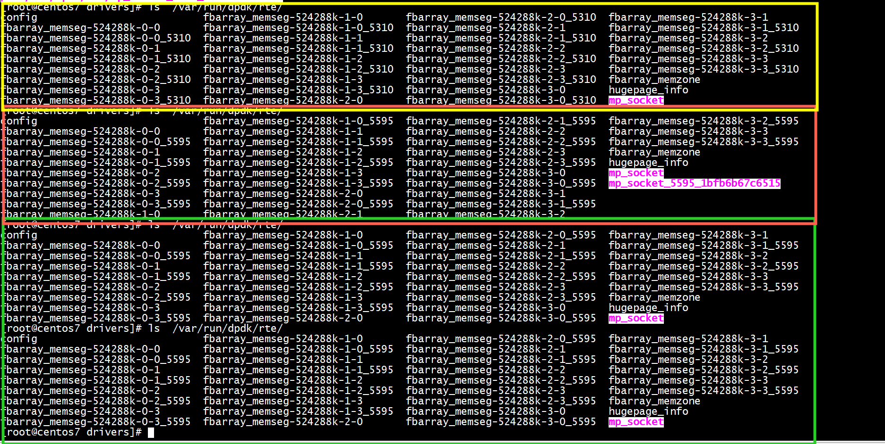

# /var/run/dpdk/rte/

+ 1 黄色部分是启动primary:  ./build/dperf -c test/http/server-cps.conf   
+ 2 红色部分是启动secondary:  ./dpdk-pdump  -l 1 --  --pdump 'port=0,queue=*,rx-dev=/tmp/capture.pcap'   
+ 3 绿色部分是关闭primary: