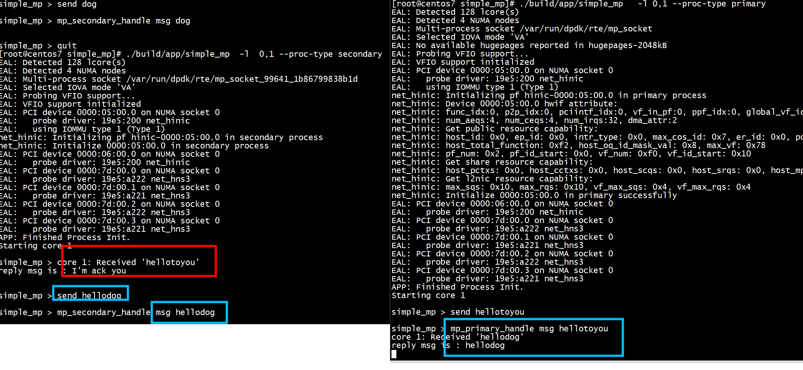

# 程序
+ primary进程***rte_mp_action_register(HNS3_MP_NAME, mp_primary_handle)***   
+ secondary进程***rte_mp_action_register(HNS3_MP_NAME, mp_secondary_handle)***   
+ 发送消息lcore_recv --> send_msg    
```
   if (rte_eal_process_type() == RTE_PROC_PRIMARY){
                send_ring = rte_ring_create(_PRI_2_SEC, ring_size, rte_socket_id(), flags);
                recv_ring = rte_ring_create(_SEC_2_PRI, ring_size, rte_socket_id(), flags);
                message_pool = rte_mempool_create(_MSG_POOL, pool_size,
                                STR_TOKEN_SIZE, pool_cache, priv_data_sz,
                                NULL, NULL, NULL, NULL,
                                rte_socket_id(), flags);
                ret = rte_mp_action_register(HNS3_MP_NAME, mp_primary_handle);
        } else {
                recv_ring = rte_ring_lookup(_PRI_2_SEC);
                send_ring = rte_ring_lookup(_SEC_2_PRI);
                message_pool = rte_mempool_lookup(_MSG_POOL);
                ret = rte_mp_action_register(HNS3_MP_NAME, mp_secondary_handle);
        }
```


```
static inline void mp_init_msg(struct rte_mp_msg *msg, const char * text)
{
     strncpy(msg->name, HNS3_MP_NAME, sizeof(msg->name));
     char *param = msg->param;
     msg->len_param = strlen(text);
     strncpy(param, text, RTE_MP_MAX_PARAM_LEN);
     msg->num_fds = 0;
}
static int send_msg(const char * text)
{
     int ret = 0, i;
     struct timespec ts;
     struct rte_mp_msg mp_req;
     struct rte_mp_msg *mp_res;
     struct rte_mp_reply mp_rep;
     ts.tv_sec = HNS3_MP_REQ_TIMEOUT_SEC;
     ts.tv_nsec = 0;
     mp_init_msg(&mp_req, text);
     ret = rte_mp_request_sync(&mp_req, &mp_rep, &ts);
     if (ret) {
         goto exit;
     }
     for (i = 0; i < mp_rep.nb_received; i++) {
                mp_res = &mp_rep.msgs[i];
                printf("reply msg is : %s \n", mp_res->param);
     }
exit:
    free(mp_rep.msgs);
}
static int reply_msg(const char * text, const void *peer)
{
     int ret = 0;
     struct timespec ts;
     struct rte_mp_msg mp_res;
     struct rte_mp_reply mp_rep;
     ts.tv_sec = HNS3_MP_REQ_TIMEOUT_SEC;
     ts.tv_nsec = 0;
     mp_init_msg(&mp_res, text);
     ret = rte_mp_reply(&mp_res, peer);
     return 0;
}
```

```
#define RTE_MP_MAX_FD_NUM       8    /* The max amount of fds */
#define RTE_MP_MAX_NAME_LEN     64   /* The max length of action name */
#define RTE_MP_MAX_PARAM_LEN    256  /* The max length of param */
struct rte_mp_msg {
        char name[RTE_MP_MAX_NAME_LEN];
        int len_param;
        int num_fds;
        uint8_t param[RTE_MP_MAX_PARAM_LEN];
        int fds[RTE_MP_MAX_FD_NUM];
};
```
# run

