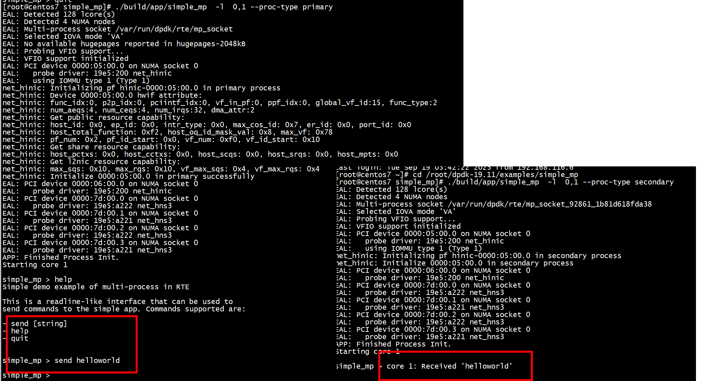

# make
```
[root@centos7 simple_mp]#  export RTE_SDK=/root/dpdk-19.11
[root@centos7 simple_mp]# ls
main.c  Makefile  meson.build  mp_commands.c  mp_commands.h
[root@centos7 simple_mp]# make
  CC main.o
  CC mp_commands.o
  LD simple_mp
  INSTALL-APP simple_mp
  INSTALL-MAP simple_mp.map
```

# run
先启动primary进程，-l参数指定使用的逻辑核为core0和core1，–proc-type参数可以省略，默认第一个进程是primary进程，也可以指定值auto，表示自动检测进程的类型。  
```
./simple_mp -l 0,1 --proc-type primary
```
secondary进程需要在primary进程之后启动，–proc-type参数必须指定（因为不指定该参数，将默认为primary进程，程序将初始化失败，因为已经存在了primary进程），值可以为secondary或auto：   
```
./simple_mp -l 0,1 --proc-type secondary
```



