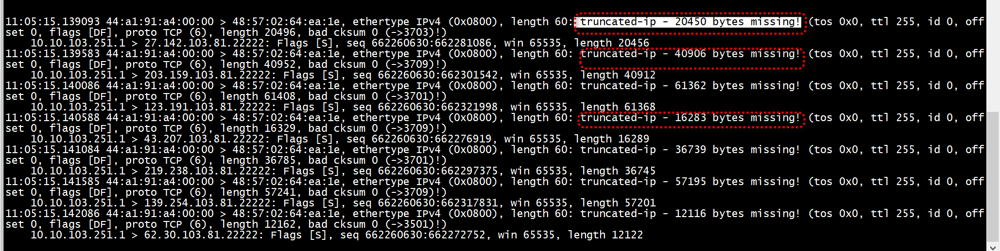

# dperf 网卡checksum 配置
`PKT_RX_IP_CKSUM_BAD`   
```C
    if (dev_info.tx_offload_capa & RTE_ETH_TX_OFFLOAD_IPV4_CKSUM) {
        g_port_conf.txmode.offloads |= RTE_ETH_TX_OFFLOAD_IPV4_CKSUM;
        g_dev_tx_offload_ipv4_cksum = 1;
    } else {
        g_dev_tx_offload_ipv4_cksum = 0;
    }

    if ((dev_info.tx_offload_capa & RTE_ETH_TX_OFFLOAD_TCP_CKSUM) &&
        (dev_info.tx_offload_capa & RTE_ETH_TX_OFFLOAD_UDP_CKSUM)) {
        g_dev_tx_offload_tcpudp_cksum = 1;
        g_port_conf.txmode.offloads |= RTE_ETH_TX_OFFLOAD_TCP_CKSUM | RTE_ETH_TX_OFFLOAD_UDP_CKSUM;
    } else {
        g_dev_tx_offload_tcpudp_cksum = 0;
    }
```

## 设置 m->ol_flags

```C
static inline void work_space_tx_send_tcp(struct work_space *ws, struct rte_mbuf *mbuf)
{       
    uint64_t ol_flags = RTE_MBUF_F_TX_TCP_CKSUM;
            
    if (ws->vxlan) {
        ol_flags = RTE_MBUF_F_TX_UDP_CKSUM;
    }   
    
    csum_offload_ip_tcpudp(mbuf, ol_flags);
    net_stats_tcp_tx();
    work_space_tx_send(ws, mbuf);
} 
```


```C
/*
 * Get the name of a TX offload flag. Must be kept synchronized with flag
 * definitions in rte_mbuf.h.
 */
const char *rte_get_tx_ol_flag_name(uint64_t mask)
{
	switch (mask) {
	case PKT_TX_VLAN_PKT: return "PKT_TX_VLAN_PKT";
	case PKT_TX_IP_CKSUM: return "PKT_TX_IP_CKSUM";
	case PKT_TX_TCP_CKSUM: return "PKT_TX_TCP_CKSUM";
	case PKT_TX_SCTP_CKSUM: return "PKT_TX_SCTP_CKSUM";
	case PKT_TX_UDP_CKSUM: return "PKT_TX_UDP_CKSUM";
	case PKT_TX_IEEE1588_TMST: return "PKT_TX_IEEE1588_TMST";
	case PKT_TX_TCP_SEG: return "PKT_TX_TCP_SEG";
	case PKT_TX_IPV4: return "PKT_TX_IPV4";
	case PKT_TX_IPV6: return "PKT_TX_IPV6";
	case PKT_TX_OUTER_IP_CKSUM: return "PKT_TX_OUTER_IP_CKSUM";
	case PKT_TX_OUTER_IPV4: return "PKT_TX_OUTER_IPV4";
	case PKT_TX_OUTER_IPV6: return "PKT_TX_OUTER_IPV6";
	case PKT_TX_TUNNEL_VXLAN: return "PKT_TX_TUNNEL_VXLAN";
	case PKT_TX_TUNNEL_GRE: return "PKT_TX_TUNNEL_GRE";
	case PKT_TX_TUNNEL_IPIP: return "PKT_TX_TUNNEL_IPIP";
	case PKT_TX_TUNNEL_GENEVE: return "PKT_TX_TUNNEL_GENEVE";
	default: return NULL;
	}
}
```

```C
const char *rte_get_rx_ol_flag_name(uint64_t mask)
{
	switch (mask) {
	case PKT_RX_VLAN_PKT: return "PKT_RX_VLAN_PKT";
	case PKT_RX_RSS_HASH: return "PKT_RX_RSS_HASH";
	case PKT_RX_FDIR: return "PKT_RX_FDIR";
	case PKT_RX_L4_CKSUM_BAD: return "PKT_RX_L4_CKSUM_BAD";
	case PKT_RX_L4_CKSUM_GOOD: return "PKT_RX_L4_CKSUM_GOOD";
	case PKT_RX_L4_CKSUM_NONE: return "PKT_RX_L4_CKSUM_NONE";
	case PKT_RX_IP_CKSUM_BAD: return "PKT_RX_IP_CKSUM_BAD";
	case PKT_RX_IP_CKSUM_GOOD: return "PKT_RX_IP_CKSUM_GOOD";
	case PKT_RX_IP_CKSUM_NONE: return "PKT_RX_IP_CKSUM_NONE";
	case PKT_RX_EIP_CKSUM_BAD: return "PKT_RX_EIP_CKSUM_BAD";
	case PKT_RX_VLAN_STRIPPED: return "PKT_RX_VLAN_STRIPPED";
	case PKT_RX_IEEE1588_PTP: return "PKT_RX_IEEE1588_PTP";
	case PKT_RX_IEEE1588_TMST: return "PKT_RX_IEEE1588_TMST";
	case PKT_RX_QINQ_STRIPPED: return "PKT_RX_QINQ_STRIPPED";
	case PKT_RX_LRO: return "PKT_RX_LRO";
	default: return NULL;
	}
}
```

+ PKT_RX_LRO
```
/**
 * When packets are coalesced by a hardware or virtual driver, this flag
 * can be set in the RX mbuf, meaning that the m->tso_segsz field is
 * valid and is set to the segment size of original packets.
 */
#define PKT_RX_LRO           (1ULL << 16)
```

#   truncated-ip - 20450 bytes missing!

```C
static uint16_t tcp_header_length(const rte_tcp_hdr* tcp)
{
    return ((tcp->data_off & 0xf0) >> 2);
}
```

 
 + 这是因为硬件计算checksum之前没有设置pkt->l4_len，pkt->l3_len ，pkt->l2_len。导致硬件计算checksum填错位置了,更改了ip头len信息       

 ```C
        pkt->l4_len = sizeof(struct rte_tcp_hdr);
        pkt->l3_len = sizeof(struct rte_ipv4_hdr);
        pkt->l2_len = RTE_ETHER_HDR_LEN;
 ```
 + 或者mbuf->data_len 或mbuf->pkt_len设置不正确    
 ```C
 pkt->data_len = pkt->l2_len + pkt->l3_len + tcp_total;
 pkt->pkt_len = pkt->data_len;
 ```

# tcp Data Offset
Padding （填充）：填充位。因为 Data Offset 只能表示 TCP 头部的长度 必须是 4 字节的整倍数。如果 Options 选项不足 4字节的整倍数，就需要 Padding 填充为 4 字节的整倍数。


```C
void *
pktgen_tcp_hdr_ctor(pkt_seq_t *pkt, void *hdr, int type)
{
    uint16_t tlen;

    if (type == RTE_ETHER_TYPE_IPV4) {
        struct rte_ipv4_hdr *ipv4 = (struct rte_ipv4_hdr *)hdr;
        struct rte_tcp_hdr *tcp   = (struct rte_tcp_hdr *)&ipv4[1];

        /* Create the TCP header */
        ipv4->src_addr = htonl(pkt->ip_src_addr.addr.ipv4.s_addr);
        ipv4->dst_addr = htonl(pkt->ip_dst_addr.addr.ipv4.s_addr);

        ipv4->version_ihl   = (IPv4_VERSION << 4) | (sizeof(struct rte_ipv4_hdr) / 4);
        tlen                = pkt->pktSize - pkt->ether_hdr_size;
        ipv4->total_length  = htons(tlen);
        ipv4->next_proto_id = pkt->ipProto;

        tcp->src_port = htons(pkt->sport);
        tcp->dst_port = htons(pkt->dport);
        tcp->sent_seq = htonl(pkt->tcp_seq);
        tcp->recv_ack = htonl(pkt->tcp_ack);
        tcp->data_off =
            ((sizeof(struct rte_tcp_hdr) / sizeof(uint32_t)) << 4); /* Offset in words */
        tcp->tcp_flags = pkt->tcp_flags;
        tcp->rx_win    = htons(DEFAULT_WND_SIZE);
        tcp->tcp_urp   = 0;

        tcp->cksum = 0;
        tcp->cksum = rte_ipv4_udptcp_cksum(ipv4, (const void *)tcp);
    } else {
        struct rte_ipv6_hdr *ipv6 = (struct rte_ipv6_hdr *)hdr;
        struct rte_tcp_hdr *tcp   = (struct rte_tcp_hdr *)&ipv6[1];

        /* Create the pseudo header and TCP information */
        memset(ipv6->dst_addr, 0, sizeof(struct in6_addr));
        memset(ipv6->src_addr, 0, sizeof(struct in6_addr));
        rte_memcpy(ipv6->dst_addr, &pkt->ip_dst_addr.addr.ipv6.s6_addr, sizeof(struct in6_addr));
        rte_memcpy(ipv6->src_addr, &pkt->ip_src_addr.addr.ipv6.s6_addr, sizeof(struct in6_addr));

        tlen              = pkt->pktSize - (pkt->ether_hdr_size + sizeof(struct rte_ipv6_hdr));
        ipv6->payload_len = htons(tlen);
        ipv6->proto       = pkt->ipProto;

        tcp->src_port = htons(pkt->sport);
        tcp->dst_port = htons(pkt->dport);
        tcp->sent_seq = htonl(pkt->tcp_seq);
        tcp->recv_ack = htonl(pkt->tcp_ack);
        tcp->data_off =
            ((sizeof(struct rte_tcp_hdr) / sizeof(uint32_t)) << 4); /* Offset in words */
        tcp->tcp_flags = pkt->tcp_flags;
        tcp->rx_win    = htons(DEFAULT_WND_SIZE);
        tcp->tcp_urp   = 0;

        tcp->cksum = 0;
        tcp->cksum = rte_ipv6_udptcp_cksum(ipv6, (const void *)tcp);
    }

    /* In this case we return the original value to allow IP ctor to work */
    return hdr;
}
```

#  PKT_TX_TCP_SEG

```

static inline void
hinic_fill_tx_offload_info(struct rte_mbuf *mbuf,
                struct hinic_sq_task *task, u32 *queue_info,
                struct hinic_tx_offload_info *tx_off_info)
{
        u16 vlan_tag;
        uint64_t ol_flags = mbuf->ol_flags;

        /* clear DW0~2 of task section for offload */
        task->pkt_info0 = 0;
        task->pkt_info1 = 0;
        task->pkt_info2 = 0;

        /* Base VLAN */
        if (unlikely(ol_flags & PKT_TX_VLAN_PKT)) {
                vlan_tag = mbuf->vlan_tci;
                hinic_set_vlan_tx_offload(task, queue_info, vlan_tag,
                                          vlan_tag >> VLAN_PRIO_SHIFT);
        }

        /* non checksum or tso */
        if (unlikely(!(ol_flags & HINIC_TX_CKSUM_OFFLOAD_MASK)))
                return;

        if ((ol_flags & PKT_TX_TCP_SEG))
                /* set tso info for task and qsf */
                hinic_set_tso_info(task, queue_info, mbuf, tx_off_info);
        else /* just support l4 checksum offload */
                hinic_set_l4_csum_info(task, queue_info, tx_off_info);
}
```

#  m->l4_len

`m->l4_len = sizeof(struct rte_udp_hdr);`   
m->l4_len不包括payload的长度

```C
        pkt->l4_len = tcp_hdr_len;
        //pkt->l4_len = tcp_total;
        pkt->l3_len = sizeof(struct rte_ipv4_hdr);
        pkt->l2_len = RTE_ETHER_HDR_LEN;
#if DBUG_TCP_GSO
        if(tcp_payload_size >  RTE_ETHER_MTU)
        {
            pkt->ol_flags |= PKT_TX_TCP_SEG;
            pkt->tso_segsz = 1024;
        }
#endi
```

```
        if (l4_hdr && hdr->gso_type != VIRTIO_NET_HDR_GSO_NONE) {
                switch (hdr->gso_type & ~VIRTIO_NET_HDR_GSO_ECN) {
                case VIRTIO_NET_HDR_GSO_TCPV4:
                case VIRTIO_NET_HDR_GSO_TCPV6:
                        tcp_hdr = l4_hdr;
                        m->ol_flags |= PKT_TX_TCP_SEG;
                        m->tso_segsz = hdr->gso_size;
                        m->l4_len = (tcp_hdr->data_off & 0xf0) >> 2;
                        break;
                case VIRTIO_NET_HDR_GSO_UDP:
                        m->ol_flags |= PKT_TX_UDP_SEG;
                        m->tso_segsz = hdr->gso_size;
                        m->l4_len = sizeof(struct rte_udp_hdr);
                        break;
                default:
                        RTE_LOG(WARNING, VHOST_DATA,
                                "unsupported gso type %u.\n", hdr->gso_type);
                        break;
                }
        }
}
      if (m_buf->ol_flags & PKT_TX_TCP_SEG) {
                if (m_buf->ol_flags & PKT_TX_IPV4)
                        net_hdr->gso_type = VIRTIO_NET_HDR_GSO_TCPV4;
                else
                        net_hdr->gso_type = VIRTIO_NET_HDR_GSO_TCPV6;
                net_hdr->gso_size = m_buf->tso_segsz;
                net_hdr->hdr_len = m_buf->l2_len + m_buf->l3_len
                                        + m_buf->l4_len;
        } else if (m_buf->ol_flags & PKT_TX_UDP_SEG) {
                net_hdr->gso_type = VIRTIO_NET_HDR_GSO_UDP;
                net_hdr->gso_size = m_buf->tso_segsz;
                net_hdr->hdr_len = m_buf->l2_len + m_buf->l3_len +
                        m_buf->l4_len;
        } else {
                ASSIGN_UNLESS_EQUAL(net_hdr->gso_type, 0);
                ASSIGN_UNLESS_EQUAL(net_hdr->gso_size, 0);
                ASSIGN_UNLESS_EQUAL(net_hdr->hdr_len, 0);
        }
```

# gro

```
gro_size = hns3_get_field(bd_base_info, HNS3_RXD_GRO_SIZE_M,
					  HNS3_RXD_GRO_SIZE_S);
		if (gro_size != 0) {
			first_seg->ol_flags |= PKT_RX_LRO;
			first_seg->tso_segsz = gro_size;
		}

		l234_info = rte_le_to_cpu_32(rxd.rx.l234_info);
		ol_info = rte_le_to_cpu_32(rxd.rx.ol_info);
		ret = hns3_handle_bdinfo(rxq, first_seg, bd_base_info,
					 l234_info);
		if (unlikely(ret))
			goto pkt_err;

```