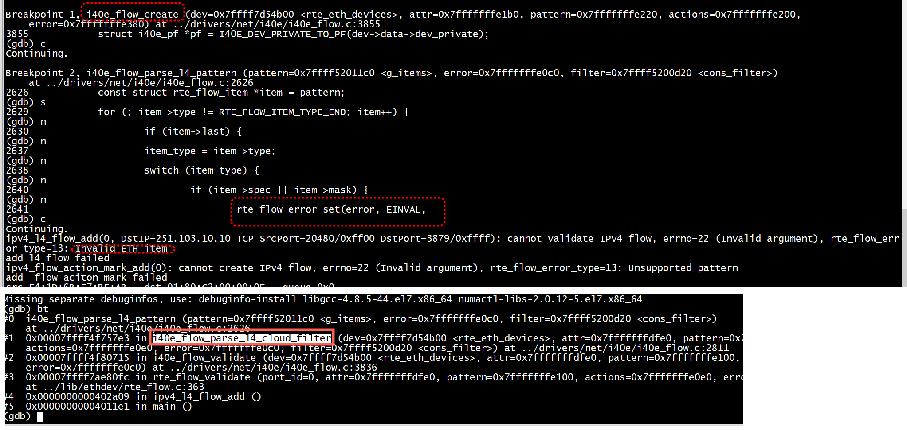
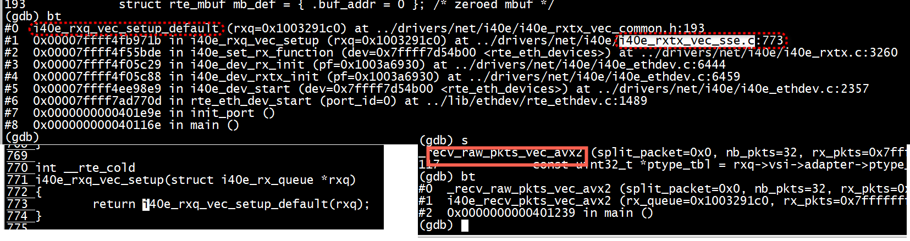

# 大小端


```
static inline int
i40e_check_fdir_programming_status(struct i40e_rx_queue *rxq)
{
        volatile union i40e_rx_desc *rxdp;
        uint64_t qword1;
        uint32_t rx_status;
        uint32_t len, id;
        uint32_t error;
        int ret = 0;

        rxdp = &rxq->rx_ring[rxq->rx_tail];
        qword1 = rte_le_to_cpu_64(rxdp->wb.qword1.status_error_len);
}
```

#  Invalid ETH item


`i40e_flow_parse_l4_pattern`   


```
/* Pattern matched ethertype filter */
static enum rte_flow_item_type pattern_ethertype[] = {
        RTE_FLOW_ITEM_TYPE_ETH,
        RTE_FLOW_ITEM_TYPE_END,
};

/* Pattern matched flow director filter */
static enum rte_flow_item_type pattern_fdir_ipv4[] = {
        RTE_FLOW_ITEM_TYPE_ETH,
        RTE_FLOW_ITEM_TYPE_IPV4,
        RTE_FLOW_ITEM_TYPE_END,
};

static enum rte_flow_item_type pattern_fdir_ipv4_udp[] = {
        RTE_FLOW_ITEM_TYPE_ETH,
        RTE_FLOW_ITEM_TYPE_IPV4,
        RTE_FLOW_ITEM_TYPE_UDP,
        RTE_FLOW_ITEM_TYPE_END,
};

static enum rte_flow_item_type pattern_fdir_ipv4_tcp[] = {
        RTE_FLOW_ITEM_TYPE_ETH,
        RTE_FLOW_ITEM_TYPE_IPV4,
        RTE_FLOW_ITEM_TYPE_TCP,
        RTE_FLOW_ITEM_TYPE_END,
};

```

#  VECTOR
+ i40e_rxq_vec_setup    
+ i40e_recv_pkts_vec_avx2/_recv_raw_pkts_vec_avx2   
+ 多架构支持
```
elif arch_subdir == 'ppc'
       sources += files('i40e_rxtx_vec_altivec.c')
elif arch_subdir == 'arm'
       sources += files('i40e_rxtx_vec_neon.c')
endif
```
+ Vector mode enable
```
i40e_rx_vec_dev_conf_condition_check_default
/**
         * Vector mode is allowed only when number of Rx queue
         * descriptor is power of 2.
         */
```

```
#ifndef RTE_LIBRTE_I40E_INC_VECTOR
/* Stubs needed for linkage when CONFIG_RTE_LIBRTE_I40E_INC_VECTOR is set to 'n' */
int
i40e_rx_vec_dev_conf_condition_check(struct rte_eth_dev __rte_unused *dev)
{
        return -1;
}

uint16_t
i40e_recv_pkts_vec(
        void __rte_unused *rx_queue,
        struct rte_mbuf __rte_unused **rx_pkts,
        uint16_t __rte_unused nb_pkts)
{
        return 0;
}

uint16_t
i40e_recv_scattered_pkts_vec(
        void __rte_unused *rx_queue,
        struct rte_mbuf __rte_unused **rx_pkts,
        uint16_t __rte_unused nb_pkts)
{
        return 0;
}

int
i40e_rxq_vec_setup(struct i40e_rx_queue __rte_unused *rxq)
{
        return -1;
}

int
i40e_txq_vec_setup(struct i40e_tx_queue __rte_unused *txq)
{
        return -1;
}

void
i40e_rx_queue_release_mbufs_vec(struct i40e_rx_queue __rte_unused*rxq)
{
        return;
}

uint16_t
i40e_xmit_fixed_burst_vec(void __rte_unused * tx_queue,
                          struct rte_mbuf __rte_unused **tx_pkts,
                          uint16_t __rte_unused nb_pkts)
{
        return 0;
}
#endif
```



#   struct rte_fdir_conf


```
dpdk_dev_config_and_set_ipfilter(uint16_t port_id, struct lb_device *dev,
                                 uint8_t ipfilter_enabled) {
    struct rte_eth_conf dev_conf;
    int rc;
    uint16_t i;

    memset(&dev_conf, 0, sizeof(dev_conf));
    dev_conf.rxmode.mq_mode = ETH_MQ_RX_RSS;
    dev_conf.rxmode.max_rx_pkt_len = ETHER_MAX_LEN;
    dev_conf.rx_adv_conf.rss_conf.rss_hf = ETH_RSS_PROTO_MASK;
    dev_conf.fdir_conf.mode = RTE_FDIR_MODE_PERFECT;
    dev_conf.fdir_conf.mask.ipv4_mask.src_ip = 0xFFFFFFFF;
    dev_conf.fdir_conf.mask.ipv4_mask.dst_ip = 0xFFFFFFFF;
    dev_conf.fdir_conf.mask.src_port_mask = 0xFFFF;
    dev_conf.fdir_conf.mask.dst_port_mask = 0xFFFF;
    dev_conf.fdir_conf.drop_queue = 127;

    rc = rte_eth_dev_configure(port_id, dev->nb_rxq, dev->nb_txq, &dev_conf);
    if (rc < 0) {
        RTE_LOG(ERR, USER1, "%s(): config port%u failed, %s.\n", __func__,
                port_id, strerror(-rc));
        return rc;
    }
```


#  reassemble_packets
```
static inline uint16_t
reassemble_packets(struct i40e_rx_queue *rxq, struct rte_mbuf **rx_bufs,
                   uint16_t nb_bufs, uint8_t *split_flags)
{
        struct rte_mbuf *pkts[RTE_I40E_VPMD_RX_BURST]; /*finished pkts*/
        struct rte_mbuf *start = rxq->pkt_first_seg;
        struct rte_mbuf *end =  rxq->pkt_last_seg;
        unsigned pkt_idx, buf_idx;

```