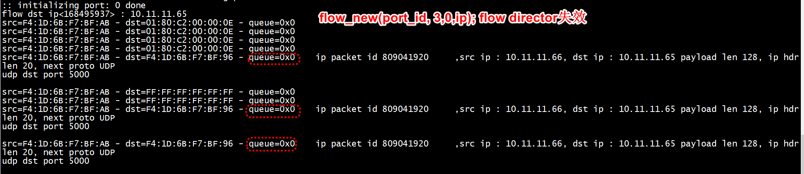

# server  
```
 sudo ./build/helloworld -c0x1
```
` flow_new(port_id, 3,0,ip);`



#  i40eDeviceSetRSSFlowIPv4(port_id, "port0", &rss_conf);


```
 i40eDeviceSetRSSFlowIPv4(port_id, "port0", &rss_conf);
```

```
Error on rte_flow validation for port port0: Invalid argument errmsg: RSS Queues not supported when pattern specified 
Error on rte_flow validation for port port0: Invalid argument errmsg: RSS Queues not supported when pattern specified 
Error on rte_flow validation for port port0: Invalid argument errmsg: RSS Queues not supported when pattern specified 
Error on rte_flow validation for port port0: Invalid argument errmsg: RSS Queues not supported when pattern specified 
Error on rte_flow validation for port port0: Invalid argument errmsg: RSS Queues not supported when pattern specified 
```