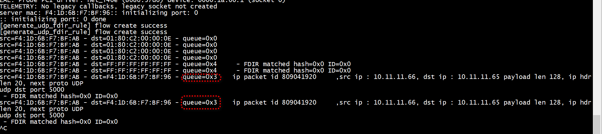
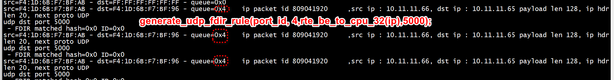

#  网络字节序
```
generate_udp_fdir_rule(port_id, nr_queues -1,IPV4_ADDR(10,11,11,65),1534);
generate_udp_fdir_rule(port_id, 3,IPV4_ADDR(10,11,11,65),5000);
```

```
#if 0
        udp_spec.hdr.dst_port = rte_cpu_to_le_16(dst_port);
        udp_mask.hdr.dst_port = rte_cpu_to_le_16(0xFFFF); // only allow specific destination port
#else
        udp_spec.hdr.dst_port = htons(dst_port);
        udp_mask.hdr.dst_port = htons(0xFFFF); // only allow specific destination port
#endif
```

# server
```
 sudo ./build/helloworld-shared  -c0x3
```
generate_udp_fdir_rule(port_id, 3,rte_be_to_cpu_32(ip),5000);



generate_udp_fdir_rule(port_id, 4,rte_be_to_cpu_32(ip),5000);

# client
```
sudo ./send_udp.py 
send udp pkt
```
