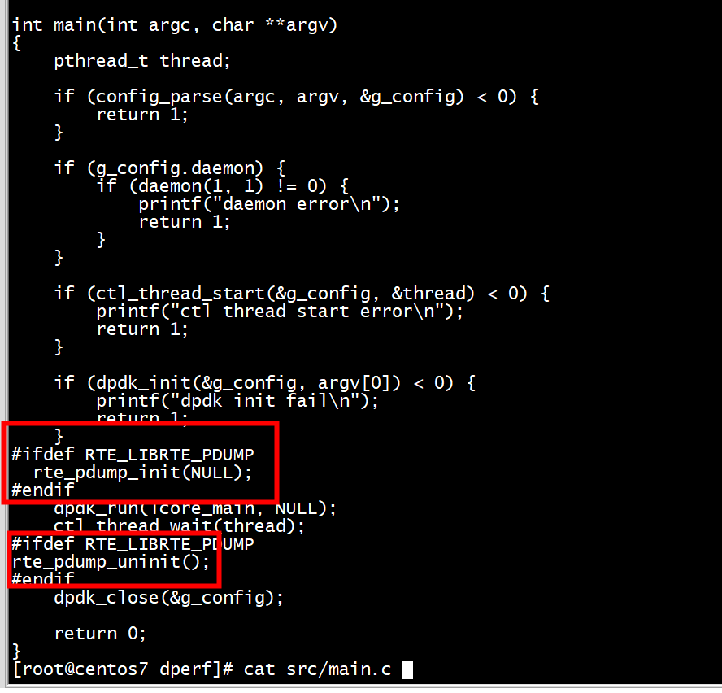

# config


```
arm64-armv8a-linuxapp-gcc/.config
CONFIG_RTE_LIBRTE_PMD_PCAP=y
CONFIG_RTE_LIBRTE_PDUMP=y
```

#   yum install libpcap-devel

```

/root/dpdk-19.11/drivers/net/pcap/rte_eth_pcap.c:19:18: fatal error: pcap.h: No such file or directory
 #include <pcap.h>
```

# make

+ 1 第一步
```
 make install T=arm64-armv8a-linuxapp-gcc  DESTDIR=/usr/src/dpdk -j 64
```
+ 2第二步

```
[root@centos7 pdump]# make
/root/dpdk-19.11/mk/internal/rte.extvars.mk:29: *** Cannot find .config in /root/dpdk-19.11/---.  Stop.
```
export RTE_SDK=/root/dpdk-19.11    
```
[root@centos7 pdump]# export RTE_SDK=/root/dpdk-19.11
[root@centos7 pdump]# export RTE_TARGET=arm64-armv8a-linuxapp-gcc
[root@centos7 pdump]# make
  CC main.o
  LD dpdk-pdump
  INSTALL-APP dpdk-pdump
  INSTALL-MAP dpdk-pdump.map
[root@centos7 pdump]# 
```

# run

```
 ./dpdk-pdump  -l 1 --  --pdump 'port=0,queue=*,rx-dev=/tmp/capture.pcap'
[root@centos7 pdump]# ./dpdk-pdump  --  --pdump 'port=0,queue=*,rx-dev=/tmp/capture.pcap'
EAL: Detected 128 lcore(s)
EAL: Detected 4 NUMA nodes
EAL: Multi-process socket /var/run/dpdk/rte/mp_socket_88949_1b7995e0c8599
EAL: Selected IOVA mode 'VA'
EAL: Probing VFIO support...
EAL: VFIO support initialized
EAL: PCI device 0000:05:00.0 on NUMA socket 0
EAL:   probe driver: 19e5:200 net_hinic
EAL:   using IOMMU type 1 (Type 1)
net_hinic: Initializing pf hinic-0000:05:00.0 in secondary process
net_hinic: Initialize 0000:05:00.0 in secondary process
EAL: PCI device 0000:06:00.0 on NUMA socket 0
EAL:   probe driver: 19e5:200 net_hinic
EAL: PCI device 0000:7d:00.0 on NUMA socket 0
EAL:   probe driver: 19e5:a222 net_hns3
EAL: PCI device 0000:7d:00.1 on NUMA socket 0
EAL:   probe driver: 19e5:a221 net_hns3
EAL: PCI device 0000:7d:00.2 on NUMA socket 0
EAL:   probe driver: 19e5:a222 net_hns3
EAL: PCI device 0000:7d:00.3 on NUMA socket 0
EAL:   probe driver: 19e5:a221 net_hns3
EAL: Failed to hotplug add device
EAL: Error - exiting with code: 1
  Cause: vdev creation failed:create_mp_ring_vdev:770
[root@centos7 pdump]# ls /var/run/dpdk/rte/mp_socket_88949_1b7995e0c8599
ls: cannot access /var/run/dpdk/rte/mp_socket_88949_1b7995e0c8599: No such file or directory
[root@centos7 pdump]# 
```
##  Cause: vdev creation failed:create_mp_ring_vdev

因为没有开启rte_pdump_init   
```Text
a) 在程序初始化过程中调用rte_pdump_init，启动dump_thread进行消息的监听：
#ifdef RTE_LIBRTE_PDUMP
/* initialize packet capture framework /
rte_pdump_init(NULL);
#endif
b) 在程序退出前调用rte_pdump_uninit进行资源的释放：
#ifdef RTE_LIBRTE_PDUMP
/ uninitialize packet capture framework */
rte_pdump_uninit();
#endif
c) 启动pdump程序，发送抓包命令，进行抓包。

```
## dperf enable pdump
+ 1 Makefile定义RTE_LIBRTE_PDUMP   

+ 2 代码总开启pdump   



#  tcpdump -nr /tmp/capture.pcap 


# 发送，接收同时抓包


```
 ./dpdk-pdump  -l 1 --  --pdump 'port=0,queue=*,rx-dev=/tmp/capture.pcap'
./dpdk-pdump  --  --pdump 'port=0,queue=*,rx-dev=/tmp/capture.pcap,tx-dev=/tmp/capture2.pcap'
```


# 抓包程序

```
create_mp_ring_vdev -- > rte_eal_hotplug_add
                    -- >  rte_eth_dev_get_port_by_name
```
当 pdump 进程调用rte_eal_hotplug_add接口时，此接口向 primary 进程发送一个接口热插拔消息，primary 进程调用 vdev bus 提供的 plug 方法完成新接口的创建并根据创建结果回复消息。当 vdev 成功创建后，pdump 进程通过调用 rte_eth_dev_get_port_by_name函数找到此 vdev 接口的 port_id 来使用。    

同理，当 pdump 进程退出时，它会调用 rte_eal_hotplug_remove接口继续向 primary 进程发送接口热插拔消息，primary 进程调用 vdev bus 提供的 unplug 方法完成接口的销毁.  
 

## pdump_rx pdump_tx
+ rte_eth_add_first_rx_callback注册pdump_rx， rte_eth_rx_burst 调用callback（pdump_rx）   
+ rte_eth_add_tx_callback 注册pdump_tx,rte_eth_tx_burst调用callback（pdump_tx）   
+ 这两个函数都要调用pdump_copy    


# vdev xmit

```
./dpdk-pdump  -l 1 --  --pdump 'port=0,queue=*,rx-dev=/tmp/capture.pcap'
```


## eth_pcap_tx_dumper
```
Breakpoint 1, 0x00000000007f4c58 in eth_pcap_tx_dumper ()
(gdb) bt
#0  0x00000000007f4c58 in eth_pcap_tx_dumper ()
#1  0x00000000004835dc in rte_eth_tx_burst (port_id=1, queue_id=0, tx_pkts=0xffffc6714ea0, nb_pkts=32)
    at /root/dpdk-19.11/arm64-armv8a-linuxapp-gcc/include/rte_ethdev.h:4666
#2  0x00000000004847d0 in pdump_rxtx (ring=0x136107b80, vdev_id=1, stats=0xb51958 <pdump_t+216>) at main.c:513
#3  0x000000000048579c in pdump_packets (pt=0xb51880 <pdump_t>) at main.c:928
#4  0x000000000048594c in dump_packets () at main.c:966
#5  0x0000000000485cf0 in main (argc=3, argv=0xffffc67152d0) at main.c:1049
(gdb) c
Continuing.

Breakpoint 1, 0x00000000007f4c58 in eth_pcap_tx_dumper ()
(gdb) bt
#0  0x00000000007f4c58 in eth_pcap_tx_dumper ()
#1  0x00000000004835dc in rte_eth_tx_burst (port_id=1, queue_id=0, tx_pkts=0xffffc6714ea0, nb_pkts=32)
    at /root/dpdk-19.11/arm64-armv8a-linuxapp-gcc/include/rte_ethdev.h:4666
#2  0x00000000004847d0 in pdump_rxtx (ring=0x136107b80, vdev_id=1, stats=0xb51958 <pdump_t+216>) at main.c:513
#3  0x000000000048579c in pdump_packets (pt=0xb51880 <pdump_t>) at main.c:928
#4  0x000000000048594c in dump_packets () at main.c:966
#5  0x0000000000485cf0 in main (argc=3, argv=0xffffc67152d0) at main.c:1049
(gdb) quit
A debugging session is active.

        Inferior 1 [process 19319] will be detached.

Quit anyway? (y or n) y
Detaching from program: /root/dpdk-19.11/app/my-pdump/dpdk-pdump, process 19319
[Inferior 1 (process 19319) detached]
[root@centos7 dpdk-19.11]# 
```

# vdev recv

pdump_rxtx只调用了rte_eth_tx_burst没有调用recv
```
pdump_rxtx(struct rte_ring *ring, uint16_t vdev_id, struct pdump_stats *stats)
{
        /* write input packets of port to vdev for pdump */
        struct rte_mbuf *rxtx_bufs[BURST_SIZE];

        /* first dequeue packets from ring of primary process */
        const uint16_t nb_in_deq = rte_ring_dequeue_burst(ring,
                        (void *)rxtx_bufs, BURST_SIZE, NULL);
        stats->dequeue_pkts += nb_in_deq;

        if (nb_in_deq) {
                /* then sent on vdev */
                uint16_t nb_in_txd = rte_eth_tx_burst(
                                vdev_id,
                                0, rxtx_bufs, nb_in_deq);
                stats->tx_pkts += nb_in_txd;

                if (unlikely(nb_in_txd < nb_in_deq)) {
                        do {
                                rte_pktmbuf_free(rxtx_bufs[nb_in_txd]);
                                stats->freed_pkts++;
                        } while (++nb_in_txd < nb_in_deq);
                }
        }
}

```

#  pcap_open_dead
```
(gdb) bt
#0  0x0000ffffbe7517f8 in pcap_open_dead () from /lib64/libpcap.so.1
#1  0x00000000007f19f0 in open_tx_pcap ()
#2  0x0000000000507b7c in rte_kvargs_process ()
#3  0x00000000007f0a98 in pmd_pcap_probe ()
#4  0x0000000000467670 in vdev_probe_all_drivers.part.1 ()
#5  0x000000000058107c in vdev_probe ()
#6  0x0000000000557f44 in rte_bus_probe ()
#7  0x0000000000543d64 in rte_eal_init ()
#8  0x0000000000485c2c in main (argc=8, argv=0xfffffffff418) at main.c:1028
(gdb) c
```

# bug

## RING: Cannot reserve memory
```
[root@centos7 my-pdump]#  ./dpdk-pdump  -l 1 --  --pdump 'port=0,queue=*,rx-dev=/tmp/capture.pcap'
EAL: Detected 128 lcore(s)
EAL: Detected 4 NUMA nodes
EAL: Multi-process socket /var/run/dpdk/rte/mp_socket_19265_1c0eade2740b2
EAL: Selected IOVA mode 'VA'
EAL: Probing VFIO support...
EAL: VFIO support initialized
EAL: PCI device 0000:05:00.0 on NUMA socket 0
EAL:   probe driver: 19e5:200 net_hinic
EAL:   using IOMMU type 1 (Type 1)
net_hinic: Initializing pf hinic-0000:05:00.0 in secondary process
net_hinic: Initialize 0000:05:00.0 in secondary process
EAL: PCI device 0000:06:00.0 on NUMA socket 0
EAL:   probe driver: 19e5:200 net_hinic
EAL: PCI device 0000:7d:00.0 on NUMA socket 0
EAL:   probe driver: 19e5:a222 net_hns3
EAL: PCI device 0000:7d:00.1 on NUMA socket 0
EAL:   probe driver: 19e5:a221 net_hns3
EAL: PCI device 0000:7d:00.2 on NUMA socket 0
EAL:   probe driver: 19e5:a222 net_hns3
EAL: PCI device 0000:7d:00.3 on NUMA socket 0
EAL:   probe driver: 19e5:a221 net_hns3
RING: Cannot reserve memory
EAL: Error - exiting with code: 1
  Cause: File exists
```
You need to restart  both primary and secondary process( work around) after you see any RING/VDEV failure issues.   

# references

[github上的项目](https://github.com/Woutifier/dpdkcap)   
[DPDK capture原理](https://www.jianshu.com/p/bc2bde0e4442)

