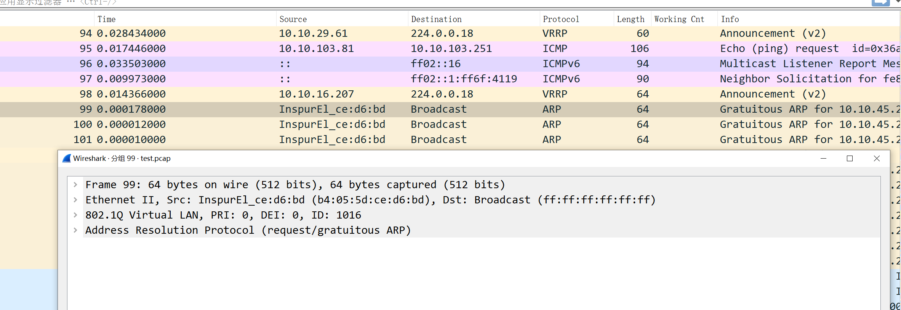

# run
```
[root@centos7 dpdk-pcap]# ./build/app/helloworld  -l 0,1
EAL: Detected 128 lcore(s)
EAL: Detected 4 NUMA nodes
EAL: Multi-process socket /var/run/dpdk/rte/mp_socket
EAL: Selected IOVA mode 'VA'
EAL: No available hugepages reported in hugepages-2048kB
EAL: Probing VFIO support...
EAL: VFIO support initialized
EAL: PCI device 0000:05:00.0 on NUMA socket 0
EAL:   probe driver: 19e5:200 net_hinic
EAL:   using IOMMU type 1 (Type 1)
net_hinic: Initializing pf hinic-0000:05:00.0 in primary process
net_hinic: Device 0000:05:00.0 hwif attribute:
net_hinic: func_idx:0, p2p_idx:0, pciintf_idx:0, vf_in_pf:0, ppf_idx:0, global_vf_id:15, func_type:2
net_hinic: num_aeqs:4, num_ceqs:4, num_irqs:32, dma_attr:2
net_hinic: Get public resource capability:
net_hinic: host_id: 0x0, ep_id: 0x0, intr_type: 0x0, max_cos_id: 0x7, er_id: 0x0, port_id: 0x0
net_hinic: host_total_function: 0xf2, host_oq_id_mask_val: 0x8, max_vf: 0x78
net_hinic: pf_num: 0x2, pf_id_start: 0x0, vf_num: 0xf0, vf_id_start: 0x10
net_hinic: Get share resource capability:
net_hinic: host_pctxs: 0x0, host_cctxs: 0x0, host_scqs: 0x0, host_srqs: 0x0, host_mpts: 0x0
net_hinic: Get l2nic resource capability:
net_hinic: max_sqs: 0x10, max_rqs: 0x10, vf_max_sqs: 0x4, vf_max_rqs: 0x4
net_hinic: Initialize 0000:05:00.0 in primary successfully
EAL: PCI device 0000:06:00.0 on NUMA socket 0
EAL:   probe driver: 19e5:200 net_hinic
EAL: PCI device 0000:7d:00.0 on NUMA socket 0
EAL:   probe driver: 19e5:a222 net_hns3
EAL: PCI device 0000:7d:00.1 on NUMA socket 0
EAL:   probe driver: 19e5:a221 net_hns3
EAL: PCI device 0000:7d:00.2 on NUMA socket 0
EAL:   probe driver: 19e5:a222 net_hns3
EAL: PCI device 0000:7d:00.3 on NUMA socket 0
EAL:   probe driver: 19e5:a221 net_hns3


number 0:  0000:05:00.0  port id 0 MAC address: 44:A1:91:A4:9C:0B

choose a port, enter the port number: 
0
net_hinic: Disable vlan filter succeed, device: hinic-0000:05:00.0, port_id: 0
net_hinic: Disable vlan strip succeed, device: hinic-0000:05:00.0, port_id: 0
net_hinic: Set new mac address 44:a1:91:a4:9c:0b

net_hinic: Disable promiscuous, nic_dev: hinic-0000:05:00.0, port_id: 0, promisc: 0
net_hinic: Disable allmulticast succeed, nic_dev: hinic-0000:05:00.0, port_id: 0
net_hinic: Enable promiscuous, nic_dev: hinic-0000:05:00.0, port_id: 0, promisc: 0
APP: lcore 1 running
^C

Signal 2 received, preparing to exit...

Statistics for port 0
APP: lcore 1 exiting
Rx:      489 Tx:        0 dropped:      186
```

