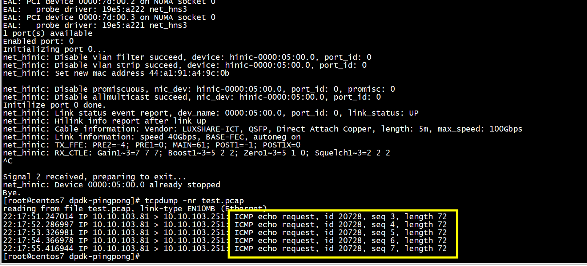

#  Couldn't open test.pcap

```
pcap_t *pcap= open_iface_live("test.pcap")
static inline pcap_t * open_iface_live(const char *iface) {
        pcap_t *pcap;

        pcap = pcap_open_live(iface, RTE_ETH_PCAP_SNAPLEN,
                        RTE_ETH_PCAP_PROMISC, RTE_ETH_PCAP_TIMEOUT, errbuf);

        if (pcap == NULL) {
             fprintf(stderr, "Couldn't open %s: %s", iface, errbuf);
                return NULL;
        }

        return pcap;
}
```

```
Couldn't open test.pcap: test.pcap: No such device exists (SIOCGIFHWADDR: No such device)net_hinic: Link status event report, dev_name: 0000:05:00.0, port_id: 0, link_status: UP
```
#  pcap_sendpacket: send: Bad file descriptor
查看系统网卡   
```
3: enp125s0f1: <NO-CARRIER,BROADCAST,MULTICAST,UP> mtu 1500 qdisc pfifo_fast state DOWN group default qlen 1000
    link/ether b0:08:75:5f:b8:5c brd ff:ff:ff:ff:ff:ff
4: enp125s0f2: <NO-CARRIER,BROADCAST,MULTICAST,UP> mtu 1500 qdisc pfifo_fast state DOWN group default qlen 1000
    link/ether b0:08:75:5f:b8:5d brd ff:ff:ff:ff:ff:ff
5: enp125s0f3: <BROADCAST,MULTICAST,UP,LOWER_UP> mtu 1500 qdisc pfifo_fast state UP group default qlen 1000
    link/ether b0:08:75:5f:b8:5e brd ff:ff:ff:ff:ff:ff
```

 改成       
 g_pcap = open_iface_live("enp125s0f3");    

```
pcap_sendpacket: send: Bad file descriptor
pcap_sendpacket: send: Bad file descriptor
pcap_sendpacket: send: Bad file descriptor
pcap_sendpacket: send: Bad file descriptor
pcap_sendpacket: send: Bad file descriptor
pcap_sendpacket: send: Bad file descriptor
pcap_sendpacket: send: Bad file descriptor
pcap_sendpacket: send: Bad file descriptor
pcap_sendpacket: send: Bad file descriptor
pcap_sendpacket: send: Bad file descriptor
pcap_sendpacket: send: Bad file descriptor
pcap_sendpacket: send: Bad file descriptor
pcap_sendpacket: send: Bad file descriptor
pcap_sendpacket: send: Bad file descriptor
pcap_sendpacket: send: Bad file descriptor
pcap_sendpacket: send: Bad file descriptor
pcap_sendpacket: send: Bad file descriptor
pcap_sendpacket: send: Bad file descriptor
pcap_sendpacket: send: Bad file descriptor
pcap_sendpacket: send: Bad file descriptor
```

# 采用 pcap_dump_open

```
static  pcap_dumper_t * test_open_single_tx_pcap(const char *pcap_filename)
{
       pcap_t *tx_pcap;
       pcap_dumper_t * dumper;
 /*
 *          * We need to create a dummy empty pcap_t to use it
 *                   * with pcap_dump_open(). We create big enough an Ethernet
 *                            * pcap holder.
 *                                     */
        tx_pcap = pcap_open_dead(DLT_EN10MB, RTE_ETH_PCAP_SNAPSHOT_LEN);
        if (tx_pcap == NULL) {
                fprintf(stderr, "Couldn't create dead pcap");
                return NULL;
        }

        /* The dumper is created using the previous pcap_t reference */
        dumper = pcap_dump_open(tx_pcap, pcap_filename);
        if (dumper == NULL) {
                pcap_close(tx_pcap);
                fprintf(stderr, "Couldn't open %s for writing.",
                        pcap_filename);
                return NULL;
        }
        pcap_close(tx_pcap);
        return dumper;
}
```

## run
抓取icmp报文   
```
                if (verbose_level > 0)
                        printf("  ICMP: echo request seq id=%d\n",
                               rte_be_to_cpu_16(icmp_h->icmp_seq_nb));
#if TEST_PACAP
        //write_pcap(pkt);
        //test_eth_pcap_tx_dumper(pkt);
#endif
```


```
[root@centos7 dpdk-pingpong]# ./build/pingpong -l 1,2 -- -p 0 -s
```

