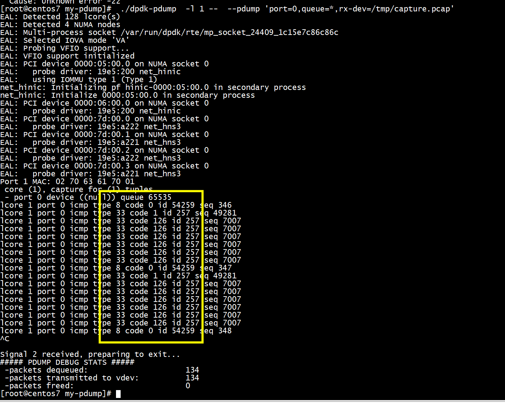

# run

```
./build/dperf -c test/http/server-cps.conf
./dpdk-pdump  -l 1 --  --pdump 'port=0,queue=*,rx-dev=/tmp/capture.pcap'
```


Type 33 — IPv6 Where-Are-You (Deprecated)   
Type 34 — IPv6 I-Am-Here (Deprecated)   
# pdump_rxtx --> icmp_dump_hdr  

```
static void icmp_dump_hdr(const struct rte_mbuf *mbuf)
{
    struct rte_ipv4_hdr *iph;
    struct rte_icmp_hdr *ich;
    struct rte_ether_hdr *eth_hdr;
    uint8_t lcore;
    eth_hdr = rte_pktmbuf_mtod(mbuf, struct rte_ether_hdr *);
    if(rte_cpu_to_be_16(RTE_ETHER_TYPE_IPV4) != eth_hdr->ether_type)
    {
        //printf("not ipv4 \n");
        return;
    }
    iph  =  (struct rte_ipv4_hdr *)((char *)eth_hdr + sizeof(struct rte_ether_hdr));
#if 0
    mbuf->l2_len = sizeof(struct rte_ether_hdr);
    if (unlikely(NULL == rte_pktmbuf_adj(mbuf, sizeof(struct rte_ether_hdr))))
        goto inhdr_error;
    if (mbuf_may_pull(mbuf, sizeof(struct rte_ipv4_hdr)) != 0)
        goto inhdr_error;
    iph = ip4_hdr(mbuf) ;
#endif
    if (unlikely(rte_cpu_to_be_16(IPPROTO_ICMP) == iph->next_proto_id)) {
         return;
    }
    //ich = rte_pktmbuf_mtod(mbuf, struct rte_icmp_hdr *);
    ich = (struct rte_icmp_hdr *) ((char *)iph + sizeof(struct rte_ipv4_hdr));
    lcore = rte_lcore_id();

    fprintf(stderr, "lcore %d port %d icmp type %u code %u id %u seq %u\n",
            lcore, mbuf->port, ich->icmp_type, ich->icmp_code,
            ntohs(ich->icmp_ident), ntohs(ich->icmp_seq_nb));

inhdr_error:
    return;
}
static inline void
pdump_rxtx(struct rte_ring *ring, uint16_t vdev_id, struct pdump_stats *stats)
{
	/* write input packets of port to vdev for pdump */
	struct rte_mbuf *rxtx_bufs[BURST_SIZE];

	/* first dequeue packets from ring of primary process */
	const uint16_t nb_in_deq = rte_ring_dequeue_burst(ring,
			(void *)rxtx_bufs, BURST_SIZE, NULL);
	stats->dequeue_pkts += nb_in_deq;

	if (nb_in_deq) {
                icmp_dump_hdr(rxtx_bufs[0]);
		/* then sent on vdev */
		uint16_t nb_in_txd = rte_eth_tx_burst(
				vdev_id,
				0, rxtx_bufs, nb_in_deq);
		stats->tx_pkts += nb_in_txd;

		if (unlikely(nb_in_txd < nb_in_deq)) {
			do {
				rte_pktmbuf_free(rxtx_bufs[nb_in_txd]);
				stats->freed_pkts++;
			} while (++nb_in_txd < nb_in_deq);
		}
	}
}
```