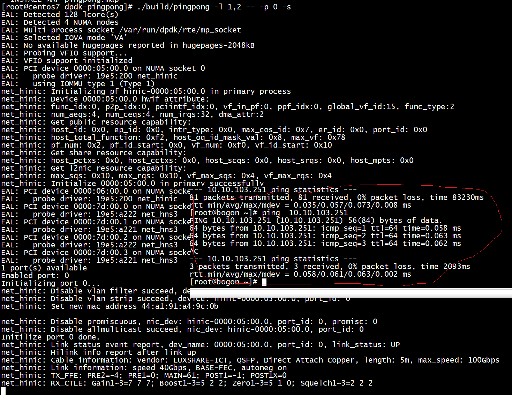

## Build

1. Modify the MAC and IP addresses

Since the ARP protocol is not implemented, the MAC and IP addresses of the client and server are hardcoded.
Modify the follwing variables.
```c
/* the client side */
static struct ether_addr client_ether_addr =
    {{0x00, 0x0c, 0x29, 0xd5, 0xac, 0xc9}};
static uint32_t client_ip_addr = IPv4(172, 16, 166, 131);

/* the server side */
static struct rte_ether_addr server_ether_addr =
    {{0x44, 0xa1, 0x91, 0xa4, 0x9b, 0xeb}};
static uint32_t server_ip_addr = RTE_IPV4(10,10,103,251);

ret = rte_eth_macaddr_get(port_id, &server_ether_addr);
    if (ret != 0)
          rte_exit(EXIT_FAILURE, "macaddr get failed\n");
```

2. Build

```shell
export RTE_SDK=/path/to/dpdk-19.05/
export RTE_TARGET=build
make
```

The valid parameters are: 
`-p` to specify the id of  which port to use, 0 by default (both sides), 
`-n` to customize how many ping-pong rounds, 100 by default (client side), 
`-s` to enable server mode (server side).

## Run
1. Make sure that NIC is properly binded to the DPDK-compible driver and huge memory page is configured on both client and server.

2. On the server side
```shell
sudo ./build/pingpong -l 1,2 -- -p 0 -s
```

3. On the client side
```shell
sudo ./build/pingpong -l 1,2 -- -p 0 -n 200
```

`Note` that >= 2 lcores are needed.

The output shoud be like this
```
====== ping-pong statistics =====
tx 200 ping packets
rx 200 pong packets
dopped 0 packets
min rtt: 50 us
max rtt: 15808 us
average rtt: 427 us
=================================
```
Note that this test is run on virtual machines, ignore the numbers.



## Issues

1. The 1st ping-pong round is very slow.
2. Only support directly connectted client and server NICs.