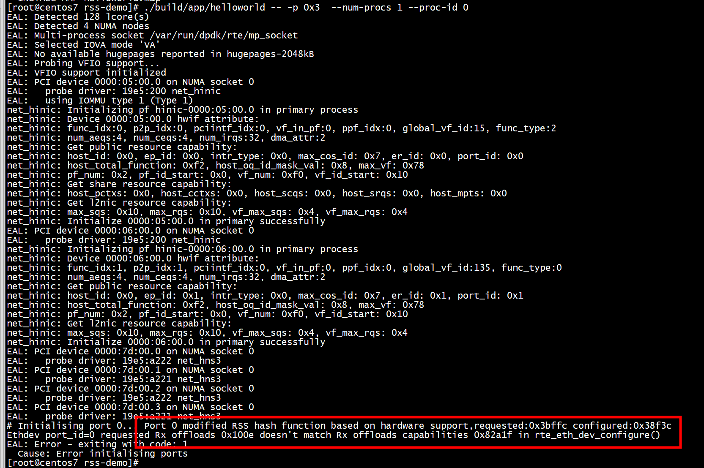

# Symmetric RSS in DPDK for i40e

```

int sym_hash_enable(int port_id, uint32_t ftype, enum rte_eth_hash_function function)
{
    struct rte_eth_hash_filter_info info;
    int ret = 0;
    uint32_t idx = 0;
    uint32_t offset = 0;

    memset(&info, 0, sizeof(info));

    ret = rte_eth_dev_filter_supported(port_id, RTE_ETH_FILTER_HASH);
    if (ret < 0) {
        DPDK_ERROR("RTE_ETH_FILTER_HASH not supported on port: %d",
                         port_id);
        return ret;
    }

    info.info_type = RTE_ETH_HASH_FILTER_GLOBAL_CONFIG;
    info.info.global_conf.hash_func = function;

    idx = ftype / UINT64_BIT;
    offset = ftype % UINT64_BIT;
    info.info.global_conf.valid_bit_mask[idx] |= (1ULL << offset);
    info.info.global_conf.sym_hash_enable_mask[idx] |=
                        (1ULL << offset);

    ret = rte_eth_dev_filter_ctrl(port_id, RTE_ETH_FILTER_HASH,
                                  RTE_ETH_FILTER_SET, &info);
    if (ret < 0)
    {
        DPDK_ERROR("Cannot set global hash configurations"
                        "on port %u", port_id);
        return ret;
    }

    return 0;
}

int sym_hash_set(int port_id, int enable)
{
    int ret = 0;
    struct rte_eth_hash_filter_info info;

    memset(&info, 0, sizeof(info));

    ret = rte_eth_dev_filter_supported(port_id, RTE_ETH_FILTER_HASH);
    if (ret < 0) {
        DPDK_ERROR("RTE_ETH_FILTER_HASH not supported on port: %d",
                         port_id);
        return ret;
    }

    info.info_type = RTE_ETH_HASH_FILTER_SYM_HASH_ENA_PER_PORT;
    info.info.enable = enable;
    ret = rte_eth_dev_filter_ctrl(port_id, RTE_ETH_FILTER_HASH,
                        RTE_ETH_FILTER_SET, &info);

    if (ret < 0)
    {
        DPDK_ERROR("Cannot set symmetric hash enable per port "
                        "on port %u", port_id);
        return ret;
    }

    return 0;
}

sym_hash_enable(port_id, RTE_ETH_FLOW_NONFRAG_IPV4_TCP, RTE_ETH_HASH_FUNCTION_TOEPLITZ);
sym_hash_enable(port_id, RTE_ETH_FLOW_NONFRAG_IPV4_UDP, RTE_ETH_HASH_FUNCTION_TOEPLITZ);
sym_hash_enable(port_id, RTE_ETH_FLOW_FRAG_IPV4, RTE_ETH_HASH_FUNCTION_TOEPLITZ);
sym_hash_enable(port_id, RTE_ETH_FLOW_NONFRAG_IPV4_SCTP, RTE_ETH_HASH_FUNCTION_TOEPLITZ);
sym_hash_enable(port_id, RTE_ETH_FLOW_NONFRAG_IPV4_OTHER, RTE_ETH_HASH_FUNCTION_TOEPLITZ);

sym_hash_set(port_id, 1);
```

# app

需要两个port   
./build/app/helloworld -- -p 0x3  --num-procs 1 --proc-id 0   
```
[root@centos7 dpdk-19.11]# ./usertools/dpdk-devbind.py  -s

Network devices using DPDK-compatible driver
============================================
0000:05:00.0 'Hi1822 Family (2*100GE) 0200' drv=vfio-pci unused=hinic
0000:06:00.0 'Hi1822 Family (2*100GE) 0200' drv=vfio-pci unused=hinic
```
 
 这是网卡不支持DEV_RX_OFFLOAD_CRC_STRIP
 ```
 smp_port_init(uint16_t port, struct rte_mempool *mbuf_pool,
               uint16_t num_queues)
{
        struct rte_eth_conf port_conf = {
                        .rxmode = {
                                .mq_mode        = ETH_MQ_RX_RSS,
                                .split_hdr_size = 0,
                                .offloads = DEV_RX_OFFLOAD_CHECKSUM ,
                                //.offloads = (DEV_RX_OFFLOAD_CHECKSUM | DEV_RX_OFFLOAD_CRC_STRIP),
                        },
 ```
 
 > ## bug2
 
 ```C
                 .txmode = {
                        .mq_mode = RTE_ETH_MQ_TX_NONE,
#if 1
                        .offloads = RTE_ETH_TX_OFFLOAD_TCP_CKSUM|RTE_ETH_TX_OFFLOAD_IPV4_CKSUM|RTE_ETH_TX_OFFLOAD_MBUF_FAST_FREE,
#else
                        .offloads = RTE_ETH_TX_OFFLOAD_TCP_CKSUM|RTE_ETH_TX_OFFLOAD_IPV4_CKSUM,
#endif
                },
 ```
 
 ```
 Ethdev port_id=0 requested Tx offloads 0x1000a doesn't match Tx offloads capabilities 0x80bf in rte_eth_dev_configure()
EAL: Error - exiting with code: 1
  Cause: Cannot init port 0
 ```
+ hinic1822不支持RTE_ETH_TX_OFFLOAD_MBUF_FAST_FREE   

>  ##  bug3

```
net_hinic: Disable promiscuous, nic_dev: hinic-0000:05:00.0, port_id: 0, promisc: 0
net_hinic: Disable allmulticast succeed, nic_dev: hinic-0000:05:00.0, port_id: 0
dst_port: 22222
net_hinic: Set filter_ctrl succeed, func_id: 0x0, filter_type: 0xa,filter_op: 0x5.
TCP_GENERATOR: Flow validation failed Not supported action.
EAL: Error - exiting with code: 1
  Cause:  Cannot establish connection.
```


+ hinic1822不支持 rte_flow_create(portid, &attr, pattern, action, &err);    

#  编译 dpdk-stable-22.11.1

```
cc -O3 -include rte_config.h -march=native -I/usr/local/include   -DALLOW_EXPERIMENTAL_API -I ethdev main.c -o build/helloworld-shared  -Wl,--as-needed -L/usr/local/lib64 -lrte_node -lrte_graph -lrte_flow_classify -lrte_pipeline -lrte_table -lrte_pdump -lrte_port -lrte_fib -lrte_ipsec -lrte_vhost -lrte_stack -lrte_security -lrte_sched -lrte_reorder -lrte_rib -lrte_dmadev -lrte_regexdev -lrte_rawdev -lrte_power -lrte_pcapng -lrte_member -lrte_lpm -lrte_latencystats -lrte_kni -lrte_jobstats -lrte_ip_frag -lrte_gso -lrte_gro -lrte_gpudev -lrte_eventdev -lrte_efd -lrte_distributor -lrte_cryptodev -lrte_compressdev -lrte_cfgfile -lrte_bpf -lrte_bitratestats -lrte_bbdev -lrte_acl -lrte_timer -lrte_hash -lrte_metrics -lrte_cmdline -lrte_pci -lrte_ethdev -lrte_meter -lrte_net -lrte_mbuf -lrte_mempool -lrte_rcu -lrte_ring -lrte_eal -lrte_telemetry -lrte_kvargs
```

```
main.c:51:27: fatal error: ethdev_driver.h: No such file or directory
 #include <ethdev_driver.h>
```
/usr/local/include 目录   
# references
`dpdk-19.11/examples/rss-demo`
[将外部 DPVS 应用程序（使用 Makefile）与使用 Meson 构建的 DPDK 链接](https://it.cha138.com/zd/show-3838027.html)

[x710 hash 分片与非分片 tcp 报文异常问题](https://blog.csdn.net/Longyu_wlz/article/details/115841974)   
[ice 100G 网卡分片报文 hash 问题](https://blog.csdn.net/Longyu_wlz/article/details/125947138?utm_medium=distribute.pc_relevant.none-task-blog-2~default~baidujs_baidulandingword~default-5-125947138-blog-107143300.235^v38^pc_relevant_anti_vip&spm=1001.2101.3001.4242.4&utm_relevant_index=8)   