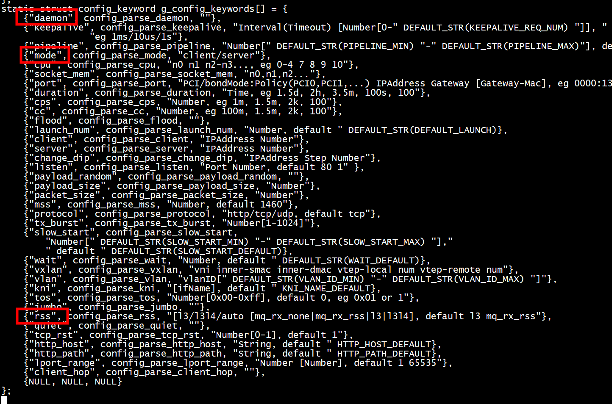
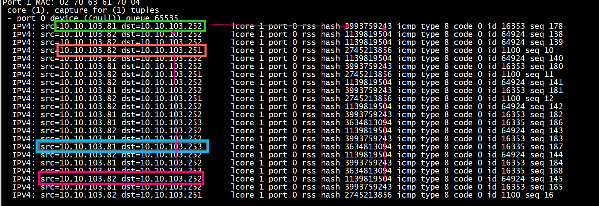
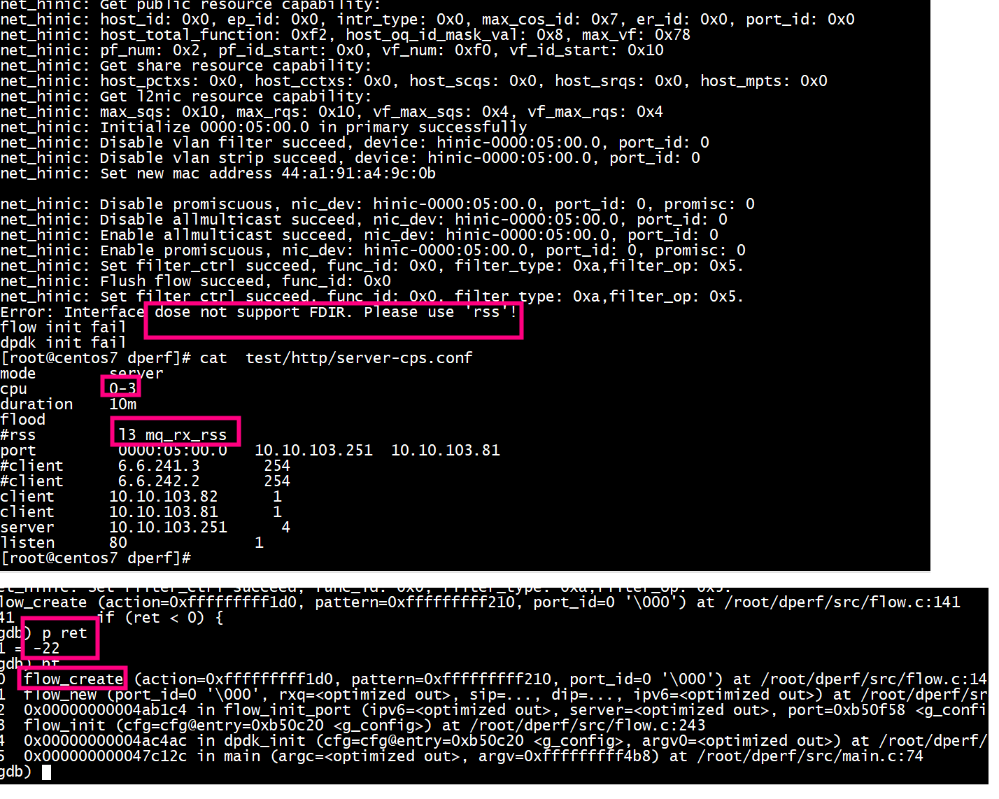

# dperf 参数

 
 


#  多线程与网卡分流
   dperf是一个多线程程序，每个线程只使用1个RX和1个TX。 dperf使用网卡的分流特性（FDIR)。 每个dperf server线程绑定一个监听IP，dperf server上使用报文的目的IP分流。 每个dperf client线程只请求一个目的IP，dperf client上使用报文的源IP分流。    经过分流后，线程之间没有共享资源，没有锁竞争，理论上性能可以线性扩展，实际上会因为共享CPU执行单元、Cache、总线、网卡等物理资源，难免会相互干扰, 做不到百分百线性。   
   对于不支持FDIR特性的网卡。dperf使用L3/L3L4RSS分流。dperf使用对称的hashkey，客户端会选择特定IP，使得同一个连接的TX/RX方向的报文都落在同一个线程上。对于不支持设置RSS的网卡。dperf适用默认的RSS分流算法，连接的第一个发送队列可能不是接收队列，dperf使用第一个响应报文来修正。 dperf服务器上共享socket表，报文哈希到任何一个线程都可以正常处理。RSS的性能与FDIR差异不大。  
   
```
[root@centos7 dperf]# ./build/dperf -c test/http/server-cps.conf
Error: 'rss' is required if cpu num is not equal to server ip num
```
# rss
+ dpdk_init  -->   rss_init
+ port_config -->    rss_config_port
              -->    rte_eth_dev_configure

			  
	
#  frag	
```
static uint64_t rss_get_rss_hf(struct rte_eth_dev_info *dev_info, uint8_t rss)
{
    uint64_t offloads = 0;
    uint64_t ipv4_flags = 0;
    uint64_t ipv6_flags = 0;

    offloads = dev_info->flow_type_rss_offloads;
    if (rss == RSS_L3) {
        ipv4_flags = RTE_ETH_RSS_IPV4 | RTE_ETH_RSS_FRAG_IPV4;
        ipv6_flags = RTE_ETH_RSS_IPV6 | RTE_ETH_RSS_FRAG_IPV6;
    } else if (rss == RSS_L3L4) {
        ipv4_flags = RTE_ETH_RSS_NONFRAG_IPV4_UDP | RTE_ETH_RSS_NONFRAG_IPV4_TCP;
        ipv6_flags = RTE_ETH_RSS_NONFRAG_IPV6_UDP | RTE_ETH_RSS_NONFRAG_IPV6_TCP;
    }

    if (g_config.ipv6) {
        if ((offloads & ipv6_flags) == 0) {
            return 0;
        }
    } else {
        if ((offloads & ipv4_flags) == 0) {
            return 0;
        }
    }

    return (offloads & (ipv4_flags | ipv6_flags));
}
```

# flow
flow_init:     
+ 1 flow_new
+ 2 flow_action_init
+ 3 flow_pattern_init_eth
+ 4 flow_pattern_init_ipv4
+ 5 flow_pattern_init_end
+ 6 flow_create

# rss test
开启rss   
```
rss         l3 mq_rx_rss
```

+ dperf ./build/dperf -c test/http/server-cps.conf
```
[root@centos7 dperf]# cat test/http/server-cps.conf 
mode        server
cpu         0-4
duration    10m
rss         l3 mq_rx_rss
port         0000:05:00.0   10.10.103.251  10.10.103.81 
#client      6.6.241.3       254
#client      6.6.242.2       254
client      10.10.103.82      1
client      10.10.103.81      1
server      10.10.103.251      4
listen      80              1
[root@centos7 dperf]# 
```
+ pdump 抓包
```
[root@centos7 my-pdump]# export  RTE_TARGET=arm64-armv8a-linuxapp-gcc
[root@centos7 my-pdump]# export  RTE_SDK=/root/dpdk-19.11/
[root@centos7 my-pdump]# ./build/app/dpdk-pdump  -l 1 --  --pdump 'port=0,queue=*,rx-dev=/tmp/capture.pcap'
```
 
 
+ ping  10.10.103.253
```
[root@bogon ~]# ping 10.10.103.253
PING 10.10.103.253 (10.10.103.253) 56(84) bytes of data.
64 bytes from 10.10.103.253: icmp_seq=1 ttl=64 time=0.091 ms
64 bytes from 10.10.103.253: icmp_seq=2 ttl=64 time=0.091 ms
64 bytes from 10.10.103.253: icmp_seq=3 ttl=64 time=4.56 ms
```
+  ping  10.10.103.252
```
[root@bogon ~]#  ping  10.10.103.252
PING 10.10.103.252 (10.10.103.252) 56(84) bytes of data.
64 bytes from 10.10.103.252: icmp_seq=1 ttl=64 time=0.104 ms
64 bytes from 10.10.103.252: icmp_seq=2 ttl=64 time=0.123 ms
```

+ ping  10.10.103.251

```
root@ubuntu:~#  ping  10.10.103.251
PING 10.10.103.251 (10.10.103.251) 56(84) bytes of data.
64 bytes from 10.10.103.251: icmp_seq=1 ttl=64 time=0.133 ms
64 bytes from 10.10.103.251: icmp_seq=2 ttl=64 time=0.083 ms
64 bytes from 10.10.103.251: icmp_seq=3 ttl=64 time=0.116 ms

```
+  ping  10.10.103.252
```
root@ubuntu:~#  ping  10.10.103.252
PING 10.10.103.252 (10.10.103.252) 56(84) bytes of data.
64 bytes from 10.10.103.252: icmp_seq=1 ttl=64 time=0.208 ms
64 bytes from 10.10.103.252: icmp_seq=2 ttl=64 time=0.066 ms
```

# flow test
开启flow     
```
[root@centos7 dperf]# cat  test/http/server-cps.conf
mode        server
cpu         0-3
duration    10m
flood       
#rss         l3 mq_rx_rss
port         0000:05:00.0   10.10.103.251  10.10.103.81 
#client      6.6.241.3       254
#client      6.6.242.2       254
client      10.10.103.82      1
client      10.10.103.81      1
server      10.10.103.251      4
listen      80              1
```
 
```
Error: Interface dose not support FDIR. Please use 'rss'!
flow init fail
dpdk init fail
```
# references
[dperf用RSS对称哈希算法分流达到极致性能](https://dperf.org/doc/html/dperf-symmetric-rss)   
[dperf设计原理](https://geekdaxue.co/read/dperf-docs/docs-design-CN.md)   