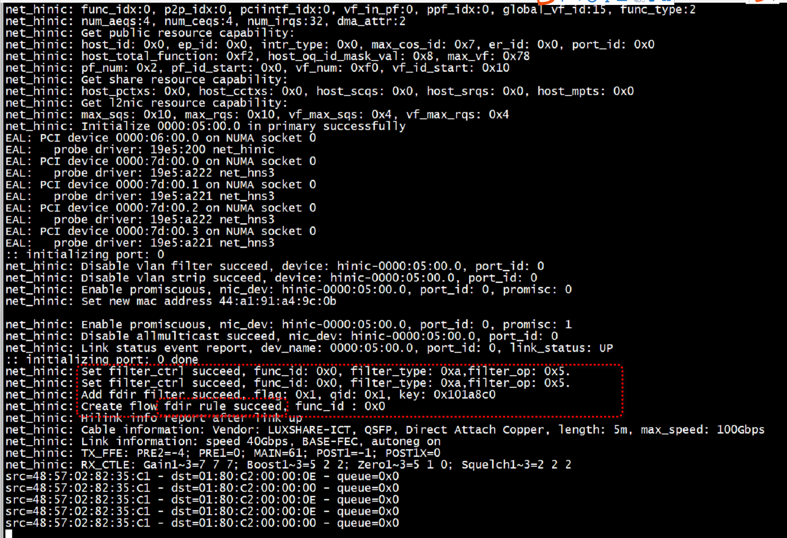
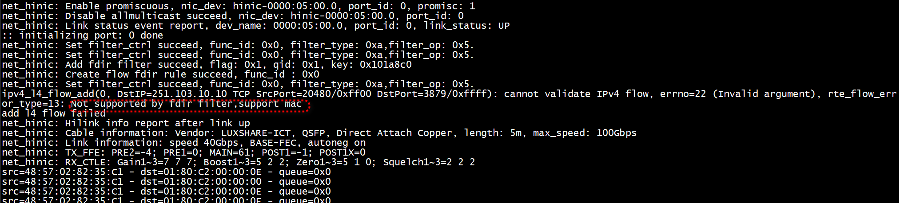

# run
[DPDK数据流过滤规则例程解析—— 网卡流处理功能窥探](https://www.sdnlab.com/23216.html)  
```
 ./build/app/flow  -c0x1
```

 
 
## 添加 tcp flow 失败

```
#if 1
        if(ipv4_l4_flow_add(port_id,selected_queue,IPV4_ADDR(251,103,10,10),80,0xff,9999,0xffff,IPPROTO_TCP)){
             printf("add l4 flow failed \n");
        }
#endif
```
 
  
 
 # hash.fdir.hi

```C
static inline uint64_t *
dp_packet_ol_flags_ptr(const struct dp_packet *b)
{
    return CONST_CAST(uint64_t *, &b->mbuf.ol_flags);
}

static inline uint32_t *
dp_packet_rss_ptr(const struct dp_packet *b)
{
    return CONST_CAST(uint32_t *, &b->mbuf.hash.rss);
}

static inline uint32_t *
dp_packet_flow_mark_ptr(const struct dp_packet *b)
{
    return CONST_CAST(uint32_t *, &b->mbuf.hash.fdir.hi);
}
```
 
 ```C
 static inline void
dump_pkt_info(struct rte_mbuf *m, uint16_t qi)
{
	struct rte_ether_hdr *eth_hdr;

	eth_hdr = rte_pktmbuf_mtod(m, struct rte_ether_hdr *);
	print_ether_addr("src=", &eth_hdr->s_addr);
	print_ether_addr(" - dst=", &eth_hdr->d_addr);
	printf(" - queue=0x%x",(unsigned int)qi);
	uint64_t ol_flags = m->ol_flags;
	if (ol_flags & PKT_RX_RSS_HASH) {
		printf(" - RSS hash=0x%x", (unsigned int) m->hash.rss);
		printf(" - RSS queue=0x%x", (unsigned int) qi);
	}
	if (ol_flags & PKT_RX_FDIR) {
		printf(" - FDIR matched ");
		if (ol_flags & PKT_RX_FDIR_ID)
			printf("ID=0x%x", m->hash.fdir.hi);
		else if (ol_flags & PKT_RX_FDIR_FLX)
			printf("flex bytes=0x%08x %08x",
			       m->hash.fdir.hi, m->hash.fdir.lo);
		else
			printf("hash=0x%x ID=0x%x ",
			       m->hash.fdir.hash, m->hash.fdir.id);
	}
	printf("\n");
}
 ```