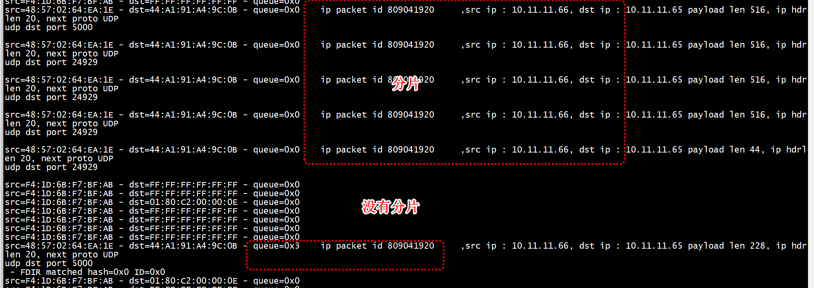

# fdir_info.mode
```
void fdir_get_infos(uint16_t port_id)
{
        struct rte_eth_fdir_stats fdir_stat;
        struct rte_eth_fdir_info fdir_info;

        static const char *fdir_stats_border = "########################";

        if (port_id_is_invalid(port_id, ENABLED_WARN))
                return;

        memset(&fdir_info, 0, sizeof(fdir_info));
        memset(&fdir_stat, 0, sizeof(fdir_stat));
        if (get_fdir_info(port_id, &fdir_info, &fdir_stat))
                return;

        printf("\n  %s FDIR infos for port %-2d     %s\n",
               fdir_stats_border, port_id, fdir_stats_border);
        printf("  MODE: ");
        if (fdir_info.mode == RTE_FDIR_MODE_PERFECT)
                printf("  PERFECT\n");
        else if (fdir_info.mode == RTE_FDIR_MODE_PERFECT_MAC_VLAN)
                printf("  PERFECT-MAC-VLAN\n");
        else if (fdir_info.mode == RTE_FDIR_MODE_PERFECT_TUNNEL)
                printf("  PERFECT-TUNNEL\n");
        else if (fdir_info.mode == RTE_FDIR_MODE_SIGNATURE)
                printf("  SIGNATURE\n");
        else
                printf("  DISABLE\n");
```

```
flow dst ip<168495937> : 10.11.11.65 

  ######################## FDIR infos for port 0      ########################
  MODE:   DISABLE
```


#  udp flow  director

+  1  IP 层，匹配10.11.11.XX/24      

```

    if (dip != 0) {
        //dmask = 0xffffffff;
        dmask = 0xffffff00;
    }

    memset(spec, 0, sizeof(struct rte_flow_item_ipv4));
    spec->hdr.dst_addr = dip;
    spec->hdr.src_addr = sip;

    memset(mask, 0, sizeof(struct rte_flow_item_ipv4));
    mask->hdr.dst_addr = htons(dmask);
    mask->hdr.src_addr = smask;
```

+ udp 层,匹配目的端口   
```
static void flow_pattern_init_udp(struct rte_flow_item *pattern,struct rte_flow_item_udp  *udp_spec, struct rte_flow_item_udp  *udp_mask, uint16_t dst_port)
{
    uint32_t dmask = 0;
    if (dst_port != 0) {
        dmask = 0xffff;
    }
    memset(udp_spec, 0, sizeof(struct rte_flow_item_udp));
    memset(udp_mask, 0, sizeof(struct rte_flow_item_udp));
    udp_spec->hdr.dst_port = htons(dst_port);
    udp_mask->hdr.dst_port = dmask;
    pattern->type = RTE_FLOW_ITEM_TYPE_UDP;
    pattern->spec = udp_spec;
    pattern->mask = udp_mask;
}
```


```
int flow_new(uint8_t port_id, uint16_t rxq, uint32_t sip, uint32_t dip,uint16_t dst_port)
{
    struct rte_flow_action_queue queue;
    struct rte_flow_item_eth eth_spec, eth_mask;
    struct rte_flow_item_ipv4 ip_spec, ip_mask;
    struct rte_flow_item_udp  udp_spec;
    struct rte_flow_item_udp  udp_mask;
    struct rte_flow_item pattern[MAX_PATTERN_NUM4];
    struct rte_flow_action action[MAX_PATTERN_NUM4];

    flow_action_init(action, &queue, rxq);
    flow_pattern_init_eth(&pattern[0], &eth_spec, &eth_mask);
    flow_pattern_init_ipv4(&pattern[1], &ip_spec, &ip_mask, sip, dip);
#if 1
    flow_pattern_init_udp(&pattern[2],&udp_spec,&udp_mask,dst_port);
    flow_pattern_init_end(&pattern[3]);
#else
    flow_pattern_init_end(&pattern[2]);
#endif
    return flow_create(port_id, pattern, action);
}
```


# 发送分片

```
def main():
    print("send udp pkt")
    payload = 'a' * 2000
    packet = IP(dst="10.11.11.65",src="10.11.11.66",id=12345)/UDP(dport=5000,sport=3333)/payload
    frags=fragment(packet,fragsize=500)
    for frag in frags:
        pkt = Ether(src= new_src_mac,dst= new_dst_mac,type=0x800)/frag
        sendp(pkt,verbose=0,iface=ethname) #sending packet at layer 2
```

+ 1 没有分片

```
def main():
    print("send udp pkt")
    payload = 'a' * 2000
    packet = IP(dst="10.11.11.65",src="10.11.11.66",id=12345)/UDP(dport=5000,sport=3333)/payload
    frags=fragment(packet,fragsize=500)
    for frag in frags:
        pkt = Ether(src= new_src_mac,dst= new_dst_mac,type=0x800)/frag
        sendp(pkt,verbose=0,iface=ethname) #sending packet at layer 2
```

# references

[使用testpmd验证CX5网卡rte_flow功能](https://rexrock.github.io/post/dpdk1/)   