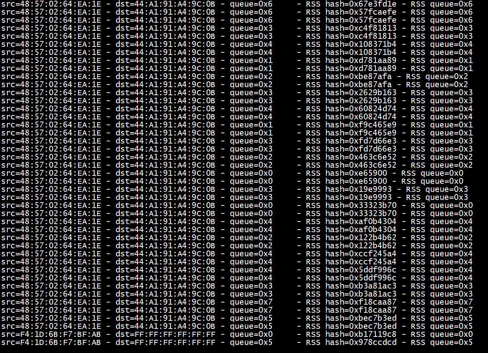

# 设置RSS

+ rss_config_port(&dev_conf,&dev_info)  

+  port_conf.rx_adv_conf.rss_conf = dev_conf.rx_adv_conf.rss_conf;    
conf->rxmode.mq_mode = RTE_ETH_MQ_RX_RSS;    
+  port_conf.rxmode.mq_mode = dev_conf.rxmode.mq_mode; 

```

#if 1
        rss_init();
        rss_config_port(&dev_conf,&dev_info);
#endif
        if(dev_info.flow_type_rss_offloads & RTE_ETH_RSS_IPV4) {
            printf("support RTE_ETH_RSS_IPV4 \n");
        }
        if(dev_info.flow_type_rss_offloads &  RTE_ETH_RSS_FRAG_IPV4) {
            printf("support  RTE_ETH_RSS_FRAG_IPV4\n");
        }
        if(dev_info.flow_type_rss_offloads &  RTE_ETH_RSS_NONFRAG_IPV4_UDP) {
            printf("support  RTE_ETH_RSS_NONFRAG_IPV4_UDP\n");
        }
        if(dev_info.flow_type_rss_offloads &  RTE_ETH_RSS_NONFRAG_IPV4_TCP) {
            printf("support  RTE_ETH_RSS_NONFRAG_IPV4_TCP\n");
        }
        port_conf.txmode.offloads &= dev_info.tx_offload_capa;
        port_conf.rx_adv_conf.rss_conf = dev_conf.rx_adv_conf.rss_conf;
        port_conf.rxmode.mq_mode = dev_conf.rxmode.mq_mode;
        printf(":: initializing port: %d\n", port_id);
        ret = rte_eth_dev_configure(port_id,
                                nr_queues, nr_queues, &port_conf);
        if (ret < 0) {
```

# run

