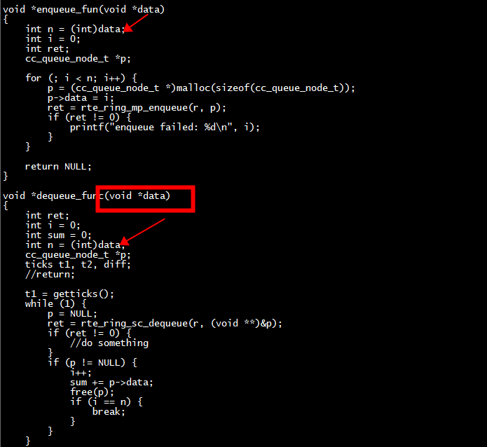
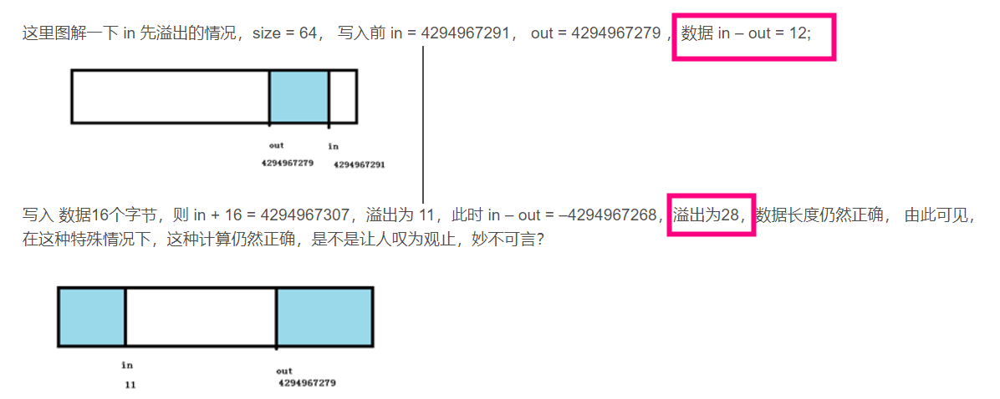

# 指针和整型数据

在64位系统中void * 是8字节，而int是4字节



## 指针对齐（uintptr_t的长度等于sizeof(void*)）
```

/**
 * Macro to align a pointer to a given power-of-two. The resultant
 * pointer will be a pointer of the same type as the first parameter, and
 * point to an address no higher than the first parameter. Second parameter
 * must be a power-of-two value.
 */
#define RTE_PTR_ALIGN_FLOOR(ptr, align) \
        ((typeof(ptr))RTE_ALIGN_FLOOR((uintptr_t)ptr, align))

/**
 * Macro to align a value to a given power-of-two. The resultant value
 * will be of the same type as the first parameter, and will be no
 * bigger than the first parameter. Second parameter must be a
 * power-of-two value.
 */
#define RTE_ALIGN_FLOOR(val, align) \
        (typeof(val))((val) & (~((typeof(val))((align) - 1))))
```

在64位系统下

```
root@ubuntux86:# uname -a
Linux ubuntux86 5.13.0-39-generic #44~20.04.1-Ubuntu SMP Thu Mar 24 16:43:35 UTC 2022 x86_64 x86_64 x86_64 GNU/Linux
root@ubuntux86:# 
```
 
```
#include <string.h>
#include <stdio.h>
#include <stdint.h>
int main()
{
    printf("%lu\n",sizeof(uintptr_t));
    printf("%lu\n",sizeof(void*));
    return 0;
}
root@ubuntux86:# gcc test.c  -o test 
root@ubuntux86:# ./test 
8
8
```

# 移植

+ 1 内存屏障实现,x86如下

```
#define rte_mb() _mm_mfence()

#define rte_wmb() _mm_sfence()

#define rte_rmb() _mm_lfence()

#define rte_smp_wmb() rte_compiler_barrier()

#define rte_smp_rmb() rte_compiler_barrier()
```
+ 2  RTE_CACHE_LINE_SIZE

+ 3  rte_atomic32_cmpset移植,arch64使用RTE_FORCE_INTRINSICS

+ 4  rte_pause

+ 5  rte_rdtsc_precise

# ring

***Derived from FreeBSD's bufring.c***

# 平台相关
+ RTE_ARCH_X86
+ RTE_ARCH_64 
+  RTE_ARCH_I686


```
librte_eal/common/include/arch/ppc_64/rte_atomic.h:29:#define rte_smp_wmb() rte_wmb()
librte_eal/common/include/arch/x86/rte_atomic.h:30:#define rte_smp_wmb() rte_compiler_barrier()
librte_eal/common/include/arch/arm/rte_atomic_32.h:26:#define rte_smp_wmb() rte_wmb()
librte_eal/common/include/arch/arm/rte_atomic_64.h:33:#define rte_smp_wmb() dmb(ishst)
librte_eal/common/include/generic/rte_atomic.h:64: * rte_smp_wmb() call are globally visible across the lcores
librte_eal/common/include/generic/rte_atomic.h:67:static inline void rte_smp_wmb(void);
```
##  RTE_ARCH_I686
```
#ifdef RTE_ARCH_I686
#include "rte_atomic_32.h"
#else
#include "rte_atomic_64.h"
#endif
```

```
static __rte_always_inline void
rte_smp_mb(void)
{
#ifdef RTE_ARCH_I686
        asm volatile("lock addl $0, -128(%%esp); " ::: "memory");
#else
        asm volatile("lock addl $0, -128(%%rsp); " ::: "memory");
#endif
}
```
## x86 pk arch64 in  memory fence 

+ 64
```
#define rte_mb() dsb(sy)

#define rte_wmb() dsb(st)

#define rte_rmb() dsb(ld)

#define rte_smp_mb() dmb(ish)

#define rte_smp_wmb() dmb(ishst)

#define rte_smp_rmb() dmb(ishld)

#define rte_io_mb() rte_mb()

#define rte_io_wmb() rte_wmb()

#define rte_io_rmb() rte_rmb()

#define rte_cio_wmb() dmb(oshst)

#define rte_cio_rmb() dmb(oshld)
```
+ x86
```

#define rte_mb() _mm_mfence()

#define rte_wmb() _mm_sfence()

#define rte_rmb() _mm_lfence()

#define rte_smp_wmb() rte_compiler_barrier()

#define rte_smp_rmb() rte_compiler_barrier()
```

## RTE_FORCE_INTRINSICS

arm use RTE_FORCE_INTRINSICS   
x86 not use RTE_FORCE_INTRINSICS  

# cache line size

```
/** Force alignment to cache line. */
#define __rte_cache_aligned __rte_aligned(RTE_CACHE_LINE_SIZE)
```

```
cat rte_config.h
#ifndef __RTE_CONFIG_H
#define __RTE_CONFIG_H
#define RTE_CACHE_LINE_SIZE 128
#endif /* __RTE_CONFIG_H */
```

#  32位index

```
volatile uint32_t head;
volatile uint32_t tail;
```

```
static inline int
rte_atomic32_cmpset(volatile uint32_t *dst, uint32_t exp, uint32_t src)
{
#ifndef RTE_FORCE_INTRINSICS
    uint8_t res;

    asm volatile(
            MPLOCKED
            "cmpxchgl %[src], %[dst];"
            "sete %[res];"
            : [res] "=a" (res),     /* output */
              [dst] "=m" (*dst)
            : [src] "r" (src),      /* input */
              "a" (exp),
              "m" (*dst)
            : "memory");            /* no-clobber list */
    return res;
#else
    return __sync_bool_compare_and_swap(dst, exp, src);
#endif
}
```
#  kfifo 的缓冲区大小必须为 2 的次幂
[kfifo 的缓冲区大小必须为 2 的次幂](https://blog.csdn.net/qq_23174771/article/details/130994106)
```
     if ((!POWEROF2(count)) || (count > RTE_RING_SZ_MASK)) {
#if TRANSPLANT_RING
#else
                        RTE_LOG(ERR, RING,
                                "Requested size is invalid, must be power of 2, and not exceed the size limit %u\n",
                                RTE_RING_SZ_MASK);
#endif
                        return -EINVAL;
                }
```

优点：

+ 1 实现单消费者和单生产者的无锁并发访问。多消费者和多生产者的时候还是需要加锁的。   
+ 2 保证缓冲区大小为2的次幂，使用与运算in & (size-1)代替模运算   
+    3 在更新in或者out的值时不做模运算，而是让其自动溢出。这应该是kfifo实现最牛叉的地方了，利用溢出后的值参与运算，并且能够保证结果的正确。溢出运算保证了以下几点：
+ 4 in - out为缓冲区中的数据长度
+ 5 size - in + out 为缓冲区中空闲空间
+ 6 in == out时缓冲区为空


## 数值溢出
in: enqueue 指针   
out: dequeu指针   


### test1
```
#include <string.h>
#include <stdio.h>
#include <bsd/string.h>
#include <stdint.h>
int main()
{
    // power of 2
    unsigned char in = 1, out = 255;
    unsigned char diff = in - out;
    unsigned char next,in2end,out2end;
    next = out +1;
    printf("in %u, out %u,diff %u,  next %u\n",in, out,diff, next);
    in = 255, out = 1;
    diff = in - out;
    printf("diff %u \n",diff);
    return 0;
}
in 1, out 255,diff 2,  next 0
diff 254 
```

## test2

```
#include <string.h>
#include <stdio.h>
#include <bsd/string.h>
#include <stdint.h>
int main()
{
    // power of 2
    unsigned char size = 128;
    unsigned char in = 0, out = 127;
    unsigned char diff = in - out;
    unsigned char next,in2end,out2end;
    next = out +1;
    in2end = size - (in &(size -1));
    out2end = size - (out &(size -1));
    printf("in %u, out %u,diff %u, diff&size %u,  next %u\n",in, out,diff, diff&size,next);
    printf("in2end %u, out2end %u\n",in2end, out2end);
    in = 127, out = 0;
    diff = in - out;
    printf("in %u, out %u,diff %u, diff&size %u\n",in, out,diff, diff&size);
    in2end = size - (in &(size -1));
    out2end = size - (out &(size -1));
    printf("in2end %u, out2end %u\n",in2end, out2end);
    return 0;
}
root@ubuntux86:# gcc test3.c  -o test
root@ubuntux86:# ./test 
in 0, out 127,diff 129, diff&size 128,  next 128
in2end 128, out2end 1
in 127, out 0,diff 127, diff&size 0
in2end 1, out2end 128
```
+ 1、unsigned char in = 0, out = 127
diff 129, diff&size 128,真正的大小是128（取模），队列空了
+ 2  in 127, out 0，diff 127, diff&size 0，队列满了了


注意这里 只是用了 fifo->out += len 也未取模，同样unsigned int的溢出性质，当out 持续增加到溢出时又会被置为0，如果in先溢出，出现 in < out 的情况，那么 in – out 为负数（又将溢出），in – out 的值还是为buffer中数据的长度。



## head

### dpdk  __rte_ring_move_prod_head
```
static __rte_always_inline unsigned int
__rte_ring_move_prod_head(struct rte_ring *r, unsigned int is_sp,
                unsigned int n, enum rte_ring_queue_behavior behavior,
                uint32_t *old_head, uint32_t *new_head,
                uint32_t *free_entries)
{
        const uint32_t capacity = r->capacity;
        unsigned int max = n;
        int success;

        do {
                /* Reset n to the initial burst count */
                n = max;

                *old_head = r->prod.head;

                /* add rmb barrier to avoid load/load reorder in weak
                 * memory model. It is noop on x86
                 */
                rte_smp_rmb();

                /*
                 *  The subtraction is done between two unsigned 32bits value
                 * (the result is always modulo 32 bits even if we have
                 * *old_head > cons_tail). So 'free_entries' is always between 0
                 * and capacity (which is < size).
                 */
                *free_entries = (capacity + r->cons.tail - *old_head);

                /* check that we have enough room in ring */
                if (unlikely(n > *free_entries))
                        n = (behavior == RTE_RING_QUEUE_FIXED) ?
                                        0 : *free_entries;

                if (n == 0)
                        return 0;

                *new_head = *old_head + n;
                if (is_sp)
                        r->prod.head = *new_head, success = 1;
                else
                        success = rte_atomic32_cmpset(&r->prod.head,
                                        *old_head, *new_head);
        } while (unlikely(success == 0));
        return n;
}
```
调用 rte_atomic32_cmpset   

### __rte_ring_move_cons_head
```
static __rte_always_inline unsigned int
__rte_ring_move_cons_head(struct rte_ring *r, unsigned int is_sc,
                unsigned int n, enum rte_ring_queue_behavior behavior,
                uint32_t *old_head, uint32_t *new_head,
                uint32_t *entries)
{
        unsigned int max = n;
        int success;

        /* move cons.head atomically */
        do {
                /* Restore n as it may change every loop */
                n = max;

                *old_head = r->cons.head;

                /* add rmb barrier to avoid load/load reorder in weak
                 * memory model. It is noop on x86
                 */
                rte_smp_rmb();

                /* The subtraction is done between two unsigned 32bits value
                 * (the result is always modulo 32 bits even if we have
                 * cons_head > prod_tail). So 'entries' is always between 0
                 * and size(ring)-1.
                 */
                *entries = (r->prod.tail - *old_head);

                /* Set the actual entries for dequeue */
                if (n > *entries)
                        n = (behavior == RTE_RING_QUEUE_FIXED) ? 0 : *entries;

                if (unlikely(n == 0))
                        return 0;

                *new_head = *old_head + n;
                if (is_sc) {
                        r->cons.head = *new_head;
                        rte_smp_rmb();
                        success = 1;
                } else {
                        success = rte_atomic32_cmpset(&r->cons.head, *old_head,
                                        *new_head);
                }
        } while (unlikely(success == 0));
        return n;
}
```
## tail
```
static __rte_always_inline void
update_tail(struct rte_ring_headtail *ht, uint32_t old_val, uint32_t new_val,
                uint32_t single, uint32_t enqueue)
{
        if (enqueue)
                rte_smp_wmb();
        else
                rte_smp_rmb();
        /*
         * If there are other enqueues/dequeues in progress that preceded us,
         * we need to wait for them to complete
         */
        if (!single)
                while (unlikely(ht->tail != old_val))
                        rte_pause();

        ht->tail = new_val;
}
```

# test2

***没有实现rte_Xmb、rte_smp_Xmb***

x86上运行
```
/work/test/nginx$ uname -a
Linux ubuntux86 5.13.0-39-generic #44~20.04.1-Ubuntu SMP Thu Mar 24 16:43:35 UTC 2022 x86_64 x86_64 x86_64 GNU/Linux
```

```
root@ubuntux86:# gcc rte_ring.c rte_ring_main2.c  -o test -lpthread -g
root@ubuntux86:# ./test 
start enqueue, 5 producer threads, echo thread enqueue 2000 numbers.
expected sum: 9995000
start dequeue, 1 consumer thread.
time diff: 4662470
dequeue total: 10000, sum: 9995000
root@ubuntux86:# 
```
expected sum: 9995000 等于 sum: 9995000


# test3
移植：    
+ 1 dpdk version :  dpdk-19.11   
+ 2 定义了#define TRANSPLANT_RING 1   
+ 3 添加了rte_ring_generic.h 的include头文件    

##  implicit declaration of function ‘strlcpy’;
```
test.c: In function ‘main’:
test.c:7:7: warning: implicit declaration of function ‘strlcpy’; did you mean ‘strncpy’? [-Wimplicit-function-declaration]
    7 |       strlcpy(buf, src, sizeof(buf));
      |       ^~~~~~~
      |       strncpy
```

```
apt-get install libbsd-dev
#include <bsd/string.h>
gcc test.c -o test -lbsd
```


```
 gcc rte_ring.c rte_ring_main.c  -o test -lpthread -g -I./ -I./common/include/arch/ -I ./common/include/arch/arm   -I./common/include/  -DRTE_ARCH_64 -DRTE_FORCE_INTRINSICS=1 -lbsd
```


## x86

```
#include <emmintrin.h>
for  mm_sfence/mm_lfence
```

```
root@ubuntux86:# uname -a
Linux ubuntux86 5.13.0-39-generic #44~20.04.1-Ubuntu SMP Thu Mar 24 16:43:35 UTC 2022 x86_64 x86_64 x86_64 GNU/Linux
root@ubuntux86:# 
```

```
root@ubuntux86:# ./test 
start enqueue, 5 producer threads, echo thread enqueue 2000 numbers.
expected sum: 9995000
start dequeue, 1 consumer thread.
time diff: 17927528
dequeue total: 10000, sum: 9995000
ring <test>@0x7f180da9b010
  flags=0
  size=16777216
  capacity=16777215
  ct=10000
  ch=10000
  pt=10000
  ph=10000
  used=0
  avail=16777215
root@ubuntux86:# uname -a
Linux ubuntux86 5.13.0-39-generic #44~20.04.1-Ubuntu SMP Thu Mar 24 16:43:35 UTC 2022 x86_64 x86_64 x86_64 GNU/Linux
root@ubuntux86:# 
```

## arch64
 make platform=arch64   

```
[root@centos7 test2]# uname -a
Linux centos7 4.14.0-115.el7a.0.1.aarch64 #1 SMP Sun Nov 25 20:54:21 UTC 2018 aarch64 aarch64 aarch64 GNU/Linux
[root@centos7 test2]# 
```

```
[root@centos7 test2]# make platform=arch64
gcc -c -I./ -I./common/include/arch/ -I ./common/include/arch/arm -I./common/include/  -DRTE_ARCH_64 -DRTE_FORCE_INTRINSICS=1 rte_ring_main.c -o rte_ring_main.o
gcc -c -I./ -I./common/include/arch/ -I ./common/include/arch/arm -I./common/include/  -DRTE_ARCH_64 -DRTE_FORCE_INTRINSICS=1 rte_ring.c -o rte_ring.o
gcc -g -o test rte_ring_main.o rte_ring.o -lbsd  -lpthread
[root@centos7 test2]# ./test 
start enqueue, 5 producer threads, echo thread enqueue 2000 numbers.
expected sum: 9995000
start dequeue, 1 consumer thread.
time diff: 224546
dequeue total: 10000, sum: 9995000
ring <test>@0xffffb3e90010
  flags=0
  size=16777216
  capacity=16777215
  ct=10000
  ch=10000
  pt=10000
  ph=10000
  used=0
  avail=16777215
```

## # test3-1

+ 1 添加rte_ring_get_memsize(unsigned count) 

# fence

```
root@ubuntux86:# gcc fence.c  -o fence
root@ubuntux86:# ./fence 
Thread 2: sharedData = 1
root@ubuntux86:# 
```