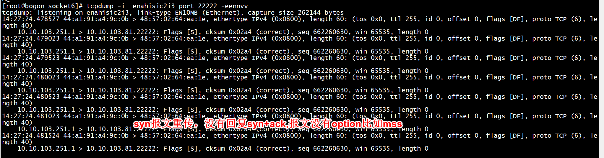
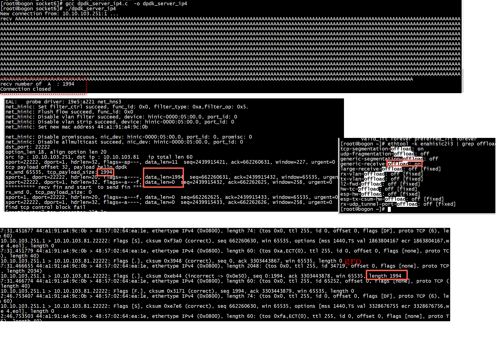
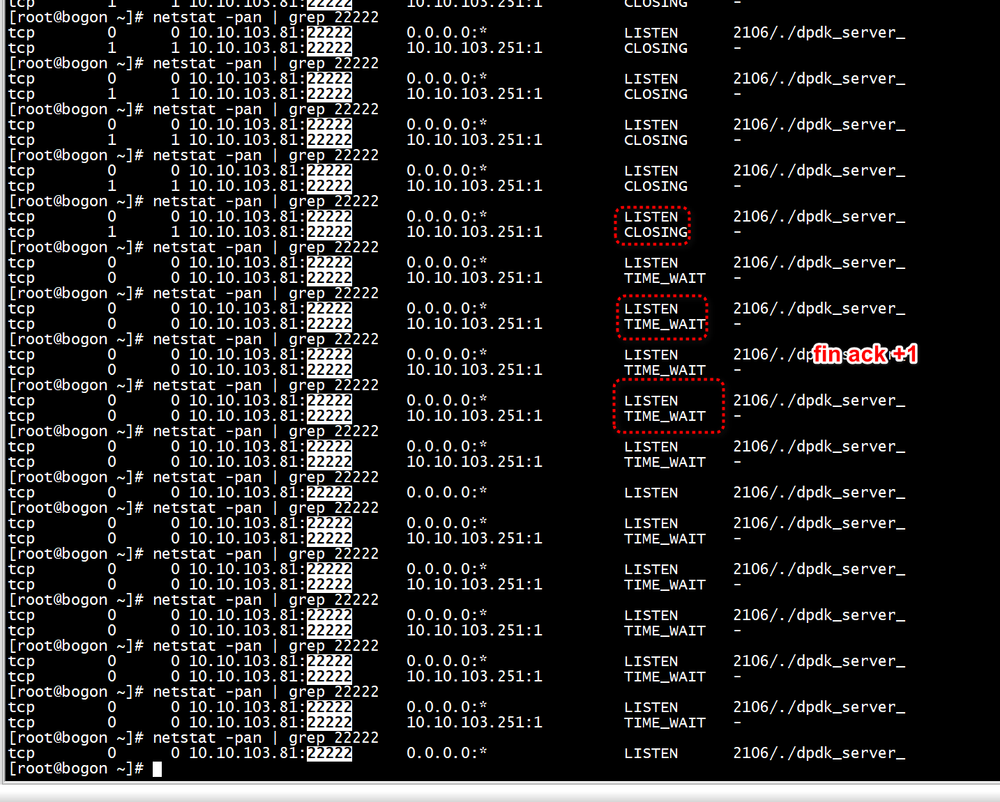

# tcp-generator

```
./build/tcp-generator  -n 4 -c 0xff -- -r exponential -r 100000 -f 1 -s 128 -t 10 -q 1 -c addr.cfg -o output.dat
```


 

+ server
设置邻居表
```
ip n add  10.10.103.251 dev enahisic2i3   lladdr 44:a1:91:a4:9c:0b
```

```
iperf -s -p22222
```

> ## 使用gso
```
./build/tcp-generator  -n 4 -c 0xff -- -r exponential -r 100000 -f 1 -s 2048 -t 10 -q 1 -c addr.cfg -o output.dat
```

```C
#if DBUG_TCP_GSO
        if(tcp_payload_size >  RTE_ETHER_MTU)
        {
            pkt->ol_flags |= PKT_TX_TCP_SEG;
            pkt->tso_segsz = 1024;
        }
#endif
```

 

# 大小端  


+ ip地址采用大端  
```
#define IPV4_ADDR(a, b, c, d)         (((d & 0xff) << 24) | ((c & 0xff) << 16) | ((b & 0xff) << 8) | (a & 0xff))
```

```
util.c:321:             src_ipv4_addr = IPV4_ADDR(b3, b2, b1, b0);
util.c:327:             dst_ipv4_addr = IPV4_ADDR(b3, b2, b1, b0);
```

+ port采用大端  
```C
 tcp_control_blocks[i].dst_port = rte_cpu_to_be_16(dst_tcp_port + (i % nr_servers));
         for(i = 0; i < nr_flows; i++) {
                ports[i] = rte_cpu_to_be_16((i % (nr_flows/nr_servers)) + 1);
        }
        //
```

# tcp option

+ tcp option添加  
```C
#if 0
        option_len += add_mss_option(tcp_hdr,TCP4_OP_MSS);
#else
        option_len = add_syn_opts(tcp_hdr);
        option_len = pad_option(tcp_hdr,option_len);
#endif
```


```C
static inline void
fill_tcph(struct rte_tcp_hdr *l4h, const struct tcb *tcb, union l4_ports port,
	uint32_t seq, uint8_t hlen, uint8_t flags)
{
	uint16_t wnd;

	l4h->src_port = port.dst;
	l4h->dst_port = port.src;

	wnd = (flags & TCP_FLAG_SYN) ?
		RTE_MIN(tcb->rcv.wnd, (uint32_t)UINT16_MAX) :
		tcb->rcv.wnd >> tcb->rcv.wscale;

	/* ??? use sse shuffle to hton all remaining 16 bytes at once. ??? */
	l4h->sent_seq = rte_cpu_to_be_32(seq);
	l4h->recv_ack = rte_cpu_to_be_32(tcb->rcv.nxt);
	l4h->data_off = hlen / TCP_DATA_ALIGN << TCP_DATA_OFFSET;
	l4h->tcp_flags = flags;
	l4h->rx_win = rte_cpu_to_be_16(wnd);
	l4h->cksum = 0;
	l4h->tcp_urp = 0;

	if (flags & TCP_FLAG_SYN)
		fill_syn_opts(l4h + 1, &tcb->so);
	else if ((flags & TCP_FLAG_RST) == 0 && tcb->so.ts.raw != 0)
		fill_tms_opts(l4h + 1, tcb->snd.ts, tcb->rcv.ts);
}
```


# tcp  CLOSING状态

```Text
有两种情况： 
第一种，由于ACK of FIN可能丢失，所以当被动关闭端发出的ACK丢失，而被动关闭端紧接着又发出了FIN，那么主动关闭端会先收到FIN，从而进入CLOSING状态。 第二种，两端都在还未收到FIN的的情况，发出了FIN，即两端同时关闭，那么可能出现发出FIN后还没收到对应的ACK，立马就收到对端发出的FIN。第二种情况下，两端都是主动关闭端，它们都是首先从ESTAB状态进入FINWAIT_1状态，不再走CLOSE_WAIT那条状态迁移路线。
```

 
出现这种情况是fin的ack报文没有在tcp_hdr->sent_seq的基础上加1，导致server端以为ACK丢失   

```C
      if((tcp_hdr->tcp_flags & RTE_TCP_FIN_FLAG) || check_tcp_close_state(block)) {
            dpdk_dump_tcph(tcp_hdr,packet_data_size + (tcp_hdr->data_off >> 4)*4);
            if(0 == packet_data_size && (tcp_hdr->tcp_flags & RTE_TCP_FIN_FLAG)){
                 // fin need +1
                 packet_data_size +=1;
            }
            update_tcp_fin_wind(block,tcp_hdr,packet_data_size);
            return tcp_process_fin(flow_id, rx_conf,block,tcp_hdr->tcp_flags,0);
        }
```

# references

[Packet Batch (DPDK)](https://github.com/Packet-Batch/PB-DPDK)   
[simple-packet-gen](https://github.com/alonrs/simple-packet-gen/blob/bfa6bbb84054db0c45ef4db642e6c3356bd6851f/lib/generator.c)  

[tldk/lib/libtle_l4p/tcp_rxtx.c](https://github.com/FDio/tldk/blob/76592f906ad040f5d99203c94719366ef42d2167/lib/libtle_l4p/tcp_rxtx.c#L208)