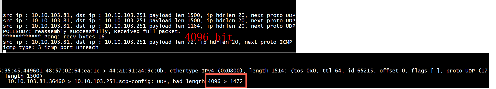
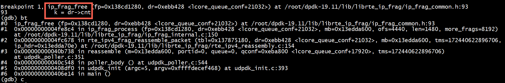
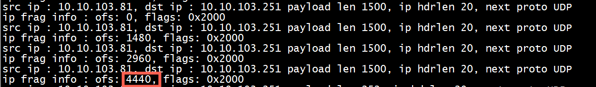
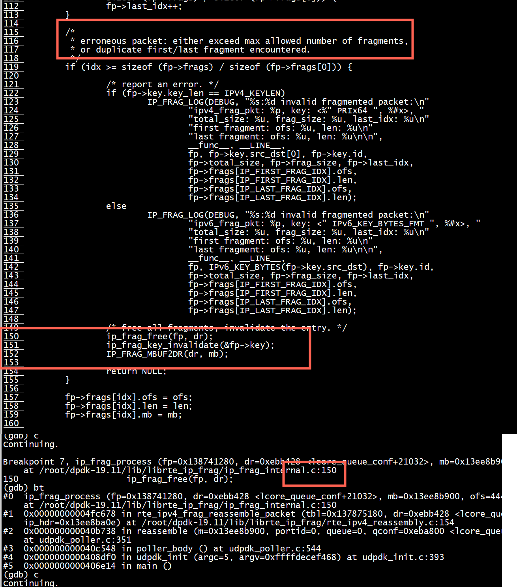

# make

> ## make libudpdk.a
+ makefile   

```
RTE_TARGET ?= arm64-armv8a-linuxapp-gcc
#UDPDK_DPDK=${DEPSDIR}/dpdk/${RTE_TARGET}
UDPDK_DPDK=/root/dpdk-19.11/${RTE_TARGET}
```

+ make   
```
[root@centos7 udpdk]# pwd
/root/dpdk-19.11/examples/udp/UDPDK/udpdk
[root@centos7 udpdk]# make
```

> ## make  pingpong

+ makefile   
```
RTE_TARGET ?= arm64-armv8a-linuxapp-gcc
UDPDK_DPDK_INCLUDE=/root/dpdk-19.11/${RTE_TARGET}/include
```
+ make

```
[root@centos7 pingpong]# make
./pingpong -c ./config.ini -f pong
```   
+ gdb  

```
 set follow-fork-mode child
```

# udp 校验和


> ## 伪首部(pseudo header)
通常有TCP伪首部和UDP伪首部。在UDP/TCP伪首部中，包含：   
32位源IP地址。  
32位目的IP地址。  
8位填充0。  
8位协议。  
16位UDP长度(IP数据报长度)。   
 伪首部并非TCP&UDP数据报中实际的有效成分。伪首部是一个虚拟的数据结构，其中的信息是从数据报所在IP分组头的分组头中提取的，既不向下传送也不向上递交，而仅仅是为计算校验和。   
 

# test  pingpong

+ 1 发送端发送4096字节



1500 + 1500 + 1164 - 20 -20 -20 -8 = 4096   

+ 2 发送端发送 #define TCP_SEND_LEN (2048*3)，超过ip报文最大长度


重组失败的原因是发生了 ip_frag_free：



出现这个分片后（超过四个）的，调用 ip_frag_free   
```
src ip : 10.10.103.81, dst ip : 10.10.103.251 payload len 1500, ip hdrlen 20, next proto UDP 
ip frag info : ofs: 4440, flags: 0x2000
```


+  超出了`最多 frags` : RTE_LIBRTE_IP_FRAG_MAX_FRAG 4



```

#define MAX_FRAG_NUM RTE_LIBRTE_IP_FRAG_MAX_FRAG
#define RTE_LIBRTE_IP_FRAG_MAX_FRAG 4

 if (idx >= sizeof (fp->frags) / sizeof (fp->frags[0]))
```


```
enum {
        IP_LAST_FRAG_IDX,    /**< index of last fragment */
        IP_FIRST_FRAG_IDX,   /**< index of first fragment */
        IP_MIN_FRAG_NUM,     /**< minimum number of fragments */
        IP_MAX_FRAG_NUM = RTE_LIBRTE_IP_FRAG_MAX_FRAG,
        /**< maximum number of fragments per packet */
};

```

```
struct ip_frag_pkt {
        TAILQ_ENTRY(ip_frag_pkt) lru;   /**< LRU list */
        struct ip_frag_key key;           /**< fragmentation key */
        uint64_t             start;       /**< creation timestamp */
        uint32_t             total_size;  /**< expected reassembled size */
        uint32_t             frag_size;   /**< size of fragments received */
        uint32_t             last_idx;    /**< index of next entry to fill */
        struct ip_frag       frags[IP_MAX_FRAG_NUM]; /**< fragments */
} __rte_cache_aligned;
```

# rte_ipv4_frag_reassemble_packet

使用rte_ipv4_frag_reassemble_packet之前要设置m->l2_len、m->l3_len
```
            // prepare mbuf (setup l2_len/l3_len)
            m->l2_len = sizeof(*eth_hdr);
            m->l3_len = sizeof(*ip_hdr);

            // Handle this fragment (returns # of fragments if all already received, NULL otherwise)
            mo = rte_ipv4_frag_reassemble_packet(tbl, dr, m, tms, ip_hdr);
```


