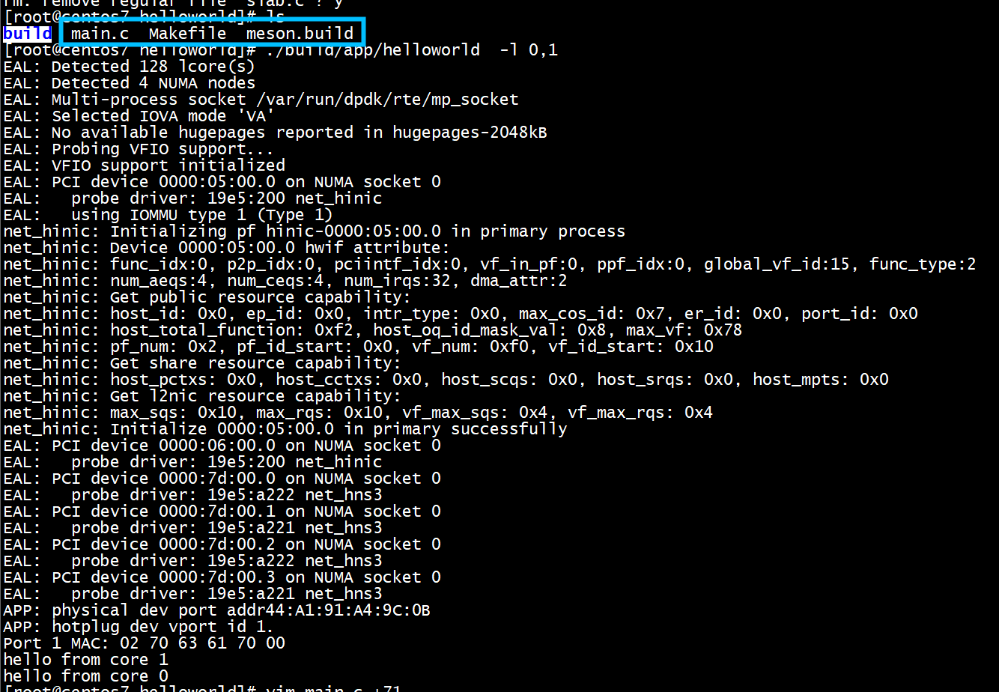

#  TAP/TUN设备
可以使用内核提供的TAP/TUN设备，这种设备的使用需要使用系统调用，并涉及到copy_to_user()和copy_from_user()的开销。DPDK也支持了tun/tap pmd（详见：），可以通过vdev参数指定创建tap设备。对应命令行如下：

--vdev=net_tap0,iface=foo0  --vdev=net_tap1,iface=foo1, ...


# virtio_user_pmd_probe
执行下述代码   
```
       //snprintf(portname, strlen("pdump-vdev") + 1, "%s", "pdump-vdev");
       snprintf(portname, sizeof(portname), "virtio_user%u", port_id);
       snprintf(portargs, strlen("tx_pcap=report.pcap") + 1, "tx_pcap=%s", "report.pcap");
	    res = rte_eal_hotplug_add("vdev", portname, portargs);
```
报错：   
```
virtio_user_pmd_probe(): error when parsing param
EAL: Driver cannot attach the device (virtio_user0)
EAL: Failed to attach device on primary process
APP: add hotplug dev fail.
```
# net_pcap
```
#define VDEV_NAME_FMT "net_pcap_%s_%d"
snprintf(portname, sizeof(portname),VDEV_NAME_FMT, "pdump", 0);
snprintf(portargs, strlen("tx_pcap=report.pcap") + 1, "tx_pcap=%s", "report.pcap");
res = rte_eal_hotplug_add("vdev", portname, portargs);
```

## RTE_PMD_REGISTER_VDEV
```
static struct rte_vdev_driver pmd_pcap_drv = {
        .probe = pmd_pcap_probe,
        .remove = pmd_pcap_remove,
};

RTE_PMD_REGISTER_VDEV(net_pcap, pmd_pcap_drv);
RTE_PMD_REGISTER_ALIAS(net_pcap, eth_pcap);
RTE_PMD_REGISTER_PARAM_STRING(net_pcap,
        ETH_PCAP_RX_PCAP_ARG "=<string> "
        ETH_PCAP_TX_PCAP_ARG "=<string> "
        ETH_PCAP_RX_IFACE_ARG "=<ifc> "
        ETH_PCAP_RX_IFACE_IN_ARG "=<ifc> "
        ETH_PCAP_TX_IFACE_ARG "=<ifc> "
        ETH_PCAP_IFACE_ARG "=<ifc> "
        ETH_PCAP_PHY_MAC_ARG "=<int>"
        ETH_PCAP_INFINITE_RX_ARG "=<0|1>");
```

```
(gdb) bt
#0  0x00000000007eaaa4 in pmd_pcap_probe ()
#1  0x0000000000467440 in vdev_probe_all_drivers.part.1 ()
#2  0x0000000000552fd0 in local_dev_probe ()
#3  0x00000000005534c0 in rte_dev_probe ()
#4  0x0000000000553638 in rte_eal_hotplug_add ()
#5  0x0000000000482948 in setup_ct_vdev.constprop.0 ()
#6  0x0000000000479e5c in main ()
(gdb) c
```

## pdump vdev eth_dev_ops

```
static const struct eth_dev_ops ops = {
        .dev_start = eth_dev_start,
        .dev_stop = eth_dev_stop,
        .dev_close = eth_dev_close,
        .dev_configure = eth_dev_configure,
        .dev_infos_get = eth_dev_info,
        .rx_queue_setup = eth_rx_queue_setup,
        .tx_queue_setup = eth_tx_queue_setup,
        .rx_queue_start = eth_rx_queue_start,
        .tx_queue_start = eth_tx_queue_start,
        .rx_queue_stop = eth_rx_queue_stop,
        .tx_queue_stop = eth_tx_queue_stop,
        .rx_queue_release = eth_queue_release,
        .tx_queue_release = eth_queue_release,
        .link_update = eth_link_update,
        .stats_get = eth_stats_get,
        .stats_reset = eth_stats_reset,
};
```

## pdump vdev rx

```
eth_dev->rx_pkt_burst = eth_pcap_rx
eth_dev->tx_pkt_burst = eth_pcap_tx
```

# pdump 

```
 ovs-vsctl add-port br0 pcap0 -- \
        set Interface pcap0 type=dpdk options:dpdk-devargs=net_pcap0
        "rx_pcap=fuzzy.pcap"
--vdev net_pcap0,iface=veth0 --vdev net_pcap1,iface=veth1
```

# run



```
APP: physical dev port addr44:A1:91:A4:9C:0B
APP: hotplug dev vport id 1.
Port 1 MAC: 02 70 63 61 70 00
```
vdev Port 1 MAC: 02 70 63 61 70 00   

执行后多了一个report.pcap   
```
[root@centos7 helloworld]# ls
build  main.c  Makefile  meson.build  report.pcap
[root@centos7 helloworld]# 
```