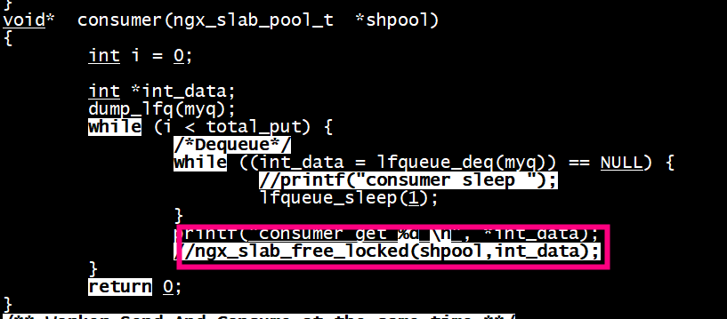
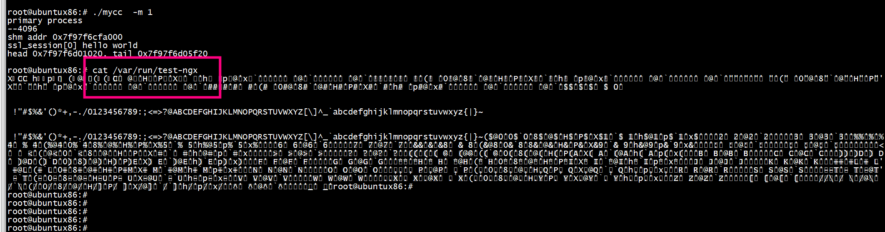

# ABA问题
```Text
CAS算法有一个缺陷，就是会产生ABA问题。ABA问题是指，在执行旧值缓存到本地局部变量和CAS操作之间，线程被切换走，旧值被修改了两次以上，恰好与原旧值相同。cas函数误认为数据没有发生变化，而实际上，数据已经与原来不一样了，

有以上的pop函数为例，pop函数中，next = curr->next 和 while之间，线程被切换走，然后其他线程先把A弹出，又把B弹出，然后又把A压入，栈变成 了A --> C，此时head还是指向A，cas判断可以做交换，把head指向next，即head指向了B。但是此时，B已经不在队列里了。

ABA问题，通常通过添加操作计数来解决。cas中，除了对比*p与变量old外，还需要对比操作计数是否改变。如果值和操作计数都没有改变，才算cas成功，才可以给*p赋于新值。
```

```
push(node):
    curr := head
    old := curr
    node->next = curr
    while (old != (curr = CAS(&head, curr, node))) {
        old = curr
        node->next = curr
    }

pop():
    curr := head
    old := curr
    next = curr->next
    while (old != (curr = CAS(&head, curr, next))) {
        old = curr
        next = curr->next
    }
    return curr
```

#  Lock-free multi-producer / multi-consumer 
+ enqueue lfqueue_enq    
+ Dequeue  lfqueue_deq   
测试用例：     
```
void multi_enq_deq(pthread_t *threads) {
	printf("-----------%s---------------\n", "multi_enq_deq");
	int i;
	for (i = 0; i < nthreads; i++) {
		pthread_create(threads + i, NULL, worker_sc, NULL);
	}

	join_threads;
	// detach_thread_and_loop;
}
```
# ngx_lfqueue
[依赖的库](https://github.com/Taymindis/lfqueue)   
```
typedef struct {
	ngx_rbtree_t  rbtree;
	ngx_rbtree_node_t sentinel;
	ngx_slab_pool_t *shpool;
} ngx_http_lfqueue_shm_t;
ngx_http_lfqueue_shm_t *shm;
```
+ 创建lfqueue

```
_queues = ngx_slab_calloc(shm->shpool, mcf->_queue_names->nelts * sizeof(ngx_lfqueue_t));
```

+ lfqueue_init_mf 初始化
```
if (lfqueue_init_mf(&_queues[i].q, shm, ngx_lfqueue_alloc, ngx_lfqueue_free) == -1) {
				ngx_log_error(NGX_LOG_EMERG, cycle->log, 0, " lfqueue Initializing error... ");
				return NGX_ERROR;
			}
```
+ 内存allocor(lfqueue->pl)
```
typedef struct {
	ngx_rbtree_t  rbtree;
	ngx_rbtree_node_t sentinel;
	ngx_slab_pool_t *shpool;
} ngx_http_lfqueue_shm_t;
ngx_http_lfqueue_shm_t *shm;
```
+ malloc
```
// static ngx_int_t ngx_lfqueue_check_create_dir(const u_char *path);
static inline void* ngx_lfqueue_alloc(void *pl, size_t sz) {
	return ngx_slab_alloc( ((ngx_http_lfqueue_shm_t*)pl)->shpool, sz);
}
```
+ free   
```
static inline void ngx_lfqueue_free(void *pl, void *ptr) {
	ngx_slab_free( ((ngx_http_lfqueue_shm_t*)pl)->shpool, ptr);
}
```

# 内存回收
__lfq_check_free会调用_free，不需要再free
 
```
static void
__lfq_check_free(lfqueue_t *lfqueue) {
        lfq_time_t curr_time;
        if (__LFQ_BOOL_COMPARE_AND_SWAP(&lfqueue->in_free_mode, 0, 1)) {
                lfq_get_curr_time(&curr_time);
                lfqueue_cas_node_t *rtfree = lfqueue->root_free, *nextfree;
                while ( rtfree && (rtfree != lfqueue->move_free) ) {
                        nextfree = rtfree->nextfree;
                        if ( lfq_diff_time(curr_time, rtfree->_deactivate_tm) > 2) {
                                //      printf("%p\n", rtfree);
                                lfqueue->_free(lfqueue->pl, rtfree);
                                rtfree = nextfree;
                        } else {
                                break;
                        }
                }
                lfqueue->root_free = rtfree;
                __LFQ_BOOL_COMPARE_AND_SWAP(&lfqueue->in_free_mode, 1, 0);
        }
        __LFQ_SYNC_MEMORY();
}
```

# 多个生产者多个消费者
running_test(multi_enq_deq);
```

/** Worker Keep Sending at the same time, do not try instensively **/
void*  worker_s(void *arg)
{
        int i = 0, *int_data;
        int total_loop = total_put * (*(int*)arg);
        while (i++ < total_loop) {
                int_data = (int*)malloc(sizeof(int));
                assert(int_data != NULL);
                *int_data = i;
                /*Enqueue*/

                while (lfqueue_enq(myq, int_data)) {
                        // printf("ENQ FULL?\n");
                }
        }
        // __sync_add_and_fetch(&nthreads_exited, 1);
        return 0;
}

/** Worker Send And Consume at the same time **/
void*  worker_sc(void *arg)
{
        int i = 0;
        int *int_data;
        while (i < total_put) {
                int_data = (int*)malloc(sizeof(int));
                assert(int_data != NULL);
                *int_data = i++;
                /*Enqueue*/
                while (lfqueue_enq(myq, int_data)) {
                        printf("ENQ FULL?\n");
                }

                /*Dequeue*/
                while ((int_data = lfqueue_deq(myq)) == NULL) {
                        lfqueue_sleep(1);
                }
                // printf("%d\n", *int_data);
                free(int_data);
        }
        __sync_add_and_fetch(&nthreads_exited, 1);
        return 0;
}
```

# test1
内存分配大一点，nthreads = 1， total_put =50,防止出现ncx_slab_alloc() failed: no memory    
+ myq = queue_create(key,getpagesize()*1024);   
+ nthreads = 1;   
+ #define total_put 50   

```
-----------multi_enq_deq---------------
[E] [ncx_slab_alloc_pages:891] ncx_slab_alloc() failed: no memory
```

# run

```
root@ubuntux86:# ./cli  create   -k 12345 -s 1024 -c 16 -o  
[SUCESS] Create LFQueue
root@ubuntux86:# ./cli    produce -k  12345  -t 1
root@ubuntux86:# ./cli    consume -k  12345  -t 1
root@ubuntux86:# ./cli destroy 12345
```

# test2

##  /var/run/test-ngx


***/var/run/test-ngx文件存在***

##   LD_LIBRARY_PATH
```
export LD_LIBRARY_PATH=./common:$LD_LIBRARY_PATH
```

# references
[Taymindis/lfqueue](https://github.com/Taymindis/lfqueue/tree/master)  
[rusnikola/lfqueue](https://github.com/rusnikola/lfqueue/tree/master)   
[darkautism/lfqueue example](https://github.com/darkautism/lfqueue/tree/HP)   
[ngx_lfqueue ](https://github.com/Taymindis/ngx_lfqueue/tree/master)  