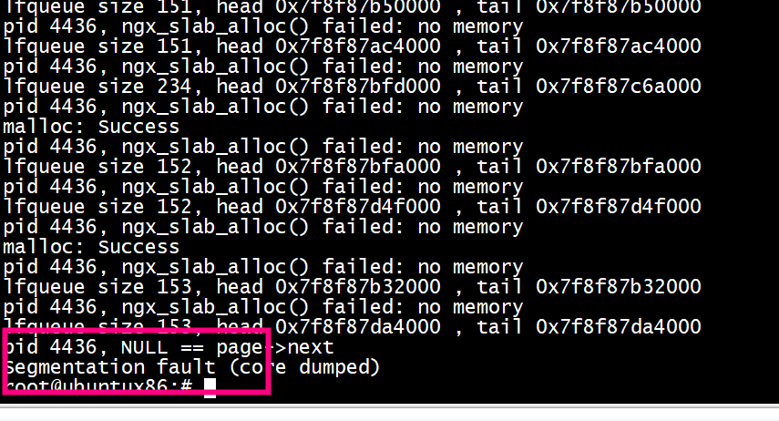
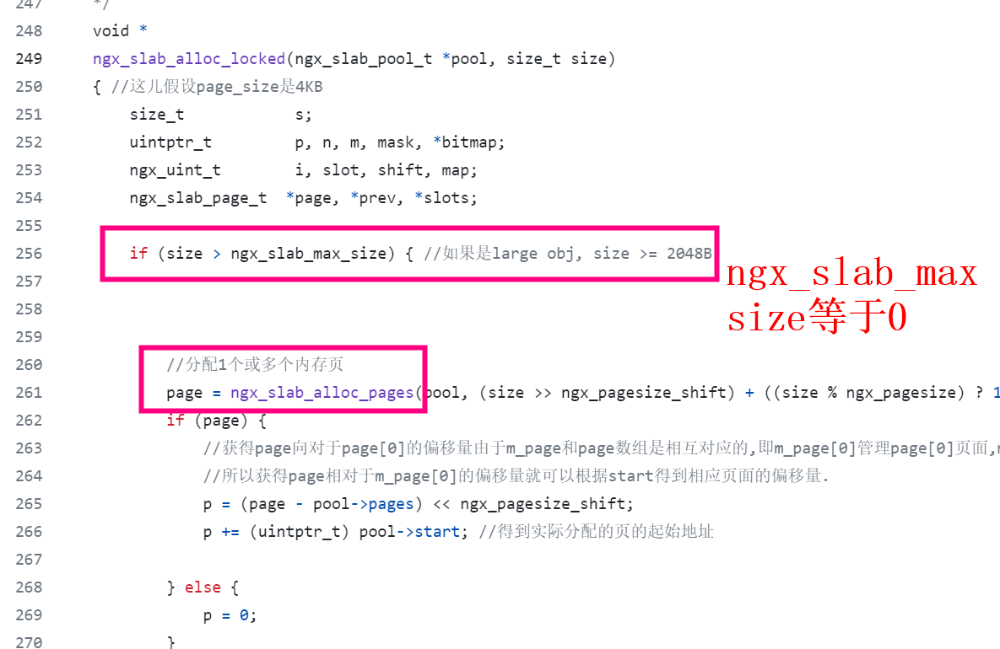
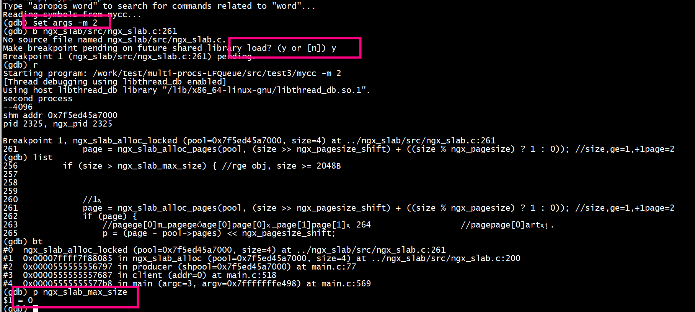
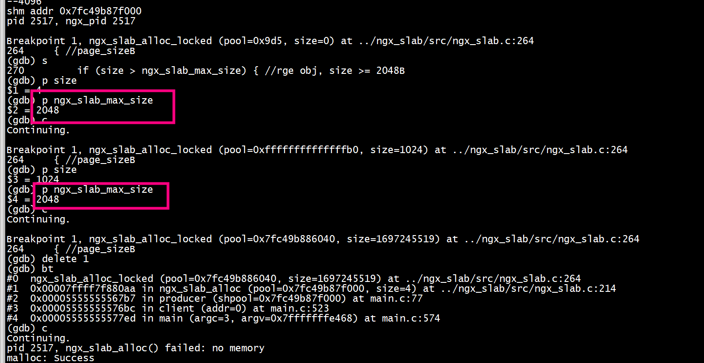

# run
```
export LD_LIBRARY_PATH=./common:$LD_LIBRARY_PATH
```
+ 1 第一步运行primary
```
./mycc -m 1
```
+ 2 第一步运行secondary
```
./mycc -m 2
```
#  consumer call  ngx_slab_free

```
void*  consumer(ngx_slab_pool_t  *shpool)
{
        int  i= 0, loop = 10;
        int *int_data;
        printf("pid %d, ngx_pid %d \n",getpid(), ngx_pid);
        dump_lfq(myq);
        //reset_lfqueue_free(myq,ngx_lfqueue_free);
#if 0
        while (i < total_put) {
#else
        while (!quit_signal) {
#endif
                loop = 5;
                /*Dequeue*/
                while ((int_data = sh_lfqueue_deq(sh_q)) == NULL) {
                        //printf("consumer sleep ");
                        printf("lfqueue size %lu, head %p , tail %p \n", sh_lfqueue_size(sh_q),sh_q->lf_q->head, sh_q->lf_q->tail);
                        sleep(1);

                        if(--loop <= 0)
                        {
                                break;
                        }
                }
                if(NULL != int_data)
                {
                    printf("consumer get %d \n", *int_data);
                    ngx_slab_free(shpool,int_data);
                }
                //ngx_slab_free_locked(shpool,int_data);
                ++ i;
        }
        return 0;
}
```


#  coredump

```
#0  ngx_slab_alloc_pages (pool=0x7f5ca286c000, pages=1) at ../ngx_slab/src/ngx_slab.c:889
889                     page->next->prev = (uintptr_t) &page[pages]; //poll->free->prev = &page[pages]ָ

                                                                                                       (gdb) bt
#0  ngx_slab_alloc_pages (pool=0x7f5ca286c000, pages=1) at ../ngx_slab/src/ngx_slab.c:889
#1  0x00007fdd02e52119 in ngx_slab_alloc_locked (pool=0x7f5ca286c000, size=32) at ../ngx_slab/src/ngx_slab.c:261
#2  0x00007fdd02e52085 in ngx_slab_alloc (pool=0x7f5ca286c000, size=32) at ../ngx_slab/src/ngx_slab.c:200
#3  0x000055c18b7b3c05 in ngx_lfqueue_alloc (pl=0x7f5ca286c000, sz=32) at main.c:187
#4  0x00007fdd02e507f2 in sh_enqueue (sh_q=0x55c18b7b70e0 <sh_q_obj>, value=0x7f5ca2985000) at ../lfqueue/lfqueue.c:238
#5  0x00007fdd02e510f2 in sh_lfqueue_enq (sh_q=0x55c18b7b70e0 <sh_q_obj>, value=0x7f5ca2985000) at ../lfqueue/lfqueue.c:465
#6  0x000055c18b7b3855 in producer (shpool=0x7f5ca286c000) at main.c:88
#7  0x000055c18b7b4687 in client (addr=0) at main.c:518
#8  0x000055c18b7b47b8 in main (argc=3, argv=0x7fff271f9288) at main.c:569
(gdb) p *page
Cannot access memory at address 0x7f5ca2871b40
(gdb)
```

```
ngx_slab_alloc_locked (pool=0x7f5ca286c000, size=32) 
```

secondary proces的ngx_slab_max_size= 0)   



primary proces的ngx_slab_max_size 进行了初始化
```
ngx_slab_init(ngx_slab_pool_t *pool)//pool指向的是整个共享内存空间的起始地址
{
    /* STUB */
    if (ngx_slab_max_size == 0) {
        ngx_slab_max_size = ngx_pagesize / 2;
        ngx_slab_exact_size = ngx_pagesize / (8 * sizeof(uintptr_t));
        for (n = ngx_slab_exact_size; n >>= 1; ngx_slab_exact_shift++) {
            /* void */
        }
    }
}
```

secondary proces 也要调用

```

void
ngx_slab_sizes_init(void)
{
    ngx_uint_t  n;

    ngx_slab_max_size = ngx_pagesize / 2;
    ngx_slab_exact_size = ngx_pagesize / (8 * sizeof(uintptr_t));
    for (n = ngx_slab_exact_size; n >>= 1; ngx_slab_exact_shift++) {
        /* void */
    }
}
```
问题解决


# ngx size 初始化

```
int init_ngx_env(bool prim)
{
    int n;
    ngx_pid = getpid();
    ngx_pagesize_shift=0;
    ngx_pagesize = getpagesize() ;
    for (n = ngx_pagesize; n >>= 1; ngx_pagesize_shift++) { /* void */ }
    printf("--%d\n",1<<ngx_pagesize_shift);
    if(!prim)
    {
	ngx_slab_sizes_init();
    }
    return 0;
}
```